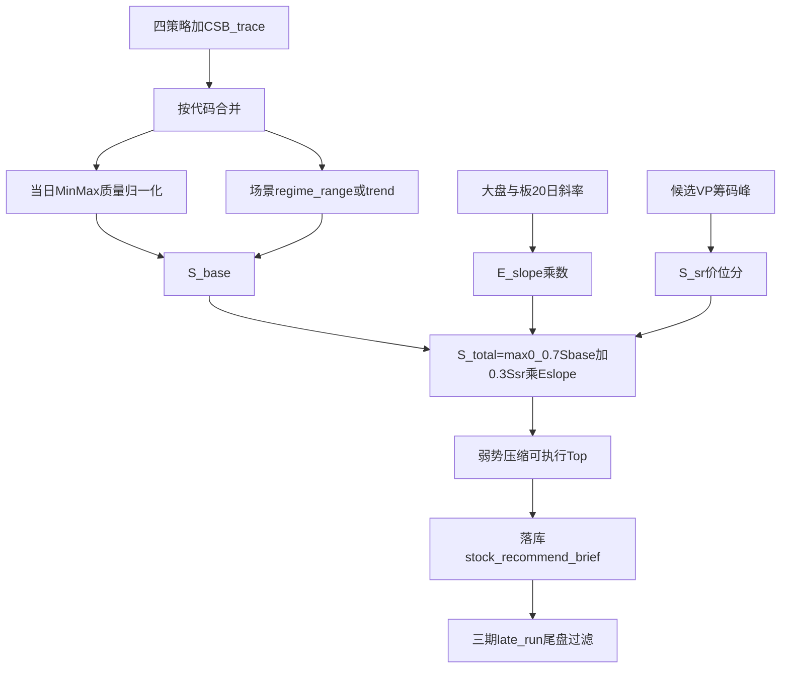

# 个股推荐策略三期优化实现计划

## 目标与边界

将现有「四策略平行 + 硬否决 + 固定 Top15」升级为：

**已锁定决策（不做二选一）：**

- 保留 URT/GMS/SBBR/RPE；**新增 CSB 为第 5 源**；场景用权重倾斜，不删除其它策略。
- E_{slope} 为主环境惩罚；**极弱地板** E<0.15 仍强制 `watch`（替代单纯 5/10 硬否决为主路径）。
- VP 仅对合并后候选（上限可配，默认 ≤80）计算，不全市场扫。
- 三期尾盘：独立 `late_run` 增量刷新，不替代日终主链路。

---

## 一期：评分与防守（低风险）

### 1.1 配置扩展 — [backend_core/recommend/config.py](backend_core/recommend/config.py)

新增并写入 `brief_config_snapshot()`：

- `RECOMMEND_E_SLOPE_NEG_MIN/MAX`（负斜率映射到 0.2～0.4）
- `RECOMMEND_E_SLOPE_FLOOR`（默认 0.15，低于则强制 watch）
- `RECOMMEND_DAILY_TOP_EXEC_DEFENSE`（默认 5，弱势可执行上限）
- `RECOMMEND_SCORE_W_BASE/SR`（默认 0.7/0.3，一期 SR 暂为 0 占位或跳过）

### 1.2 质量 Min-Max — [backend_core/recommend/candidates.py](backend_core/recommend/candidates.py) 或新文件 `normalize.py`

- 合并后按策略分组，对当日池内 `score` 做 Min-Max → `quality_norm ∈ [0,100]`
- SBBR 无分：赋池内中位或固定 50（可配置）
- RPE `z_score`：先映射再入池 Min-Max（与 enrich 口径对齐）
- `best_score` 改为使用归一化后的分，供质量项计算

### 1.3 E_{slope} — [backend_core/recommend/env.py](backend_core/recommend/env.py) + [scoring.py](backend_core/recommend/scoring.py)

- 用已有 `load_board_sector_slopes_multi` 的 **20 日**板斜率 + 指数近 20 日线性回归斜率
- 合成：`E = min(E_market, E_board)`（偏防守）
- 负斜率非对称映射到 `[0.2, 0.4]`；非负保持接近 1.0（可配上限 1.0）
- 改造 `compute_recommend_score`：
  - 先算 `S_base = resonance + quality + action + role`（role 在 E<floor 时仍可清零）
  - `total = max(0, S_base * E_slope)`（一期暂无 S_{sr}，或 S_{sr}=0）
  - `score_detail` 增加 `e_slope`、`e_slope_note`、`s_base`、`quality_norm`

### 1.4 弱势压缩 Top — [daily_brief.py](backend_core/recommend/daily_brief.py)

- `market_stance==bear` 或 `E_slope < 0.5` 时：`executable = buy[:DEFENSE]`（默认 5），否则仍 15
- `summary.counts` / `config` 记录实际用的 `daily_top_exec_effective`

### 1.5 测试与文档

- 扩展 [test/test_recommend_brief.py](test/test_recommend_brief.py)：归一化、E_{slope} 乘法、弱势 Top 压缩
- 更新 [docs/strategies/recommend/个股推荐策略说明.md](docs/strategies/recommend/个股推荐策略说明.md) 一期章节
- 前台 [recommend.js](frontend/js/recommend.js) 明细展示 `E斜率` / `S_base`

---

## 二期：CSB 场景 + 筹码峰

### 2.1 CSB 候选接入 — [candidates.py](backend_core/recommend/candidates.py)

- 查询 `CSBSignalTrace`：`entry_signal=True`，默认 config，`score` 入质量池
- `STRATEGY_PRIORITY` 调整为：`(csb, urt, gms, sbbr, rpe)` 或按 regime 动态主策略（见下）
- `out["csb"]` 纳入 merge；`counts.by_strategy` 含 csb

### 2.2 场景 regime 与权重 — 新 `regime.py` + [scoring.py](backend_core/recommend/scoring.py) / [daily_brief.py](backend_core/recommend/daily_brief.py)

- 用大盘（及可选板）20 日斜率划分：`range`（偏平/负） / `trend`（明显为正）
- **权重倾斜（不删策略）**：
  - `range`：CSB 质量权重 ↑，GMS ↓
  - `trend`：GMS ↑，CSB ↓
  - URT/SBBR/RPE 仍参与共振与归一化质量
- `primary_strategy`：在命中集合中按 regime 优先级挑选（range: csb>urt>gms…；trend: gms>urt>csb…）
- `evidence` / `summary` 写入 `regime`

### 2.3 Volume Profile → S_{sr} 与浮动价位 — 新 `sr_levels.py`

- 复用 [backend_core/analysis/volume_profile.py](backend_core/analysis/volume_profile.py) `compute_volume_profile_from_bars`
- 输入：候选 codes 的日 K（lookback 与现网 VP 默认一致，约 60）
- 输出：`P_sup` / `P_res`；近 20 日局部极值二次校验
- S_{sr}：现价相对支撑/阻力的贴合度，映射到 0～100
- 买区/止损：以 P_{sup} 为锚，设 **2%～5%** 浮动区间（配置 `RECOMMEND_SR_BAND_PCT`）；与现有 `build_trade_advice` 合并规则：
  - 有策略价位则取更保守交集或 VP 覆盖缺失字段
  - **有 VP 区间则不再因「缺买区/止损」一律降级**

### 2.4 总分公式落地

S_{total}=\max(0,\ (0.7\cdot S_{base}+0.3\cdot S_{sr})\cdot E_{slope})

- `score_detail` 增加 `s_sr`、`s_sr_note`、`p_sup`、`p_res`、`formula_version`
- enrich 读历史简报时：有明细则展示；缺 SR 不强制重算 VP（避免读接口过重）

### 2.5 前后台与测试

- 列表/导出增加行业已有字段外的「场景」「E斜率」「SR」摘要
- 测试：CSB 合并、regime 主策略、VP 浮动区、公式加总
- 文档二期章节；权限码无需新 Tab（仍在 recommend 下）

---

## 三期：尾盘确认 + 多周期传导

### 3.1 尾盘 `late_run` 管道 — [scheduled.py](backend_core/recommend/scheduled.py) + workflow

- 新增工作流节点或定时入口：`stock_recommend_brief_late`（建议 14:40 左右），调用 `run_recommend_brief_job(late_run=True, horizons=["daily"])`
- [daily_brief.py](backend_core/recommend/daily_brief.py) 在 `late_run=True` 时：
  1. 加载当日已落库 daily 快照（或重算候选）
  2. 用当日已有 OHLC（实时行情表或当日 bar）做过滤：
    - 长上影：上影占比超阈值 → buy 降 watch
    - 假突破：收盘跌回关键位（买区上沿 / VP 阻力）→ 降级
  3. upsert 同一 `asof_date`，`late_run=True`，`summary.publish_window` 标注尾盘确认
- 管理端已有 `late_run` 开关，对齐该行为并展示「是否尾盘确认」

### 3.2 月→周→日传导加强

- 周报：主线板与月主题板交集加权（`summary` / 池内分加成）
- 日报：若代码落在当周主线板或当月主题板，`S_base` 小幅加成（可配 +2～+5），并写入 `constraint_reasons` 相反的正向 `evidence.theme_align`
- 周池外降级逻辑保留

### 3.3 KPI 与观察

- 扩展 [kpi.py](backend_core/recommend/kpi.py)：弱势出手次数、尾盘降级数、regime 分布
- 文档三期 + 运维说明（节点依赖 CSB 预计算、VP 耗时、late 窗口）

---

## 关键改动文件（按优先级）

| 阶段  | 核心文件                                                                                                                                      |
| --- | ----------------------------------------------------------------------------------------------------------------------------------------- |
| 一   | `config.py`, `scoring.py`, `env.py`, `daily_brief.py`, `candidates.py`/`normalize.py`, `test_recommend_brief.py`, `recommend.js`, 策略说明.md |
| 二   | `candidates.py`, 新 `regime.py`, 新 `sr_levels.py`, `daily_brief.py`, `scoring.py`, `export.py`, 测试与文档                                      |
| 三   | `scheduled.py`, `node_registry.py` + adapters, `daily_brief.py`, `weekly_watch.py`, `kpi.py`, 管理端文案, 文档                                   |

---

## 验收标准

1. **一期**：同日多策略质量可比；弱市 E_{slope} 压分且可执行条数 ≤5；明细可见。
2. **二期**：CSB 可出现在共振/主策略；range/trend 切换主策略偏好；有 VP 的标的具备浮动买区/止损；公式与明细一致。
3. **三期**：14:40 左右 late 跑可降级长上影/假突破；周月对齐有加分痕迹；KPI 可统计尾盘降级。

## 风险控制

- 所有新阈值环境变量化，便于回滚到「近似旧行为」（E=1、Top=15、无 SR）。
- VP/CSB 失败时降级：缺 SR 则 S_{sr}=0 仍出分；缺 CSB 不阻断日报。
- 先单测再管理端对历史 asof 重跑对比纸面 KPI，再挂 late 节点到生产日程。

