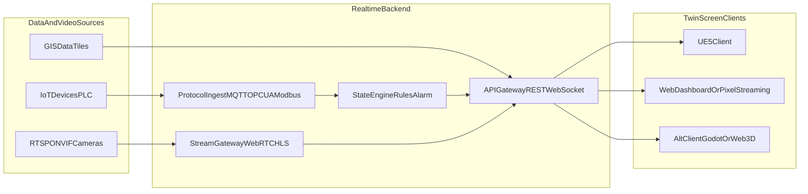

# 数字孪生大屏（无 C#）解决方案与效果原型

## 1. 目标与场景边界
- 核心能力：三维地理场景（园区/城市）+ 设备实时状态 + 视频监控画中画（PiP）联动交互。
- 双端要求：
  - Windows 本地大屏（主体验、性能优先）。
  - Web 访问端（指挥席或移动查看，功能可做轻量化）。
- 典型业务动作：地图点选设备 -> 弹出 PiP 视频窗 -> 拖拽/缩放/置顶 -> 回放或切回实时流；异常告警时自动联动镜头和设备高亮。

## 2. 引擎选型建议（无 C# 约束）
- UE5 作为主引擎（推荐）：
  - 高保真视觉表达、光照材质质量更高。
  - 大场景渲染和影视级展示优势明显。
  - 与 Pixel Streaming 组合实现 Web 远程访问效果好。
- 非 C# 备选路线：
  - Godot 4（GDScript/C++）或 Web 3D（TypeScript + CesiumJS/Three.js）用于轻量化交互看板。
  - 适用于低成本快速迭代或“2D/2.5D + 视频联动”场景。
- 决策策略：
  - 主线按 UE5 落地，备选方案仅做风险兜底 PoC。
  - 统一指标评估：帧率、延迟、Web 可达性、运维复杂度、二次开发成本。

## 3. 总体技术架构

## 4. 关键模块设计
- GIS 场景层：
  - 底图瓦片（卫星/矢量）+ 三维模型（建筑、管线、设备）。
  - LOD 分级、分块加载、遮挡剔除，保障大屏流畅。
- 数字孪生状态层：
  - 统一设备模型（设备ID、位置、状态、告警等级、时间戳）。
  - WebSocket 推送增量更新（建议 200ms~1s 可配置）。
- 视频 PiP 层：
  - 支持多路实时流（优先 WebRTC 低延迟，HLS 作兼容）。
  - 交互：拖拽、缩放、吸附边缘、最小化、锁定跟随设备。
  - 联动：地图对象点选/告警触发自动打开对应摄像头。
- 告警与事件层：
  - 规则引擎驱动“设备闪烁 + 音效 + PiP 自动弹出 + 跳转视角”。
  - 事件时间轴支持回溯。

## 5. 落地路线（UE5 主线 + 非 C# 备选）
- UE5 主线：
  - 客户端：World Partition + Nanite/Lumen（按硬件开关）。
  - GIS：Cesium for Unreal + GeoReferencing。
  - 视频：Media Framework + WebRTC/RTSP 网关；Web 通过 Pixel Streaming。
- 备选路线（非 C#）：
  - Godot 4：3D 场景 + GDScript 业务逻辑 + GDExtension（C++）性能模块。
  - Web 3D：CesiumJS/Three.js + WebRTC/HLS 播放组件，实现指挥席轻量端。

## 6. 效果原型（PoC）定义
- PoC 目标（2~4 周）：
  - 完成 1 个典型园区场景（1-2 km²）与 100~300 设备点位。
  - 接入 4~9 路实时监控画面，支持 2~4 个并发 PiP 窗。
  - 实现 3 条业务链路：
    - 地图点选设备 -> 打开对应视频 PiP。
    - 告警触发 -> 镜头弹窗 + 设备高亮 + 视角飞行。
    - 视频窗交互（拖拽/缩放/置顶/关闭）+ 设备状态实时刷新。
- PoC 演示脚本（验收演示顺序）：
  - 全景巡航开场 -> 热区钻取 -> 设备异常告警 -> 自动弹出 PiP -> 人工确认并处置。

## 7. 性能与指标门槛（验收）
- 本地大屏（1080p/4K按设备定）：
  - 常态帧率 >= 50 FPS（1080p）或 >= 30 FPS（4K）。
  - 实时数据端到端延迟 <= 1s。
  - 视频首帧 <= 2s，交互响应 <= 200ms。
- Web端：
  - 关键操作响应 <= 500ms（同内网条件）。
  - 并发查看 10~30 用户（按网关规格压测）。

## 8. 风险与规避
- 多协议设备接入碎片化：先做协议网关抽象层，统一数据模型。
- Web 端视频能力差异：优先 WebRTC，HLS 作兜底。
- 场景过重导致掉帧：严格 LOD、贴图预算、实例化渲染。
- 双路线维护成本：坚持“UE5 主线 + 备选轻量方案”，避免并行重建设。

## 9. 里程碑
- M1（第1周）：需求冻结 + 数据协议清单 + 场景白模 + 引擎PoC脚手架。
- M2（第2周）：GIS定位 + 实时状态链路 + 单路 PiP 打通。
- M3（第3周）：告警联动 + 多PiP交互 + 演示脚本。
- M4（第4周）：性能压测 + 视觉打磨 + 交付评审。

## 10. 交付物
- 架构设计说明（数据流、模块图、部署图）。
- UE5 PoC 可运行包 1 套 + 非 C# 备选原型 1 套（Godot 或 Web 3D）。
- 演示视频与操作手册。
- 指标压测报告与下一阶段实施清单。

## 11. UE5 原型实施清单（2 周可演示）
- 第 1-2 天：工程初始化与插件集成
  - 创建 UE5 项目（推荐 5.3+），确定渲染档位（1080p 优先稳定 50 FPS）。
  - 集成 `Cesium for Unreal`、`Pixel Streaming`、`WebSocket`（或 HTTP+WS SDK）插件。
  - 初始化场景分层：地形层、建筑层、设备层、告警特效层、UI层。
- 第 3-5 天：GIS + 设备点位基础链路
  - 加载园区地理底图与基础白模。
  - 完成设备点位批量导入（CSV/JSON），渲染图标或三维标牌。
  - 完成设备点击拾取、聚焦飞行与信息卡片。
- 第 6-8 天：实时数据 + 告警联动
  - 打通 WebSocket 订阅，按 `deviceId` 增量更新状态。
  - 实现告警分级可视化（颜色、闪烁、脉冲圈）。
  - 实现“告警触发 -> 视角飞行 -> 自动弹出 PiP”。
- 第 9-10 天：视频 PiP 交互与验收脚本
  - 打通 RTSP/WebRTC/HLS 到统一视频源接口。
  - 完成 PiP 窗口交互：拖拽、缩放、置顶、最小化、关闭。
  - 按演示脚本完成一次全流程彩排并记录指标。

## 12. 蓝图模块划分（便于并行开发）
- `BP_MapController`
  - 负责地图加载、镜头巡航、热区钻取、点位聚焦。
- `BP_DeviceActor`
  - 维护设备显示态（在线/离线/告警）、点击事件与状态材质。
- `BP_AlarmDirector`
  - 接收告警事件，编排声光特效、镜头跳转、PiP 自动弹窗。
- `WBP_PiPWindow`
  - 单个视频窗组件，封装拖拽缩放和播放状态控制。
- `WBP_PiPManager`
  - 管理多 PiP 布局、层级、并发数量与资源回收。
- `BP_RealtimeGateway`
  - 封装 WebSocket 连接、心跳、重连、消息分发。

## 13. 后端接口与消息字段（PoC 最小集）
- 设备全量快照（首次加载，HTTP）
  - `GET /api/twin/devices`
  - 返回字段：`deviceId`、`name`、`longitude`、`latitude`、`altitude`、`status`、`alarmLevel`、`cameraId`
- 状态增量推送（实时，WebSocket）
  - Topic：`/ws/twin/state`
  - 消息字段：`ts`、`deviceId`、`status`、`alarmLevel`、`metrics`（如温度/压力）
- 视频拉流地址查询（按设备或摄像头）
  - `GET /api/video/stream?cameraId=xxx&protocol=webrtc|hls`
  - 返回字段：`playUrl`、`codec`、`expireAt`
- 告警事件流（实时）
  - Topic：`/ws/twin/alarm`
  - 消息字段：`alarmId`、`deviceId`、`alarmLevel`、`alarmType`、`startTime`、`message`

## 14. 原型验收用例（演示即测试）
- 用例 1：地图点选联动视频
  - 操作：点击设备点位。
  - 期望：镜头聚焦 + 右下角弹出对应摄像头 PiP，首帧 <= 2s。
- 用例 2：告警自动处置链路
  - 操作：注入一条 `alarmLevel=high` 的告警消息。
  - 期望：设备高亮闪烁 + 自动飞行到目标 + PiP 自动置顶。
- 用例 3：多窗交互稳定性
  - 操作：同时打开 4 路 PiP，连续拖拽缩放 30 秒。
  - 期望：无明显卡顿、无窗口错位、主场景帧率不低于目标阈值。
- 用例 4：断线恢复
  - 操作：中断 WebSocket 10 秒后恢复。
  - 期望：自动重连成功，状态与告警继续增量更新，无需重启客户端。

## 15. 两周逐日排期（可直接执行）
- Day 1：需求冻结与资产盘点
  - 输出：设备清单、摄像头清单、坐标系定义、验收阈值确认单。
- Day 2：UE5 工程脚手架
  - 输出：基础工程、插件启用、目录规范、基础关卡与场景分层。
- Day 3：GIS 底图与地理定位
  - 输出：Cesium 地图可视、园区范围框定、地理坐标到引擎坐标映射验证。
- Day 4：设备点位导入
  - 输出：100~300 点位正确渲染、点位点击拾取、基础信息卡。
- Day 5：镜头与交互
  - 输出：全景巡航、点位聚焦飞行、热区钻取交互。
- Day 6：实时数据接入
  - 输出：WebSocket 连接、状态增量更新、异常断线重连。
- Day 7：告警联动
  - 输出：告警颜色分级、闪烁动画、告警驱动镜头跳转。
- Day 8：单路视频链路
  - 输出：单路摄像头拉流成功、PiP 基础显示。
- Day 9：多路 PiP 管理
  - 输出：2~4 窗并发、拖拽缩放、置顶/最小化/关闭。
- Day 10：联动闭环
  - 输出：点位点击开视频、告警自动弹窗、手工处置确认。
- Day 11：性能优化（第一轮）
  - 输出：LOD、贴图压缩、特效预算、关键路径 profiling 报告。
- Day 12：Web 访问链路
  - 输出：Pixel Streaming 可访问、低码率下交互可用性验证。
- Day 13：全链路彩排
  - 输出：按演示脚本完整演练，记录问题单与修复优先级。
- Day 14：验收与交付
  - 输出：PoC 演示、指标报告、下一阶段实施清单。

## 16. 人员分工（4-6 人标准班组）
- 技术负责人（1）
  - 负责架构决策、风险把控、跨模块集成、演示口径统一。
- UE5 客户端开发（1-2）
  - 负责 GIS、点位交互、镜头系统、告警特效、PiP UI 蓝图。
- 后端与流媒体开发（1-2）
  - 负责协议接入、状态聚合、WebSocket 推送、视频网关与鉴权。
- 美术/技术美术（1）
  - 负责园区白模优化、材质灯光、UI 视觉与性能平衡。
- 测试/实施（1，可兼任）
  - 负责用例执行、性能压测、网络条件模拟、验收文档整理。

## 17. 开发环境与资产准备清单
- 硬件
  - 大屏演示机：建议 8 核 CPU、32GB 内存、RTX 3060/4060 及以上。
  - 视频网关机：独立部署（建议与渲染机分离，避免资源争抢）。
- 软件
  - UE5（建议 5.3+）、Cesium for Unreal、Pixel Streaming 组件。
  - 流媒体服务（WebRTC 网关 + HLS 兜底）与日志监控组件。
- 数据
  - 园区底图/三维模型、设备点位表、摄像头映射表（deviceId-cameraId）。
  - 告警规则字典（等级、类型、颜色、处理动作）。
- 网络
  - 内网带宽与端口策略确认（尤其 WebRTC 端口与 STUN/TURN 可达性）。
  - 演示环境固定 IP 或域名，避免临场连接不稳定。

## 18. 下一阶段（PoC 后）扩展建议
- 从“演示可用”升级为“生产可用”
  - 加入权限体系、审计日志、配置中心、多项目多园区租户能力。
- 从“人工运维”升级为“智能运维”
  - 引入异常检测模型，实现告警降噪与自动处置建议。
- 从“单大屏”升级为“多角色协同”
  - 指挥席、巡检端、管理端统一事件中心与任务闭环。