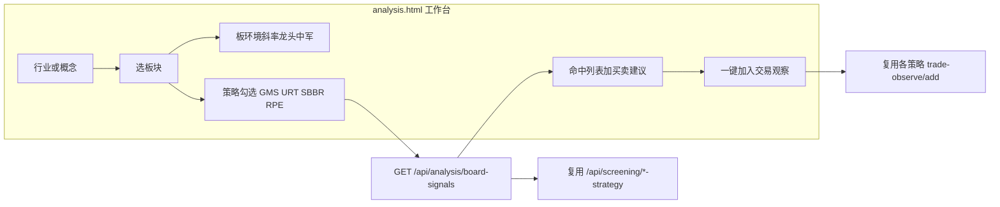

# 分析频道：板块优先多策略工作台

## 背景与结论

- **分析频道** [`frontend/analysis.html`](frontend/analysis.html) 现状偏 AI 个股分析与静态市场卡片，与四策略几乎无关。
- **选股频道** [`frontend/screening.html`](frontend/screening.html) 已是「策略 Tab → 可选行业/概念作数据源」，四策略后端均已支持 `industry_board` / `concept_board`。
- 按你的选择 **1-C / 2-两者**：在**分析频道新建板块工作台**；选股页策略优先入口**保留不动**；命中结果**列表展示 + 一键加入交易观察**；并对命中股给出**买点/卖点建议**（复用现有指标，不另造一套打分体系）。



---

## 一、四策略现有逻辑（选股/可观察，摘要）

主入口：[`backend_api/stock/stock_screening_routes.py`](backend_api/stock/stock_screening_routes.py)

| 策略 | 语义 | 板池 | 命中口径 | 板/斜率角色 | 观察池 |
|------|------|------|----------|-------------|--------|
| **GMS** | 均值引力 + 动量突变 | `scope=industry_board\|concept_board` | 左/右买点 + 总分；可挂 `board_env`、软减分 | **主行业板共振**（走弱减分/走强仅展示） | `/api/stock/gms-trade-observe/add` |
| **URT** | 上升趋势买点 | 路由解成分后筛 | 硬筛 ∧ score≥阈值 → `buy_signal` | 无板斜率；有 KDE/RR 软标签 | `/api/stock/urt-trade-observe/add` |
| **SBBR** | 做小做底共振 | 板成分（板 scope 放宽池） | `bottom_matched` / `entry_signal` 布尔态 | 个股箱体斜率；非行业板共振 | `/api/sbbr/trade-observe/add`（另有储备箱） |
| **RPE** | 板块比价 Z | **原生按板建簇** | `catch_up`/`lead`；`entry_signal`/`watch_only` | **sector_slope 趋势否决** | `/api/stock/rpe-trade-observe/add` |

共用：[`backend_core/board_roles/`](backend_core/board_roles/) → `role_tags`（龙头/中军）；行情板详情/斜率见 [`/api/market/.../detail|roles`](backend_api/market_routes.py)。

实现时注意：URT 的 `boards` 是上市板型不是行业码；SBBR 默认做小宇宙；RPE 的 `lead` ≠ 板角色龙头；GMS 板共振在路由后处理 enrich。

---

## 二、产品交互（分析频道）

改造 [`frontend/analysis.html`](frontend/analysis.html) / [`analysis.js`](frontend/js/analysis.js) / [`analysis.css`](frontend/css/analysis.css)：

1. **顶层 Tab**：「板块分析」（默认）|「个股 AI 分析」（保留现有快速分析，收进第二 Tab，避免丢能力）。
2. **板块分析工作台**
   - 切换：行业板块 | 概念板块（同花顺 catalog，复用选股/行情已有接口）。
   - 选板后展示摘要：板名/代码、斜率、`board_env`、成分数、龙头/中军（`board_roles_panel` 或等价）。
   - 策略多选（默认四策略全开）→「开始分析」。
   - 结果区：按策略分子表或统一表 + 策略列；每行含代码、名称、策略命中摘要、`role_tags`、**买点建议 / 卖点建议**、操作「加入观察」。
3. **权限**：沿用 `channel.analyze.*`，新增细粒度如 `channel.analyze.tab.board`、`...btn.run`、`...btn.observe`（写入 [`permission-registry.js`](frontend/js/permission-registry.js)）。
4. **选股页**：不改交互范式；仅在分析页结果可链到选股追溯页（已有 `stock_*_trace.html`）。

---

## 三、后端方案（聚合 + 交易建议）

### 3.1 聚合接口（新建，薄封装）

在分析相关路由（建议新建 `backend_api/stock/board_analysis_routes.py`，挂到 `/api/analysis`）增加：

`GET /api/analysis/board-signals`

参数：`board_kind=industry|concept`、`board_code`、`board_code_source=tonghuashun`、`strategies=gms,urt,sbbr,rpe`、可选 `cn_board_segment` / `exclude_st`。

行为：

1. 拉板详情（斜率/环境）+ roles。
2. 对勾选策略**并行调用**现有 screening 逻辑（内部函数复用，避免 HTTP 自调用）：固定 `scope=industry_board|concept_board` 与对应 `*_board_code`。
3. 对每条命中行调用统一 **`build_trade_advice(strategy, row)`**，写入 `trade_advice`。
4. 返回结构：

```json
{
  "board": { "board_code", "board_name", "board_kind", "sector_slope", "board_env", "leaders", "mids" },
  "strategies": {
    "gms": { "total", "items": [ { "...screen_fields", "trade_advice": {} } ] },
    "urt": { "..."}, "sbbr": { "..."}, "rpe": { "..." }
  }
}
```

命中过滤（默认）：

- GMS：有左/右买点或总分达标（与选股默认展示一致，跟现网 `gms-strategy` 过滤对齐）
- URT：`buy_signal=true`
- SBBR：`entry_signal=true`（筑底未入场可进「关注」分区，默认折叠）
- RPE：`entry_signal=true` 或 `watch_only=true`（lead 标「仅观察」）

### 3.2 买卖点建议模块（新建）

新建 [`backend_core/analysis/trade_advice.py`](backend_core/analysis/trade_advice.py)，编排策略字段 + 结构位参考，输出：

```text
trade_advice = {
  action: "buy" | "watch" | "avoid",
  buy_zone / stop_zone / take_profit / sell_triggers / summary / confidence,
  reference_levels: {   # 初期仅作买卖判断参考，不覆盖策略主止损
    fibonacci: { swing_high, swing_low, direction, retracements[], extensions[] },
    pivot: { method: "classic", H, L, C, P, R1, R2, R3, S1, S2, S3 },
    nearest_fib_support / nearest_fib_resistance,
    nearest_pivot_support / nearest_pivot_resistance
  }
}
```

**各策略主建议映射（仍以策略字段 + KDE/箱体为准）：**

| 策略 | 买点建议 | 卖点/防守建议 | 依据字段 |
|------|----------|---------------|----------|
| GMS | 左：贴近 MA/支撑吸筹；右：突破后回踩不破支撑 | KDE/`sell_signal`/`board_weak` | `buy_type`、structure、`board_env` |
| URT | 信号价或回踩 MA20/KDE 支撑 | KDE 支撑下止损、阻力止盈 | `buy_logic`、KDE、`risk_tags` |
| SBBR | `entry_low`；未入场 → watch | `defense_*`、`box_*` | 筑底/入场字段 |
| RPE | catch_up 入场；lead → watch | trend_veto 降级；`structure_plan` | Z/斜率/KDE |

Fib/Pivot 写入 `reference_levels`，并在 `summary` 中用一句「参考：Fib0.618=x / Pivot S1=y」提示；**不替代** `stop_zone` 的主依据（主依据仍标 `basis=kde|box|defense|ma`）。

#### 3.2.1 支撑/压力价位源（含新建 Fib / Pivot）

| 类型 | 现状 | 本方案用法 |
|------|------|------------|
| KDE 量权峰 | 已有 | 主结构位 |
| SBBR 箱体 / 防守带 | 已有 | SBBR 主价位 |
| 动态均线 | 已有 | 旁证 |
| **Fibonacci** | **新建** | 参考支撑/压力价 |
| **经典 Pivot** | **新建** | 参考支撑/压力价 |
| 布林带 | 有计算未接入策略 | 本阶段仍不纳入 |

编排优先级：

1. 策略原生价位 → 写入 `buy_zone` / `stop_zone` / `take_profit`
2. KDE 最近支撑/压力 → 补全主建议
3. **Fib + 经典 Pivot** → 仅 `reference_levels` + 文案参考；若与主止损/压力同向且距离当前价更近，可在 summary 标注「附近另有 Fib/Pivot 共振」

#### 3.2.2 Fibonacci / 经典 Pivot 算法口径（固化）

新建模块：[`backend_core/analysis/classic_levels.py`](backend_core/analysis/classic_levels.py)（纯函数，便于单测）。

**数据输入（日线，不复权优先与策略日线一致；缺则用 available bars）：**

- 从 `historical_quotes` 取最近 `lookback=60` 根（可配置，默认 60）的 high/low/close。
- **摆动锚点**：窗口内最高价 `swing_high`、最低价 `swing_low`；若高点日期晚于低点 → 视为上升段回撤（自上而下 Fib）；若低点更晚 → 下降段反弹 Fib（自下而上）。区间过窄（`(H-L)/L < 1%`）则跳过 Fib，只算 Pivot。

**Fibonacci 回撤位（相对 swing 区间 `range = H - L`）：**

- 上升段（回撤支撑）：`level = H - ratio * range`，ratios = `0.236, 0.382, 0.5, 0.618, 0.786`
- 下降段（反弹压力）：`level = L + ratio * range`，同上比率
- 扩展位（可选展示）：`1.272, 1.618`（上升段向上、下降段向下），标为 `extension`，默认只取距现价最近的 1 个扩展位写入参考

相对现价划分：`level < last_close` → 支撑候选；`>` → 压力候选；取最近各 1 个写入 `nearest_fib_support` / `nearest_fib_resistance`。

**经典 Pivot（Standard / Floor 枢轴，用「上一交易日」H/L/C）：**

```text
P  = (H + L + C) / 3
R1 = 2P - L
S1 = 2P - H
R2 = P + (H - L)
S2 = P - (H - L)
R3 = H + 2*(P - L)
S3 = L - 2*(H - P)
```

`nearest_pivot_support` = 现价下方最大的 S*/P；`nearest_pivot_resistance` = 现价上方最小的 R*/P。

**批量性能：** 聚合接口对命中股批量拉 K 线（按 code 列表一次查询 lookback 窗口），内存算 Fib/Pivot，避免 N+1。

**角色：** 初期明确为「买卖判断参考」，UI 标签「参考价（Fib/Pivot）」；不改 GMS/URT/SBBR/RPE 引擎门槛，不写回策略 trace。

### 3.3 一键加入观察

前端按策略打到现有 add 接口（不新建观察表）：

- GMS → `POST /api/stock/gms-trade-observe/add`
- URT → `POST /api/stock/urt-trade-observe/add`
- SBBR → `POST /api/sbbr/trade-observe/add`
- RPE → `POST /api/stock/rpe-trade-observe/add`

请求体带上策略信号摘要 + `trade_advice.summary`（若现接口有 note/remark 字段则写入；无则只加代码，备注落本地 toast）。需登录；未登录引导登录。

可选薄封装：`POST /api/analysis/board-signals/observe`（body: strategy + code + payload）内部转发，统一错误码——**采用此封装**，前端只调一个 observe 入口。

---

## 四、前端实现要点

- 新模块：`frontend/js/board_analysis.js`（由 `analysis.js` 挂载），样式落在 `analysis.css`，复用 `board_roles_panel.js`、选股页板块选择器交互模式（检索/下拉）。
- 调用聚合 API；四策略结果分区表格；列：代码、名称、角色、命中标签、主买点/主卖点（策略+KDE）、**参考价 Fib/Pivot**、操作。
- 参考价列展示最近 Fib 支撑/压力 + Pivot S1/R1（或 nearest），悬停可看完整 0.236–0.786 与 P/R1–R3/S1–S3。
- 「加入观察」调用 observe 封装；成功后按钮置灰「已观察」。
- 性能：单板成分通常几十～几百只；Fib/Pivot 批量算；按钮防抖；超时提示。不在分析页默认跑全市场。

---

## 五、测试与验收

- 单测：`test/test_classic_levels.py`（固定 H/L/C 与 swing → 断言 P/R1/S1 与 Fib 0.382/0.618）；`test/test_trade_advice.py`；`test/test_board_analysis_api.py`。
- 手工：板块分析命中行可见主建议 + Fib/Pivot 参考价；一键进观察池；选股页原流程仍可用。

---

## 六、非目标（本阶段不做）

- 不改选股页为板块优先。
- 不新建独立「分析观察池」表。
- 不重写四策略打分引擎；不把 Fib/Pivot 做成硬性入场/止损门槛。
- 不做 Camarilla / Woodie / Fibonacci Pivot 变体（仅 **经典 Pivot** + 摆动 Fibonacci）。
- 不在本阶段做全市场多板批量扫描看板。
