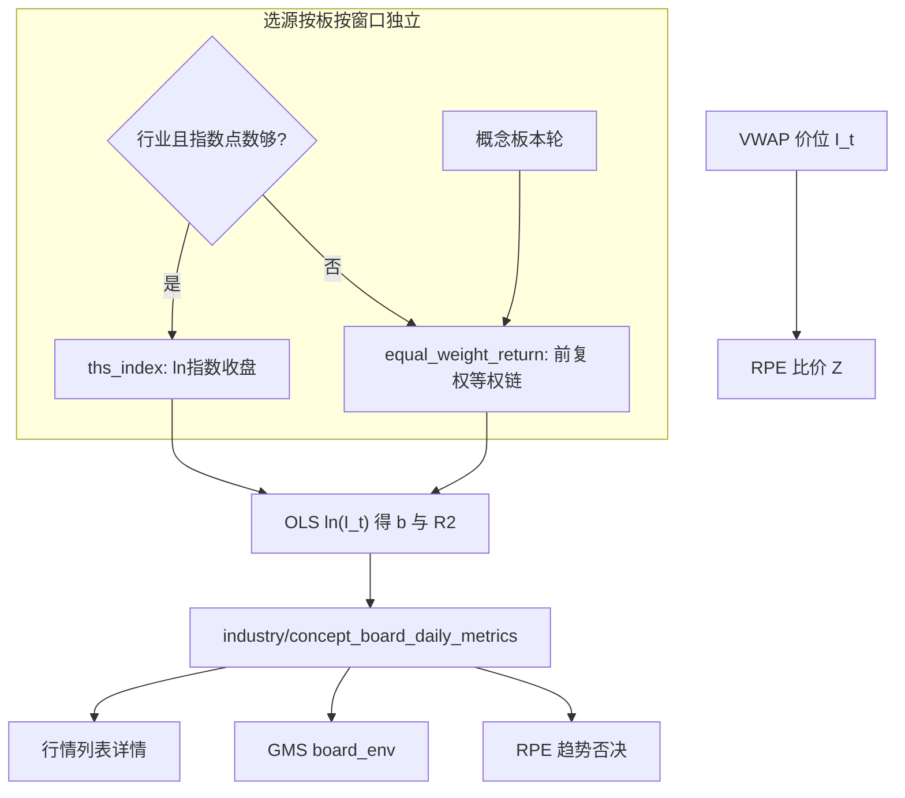

# 板块斜率口径改造方案

前提：同花顺**行业**板块指数日 K 基本可用（[`industry_board_historical_quotes`](backend_api/models.py)）；**概念**板指数尚未采集。概念指数采集不纳入本轮。

---

## 背景与修改思路

### 现状怎么算

系统没有把官方板块指数用于斜率。生产口径（行情列表/详情入库、GMS 读库）是：

1. **当日成分快照**（`industry_board_constituents` / 概念表），没有历史调入调出。
2. 成分日线来自 `historical_quotes`，斜率入库默认 **不复权**（`load_sector_panel(..., adjust="none")`）。RPE 可选 `qfq`，但 [`sector_slope_store.py`](backend_core/board_metrics/sector_slope_store.py) 未传。
3. 合成量权均价 \(I_t=\sum_i P_{i,t} V_{i,t}/\sum_i V_{i,t}\)（价或量 \(\le 0\) 跳过），再对近 N 日 \(\ln(I_t)\) 做 OLS：\(y=a+bx,\ x=0..n-1\)，斜率即 \(b\)。
4. 标准窗口 120/60/20/10/5；策略默认 60 日。走弱 \(b<0\)；走强 \(b\ge\) 窗口阈值（中线约 0.001）。
5. **同一套 \(I_t\)** 还被 RPE 用作比价 \(R=P/I_t\) 和 Z-Score。斜率只是其中一个消费者。

实现：[`sector_benchmark.py`](backend_core/strategies/rpe/sector_benchmark.py) 的 `compute_vwap_benchmark` / `sector_slope`。规则文档：[`RPE_比价效应_信号计算规则.md`](docs/strategies/rpe/RPE_比价效应_信号计算规则.md)、[`GMS_逻辑证伪_交易系统白皮书.md`](docs/strategies/gms/GMS_逻辑证伪_交易系统白皮书.md) §6.3。

同花顺板块指数日 K 已有采集表（行业/概念），方案里写明「OHLC 供 K 线/回测，斜率仍用成分合成」。官方指数目前**没有**进入斜率。概念板指数本轮仍采不到，行业板基本可以。

### 外部优化建议的判断

建议认为：**第二步对 \(\ln(I_t)\) 做 OLS 合理；第一步用 VWAP 当指数有严重逻辑缺陷。** 对照本仓库后结论如下。

**第二步（保留并补 \(R^2\)）**

- 对 \(\ln(I_t)\) 回归，\(b\) 近似日对数收益，跨板可比；走强阈值按这个量纲定的，应保留。
- 只看 \(b\)、不看拟合优度偏松：高波动震荡也能刷出 \(|b|\) 过线，5/10 日窗更明显。补 \(R^2\)（或 t 统计）挡「假走强」，与改基准正交。

**第一步四条缺陷 vs 代码**

- **成交量权重漂移（虚假暴涨/暴跌）：成立。** \(I_t\) 是收盘价的成交量加权平均，不是收益指数。量从低价股转到高价股、股价不动，\(I_t\) 也会跳（建议中 55→70 的例子与公式一致）。\(\ln\) 回归消不掉一日台阶。
- **高价股权重天然过高：成立。** 权重是股数成交量，不是市值/成交额。同量下高价股主导 \(I_t\) 的收益；全员同涨幅时 \(I_t\) 仍近似同涨，偏差主要在涨跌分化时。
- **除权未复权导致假崩盘：生产斜率链路上成立。** 入库用不复权收盘；高送转日 \(P\) 腰斩、\(V\) 往往放大。系统已有 `stock_adj_factor`（RS / RPE 可选），斜率未用。只对 \(P\) 前复权、仍用未复权 \(V\) 做 VWAP，口径仍然拧巴。
- **缺少除数/成分调整：部分成立。** 实现是「当前成分 ∩ 当日有 K 线」往回套 lookback，不是点-in-time。停牌大票会改水平；新票进入 lookback 无除数会台阶；调出的历史成分回溯里消失。等权日收益能缓解停牌与水平台阶，但**解决不了**「用今天的成分表回看 60 日」。无历史成分表时，任何自建指数都有这个问题，本轮不做 PIT 成分。

**「等权对数收益累加、代码改动极小」不能整段替换**

等权方案（前复权日收益 → 等权平均 → \(I_t=I_{t-1}(1+R_t)\)，起点 1000 → 再对 \(\ln(I_t)\) 回归）作为**斜率专用**基准是合理方向，但：

- **不能替换共享的 \(I_t\)。** RPE 的 \(I_t\) 是价位（比价 \(P/I\)）。改成从 1000 递推的收益指数后，斜率仍有意义，\(P/I\) 的「板块典型价格」语义没了，Z 更接近「相对等权超额」，和「比价效应」不是同一件事。必须拆基准。
- **改动不是「极小」。** 需要昨收对齐、斜率链路强制前复权、停牌过滤、与 RPE 拆开、全量重算 `*_daily_metrics`、文案与测试。`build_date_members` 现在只丢 `(close, volume)`。
- **等权的业务取舍。** 等权回答「成分里多数股票在涨吗」，对 GMS/行情板环境更合适；会抬小票、抑龙一。成交额加权日收益更能刻画「钱往哪流」，且同样能消掉「股价不动、量在高低价间搬家」。本轮回退**固定等权**，不做额权。
- **官方指数杠杆更大。** 行业板指数已入库，带除权/成分处理。对官方指数收盘做 \(\ln\) 回归，可同时避开自建 VWAP 的量权漂移、除权假崩、无除数；不依赖成分日线是否齐。缺数再回退等权链。概念板暂无指数，本轮概念一律等权。

### 取舍结论（写入本方案）

- 斜率与 RPE 比价拆基准；禁止共用一个 \(I_t\) 定义。
- 斜率：**官方指数优先，等权前复权收益回退**；不保留 VWAP 作斜率第三回退。
- 走强加 \(R^2\) 门槛；走弱默认仍只看 \(b<0\)。
- 不做：概念指数采集、PIT 成分/自建除数、额权收益、把 1000 点指数塞进 RPE 的 \(P/I\)。

---

## 问题与原则（落地）

第二步对数 OLS 保留。改的是第一步基准，并拆开两种用途：

- **斜率专用基准** → 入库 → 行情 / GMS 板环境 / RPE 趋势否决
- **RPE 比价 \(I_t\)** → 仍 VWAP，不改 Z-Score 语义

## 选源规则

每个窗口（120/60/20/10/5）独立选源，写入该行 `slope_source`。

- **行业**：该窗有效指数收盘（`close>0`）点数 \(\ge \max(窗长, 现有门槛)\)，即 `max(10 if w>=20 else 5, w//2)` → `ths_index`；否则等权链。允许「仅有 close」的实时归档行。缺日不插值。
- **概念**：本轮一律 `equal_weight_return`。日后概念指数入库，同一套「官方优先」自动生效，不必再改算法。
- 两路都失败：`sector_slope=NULL`，环境 `unknown`。
- 仍仅 `board_code_source=tonghuashun`。

行业「只有 80 根指数」时：60 日可用官方，120 日回退等权。

## 等权收益链（回退）

1. 当前成分快照；日线 **前复权**（`stock_adj_factor` 只读库；无因子剔除，禁止混不复权）。
2. 有昨收且价 \(>0\) 才计入；无 K / 停牌不参与当日平均。
3. \(r_{i,t}=P_t/P_{t-1}-1\)，\(R_t=\mathrm{mean}(r_{i,t})\)；当日有效家数 \(M_t<5\) 则该日无 \(R_t\)。
4. \(I_0=1000\)，\(I_t=I_{t-1}(1+R_t)\)，再对近窗 \(\ln(I_t)\) OLS。

## R² 过滤（只挡假走强）

扩展 [`linear_slope`](backend_core/strategies/rpe/sector_benchmark.py) 同时返回 \(b\) 与 \(R^2\)。[`evaluate_board_environment`](backend_core/strategies/gms/board_resonance.py)：

- **走弱**：仍 \(b<0\)，默认不看 \(R^2\)（开关 `r2_gate_weak` 默认关）。震荡下跌不因拟合差被打成「正常」。
- **走强**：\(b\ge\) 原窗口阈值 **且** \(R^2\ge\) 该窗下限。
- **正常**：其余（含 \(b\) 过线但 \(R^2\) 不够）。

默认 \(R^2\) 下限：120→0.25，60→0.30，20→0.35，10→0.40，5→0.50。走强阈值不变（120: 0.0008 … 5: 0.002），量纲仍是日对数收益，一般不用重标定。

## 表结构

[`industry_board_daily_metrics`](migrations/add_board_daily_metrics.py) / `concept_board_daily_metrics` 增列（主键不变）：

- `slope_source VARCHAR(32)`：`ths_index` / `equal_weight_return`
- `slope_r2 DOUBLE PRECISION`
- `slope_n INTEGER`（回归点数）

`member_count_used`：等权为有效成分数；官方指数可空。旧 VWAP 斜率作废，部署后**全量重算**，不混用。

同步 ORM：[`IndustryBoardDailyMetrics` / `ConceptBoardDailyMetrics`](backend_api/models.py)。读库/upsert 扩展这些字段。

## 代码改动

**计算与入库**

- [`backend_core/strategies/rpe/sector_benchmark.py`](backend_core/strategies/rpe/sector_benchmark.py)：保留 `compute_vwap_benchmark`；新增等权链；`linear_slope` / `sector_slope` 带出 \(R^2\)（兼容旧调用只取 \(b\)）。
- [`backend_core/board_metrics/sector_slope_store.py`](backend_core/board_metrics/sector_slope_store.py)：读行业指数 → 按窗选源 → 算 \(b,R^2\) → upsert。概念跳过指数尝试。
- 指数读取：`industry_board_historical_quotes`（概念表预留，有数才走官方）。

**消费方**

- [`board_resonance.py`](backend_core/strategies/gms/board_resonance.py) + [`industry_board_query.py`](backend_api/utils/industry_board_query.py)：环境判定传入 `slope_r2`；详情/列表带出来源（详情需要，列表可选）。
- GMS enrich 已读库，重算后自动换口径。
- [`rpe/strategy_engine.py`](backend_core/strategies/rpe/strategy_engine.py)：比价仍 VWAP；趋势否决改为读板斜率（库优先，与 GMS 相同窗口 60），不再用 VWAP 顺手算的斜率。

**前端**

- [`frontend/markets.html`](frontend/markets.html) 表头 title：去掉「量权基准」。
- [`frontend/js/markets.js`](frontend/js/markets.js) 详情「板块斜率与强弱」：来源、\(R^2\)。列表不必展示 \(R^2\)。
- [`frontend/js/rpe_score_detail.js`](frontend/js/rpe_score_detail.js) 趋势否决文案与行情对齐。

**文档**（确认实现后改，与代码同步）

- [`docs/strategies/rpe/RPE_比价效应_信号计算规则.md`](docs/strategies/rpe/RPE_比价效应_信号计算规则.md)
- [`docs/strategies/gms/GMS_逻辑证伪_交易系统白皮书.md`](docs/strategies/gms/GMS_逻辑证伪_交易系统白皮书.md) §6.3
- 设计文档中「斜率与行情一致」表述

**测试**（`test/`）

- 价不变、量在高低价间搬家：VWAP 跳、等权链不跳。
- 行业：指数够 → `ths_index`；截短指数 → 该窗等权。
- 概念：无指数时一定等权。
- \(R^2\)：\(b\) 过走强线但拟合差 → 不标走强；\(b<0\) 仍走弱。
- RPE：Z 仍 VWAP；趋势否决用新斜率。

## 上线

1. 跑迁移加列。
2. 部署代码。
3. 全量刷新行业+概念斜率（现有 `refresh_board_sector_slopes` / 行情页按钮）。未刷新前旧 VWAP 视为过期。
4. 抽查：有指数行业板 `ths_index`；概念板 `equal_weight_return`。

不改采集调度；概念指数仍为后续独立项。

## 实施顺序

1. 基准函数 + 选源入库 + 迁移 + 单测
2. 环境判定 \(R^2\)；GMS/行情读新字段
3. RPE 趋势否决改读板斜率
4. 文案/详情/规则文档；全量重算说明
