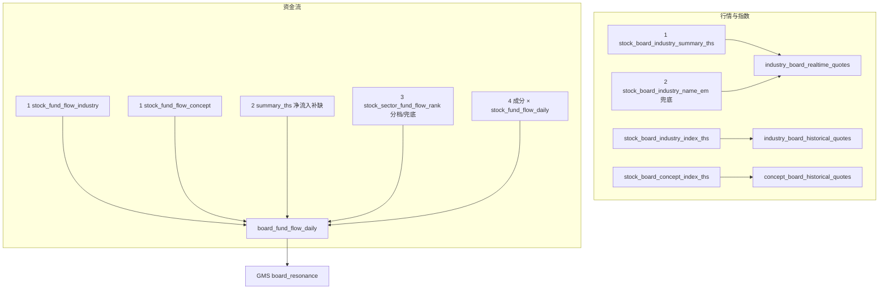

# 板块资金流向补齐实现方案（同花顺优先 + 详情展示）

## 已定范围与口径

| 项 | 选定 |
|----|------|
| 数据源原则 | **同花顺优先，东财/成分上卷兜底**（板块行情与资金流均适用） |
| 范围 | **行业 + 概念板块**资金流落库；对齐 GMS 板共振 |
| 指数（宽基） | 本期仍不做沪深300等单指数资金流；同花顺「板块指数」日 K 已有专用接口（见下） |
| 消费 | GMS 读当日 `board_main_net_inflow`；分档入库但不强制进一期计分 |
| 金额单位 | 统一为**元**（源为「亿」则 ×1e8） |
| 频率 | 交易日日更（`_wrap_cn` 休市跳过） |

文档锚点：[AKShare 股票数据 · 同花顺板块/资金流](https://akshare.akfamily.xyz/data/stock/stock.html#id378)

---

## 0. 同花顺相关接口核对（职责与现状）

| 接口 | 用途 | 关键字段 | 仓库现状 | 本期调整 |
|------|------|----------|----------|----------|
| `stock_board_industry_summary_ths` | 同花顺**行业一览**（准实时） | 涨跌幅、总成交量/额、**净流入**、涨跌家数、领涨股 | [`realtime_stock_industry_board_ak.py`](backend_core/data_collectors/akshare/realtime_stock_industry_board_ak.py) 仅在 **东财失败后兜底**；[`normalize_ths_industry_df`](backend_core/data_collectors/akshare/industry_board_normalize.py) **未映射净流入** | **改为优先调用**；归一化保留净流入，并可写入资金流日表 |
| `stock_board_industry_index_ths` | 同花顺**行业板块指数**日 K | OHLC、成交量、成交额（**无资金流**） | [`board_historical_ths.py`](backend_core/data_collectors/akshare/board_historical_ths.py) 已主用 | 保持；确认历史链路继续 THS 优先，不改东财 |
| `stock_board_concept_index_ths` | 同花顺**概念板块指数**日 K | 同上 OHLC/量额 | 同上已主用 | 保持 |
| `stock_fund_flow_industry` | 同花顺**行业资金流** | 流入/流出/**净额**（亿）、涨跌幅、领涨股等 | **未接入** | **资金流主路径** |
| `stock_fund_flow_concept` | 同花顺**概念资金流** | 同上 | **未接入** | **资金流主路径** |
| `stock_sector_fund_flow_rank` | 东财板块资金流排名 | 主力/超大/大/中/小单分档 | **未接入** | **仅分档补全或 THS 失败时兜底** |

要点：

- `*_index_ths` 解决的是**板块指数成交额/量与 OHLC**，不是资金流；与资金流方案正交，已正确用同花顺。
- `summary_ths` 自带 **净流入**，与 `stock_fund_flow_industry` 同属同花顺口径，可交叉校验/补缺。
- 当前行业实时 **东财优先** 与「同花顺优先」原则冲突，本期一并改序。



---

## 1. 现有采集顺序修正（同花顺优先）

### 1.1 行业实时 [`realtime_stock_industry_board_ak.py`](backend_core/data_collectors/akshare/realtime_stock_industry_board_ak.py)

**现状** `fetch_data`：`stock_board_industry_name_em` → 失败才 `stock_board_industry_summary_ths`。

**改为**：

1. 优先 `ak.stock_board_industry_summary_ths()` + `normalize_ths_industry_df`
2. 失败再 `ak.stock_board_industry_name_em()` + 原有英文化映射

### 1.2 归一化 [`industry_board_normalize.py`](backend_core/data_collectors/akshare/industry_board_normalize.py)

- `normalize_ths_industry_df`：保留并映射 **净流入**（列名 `净流入`，单位亿元 → 落库前转元）
- 实时表：若短期不改 DDL，净流入可不写 `industry_board_realtime_quotes`，改由资金流采集器同次读取 summary 写入 `board_fund_flow_daily`；若希望实时表可展示，再增量加可空列 `net_inflow`（可选，非 GMS 硬依赖）

### 1.3 板块指数日 K（已符合，仅确认）

[`board_historical_ths.py`](backend_core/data_collectors/akshare/board_historical_ths.py) 已对：

- 行业：`stock_board_industry_index_ths`
- 概念：`stock_board_concept_index_ths`

保持同花顺主路径；**不**为历史 OHLC 引入东财优先。

---

## 2. 数据表设计

新建 [`migrations/add_board_fund_flow_daily.py`](migrations/add_board_fund_flow_daily.py)，表名 `board_fund_flow_daily`。

| 列 | 说明 |
|----|------|
| `board_kind` | `industry` / `concept` |
| `board_code` | **同花顺码优先**（名称匹配 `*_basic_info` / 码表） |
| `board_code_source` | 默认 `tonghuashun` |
| `trade_date` | 交易日 |
| `board_name` | 名称（THS「行业」列） |
| `change_percent` | 涨跌幅 |
| `inflow_amount` / `outflow_amount` | 流入/流出（元）；THS 资金流有则写 |
| `main_net_inflow` | 净额/净流入（元）— GMS 主字段 |
| `main_net_inflow_pct` | 净占比（东财有则写） |
| `super_large_net_inflow` 等分档 | 仅东财兜底补全时有值 |
| `source` | `ths_fund_flow` / `ths_summary` / `em_rank` / `aggregate` |
| `em_board_code` | 东财兜底时审计 |
| `created_at` / `updated_at` | |

**PK**：`(board_kind, board_code_source, board_code, trade_date)`

ORM：[`models.py`](backend_api/models.py) → `BoardFundFlowDaily`。

码对齐：THS 资金流按**名称**对 `industry/concept_board_basic_info`（`board_code_source=tonghuashun`）解析 `board_code`；对不上则跳过或记未匹配计数，**不**强行写东财码为主键。

---

## 3. 资金流采集器（同花顺主路径）

新文件：[`backend_core/data_collectors/akshare/board_fund_flow_daily.py`](backend_core/data_collectors/akshare/board_fund_flow_daily.py)

### 3.1 主路径：同花顺资金流

```python
ak.stock_fund_flow_industry(symbol="即时")
ak.stock_fund_flow_concept(symbol="即时")
```

- 映射：`行业`→名称，`流入资金`/`流出资金`/`净额`（亿→元），`行业-涨跌幅`
- `source=ths_fund_flow`，`board_code_source=tonghuashun`
- 无超大单等分档：分档列空

### 3.2 同花顺 summary 净流入补缺（仅行业）

对当日仍缺 `main_net_inflow` 的行业板，用 `stock_board_industry_summary_ths` 的 **净流入** 补齐：

- `source=ths_summary`
- 不覆盖已有 `ths_fund_flow` 行的净额（仅填空）

（概念无对等 summary 一览接口时，概念只依赖 `stock_fund_flow_concept`。）

### 3.3 东财分档 / 失败兜底（次优）

```python
ak.stock_sector_fund_flow_rank(indicator="今日", sector_type="行业资金流|概念资金流")
```

- 经 [`industry_board_code_map`](backend_api/utils/industry_board_code_map.py) EM→THS
- 用途：① THS 整路失败时写入净流入；② THS 已有行则**只补分档列**，不覆盖 `main_net_inflow`
- `source` 保持原 THS；若纯东财行则 `source=em_rank`

### 3.4 成分上卷（最后兜底）

同花顺板仍无行：`constituents JOIN stock_fund_flow_daily` 求和 → `source=aggregate`。  
依赖 workflow 中个股资金流节点先执行。

### 3.5 冲突策略（已定）

同日同板：`main_net_inflow` / 流入流出 **THS 优先不覆盖**；分档 **东财可补空**；upsert 用「非空保护」或分字段更新。

入口：`collect_board_fund_flow_daily(trade_date=None)`。

历史回填：可后续用 THS `symbol="3日排行"` 等阶段排行或东财 `stock_sector_fund_flow_hist`；不阻塞一期日采。

---

## 4. Workflow 与调度

**是否需要新增采集节点？——需要。**

| 现有节点 | 职责 | 能否代替板级资金流 |
|----------|------|-------------------|
| `cn_industry_board` | 行业实时行情 | 否；主责行情表，不宜塞入概念资金流与完整日序 |
| `cn_board_historical` | 同花顺板块指数日 K | 否；仅 OHLC/量额，无资金流 |
| `ths_fund_flow_daily` | **个股**资金流 | 否；仅作成分上卷的上游依赖 |

新增独立节点 **`board_fund_flow_daily`**（一次跑行业+概念），原因：失败与行情隔离、必须排在个股资金流之后、支撑详情近 N 日图与 GMS 批量读库。  
**不建议**仅在详情 API 里现拉 AkShare（延迟/限流，且无法批量 enrich）。

| 动作 | 说明 |
|------|------|
| adapter | `exec_board_fund_flow_daily = _wrap_cn(...)` |
| 注册 | 节点 `board_fund_flow_daily` |
| 顺序 | 在 `ths_fund_flow_daily` **之后**；靠近改序后的 `cn_industry_board` 同日收盘段 |
| 管理端 | 流程模板按惯例增量挂上该 node |

可选：`cn_industry_board` 若已拿到 `summary_ths` 净流入，可顺带 upsert 当日行业摘要行；仍保留独立节点覆盖概念与完整补齐。

---

## 5. 查询 API

[`backend_api/stock/board_fund_flow.py`](backend_api/stock/board_fund_flow.py)：

- `GET /api/board_fund_flow/daily?board_kind=&board_code=&days=20` — 详情页主用；返回按日升序序列（流入/流出/净额/涨跌幅/source）
- `GET /api/board_fund_flow/today?board_kind=industry` — 当日全表（管理/调试）
- `POST /api/board_fund_flow/daily/collect` — 手动触发采集

响应形状对齐个股 [`/api/stock_fund_flow/daily`](backend_api/stock/stock_fund_flow.py) 习惯：`{ success, data: { series: [...], series_source } }`，金额单位元，前端再格式化为亿。

可选增强（非必须）：详情 API [`fetch_board_detail`](backend_api/utils/industry_board_query.py) 增加当日摘要字段 `main_net_inflow` / `fund_flow_asof`，减少弹窗二次请求；一期默认**独立拉取 daily 接口**，与斜率区块解耦。

---

## 5.1 板块详情页资金流向展示（本期纳入）

**入口**：行情页 [`markets.html`](frontend/markets.html) 共用弹窗 `#sectorDetailModal`（行业 + 概念，无独立路由）。  
**逻辑**：[`markets.js`](frontend/js/markets.js) 的 `showSectorDetail` / `renderSectorDetail`。  
**说明**：「个股板块」按本系统指**概念板块**详情（与行业共用弹窗）；**不是** `stock.html` 个股页（个股资金流已有）。

### UI 结构（插在「板块斜率与强弱」与「龙头/中军」之间）

新增区块 `sector-detail-section` 标题「资金流向」：

1. **当日摘要行**：净流入、流入、流出（有则显示）；单位亿；涨跌同色（净流入红绿）
2. **近 N 日图**（默认 20 日）：柱状净流入 + 可选流入/流出；无 ECharts 依赖时可用与个股相同的图表栈（`markets.html` 若未引 echarts，则引入与 `stock.html` 同级的现有脚本，或做简易 SVG/Canvas 柱图避免新依赖）
3. **空态**：无数据时文案「暂无板块资金流数据（需日采入库）」；加载中 skeleton/「加载中…」
4. **分档**（超大/大/中/小）：有值才折叠展示一行，无则隐藏（THS 主路径通常无分档）

### 前端实现要点

- `renderSectorDetail` 先渲染壳（含资金流容器 `#sectorFundFlowHost`），再异步：
  ```
  GET /api/board_fund_flow/daily?board_kind={industry|concept}&board_code=...&days=20&board_code_source=tonghuashun
  ```
- 新方法建议：`loadSectorFundFlow(kind, code)` + `renderSectorFundFlow(host, payload)`  
  视觉与交互可参考 [`stock.js`](frontend/js/stock.js) 的 `initFlowChart` / `loadFlowData`，但**不要**直接调个股接口
- 样式：[`markets.css`](frontend/css/markets.css) 增加 `.sector-fund-flow-*`，与现有 `sector-detail-*` 网格一致，避免另起一套卡片风
- 打开新详情时销毁/复用图表实例，防止泄漏

### 不做

- 不改 `stock.html` 个股资金流向 Tab（已有）
- 不在列表/卡片上默认挂全量资金流（成本高；详情按需加载即可）
- 管理端 Vue 板块管理页本期不强制加展示

---

## 6. 接入 GMS

[`board_resonance.py`](backend_core/strategies/gms/board_resonance.py)：

1. 按 THS `primary_board_code` + 交易日读 `board_fund_flow_daily`
2. 填 `board_main_net_inflow`
3. 配置：`enable_board_fund_flow`、`fund_flow_weak_threshold`（默认 0 元）
4. 弱判定：`sector_slope < 0` OR（开关开且净流入 &lt; 阈值）→ `board_weak`（软降权）
5. 更新 penalties 文案与白皮书 §6.3

---

## 7. 测试

- THS 资金流 / summary 金额（亿→元）与名称→`board_code`
- 行业实时：mock 下验证 **先调 summary_ths**
- 东财仅补分档、不覆盖 THS 净额
- 上卷与 GMS 弱判定开关
- 详情 API daily 空数据/有序列返回形状；前端可做轻量 DOM 冒烟（可选）

---

## 8. 明确不做（本期）

- 沪深300 等宽基指数资金流
- 用 `*_index_ths` 冒充资金流（仅有量额 OHLC）
- 概念板实时行情全量新表（概念资金流走 `stock_fund_flow_concept` 即可）
- 分档进 GMS 打分、港股板资金流
- 个股详情页资金流改造（已有 `/api/stock_fund_flow/daily`）
- 板块列表页批量资金流列（仅详情按需）

---

## 关键复用点

- 个股日采：[`ths_fund_flow_daily.py`](backend_core/data_collectors/akshare/ths_fund_flow_daily.py)
- 行业实时（改序）：[`realtime_stock_industry_board_ak.py`](backend_core/data_collectors/akshare/realtime_stock_industry_board_ak.py)
- 板块指数日 K（已 THS）：[`board_historical_ths.py`](backend_core/data_collectors/akshare/board_historical_ths.py)
- 码表：[`industry_board_code_map.py`](backend_api/utils/industry_board_code_map.py)
- GMS 预留：[`board_resonance.py`](backend_core/strategies/gms/board_resonance.py)
- 详情弹窗：[`markets.js`](frontend/js/markets.js) `renderSectorDetail`；个股图参考 [`stock.js`](frontend/js/stock.js) `loadFlowData`