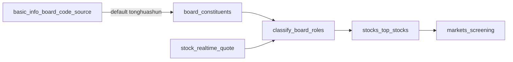

# 板块龙头/中军（偏短线领涨 + 兼顾市值）

## 目标与默认口径

- **偏短线**：板内当日涨幅（及成交额）决定排序；**不**用 RPE 日线 Z（那是中期比价）。
- **兼顾市值**：流通市值作**资格门槛 + 弱加权**，避免小票虚高「龙头」。
- **板块口径暂定同花顺**：行业/概念以 [`board_code_source`](backend_api/utils/board_code_source.py) = `tonghuashun` 的基础信息与对应成分为准；东财等其它来源并存，用同源字段区分，不混码。
- **不落库**：v1 每次请求按最新实时行情现算；不新增角色表。

## 板块来源约定（本版新增）

已有能力（沿用，不重造枚举）：

- 表：`industry_board_basic_info` / `concept_board_basic_info` 列 `board_code_source`
- 取值：`tonghuashun`（同花顺）、`eastmoney`（东财）、`huatai` / `manual` / `other`
- 常量：[`DEFAULT_BOARD_CODE_SOURCE = "tonghuashun"`](backend_api/utils/board_code_source.py)（管理端新增/导入默认）；东财同步仍写 `eastmoney`
- 成分股表按 `board_code` 挂靠；**同一中文名可能存在不同来源的不同代码**，必须带 `board_code_source` 才能唯一定位基础信息行（参见 [`bk_board_code.py`](backend_api/utils/bk_board_code.py) 同源匹配逻辑）

**本功能规则：**

1. 龙头/中军计算的成分池：仅使用**请求指定来源**对应的 `board_code` 在 `*_board_constituents` 中的成分；默认来源 **`tonghuashun`**。
2. 行情/选股列表展示多来源并存时：**同名优先展示同花顺**；东财板仍可查，但不作为默认口径。
3. API 增加查询参数 `board_code_source`（默认 `tonghuashun`）；解析时 JOIN basic_info 校验 `(board_code, source)`，找不到同花顺时可明确 404/空成分，**不静默回退东财成分**（避免混口径）。
4. 板级强弱：`industry_board_realtime_quotes` 现为东财采集，**不能**直接当作同花顺板涨幅。同花顺板的板强度用成分股 `stock_realtime_quote.change_percent` 均值/中位数现算（可选返回 `board_change_percent_est`）；东财实时领涨字段仅作东财路径参考，不参与同花顺角色判定。



## 分类规则（固定默认）

对**已解析来源**的单板成分股 JOIN 最新 `stock_realtime_quote`（需 `change_percent`、`amount`、`circulating_market_value`；缺市值时用 `stock_basic_info` 股本 × 现价兜底）：

1. 有效样本：有涨幅且流通市值 > 0。
2. 板内分位：`chg_pctile`、`amt_pctile`、`mv_pctile`（流通市值，0–100）。
3. **综合分**（偏短线）：  
   `score = 0.70 * chg_pctile + 0.20 * amt_pctile + 0.10 * mv_pctile`
4. **龙头**（至多 1～2 只）：  
   - `mv_pctile >= 40`  
   - 且 `chg_pctile >= 80` 或涨幅排名进入前 `max(3, ceil(N*0.1))`  
   - 按 `score` 取最高 1 只；第 2 名差距 ≤ 5 分且同门槛则可标第二龙头。
5. **中军**（约 3～5 只）：非龙头、`mv_pctile` ∈ [50, 95]、`chg_pctile >= 60`，按 `score` 取前 5（小板按比例缩减）。
6. 返回：`board_role` / `board_role_label` / `board_role_score` / `role_reason`，并带上 `board_code_source`（及 label）便于前端展示。

可配置常量集中放在新模块顶部；v1 用代码默认值。

## 实现落点

### 1. 来源解析（新建/扩展工具）

在 [`backend_api/utils/industry_board_query.py`](backend_api/utils/industry_board_query.py) 或同级增加：

- `resolve_board_for_roles(db, board_type, board_code, board_code_source=DEFAULT)` → 校验 basic_info 并返回规范 `board_code` + `board_code_source`
- 取成分：严格按解析后的 `board_code` 查 `IndustryBoardConstituent` / `ConceptBoardConstituent`

### 2. 核心模块（新建）

[`backend_core/board_roles/classify.py`](backend_core/board_roles/classify.py)

- `enrich_constituents_with_quotes(...)` / `classify_board_roles(rows)`
- 与来源无关的纯打分；来源只在取池阶段约束

### 3. 行情 API（主入口）

扩展 [`backend_api/market_routes.py`](backend_api/market_routes.py)：

- `GET .../industry_board/{board_code}/stocks|top_stocks?board_code_source=tonghuashun`
- 新增 `GET .../concept_board/{board_code}/stocks|top_stocks?board_code_source=tonghuashun`

补充 `circulating_market_value` / `amount` 后调用分类器；响应含来源字段。

行情页行业强板列表若仍读东财实时表：卡片上标注来源；点进成分/角色时引导用同花顺板码（同名映射优先同花顺 basic_info），无同花顺映射则提示「仅有东财口径，角色暂不按同花顺标注」或允许显式 `board_code_source=eastmoney` 计算（非默认）。

### 4. 选股结果挂载（次入口）

[`backend_api/stock/stock_screening_routes.py`](backend_api/stock/stock_screening_routes.py)：`scope` 为行业/概念且已选板时，按所选 `board_code` + 请求/配置中的 `board_code_source`（默认同花顺）算角色，挂：

```json
"role_tags": [{ "id": "board_leader", "label": "龙头", "level": "info", "reason": "..." }]
```

不写入 `risk_tags`。多板时取该股所属且被选中的板中 score 最高角色。

### 5. 前端

- [`frontend/js/markets.js`](frontend/js/markets.js)：成分/top 展示龙头/中军；请求带 `board_code_source`；来源 chip。
- [`frontend/js/screening.js`](frontend/js/screening.js)：板块选择已含来源时透传；结果表同构渲染 `role_tags`。

### 6. 测试与文档

- [`test/test_board_roles_classify.py`](test/test_board_roles_classify.py)：打分规则 +「同名不同源不混成分」解析用例。
- `docs/features/板块龙头中军标注说明.md`：同花顺默认口径、`board_code_source`、与东财实时表/RPE 的区别。

## 明确不做（本版）

- 不新建同花顺/概念板级实时涨幅采集表（板强度用成分现算）。
- 不把角色塞进 GMS/URT `risk_tags.py`。
- 不静默把同花顺空成分回退成东财成分。
- 不持久化历史龙头序列；不改 RPE Z 语义。
