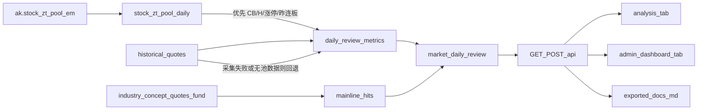

# 每日复盘报告实现方案

## 专家口径（与参考 MD 对齐）

参考 [2026年09月15日 股市复盘报告.md](c:\Users\Administrator\Downloads\2026年09月15日%20股市复盘报告.md) 的六段结构，按短线情绪交易框架固化为**可计算 + 可审核**两层：

| 章节             | 性质   | 一期策略                   |
| -------------- | ---- | ---------------------- |
| 观点与盘面分析        | 主观综合 | 规则槽位生成草稿，页面可改后保存       |
| 一、趋势解读         | 半自动  | 指标 Δ + 预置「恶化/回暖/孤高」规则句 |
| 二、五项硬门槛        | 全自动  | 表驱动 PASS/FAIL          |
| 三、主线板块         | 全自动  | 「上榜」次数统计 + 今日状态        |
| 四、情绪周期         | 全自动  | 冬/秋/春/夏匹配表             |
| 五、双曲线 Lo/Hi/Sp | 全自动  | 日序列 + 百分位 + 四象限        |
| 六、操作建议         | 半自动  | 按门槛达标率与周期套模板，可改        |

**产品形态（默认）**：

- 前台：[`frontend/analysis.html`](frontend/analysis.html) 新 Tab「每日复盘」
- 管理端：[`admin/src/views/DashboardView.vue`](admin/src/views/DashboardView.vue)（路由 `/dashboard` 仪表板/首页）用 `el-tabs` 拆成「资金流向」（现有内容）+「每日复盘」
- 导出 Markdown 至 [`exported_docs/`](exported_docs/)；日终工作流自动算快照
- 一期**不用 LLM**，保证可复现

管理端 Tab 侧重**运营审核**：选日期、一键重算、编辑观点/建议并保存、导出 MD；与前台共用同一套 `market_daily_review` 快照与 API，避免两套口径。

---

## 官方涨停池采集（新增，优先口径）

接口文档：[AkShare 涨停股池 `stock_zt_pool_em`](https://akshare.akfamily.xyz/data/stock/stock.html#id412)（东方财富涨停板行情）。仓库目前**未采集**，一期纳入。

**调用**：`ak.stock_zt_pool_em(date='YYYYMMDD')`  
**限量**：仅能拉**近期**交易日；更早日期可能空/报错，必须容错。

**入库表** `stock_zt_pool_daily`（`trade_date + code` 唯一），字段对齐接口输出并规范化：

| 库字段 | 接口列 | 说明 |
|--------|--------|------|
| code / name | 代码 / 名称 | 代码补零 6 位 |
| change_percent / price | 涨跌幅 / 最新价 | |
| amount / float_mv / total_mv | 成交额 / 流通市值 / 总市值 | |
| turnover_rate | 换手率 | |
| seal_fund | 封板资金 | |
| first_seal_time / last_seal_time | 首次/最后封板时间 | 保留原始字符串 |
| break_count | 炸板次数 | |
| limit_stats | 涨停统计 | 如 `10/6` |
| board_count | 连板数 | **1=首板** |
| industry | 所属行业 | |
| source | 固定 `em_zt_pool` | |
| collected_at | 采集时间 | |

**采集器**：`backend_core/data_collectors/akshare/zt_pool_em.py`

- `collect_zt_pool_em(trade_date) -> {success, rows, error?}`
- 异常/空表：**不抛崩工作流**，记 warning，返回 `success=False`，供复盘计算走回退
- API：`POST /api/.../zt_pool/collect?trade_date=`（可挂管理端手动补采）
- 工作流节点：排在日终行情之后、**复盘指标计算之前**

一期只采 **涨停股池**；昨日涨停/炸板/跌停等同系列接口暂不入库（需要时可二期扩展）。

---

## 指标定义（写死入库，避免口径漂移）

### 涨停 / 连板：优先官方池，失败回退原方案

| 符号 | **优先**（`stock_zt_pool_daily` 当日有数据） | **回退**（采集失败或该日 0 行） |
|------|-----------------------------------------------|--------------------------------|
| **涨停家数** | 池内行数 | `historical_quotes` + `is_limit_up`（[`classify.py`](backend_core/board_roles/classify.py)） |
| **CB 连板家数** | `board_count ≥ 2` 的家数 | 近窗涨停日序列 + `_max_consec`，取 ≥2 |
| **H 高度** | `MAX(board_count)` | 同上算法的全市场最大连板 |
| **昨连板收益** | 昨日池中 `board_count≥2` 的代码，今日涨跌幅均值（优先池内涨跌幅，否则 `historical_quotes`） | 昨日涨停代理集合 ∩ 今日涨幅均值 |

快照字段增加 `limit_source`: `em_zt_pool` | `hist_proxy`，报告页脚注明口径。

### 其余指标（仍主要靠行情表）

复权累计涨幅、成交额等仍用 `historical_quotes`；连板近似回退逻辑对齐 [`industry_board_query._max_consec`](backend_api/utils/industry_board_query.py)（相邻涨停间隔 ≤3 自然日）。

| 符号          | 定义                                                                                      | 数据源                       |
| ----------- | --------------------------------------------------------------------------------------- | ------------------------- |
| **Vol**     | 两市 A 股当日 `SUM(amount)` / 1e12（万亿）；排除 ST/*ST（名称含 ST）                                     | `historical_quotes`       |
| **Hi**      | 非 ST 全市场「近 10 交易日累计涨幅%」的**最大值**                                                         | 复权用库内收盘价串                 |
| **Lo**      | 「低位组」近 10 日累计涨幅%的**中位数**：低位 = 收盘处于近 60 日高低区间 ≤35% 分位；若样本 <30 则退化为全市场近 10 日累计涨幅的 **P20** | 同上                        |
| **Sp**      | `Hi - Lo`                                                                               | 派生                        |
| **百分位**     | 该指标在近 N 个交易日（默认 79，与参考「有记录以来」一致，不足则全长）中的经验分位                                            | `market_daily_review` 历史行 |

说明：参考文中 Hi 可到 151，与「十日累计涨幅最大值」量级一致；Lo 落在 20–40 需用低位组中位数校准，上线后用 09-15 样本对一下，必要时只调「低位阈值 / P20」配置，不改表结构。

**五项硬门槛（与参考表一致，可配置）**

1. Vol ≥ 2.0 万亿
2. CB ≥ 13
3. H ≥ 6（且非「孤高」：若 CB 较昨下降且 Vol 较昨下降则记隐患，仍可按 H 判达标）
4. Lo 近 3 日严格上升
5. Hi 近 3 日均 ≥ 95

**情绪周期（优先匹配最「冷」的满足行）**

- 冬：CB<10 且 H<4 且 昨连板收益<0  
- 秋：CB<13 且 H<6 且 昨连板收益<1  
- 春：CB<18 且 H<7 且 昨连板收益>3  
- 夏：其余偏热（CB/H/溢价更高）  
报告中保留「部分满足」明细，与参考「秋期逼近冬」叙述模板一致。

**双曲线四象限**：Lo<35 且 Hi<100 → 冬/冰点；其余按 (Lo≥35, Hi≥100) 四分。

**主线「上榜」（本系统无龙虎榜，采用合成日榜）**  
对同花顺行业+概念板，当日满足任一即计 1 次上榜：

- 涨幅 Top15，或  
- 板内涨停家数 Top10（有成分映射时），或  
- `[board_fund_flow_daily](backend_api/stock/board_fund_flow.py)` 净流入 Top10

近 10 个交易日上榜次数 ≥3 → ★★★/★★ 核心主线；1–2 → 观察；今日是否再次命中 → 今日状态；梯队：持续上榜 / 休整（核心但今日未上）/ 新面孔（近 10 日首次）/ 滑出。

---

## 数据层

新建 PostgreSQL 表（迁移脚本放 `migrations/`）：

1. **`stock_zt_pool_daily`**：东方财富涨停股池日表（见上节）
2. **`market_daily_review`**（按 `trade_date` 唯一）  
   存：Vol、涨停家数、CB、H、昨连板收益、Lo、Hi、Sp、百分位、`limit_source`、硬门槛 JSON、周期判定、规则结论 JSON、人工覆盖的 `viewpoint_md` / `advice_md`、`computed_at`。
3. **`market_daily_mainline_hits`**（`trade_date, board_type, board_code`）  
   存：是否上榜、命中原因、涨幅/涨停数/净流入，供近 10 日滚动统计。

计算入口：`backend_core/market_review/compute.py`（新包）

- `compute_market_metrics(db, trade_date) -> dict`（内部：有池用池，否则 `hist_proxy`）  
- `compute_mainline_hits(db, trade_date) -> list`  
- `build_review_snapshot(db, trade_date) -> upsert`  
- `render_markdown(snapshot) -> str`（章节顺序与参考 MD 一致）

挂载：

- API：`POST /api/market_review/compute`、`GET /api/market_review/daily`、`PUT` 保存人工观点、`GET .../export.md`；另 `POST` 涨停池补采  
- 工作流：`涨停池日采` →（可选资金流等）→ `每日复盘指标`（行情日采之后）

---

## 后端 API / 模板

- 路由：[`backend_api/stock/market_review_routes.py`](backend_api/stock/market_review_routes.py)（新），在 `main` 注册；涨停池采集可同文件或挂 `data_collection_api`。  
- 模板：`backend_core/market_review/templates/daily_review.md.j2`（或 f-string），输出：`exported_docs/YYYY年MM月DD日 股市复盘报告.md`。  
- 规则引擎：`backend_core/market_review/rules.py`。  
- 单测：`test/test_zt_pool_em_collector.py`（mock akshare）、`test/test_market_daily_review_metrics.py`（池优先 / 回退两条路径）、`test/test_market_review_render.py`。

---

## 前端（分析频道）

- [`frontend/analysis.html`](frontend/analysis.html)：Tab `daily-review`。  
- [`frontend/js/daily_review.js`](frontend/js/daily_review.js)：日期、重算、指标/硬门槛/主线/双曲线、观点编辑、导出 MD；展示 `limit_source`。  
- 样式 [`frontend/css/analysis.css`](frontend/css/analysis.css)；权限 `channel.analyze.tab.daily_review`。  
- 挂入 [`analysis.js`](frontend/js/analysis.js) 的 `loadTabData`。

---

## 管理端首页 Tab

现状：[`DashboardView.vue`](admin/src/views/DashboardView.vue) 单页资金流向；[`AdminLayout.vue`](admin/src/views/AdminLayout.vue)「仪表板」→ `/dashboard`。

改造：

1. `DashboardView` 顶层 `el-tabs`：**资金流向**（现有）+ **每日复盘**
2. 组件 [`admin/src/views/dashboard/DailyReviewPanel.vue`](admin/src/views/dashboard/DailyReviewPanel.vue)：选日、加载、重算、保存观点、导出 MD；可附「补采涨停池」按钮
3. [`admin/src/services/marketReview.service.ts`](admin/src/services/marketReview.service.ts)；必要时 `/api/admin/...` 薄转发
4. 不新增侧栏路由，仍在仪表板内切 Tab

---

## 实施顺序

1. **涨停池表 + `stock_zt_pool_em` 采集器**（失败不阻断）
2. **复盘指标表 + compute**（优先池 / 回退 hist_proxy：Vol/CB/H/昨连板/Lo/Hi/Sp）
3. **硬门槛与周期 + MD 渲染**
4. **主线上榜** 统计与第三节表格
5. **API + 前台 analysis Tab + 人工覆盖**
6. **管理端 Dashboard「每日复盘」Tab**
7. **工作流串联 + 用近期交易日（含 2026-09-15 若接口仍可得）校准**

---

## 风险与边界

- 官方涨停池**仅近期可采**；历史补算或接口失败时自动 `hist_proxy`，报告脚注标明 `limit_source`。  
- 代理口径为日终涨幅涨停，与东财「含炸板次数/封板时间」不完全一致。  
- Vol 用全市场成交额加总，可能与券商「两市成交额」略有差异（口径脚注）。  
- 一期叙述不求文采，求**指标正确 + 模板稳定**；观点段保留人工终审，符合参考文末「报告审核：Person」。
