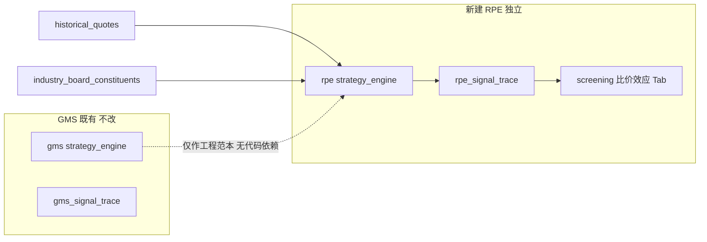

# 比价效应（RPE）选股策略实现计划

## 策略理解（文档 → 可量化规则）

| 文档概念 | 落地规则（默认参数，进配置） |
|---------|---------------------------|
| **板块簇** | 默认用 [`industry_board_constituents`](backend_api/models.py) 的 `board_code` 作为 `sector_id`；同板块成分股为一簇 |
| **簇基准 \(I_t\)** | 板块内当日：成交量加权收盘价 \(I_t=\sum(P_{i,t}V_{i,t})/\sum V_{i,t}\)；生成约 250 日序列 |
| **偏离 Z-Score** | 个股相对 \(I_t\) 的比价序列做滚动 Z（窗口默认 40，可配 20–60）；\(Z>2.0\)=领涨；\(Z<-1.5\)=潜在补涨 |
| **趋势否决** | 对 \(I_t\) 做年度窗口线性斜率（或近 N 日回归斜率）；斜率 &lt; 0 时**禁止补涨类入选**（领涨是否允许由配置开关控制，默认同样否决弱势板块） |
| **KDE 结构坐标** | `scipy.stats.gaussian_kde`，成交量为权重；`bw_method = base_factor * (sigma/mu)`；`find_peaks` 取密度极大值 → 支撑/阻力数组 |
| **结构过滤** | 现价须在最近一级支撑之上；距最近一级阻力有最小安全边际（盈亏比阈值，配置项） |
| **防守/退出** | **禁止固定百分比止损**；仅结构破位（收盘跌破最近有效支撑）作为离场准绳 |
| **流动性** | 决策侧检查近 N 日均量/换手下限，避免极低流动性下做均值回归（T+1 溢价约束） |

选股主信号建议拆两类（写入 `signal_type`）：

- `catch_up`：\(Z<-1.5\) + 板块非下行 + 站在支撑上 + 阻力空间足够  
- `lead`：\(Z>2.0\)（默认仅入观察池/弱提示，是否进入「可交易」由配置 `enable_lead_trade` 控制，默认 false，贴合文档「补涨捕捉」主目标）

## 与 GMS 的关系



- **独立**：独立包名、表前缀、API 前缀、前端 Tab、admin 路由，不 import GMS 业务逻辑。  
- **对标**：目录分层、config 多版本、`config_id` 隔离 trace、选股 `trace_only`、观察→正式交易、日终 cron、admin 回测任务，均按 [GMS](backend_core/strategies/gms/) 范式镜像。

**前置**：本地 `main` 落后远程约 17 提交；实现前先 `git pull`，在最新 `main`（含 SBBR 等）上开分支 `cursor/rpe-relative-price-effect`。

## 模块落点

新建 [`backend_core/strategies/rpe/`](backend_core/strategies/)：

| 文件 | 职责 |
|------|------|
| `config.py` | 默认阈值 + `RPEConfigManager`（仿 GMS 多版本） |
| `data_loader.py` | 拉 250 日 OHLCV；按板块加载成分股与日线 |
| `sector_benchmark.py` | 计算簇基准 \(I_t\) 序列与斜率 |
| `zscore.py` | 个股相对基准的滚动 Z-Score |
| `kde_levels.py` | 成交量加权 KDE + peaks → 支撑/阻力 |
| `filters.py` | 趋势否决、支撑确认、阻力空间、流动性过滤 |
| `signal_detector.py` | 组装 catch_up / lead 信号 |
| `strategy_engine.py` | `screen()` / `evaluate_code()` |
| `frontend_interface.py` | 优先读 `rpe_signal_trace`，缺失则计算回写 |
| `signal_storage.py` | upsert trace |
| `scheduled_precompute.py` | 日终全市场/按板块批处理 |
| `backtest_runner.py` + `backtest_storage.py` + `backtest_worker.py` | 命中率 / 结构破位退出的交易模拟 |
| `trade_structure_plan.py` | 观察/正式交易用结构价位计划（替代 GMS 固定比例止损计划） |

**依赖**：确认环境有 `scipy`；KDE 单测放 [`test/`](test/)（文档强调带宽容错，优先覆盖）。

## 数据模型（PostgreSQL，独立表）

不使用文档中的 `market_watch_list` 单表名，而按 GMS 拆分（语义对应「观察池」= 选股结果/trace）：

1. **`rpe_strategy_configs`** — JSON `config_params` + `is_default` / `precompute_enabled`  
2. **`rpe_signal_trace`** — PK `(code, trade_date, market_type, config_id)`  
   - 关键：`sector_id`, `sector_name`, `z_score`, `signal_type`, `entry_signal`, `sector_slope`, `support_levels`(JSONB), `resistance_levels`(JSONB), `nearest_support`, `nearest_resistance`, `structure_valid`, `liquidity_ok`, `detail`(JSONB)  
3. **`rpe_trade_observe_stocks`** / **`rpe_trade_observe_history`**  
4. **`rpe_formal_trades`** — `entry_price`, `status`, `structure_support`, `structure_resistance`, `exit_reason`（仅 `structure_break` 等结构原因）, `pnl_*`  
5. **`rpe_backtest_tasks`**  
6. **`rpe_precompute_runs`**（可选，仿 GMS 监控）  
7. 迁移：[`migrations/add_rpe_tables.py`](migrations/)

**可选性能表**（全市场日终过慢时再加）：`rpe_sector_benchmark`（`sector_id, date, i_t, volume_sum`）缓存基准序列，避免每日重算。

## API（路径与 GMS 平行、零冲突）

**选股**（[`stock_screening_routes.py`](backend_api/stock/stock_screening_routes.py)）  
- `GET /api/screening/rpe-strategy`  
  - `scope=cn|watchlist|industry_board|single`  
  - `config_id`, `trace_only`, `signal_type`, `board_code`  

**用户**（新建 `backend_api/rpe_*_routes.py`）  
- `/api/stock/rpe-trade-observe/*`  
- `/api/stock/rpe-formal-trade/*`（破位平仓校验：禁止固定 % 止损字段作为唯一离场）  
- `/api/stock/rpe-signal-trace`（+ 可选 recompute）  

**管理端** `backend_api/admin/rpe_admin_routes.py`，前缀 `/api/admin/rpe`  
- `strategy-configs` CRUD / default  
- `backtests` 创建/轮询/报告  
- `precompute/trigger`  
- `selection-results`  

**前端公开**（可选但对齐 GMS）：`/api/frontend/rpe/strategy-configs`

注册于 [`backend_api/main.py`](backend_api/main.py)，与 GMS 路由并列、互不复用。

## 前端

**用户端** [`frontend/screening.html`](frontend/screening.html) + [`js/screening.js`](frontend/js/screening.js)（或独立 `rpe_screening.js` 减轻耦合）：  
- 新 Tab「比价效应」  
- 子面板：策略信号 / 交易观察 / 正式交易（对齐 GMS 三段）  
- 列：板块、Z、信号类型、支撑/阻力、结构有效、流动性  

**追溯页**：`frontend/stock_rpe_trace.html`  

**管理端**：`/rpe-management`（[`admin/src/views/RPEManagementView.vue`](admin/src/views/) + `rpeApi.ts`），侧栏入口仿 GMS。

## 日终调度

[`backend_core/data_collectors/main.py`](backend_core/data_collectors/main.py)：  
- `ENABLE_RPE_PRECOMPUTE`  
- `rpe_signals_cn` 默认工作日 **19:40**（避开 GMS/SBBR 高峰）  
- 流程：成分股 → 板块 \(I_t\) → Z-Score → KDE → 过滤 → `rpe_signal_trace`  

文档中的「T+1 盘中 13:00–15:00 二次确认」：第一期用 **实时行情 `stock_realtime_quote`** 在选股/观察列表刷新时做「现价是否仍在支撑上」二次校验即可（无分钟线库）；不单独做盘中 cron，除非后续明确要求。

## 回测（对标 GMS）

| 类型 | 行为 |
|------|------|
| `signal_hit_rate` | 补涨信号日后 N 日内是否向板块基准收敛 / 触及目标相对收益 |
| `trade_simulation` | T+1 开盘入场；离场仅结构破位或触及阻力兑现；统计收益与破位率 |

## 测试（[`test/`](test/)）

- `test_rpe_zscore.py`、`test_rpe_kde_levels.py`（多 bw 对比）  
- `test_rpe_filters.py`（趋势否决、支撑/阻力空间）  
- `test_rpe_screening_api.py`、`test_rpe_formal_trades.py`  
- `test_rpe_backtest.py`  

## 交付顺序

1. 核心算法 + 配置 + 单测（尤其 KDE）  
2. 表迁移 + engine + 预计算 + `/screening/rpe-strategy`  
3. 用户观察/正式交易 + screening Tab  
4. 管理端配置/回测 + 追溯页  
5. 文档：`docs/RPE_比价效应_信号计算规则.md` + 业务简化版  

## 明确不做 / 边界

- 不修改 GMS 表与逻辑；不共用 `gms_*` API  
- 不引入固定百分比止损作为策略内建离场规则  
- 不依赖不存在的板块历史指数表：基准由成分股日线现场合成  
- 前复权：沿用现有 `historical_quotes` 入库口径（与全站一致）；若后续统一前复权管道再单独迁移  

## 关键默认配置草案（写入 `config.py`）

```python
{
  "lookback_days": 250,
  "z_window": 40,
  "z_lead": 2.0,
  "z_catch_up": -1.5,
  "sector_slope_window": 60,
  "kde_base_factor": 1.0,
  "min_rr_to_resistance": 1.5,
  "min_avg_amount": ...,
  "enable_lead_trade": False,
  "enable_trend_veto": True,
}
```
