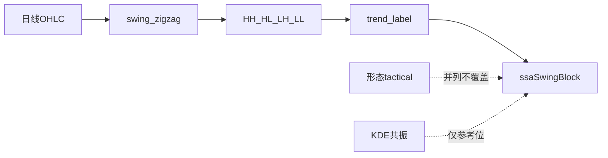

# 个股分析：是否加入「波段与趋势结构」——结论与方案

## 结论（建议）

**有必要加入，但是「补第三维叙事」，不是再造一套价位引擎。**

| 维度      | 现状                              | 回答的问题                      |
| ------- | ------------------------------- | -------------------------- |
| 阻力支撑位   | 已落地（KDE/VP/Fib/Pivot/共振）        | 价在哪档攻防？                    |
| 形态识别    | 已落地（12 种 + 生命周期 + `tactical`）   | 几何形态与短期三态？                 |
| 波段与趋势结构 | **缺产品面**（ZigZag 只服务 Fib/KDE/枢轴） | 多空结构是否仍完好（HH/HL）？最近一波是否破位？ |

文档已写「四维闭环」（形态 / 共振 / 攻防分层 / 盘口自适应），那是**形态+价位**闭环；**不包含**经典 swing market structure。当主形态归档、`tactical=insufficient` 或旁路看空过重时，用户缺少一句可核对的「日线波段仍是抬升 / 已出 LH·LL」——这正是第三维价值。

**不建议立刻做满**：完整 SMC（BOS/CHOCH/OB/FVG）、多周期自动融合、与策略硬筛强绑定——成本高、与现有 `tactical`/共振文案易打架。

---

## 为何值得做（与现有能力不重叠）

1. **底层已有、产品未露**：`[swing_zigzag.py](backend_core/analysis/swing_zigzag.py)` 已产出摆动序列；Fib 只展示「最近一对」高低点，个股 UI **不画 ZigZag 链、不标 HH/HL**。
2. **填形态空窗**：无主形态时靠共振兜底；趋势结构可给出独立、可解释的方向标签（上升/下降/转换/震荡）。
3. **纠偏旁路看空**：归档双顶「浅破颈线」易被读成结构破位；若日线仍是 HH+HL，专家区可并列「形态压力 vs 波段趋势仍多」。
4. **与策略同语言**：URT/GMS 的「结构」多指 KDE 位；个股第三块应明确命名为 **「波段与趋势」**，避免再泛用「结构」一词。

---

## 建议产品口径（定稿）

**名称**：波段与趋势（Market Structure）  
**入口**：个股分析第三块 `ssaSwingBlock`（与 `[ssaLevelsBlock](frontend/analysis.html)` / `ssaPatternBlock` 并列）；技术工具可后挂同一 API。  
**数据**：日线 OHLC，复权口径与 levels/patterns 一致（`adjust=none|qfq`）。  
**输出（一期最小集）**：

- ZigZag 确认摆动点序列（最近 N 个，默认约 8～12 点）
- 每个点标注：`HH | HL | LH | LL | —`（相对前一同向极值）
- 趋势标签：`uptrend | downtrend | transition | range`（规则：连续至少 2 组 HH+HL → up；2 组 LH+LL → down；高低错乱 → transition/range）
- 最近关键事件：`last_bos_like`（可选轻量：收盘有效越过最近确认 swing high/low，**不叫 CHOCH 全称以免过度承诺**）
- 一句 NLG：与形态 `short_bias` **并列展示、不互相覆盖**；冲突时文案写明「形态看空 / 波段仍抬升」类对照

**明确非目标（一期）**：订单块、FVG、周线自动主判、写入 URT/GMS 硬筛。

---

## 实现落点（确认后再做）

1. **后端**新建薄模块（建议 `backend_core/analysis/market_structure.py`）：输入 bars → 调现有 `extract_zigzag_swing` → 标注与趋势规则 → JSON。
2. **API**：`GET /api/analysis/market-structure/{code}`（或挂在 `/levels` 扩展字段 `market_structure`；独立路由更清晰、便于懒加载）。
3. **前端**：`[stock_multi_strategy.js](frontend/js/stock_multi_strategy.js)` 在 levels/patterns 旁并行加载；`[analysis.html](frontend/analysis.html)` 增 `ssaSwingBlock`；PDF 追加一小节摘要。
4. **文档**：在 `[支撑阻力与形态识别_算法说明.md](docs/features/支撑阻力与形态识别_算法说明.md)` 增「第五维/第三块：波段与趋势」，写清与 `tactical` 边界。
5. **单测**：合成 HHHL 升势、破前高、锯齿震荡、数据不足。

参数默认对齐 Fib：`fractal` / `min_swing_bars`（现网约 8），避免与 Fib 锚点两套 ZigZag。

---

## 优先级与分期

| 阶段           | 内容                                                        | 优先级      |
| ------------ | --------------------------------------------------------- | -------- |
| **P0（建议先做）** | 日线 ZigZag 链 + HH/HL 标注 + 趋势标签 + 个股第三块 + 与形态对照一句           | 高（性价比最好） |
| **P1**       | 轻量「破前摆动高/低」事件；K 线叠加折线（若图表组件已支持）                           | 中        |
| **P2**       | 周线结构只读对照；可选喂给 `tactical.evidence` 软增强（仍不改 short_bias 主判定） | 低        |
| **不做（近端）**   | 完整 SMC、策略硬筛绑定、替代形态专家                                      | —        |

---

## 风险与纪律

- **文案冲突**：必须「并列 + 对照」，禁止静默用波段覆盖形态三态。  
- **参数漂移**：与 Fib/KDE 结构锚共用 ZigZag 参数，一处配置。  
- **命名**：UI 用「波段与趋势」，内部可用 `market_structure`；少说笼统「结构分析」。

---

## 总结建议

- **要做**：补第三块，让「趋势是否完好」可核对、可导出。  
- **怎么做**：复用 ZigZag，一期只做 HH/HL + 趋势标签 + UI/PDF，**不**上完整 SMC。  
- **何时做**：形态与 KDE 已稳，现在加 P0 合适；若近期资源紧，可先只出 API+PDF 摘要，再上图表折线（P1）。

