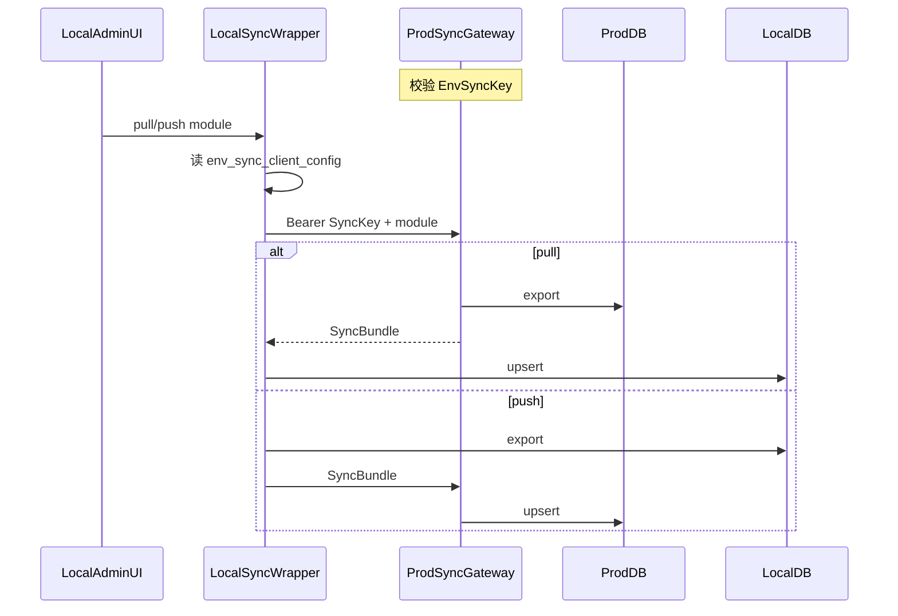

# 环境数据双向同步（一期：策略 + 交易观察）

## 已确认决策

- **范围（1A）**：策略参数版本（GMS / URT / RPE / SBBR，含 PVFRS 若同构）+ 各策略交易观察股 / 观察历史 / 正式交易（及 SBBR 储备箱）；用户按 `username` 对齐。
- **密钥模型（2A）**：仅生产维护并校验 Sync Key；本地配置「生产 Base URL + Key」，**一律由本地发起** pull / push。
- **不同步**：行情、指标、`*_signal_trace`、回测任务、推送记录、板块、权限、自选股、推送配置（后续可二期扩展）。

## 架构

- **生产**：网关校验 Key → 调用同步服务（export / import）。
- **本地**：管理端只调本地包装 API；本地持 Key 调生产，前端不直连生产。

## 数据与 upsert 规则

| 模块 | 表 | 对齐键 | 备注 |
|------|-----|--------|------|
| 策略配置 | `gms_strategy_configs` / `urt_*` / `rpe_*` / `sbbr_*`（+ `gms_runtime_config`） | `name` | 写入后建立 `name→本地id` 映射，供观察表 remap `config_id` |
| 用户锚点 | `users`（仅匹配用） | `username` | **不创建**缺失用户：观察行若用户在目标端不存在则跳过并记入报告 |
| GMS 观察 | `gms_trade_observe_stocks` | `(username→user_id, market, code)` | history / formal 按业务字段 upsert 或按源 `id` 附带 `source_env` 防冲突 |
| URT / RPE / SBBR 观察 | 对应 `*_trade_observe_stocks` | 同上 | SBBR 另含 `sbbr_reserve_box` `(user, stock_code)`；SBBR 无 history |
| 正式交易 | `*_formal_trades` | 建议 `(user, market, code, entry_date, status)` 或同步包内稳定 `external_key` | 写入时 remap `user_id`、`config_id`、`source_observe_id` |

包格式（JSON）：`{ schema_version, module, exported_at, env_label, items: [...], id_maps hints }`。冲突策略一期：**目标端以源包覆盖同业务键行**（last-write-from-sync），结果返回 `created/updated/skipped/errors`。

## 持久化与配置

仿 [`email_sender_config`](backend_api/models.py) 单行表模式：

1. **`env_sync_server_config`（生产为主，本地也可存但不用于校验对端）**  
   - `sync_key_hash`（只存哈希，或存密文+脱敏展示）、`enabled`、`updated_at`  
   - 管理端：生成/轮换 Key（明文仅创建时展示一次）、启用开关。

2. **`env_sync_client_config`（本地）**  
   - `prod_base_url`、`sync_key`（加密或受限展示）、`enabled`  
   - 管理端：填写生产 URL + Key、连通性测试。

可选 env 回退：`ENV_SYNC_KEY` / `ENV_SYNC_PROD_BASE_URL`（与 SMTP 一致：DB 优先）。

迁移脚本：`migrations/add_env_sync_tables.py`。

## 接口层

**生产（对本地服务端，Key 认证，不要用户 JWT）：**

- `GET /api/env-sync/v1/health` — Key 校验探活  
- `GET /api/env-sync/v1/export?module=...` — 导出包  
- `POST /api/env-sync/v1/import` — 接收包并 upsert  

Header：`Authorization: Bearer <SyncKey>` 或 `X-Env-Sync-Key`。

**本地包装（管理端 JWT + 管理员角色）：**

- `GET/PUT /api/admin/env-sync/server-config` — 维护本机作为「可被拉取方」时的 Key（本地一般少用）  
- `GET/PUT /api/admin/env-sync/client-config` — 生产 URL + Key  
- `POST /api/admin/env-sync/test-connection`  
- `POST /api/admin/env-sync/pull` body: `{ modules: ["strategy_configs","trade_observe"] }`  
- `POST /api/admin/env-sync/push` 同上  

实现目录建议：

- [`backend_api/env_sync/`](backend_api/)：`auth.py`（Key 校验）、`gateway_routes.py`、`admin_routes.py`、`bundle.py`、`services/`（按模块 export/import）
- 注册到 [`backend_api/main.py`](backend_api/main.py)

## 管理端 UI

- 新页或挂在「系统/环境」：[`admin/src/views/EnvSyncView.vue`](admin/src/views/) + [`admin/src/services/envSyncApi.ts`](admin/src/services/)  
- 侧栏入口：[`AdminLayout.vue`](admin/src/views/AdminLayout.vue) / router  
- 区块：客户端配置（URL+Key+测试）、服务端 Key 轮换、模块多选、Pull / Push 按钮、结果摘要（成功/跳过/错误列表）

## 安全

- 生产 Key 使用常量时间比较；失败统一 401；可加简单 rate limit / IP 白名单（env 可选，一期可只做 Key）。  
- 审计：写简单日志表或复用现有 audit（`env_sync_audit_logs`：方向、模块、操作者、计数、错误）。  
- Push 到生产为高风险操作：UI 二次确认。

## 文档与测试

- 更新 [`docs/环境说明.md`](docs/环境说明.md)：同步范围、Key 落点、操作步骤。  
- 单测：Key 鉴权；策略 `name` upsert + `config_id` remap；观察股缺用户跳过；pull/push 包装层 mock 对端。

## 实施顺序

1. 表 + 模型 + Key 校验中间件  
2. 策略配置 export/import  
3. 交易观察 / formal / reserve export/import（含用户对齐）  
4. 本地 admin 包装 API + 连通测试  
5. 管理端页面  
6. 文档与单测  
