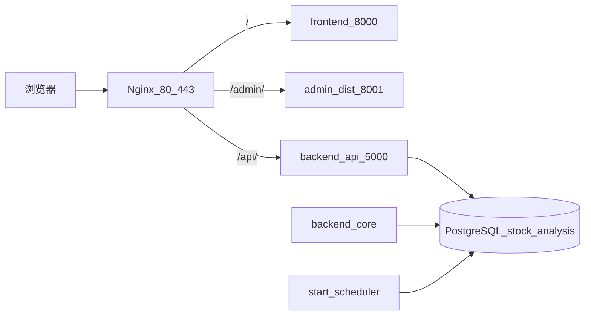

# 生产环境整体迁移方案（目标：CentOS）

## 前提与约定

- **源环境**：现有 Windows 生产（NSSM + 自带 Nginx 工具目录）。
- **目标环境**：**CentOS 7/8/Stream 或兼容 Rocky/Alma**（本文统称 CentOS）。包管理按大版本用 `yum`（7）或 `dnf`（8+/Stream）。
- **不沿用** Windows 的 `scripts/deploy/*.ps1` / NSSM 作为新机主路径；开发机仍可用 `deploy.ps1` **打 zip**，新机用 **bash + systemd** 发布。
- **业务拓扑不变**（仅 OS 与进程托管方式变化）：



### 统一目录（CentOS）

```
/opt/stock_quote/
  releases/                 # 历史版本解压目录
  current/                  # 当前运行代码（symlink → releases/xxx）
  shared/.env               # 生产密钥
  shared/logs/              # journald 之外的应用补充日志（可选）
  shared/backups/           # pg_dump 落地
  shared/ssl/               # 或使用 /etc/nginx/ssl/
  .venv/                    # 推荐：DeployRoot 级共享 venv（随 requirements 升级）
```

运行用户建议：`stockquote`（无登录），目录属主 `stockquote:stockquote`。

| 组件 | 端口 | systemd 单元（拟） |
|------|------|-------------------|
| Nginx | 80 / 443 | `nginx.service`（系统包） |
| frontend | 8000 | `stock-quote-frontend.service` |
| admin | 8001 | `stock-quote-admin.service` |
| backend_api | 5000 | `stock-quote-api.service` |
| backend_core | 无 | `stock-quote-core.service` |
| 推送调度 | 无 | `stock-quote-notify.service` |
| PostgreSQL | **5432**（本机默认） | `postgresql-*.service` |

安全组/firewalld：对外仅 **80、443、SSH**；禁止公网访问 5000/8000/8001/5432。

---

## 阶段 0：迁机前盘点（旧 Windows 机）

1. 导出：现网 `.env`、生效 Nginx conf、SSL 证书与私钥、最近发布 zip 或 `current` 代码版本。
2. 记录：PG 版本与端口（现网笔记常见 **8432**）、库名 `stock_analysis`、域名 `www.icemaplecity.com`。
3. 约定停写窗口（收盘后）：停采集/推送/API 写库后再做最终 dump。
4. 提前将 DNS TTL 降到 300s。

---

## 阶段 1：CentOS 基础运行时

### 1.1 系统与防火墙

```bash
# 示例 CentOS 8+/Stream
sudo dnf -y update
sudo firewall-cmd --permanent --add-service=http --add-service=https
sudo firewall-cmd --permanent --add-service=ssh
sudo firewall-cmd --reload
sudo useradd -r -m -d /opt/stock_quote -s /sbin/nologin stockquote
```

### 1.2 Python

- 安装 **Python 3.10+**（CentOS 7 需 SCL/`pyenv`/源码或第三方源；8+/Stream 可用模块流或源码）。
- 在 `/opt/stock_quote` 创建 venv：

```bash
sudo -u stockquote python3.10 -m venv /opt/stock_quote/.venv
source /opt/stock_quote/.venv/bin/activate
pip install -U pip
pip install -r /opt/stock_quote/current/requirements-prod.txt
```

- systemd 的 `ExecStart` 使用 **venv 绝对路径**，例如 `/opt/stock_quote/.venv/bin/python`。

### 1.3 构建依赖

- **Node 不必装在生产机**：`admin/dist` 由开发机 [scripts/deploy/deploy.ps1](scripts/deploy/deploy.ps1) 打进发布包。
- 若需在服务器重编前端：再装 Node 16+。

### 1.4 系统库

- 编译型 Python 包可能需要：`gcc`、`libpq-devel`、`openssl-devel` 等（`psycopg2` 若用二进制轮子可减少依赖）。

---

## 阶段 2：PostgreSQL 迁移

### 2.1 新机装库

- 安装与旧机**大版本一致或更新**的 PostgreSQL 12+（官方 PGDG yum 源更可控）。
- 初始化并启动；创建库：

```sql
CREATE DATABASE stock_analysis OWNER postgres;
```

- `pg_hba.conf`：应用同机则 `127.0.0.1/32 scram/md5`；改完 `systemctl reload postgresql`。
- 监听默认 **5432**。

### 2.2 旧机导出（停写后）

旧 Windows 停服务顺序：`stock-quote-core` → `stock-quote-notify` → `stock-quote-api`（及 frontend/admin）。

```bash
# 在可连通旧库的机器上执行（密码用 .pgpass 或 PGPASSWORD）
pg_dump -h <旧机IP> -p <端口> -U postgres -Fc -f stock_analysis_YYYYMMDD.dump stock_analysis
```

### 2.3 新机导入

```bash
sudo -u postgres pg_restore -d stock_analysis --no-owner --role=postgres /opt/stock_quote/shared/backups/stock_analysis_YYYYMMDD.dump
```

### 2.4 校验

- 表数量、关键表行数、最近行情日期、GMS/观察/正式交易表抽样。
- 用生产 `.env` 在 venv 中 `SessionLocal` 试连。
- **全量 dump 已含最终 schema 时，不要盲目跑全部 `migrations/*.py`**；仅补缺时执行单个脚本或 [init_db.py](init_db.py)。

---

## 阶段 3：应用目录与 `.env`

### 3.1 目录初始化（拟提供 `bootstrap_centos.sh`）

```bash
sudo mkdir -p /opt/stock_quote/{releases,shared/logs,shared/backups,shared/ssl}
sudo ln -sfn /opt/stock_quote/releases/<首次解压目录> /opt/stock_quote/current
sudo chown -R stockquote:stockquote /opt/stock_quote
```

将 `shared/.env` 拷到 `current/.env`（或在 unit 里 `EnvironmentFile=` 指向 shared，推荐 **EnvironmentFile=/opt/stock_quote/shared/.env`**，避免依赖拷贝）。

### 3.2 生产 env 必配（拟 `scripts/deploy/linux/.env.centos.example`）

```
ENVIRONMENT=production
BACKEND_PORT=5000
UVICORN_WORKERS=2
FRONTEND_PORT=8000
DATABASE_URL=postgresql+psycopg2://postgres:<密码>@127.0.0.1:5432/stock_analysis
JWT_SECRET_KEY=...
TUSHARE_TOKEN=...
SMTP_*=...
WECHAT_*=...          # 以 backend_api/config.py 实际读取键为准
GMS_SCREENING_TIMEOUT=600
```

路径类（`REPORT_DIR` 等）改为 Linux 路径，如 `/opt/stock_quote/shared/reports`。

### 3.3 发布流程

**开发机（可仍用 Windows）：**

```powershell
powershell -ExecutionPolicy Bypass -File .\scripts\deploy\deploy.ps1
# 产出 dist\stock_quote_release_*.zip → scp 到 CentOS
```

**CentOS（拟 `release.sh`）：**

1. 解压到 `releases/stock_quote_release_<ts>/`
2. `pip install -r requirements-prod.txt`（进共享 venv）
3. `ln -sfn` 切换 `current`
4. `systemctl restart stock-quote-api core notify frontend admin`
5. `nginx -t && systemctl reload nginx`
6. curl 健康检查；失败则 symlink 回滚并 restart

---

## 阶段 4：Nginx 与证书（CentOS）

1. 安装系统 Nginx：`dnf/yum install nginx`（不要依赖 Windows 那份 `tools/nginx-1.28.0`）。
2. 以 [docs/prod/nginx.conf](docs/prod/nginx.conf) 为业务逻辑源，产出 **`docs/prod/nginx.centos.conf`**，差异仅路径：
   - `ssl_certificate` → `/opt/stock_quote/shared/ssl/...` 或 `/etc/nginx/ssl/...`
   - `access_log` / `error_log` → `/var/log/nginx/...`
   - `root`（ACME）→ `/usr/share/nginx/html`
3. 启用站点：`sites-available`/`conf.d/stock_quote.conf`；`nginx -t` 后 `systemctl enable --now nginx`。
4. 证书：从旧机拷贝 PEM，或用 certbot（`certbot --nginx`）在新机签发；ACME location 保持与现网一致。
5. upstream 仍指向 `127.0.0.1:5000` / `8000` / `8001`；`/api/` 的 `proxy_read_timeout 600s` 保留。

---

## 阶段 5：systemd 五服务（替代 NSSM）

单元文件落在拟建目录 `scripts/deploy/linux/systemd/`，安装到 `/etc/systemd/system/`。

共性：

```
User=stockquote
Group=stockquote
WorkingDirectory=/opt/stock_quote/current
EnvironmentFile=/opt/stock_quote/shared/.env
Restart=always
RestartSec=5
```

| 单元 | ExecStart 要点 |
|------|----------------|
| `stock-quote-api` | `/opt/stock_quote/.venv/bin/python /opt/stock_quote/current/start_backend_api.py`（或直接 `uvicorn backend_api.main:app --host 0.0.0.0 --port 5000 --workers N`） |
| `stock-quote-core` | `.../python .../start_backend_core.py` |
| `stock-quote-notify` | `.../python .../start_scheduler.py` |
| `stock-quote-frontend` | `Environment=FRONTEND_PORT=8000` + `.../python .../start_frontend.py` |
| `stock-quote-admin` | `WorkingDirectory=.../current/admin/dist` + `.../python -m http.server 8001` |

```bash
sudo systemctl daemon-reload
sudo systemctl enable --now stock-quote-api stock-quote-core stock-quote-notify \
  stock-quote-frontend stock-quote-admin
sudo systemctl status stock-quote-api
journalctl -u stock-quote-api -f
```

> 手册中仅有推送调度的 Linux 示例（[docs/系统维护手册.md](docs/系统维护手册.md) §4）；迁机需补齐另外 4 个单元，避免 Windows 上 frontend/admin 未进服务的同样缺口。

---

## 阶段 6：切换日 Runbook

| 步骤 | 动作 |
|------|------|
| T-1 | CentOS 灰测：本机 hosts 指新 IP，验登录/选股/管理端/HTTPS |
| T0 | 旧机停写 → 最终 `pg_dump -Fc` → 新机 `pg_restore` → 校验行数 |
| T1 | `systemctl start` 全部应用单元 + nginx；`curl -k https://新IP/health`、`/api/`、`/admin/` |
| T2 | DNS A/AAAA → 新公网 IP |
| T3 | 监控 30–60 分钟：`journalctl`、Nginx error、下一采集窗口 |
| T4 | 旧 Windows 只读观察 24–48h 后下线 |

### 验收清单

- 用户站登录、选股（GMS 长请求不 502/504）
- 管理端登录与 GMS/行情
- 推送调度与 `backend_core` 有正常日志
- DB 连接稳定；磁盘/inode 余量正常

---

## 阶段 7：回滚

1. DNS 指回旧 Windows。
2. 旧机按原 NSSM 启服务（迁机窗口禁止双写，数据以切日前 dump 为准）。
3. 应用层：`current` symlink 指回上一 `releases/*` 后 `systemctl restart` 五服务。
4. 库层回滚需另备切日前 dump，不能只靠应用回滚。

---

## 实施时需落地的仓库产物

| 产物 | 说明 |
|------|------|
| [docs/prod/centos-migration-runbook.md](docs/prod/centos-migration-runbook.md) | 本文固化为可照做手册 |
| [docs/prod/nginx.centos.conf](docs/prod/nginx.centos.conf) | Linux 路径版 Nginx |
| `scripts/deploy/linux/bootstrap_centos.sh` | 建目录/用户/venv |
| `scripts/deploy/linux/release.sh` | 解压、切 symlink、pip、restart、健康检查 |
| `scripts/deploy/linux/backup_postgres.sh` | `pg_dump -Fc` + 保留天数 |
| `scripts/deploy/linux/systemd/*.service` | 五个 unit |
| `scripts/deploy/linux/.env.centos.example` | 生产 env 模板 |

开发机 Windows 打包链 **保留**；过期 Windows 迁机叙述在新手册中标注「仅旧生产」，避免与 CentOS 混读。

---

## 不在本方案范围

- 继续以 NSSM 为主的新机方案（已否决）。
- Docker/K8s 生产化（可后续单独做）。
- 把 PostgreSQL 迁到云 RDS：应用步骤相同，仅改 `DATABASE_URL` 与安全组，本机可不安装 PG 服务。
