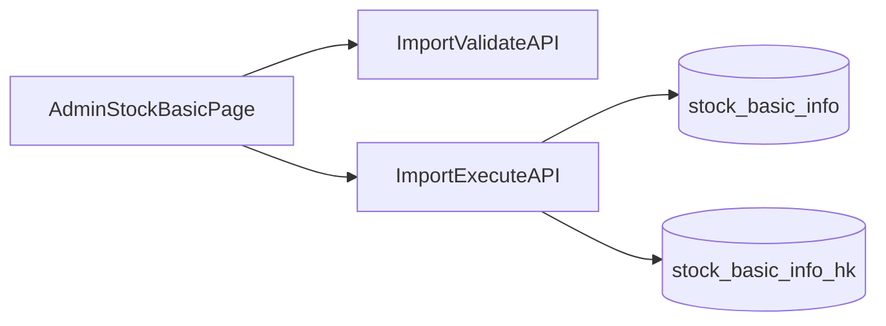
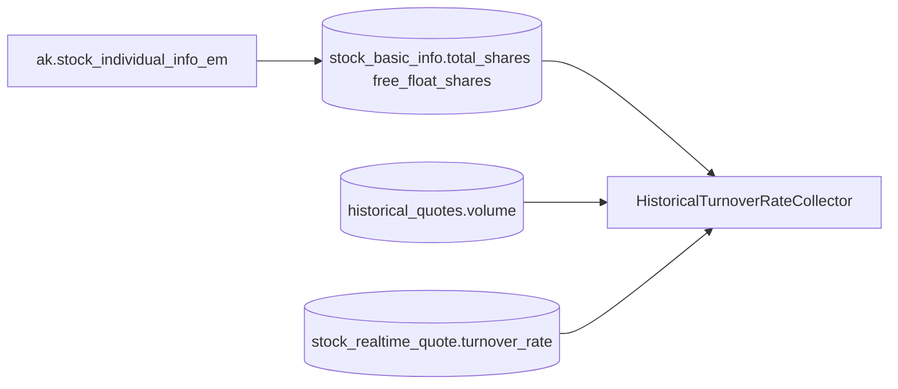
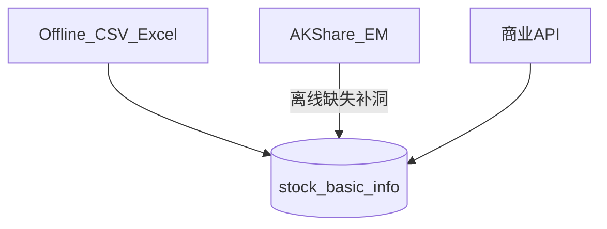

# 股本爬取与换手率：系统内方案说明

## 管理端模块新增（本次需求）

目标：在管理端新增一级菜单 **股票基本信息管理**，支持：

- 股票基本信息查询（A股+港股）
- 股本信息离线导入（CSV + XLSX）
- 导入预校验、执行导入、结果审计

### 页面与入口

- 前端新增一级菜单：`股票基本信息管理`（管理端导航）
- 页面拆分建议：
  - `列表页`：按市场、代码、名称、是否缺少股本、更新时间筛选；
  - `导入页`：上传文件、预校验结果、确认导入、导入报告下载。

### 后端API（管理端）

- `GET /api/admin/stock-basic/list`
  - 查询 A股+港股基础信息，支持分页与筛选（market/code/name/empty_shares/updated_at_range）。
- `POST /api/admin/stock-basic/import/validate`
  - 仅做解析与校验，不落库；返回错误行与统计。
- `POST /api/admin/stock-basic/import/execute`
  - 按“仅补空值”策略执行导入，支持 A股+港股分表写入。
- `GET /api/admin/stock-basic/import/template`
  - 下载标准模板（CSV/XLSX）。

### 导入规则（已确认）

- 文件：CSV + XLSX
- 范围：A股 + 港股
- 策略：仅补空值（默认不覆盖已有非空字段）
- 关键校验：
  - `code` 标准化（A股6位、港股按现库编码规则）
  - `free_float_shares <= total_shares`
  - 股本字段为正数
  - 非法行进入失败清单，达到 `max_errors` 可中止

### 数据流

## 结论（你已有现成能力）

系统**不单独再“爬一套网页”**也能完成目标：用 **AKShare `stock_individual_info_em`（东方财富个股资料）** 拉取 **总股本 / 流通股本（股）**，写入表 `[stock_basic_info](backend_core/data_collectors/akshare/realtime.py)` 扩展列，供换手率计算使用。

核心公式（与实现一致）：

- **换手率 = 成交量 / 流通股本 × 100**（流通股本为股数，与 `[historical_turnover_rate.py](backend_core/data_collectors/akshare/historical_turnover_rate.py)` 中 Level 2 一致）

## 数据写入（股本）

| 组件   | 路径                                                                                             | 作用                                                                                                                  |
| ---- | ---------------------------------------------------------------------------------------------- | ------------------------------------------------------------------------------------------------------------------- |
| 定时采集 | `[StockSharesCollector](backend_core/data_collectors/akshare/stock_shares_collector.py)`       | 解析 `item` 为「总股本」「流通股」等，更新 `total_shares`、`free_float_shares`、`shares_updated_at`；增量条件：`shares_updated_at` 为空或超过 7 天 |
| 调度   | `[main.py](backend_core/data_collectors/main.py)`                                              | `update_stock_shares` 默认 **周六 10:00**（`SCHED_STOCK_SHARES_`* 可覆盖）                                                   |
| 手动补丁 | `[manual_scripts/update_stock_basic_info_em.py](manual_scripts/update_stock_basic_info_em.py)` | 同接口写入股本 + 行业等，**每只股票间隔 5 秒**，适合全量/补洞或东方财富限频场景                                                                       |

**建议**：首次上线或大量股票 `free_float_shares` 为空时，可先跑一轮 `manual_scripts` 或 `StockSharesCollector --mode full`，再依赖周六增量。

## 换手率使用（读）

| 组件         | 路径                                                                                                    | 作用                                                                                                     |
| ---------- | ----------------------------------------------------------------------------------------------------- | ------------------------------------------------------------------------------------------------------ |
| 历史换手率补算    | `[HistoricalTurnoverRateCollector](backend_core/data_collectors/akshare/historical_turnover_rate.py)` | Level 1：实时表 `turnover_rate`；Level 2：`free_float_shares` + `historical_quotes.volume`；Level 3：流通市值/现价反推 |
| 调度         | `[main.py](backend_core/data_collectors/main.py)`                                                     | `collect_akshare_turnover_rate`，默认工作日 `SCHED_AKSHARE_TURNOVER_`*                                       |
| Tushare 日线 | `[historical.py](backend_core/data_collectors/tushare/historical.py)`                                 | 无实时换手率时，用 `free_float_shares` 与 `vol`（手）换算                                                             |

**要点**：`free_float_shares` 填全后，Level 2 才能稳定工作；否则会退到 Level 1/3 或缺失。

## 运维与配置建议

1. **确认定时任务进程**：`backend_core/data_collectors/main.py` 的 scheduler 在跑，且未注释 `update_stock_shares` / `collect_akshare_turnover_rate`。
2. **环境变量**：在 `[.env.example](.env.example)` 中已有 AKShare 重试等；股本相关可配置 `SCHED_STOCK_SHARES_`* 与手动脚本的 `STOCK_EM_PROFILE_STALE_DAYS` / `STOCK_EM_API_INTERVAL_SEC`。
3. **质量检查**：定期 SQL 统计 `free_float_shares IS NULL` 的 A 股数量；对异常代码做单独重跑或人工核对东方财富页面。

## 可选增强（非必须）

- **Tushare `daily_basic` 流通股本**：若已持有 Tushare 权限，可作为**第二数据源**与 EM 交叉校验或补缺（需单独开发采集与合并策略）。
- **北交所/新代码**：若 EM 个别代码缺失，可记录失败列表并走备用源或手工维护。

## AKShare 经常限流时的其他方案（按当前优先级）

说明：AKShare 多数接口封装的是**公开网页/JSON**，与你自己用 `requests` 直连**同源**时，限流风险类似；真正缓解通常靠 **换数据源、降频、错峰、配额型 API**。

### 1. 离线/半离线（当前优先）

- **做法**：从行情终端或供应商导出 CSV/Excel，导入 `stock_basic_info`。
- **建议模板列**：`code,name,total_shares,free_float_shares,listing_date,industry,asof_date`。
- **文件格式**：优先支持 `CSV + Excel(xlsx)`。
- **导入策略**：采用“仅补空值（最保守）”，默认不覆盖已有非空字段。
- **增量模式**：仅更新库中目标字段为空的记录；全量模式作为可选能力，先 `--dry-run` 再执行。
- **硬校验**：`code` 标准化、股本字段为正数、`free_float_shares <= total_shares`，异常行写失败清单。

### 2. AKShare（作为补洞）

- 继续使用 `[manual_scripts/update_stock_basic_info_em.py](manual_scripts/update_stock_basic_info_em.py)`，用于离线缺失代码补洞。
- 保持 5 秒节流，必要时拉大间隔并夜间跑批。

### 3. 商业 / 量化终端 API（稳定、付费）

- **例如**：聚宽 `JQData`、米筐、Wind、同花顺 iFinD 等。
- **优点**：契约稳定、适合生产；限流以合同为准。
- **缺点**：成本与接入复杂度。
- **适用**：对稳定性要求高于零成本时。

### 4. 直连东方财富 JSON（仍同源，仅「可控性」略好）

- **做法**：不用 AKShare，自写 `requests` + 固定 **Referer/User-Agent**、会话复用、**更长间隔**、失败退避；解析字段与现解析逻辑对齐。
- **现实**：**仍可能被同源风控限流**，只是便于你精细调参；不是「换源」。

### 5. 运维型缓解（与任意数据源配合）

- **错峰**：全市场补数放在 **夜间或非交易高峰**；调度上拉大 `SCHED_STOCK_SHARES_`* 间隔。
- **已有手动脚本**：`[manual_scripts/update_stock_basic_info_em.py](manual_scripts/update_stock_basic_info_em.py)` 的 **5 秒/股** 为减轻 EM 压力；仍不够时可再加大 `STOCK_EM_API_INTERVAL_SEC`。
- **代理/IP**：仅建议在合规前提下用于**合理访问频率**；不能替代「换正规 API」。

## 若你希望我“落地实现”的下一步

当前代码库已具备 **EM（AKShare）+ 手动节流** 链路；按你当前要求，下一步优先落地 **离线导入脚本 + 模板 + 校验审计**，Tushare 暂不作为优先实施项。