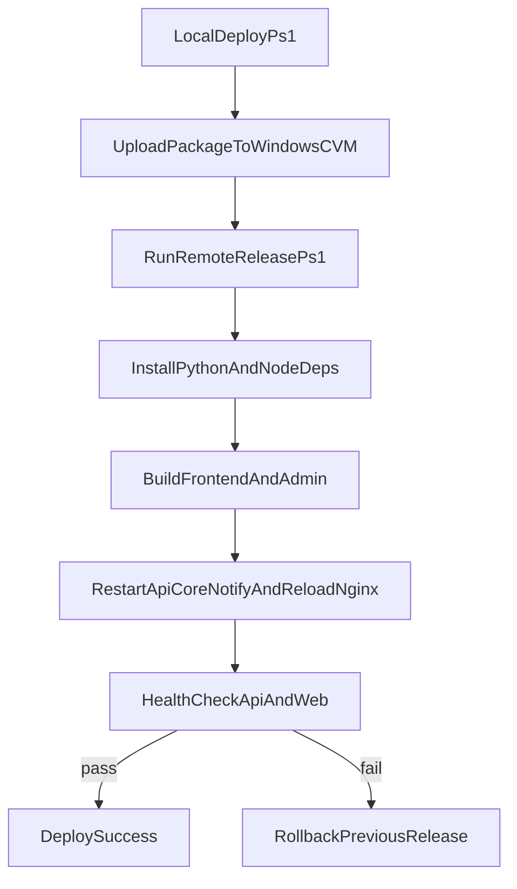

# 腾讯云 CVM 一键部署计划（多服务版）

## 目标
将当前项目（`frontend`、`admin`、`backend_api`、`backend_core`、`start_schedule.py`）部署到公网，支持单命令发布（本机执行一次命令即可完成：上传代码、安装依赖、构建双前端、重启多服务、健康检查）。

## 现状识别（基于仓库与补充信息）
- 前端有两个 Web 端：`frontend`（用户端）和 `admin`（管理端，Vue3 + Vite，参考 [`E:/wangxw/work/stock_quote_analayze/admin/package.json`](E:/wangxw/work/stock_quote_analayze/admin/package.json)）。
- 后端有两个进程角色：`backend_api`（FastAPI 接口，参考 [`E:/wangxw/work/stock_quote_analayze/backend_api/start.py`](E:/wangxw/work/stock_quote_analayze/backend_api/start.py)）与 `backend_core`（采集/策略逻辑）。
- 另有通知调度入口 `start_schedule.py`，应以独立常驻任务方式托管（Windows Service）。
- Nginx 已提前配置完成，本方案仅复用既有配置并在发布时执行配置检查与 reload。

## 方案设计
- 服务器侧：
  - 使用 Windows 服务编排 3 个后端进程（推荐 NSSM 包装 Python 进程）：
    1) `stock-quote-api`（`backend_api`）
    2) `stock-quote-core`（`backend_core`，如需常驻采集）
    3) `stock-quote-notify`（`start_schedule.py`）
  - Nginx 使用现有配置进行双前端与 API 分流：
    - `https://www.icemaplecity.com/` -> `frontend/dist`
    - `https://www.icemaplecity.com/admin` -> `admin/dist`
    - `/api/` -> `backend_api`
  - `certbot` 自动签发/续期 HTTPS。
- 一键发布触发：
  - 本地脚本 `deploy.ps1` 执行：
    1) 打包代码并上传 CVM
    2) 远程执行 `release.ps1`
    3) 远端完成依赖安装、双前端构建、数据库迁移、服务重启
    4) 健康检查并输出版本
- 发布安全与回滚：
  - 采用 `releases\\<timestamp>` + `current` 目录切换（或 Junction）策略。
  - 发布失败自动回滚到上一个可用版本。

## 实施步骤
1. 准备服务器基础环境（Python、Node、Nginx、OpenSSH Server、NSSM、证书工具）。
2. 新增部署目录规范：`C:\\deploy\\stock_quote\\{releases,shared,current}`，将 `.env`、日志、上传文件放在 `shared`。
3. 新增 3 个 Windows 服务（`api/core/notify`），配置自动启动和失败自动恢复。
4. 在发布链路中复用现有 Nginx 配置，仅执行 `nginx -t` 校验与 `nginx -s reload`（或 `Restart-Service nginx`）。
5. 编写远端发布脚本 `scripts/deploy/release.ps1`（原子切换 + 按顺序重启服务 + 健康检查 + 回滚）。
6. 编写本地一键脚本 `scripts/deploy/deploy.ps1` 用于上传和触发发布。
7. 增加部署文档：首次初始化、日常发布、故障回滚、证书续期、任务进程排障（Windows）。

## 部署流程图

## 验收标准
- 本地执行一次部署命令后，公网可访问：`/`（frontend）、`/admin/`（admin）和 `/api`（backend_api）均正常。
- 服务重启后可自动拉起（Windows 服务自动启动生效）。
- `backend_core` 与 `start_schedule.py` 进程在异常退出后能被 Windows 服务恢复策略自动重启。
- 发布失败可自动回滚，且回滚后服务恢复正常。
- HTTPS 证书有效，续期任务可用。

## 风险与规避
- 首次部署风险：系统依赖缺失 -> 在初始化脚本中加入依赖检测与幂等安装。
- 环境变量泄漏风险 -> `.env` 只存放在服务器 `shared`，不入库。
- 迁移失败风险 -> 迁移步骤前后加检查点，失败立即回滚并保留日志。