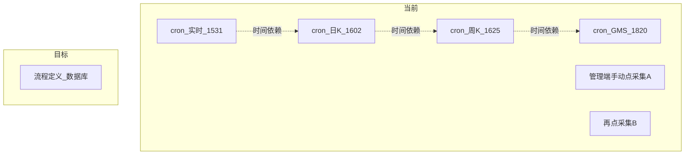
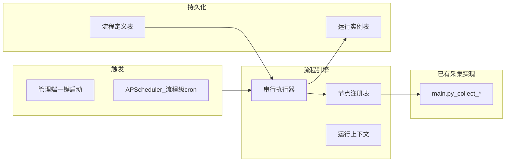

# 采集模块流程自动化实现方案

## 现状与痛点

当前采集存在两条独立路径，节点间依赖靠**手工对齐 cron 时间**或**代码内硬编码链**：

| 路径 | 入口 | 问题 |
|------|------|------|
| 定时 | [`backend_core/data_collectors/main.py`](backend_core/data_collectors/main.py) 中 20+ 个 `scheduler.add_job` | 每个任务单独配置 `.env` 的 DOW/HOUR/MINUTE；依赖关系靠时间先后（如日 K 16:02 → 周 K 16:25） |
| 手动 | [`backend_api/stock/data_collection_api.py`](backend_api/stock/data_collection_api.py) + [`admin/src/views/DataCollectView.vue`](admin/src/views/DataCollectView.vue) | 每步需单独点启动；`collection_tasks` 仅存内存，重启丢失 |

已有零散链式逻辑（非统一框架）：实时→日 K、日 K→周期 K、实时后指标计算、GMS/URT 预计算等，分散在 `main.py` 与 `data_collection_api.py` 中。



---

## 目标架构

新增 **采集流程引擎（Collection Workflow Engine）**，与现有采集器解耦：



**核心原则**：
- 不重写采集逻辑，将现有 `collect_*` / `generate_*` / API 采集函数包装为**节点执行器**
- 流程内**严格串行**（与现有 `current_task_id` 单任务互斥一致）
- 流程级只配**一个 cron**；节点间用 `on_success` 自动衔接，可选 `wait_seconds` 缓冲

---

## 一、节点注册表（Node Registry）

新建 [`backend_core/data_collectors/workflow/node_registry.py`](backend_core/data_collectors/workflow/node_registry.py)

每个节点定义元数据 + 执行函数：

```python
@dataclass
class CollectionNodeDef:
    key: str                    # 如 cn_realtime
    name: str                   # 展示名：A股实时采集
    category: str               # cn / hk / etf / agg / strategy / news
    executor: Callable[[WorkflowContext], NodeResult]
    param_schema: dict          # JSON Schema，供前端动态表单
    supports_scheduled: bool    # 是否可用于定时流程（无 UI 参数）
    default_params: dict
```

**首期注册节点**（直接复用 [`main.py`](backend_core/data_collectors/main.py) 中已有函数）：

| 分类 | 节点 key（示例） | 对应现有函数 |
|------|------------------|--------------|
| A股 | `cn_realtime`, `cn_historical`, `cn_index_realtime`, `cn_industry_board`, `cn_turnover` | `collect_akshare_realtime` 等 |
| 港股 | `hk_realtime`, `hk_historical`, `hk_index_*` | `collect_hk_*` |
| ETF | `etf_realtime`, `etf_historical` | `collect_etf_*` |
| 聚合 | `cn_weekly`, `cn_monthly`, `cn_quarterly`, `cn_semiannual`, `cn_annual`（及 hk 对应项） | `generate_*_data` |
| 策略 | `gms_signals_cn`, `urt_signals_cn`, `sbbr_*`, `rpe_*` | `scheduled_*` 预计算 |
| 维护 | `stock_shares_update`, `industry_board_constituents` | 已有 job |
| API 型 | `cn_historical_akshare`, `cn_realtime_api`, `cn_indicators` | 包装 `AkshareDataCollector` / `_trigger_indicators_after_realtime` |

对 API 型节点，新建薄适配层 [`workflow/adapters/api_nodes.py`](backend_core/data_collectors/workflow/adapters/api_nodes.py)，将 `DataCollectionRequest` 参数从 `WorkflowContext` 注入（`start_date`/`end_date`/`market`/`stock_codes` 等）。

**休市跳过**：节点执行前统一调用现有 `_cn_session_closed_today()` / `_hk_session_closed_today()`（从 `main.py` 抽到 `workflow/session_guard.py` 复用）。

---

## 二、流程引擎

新建 [`backend_core/data_collectors/workflow/engine.py`](backend_core/data_collectors/workflow/engine.py)

```python
class CollectionWorkflowEngine:
    def start(workflow_id, trigger_source, override_params=None) -> run_id
    def _run_loop(run_id):          # 后台线程执行
    def _execute_node(node_run):    # 更新 DB 状态、写日志
    def _advance_or_finish(run, node_result)
    def cancel(run_id)
```

**运行上下文 `WorkflowContext`**（在节点间传递）：
- `trade_date`：默认最近交易日（复用 `trading_calendar_utils`）
- `start_date` / `end_date`：可由流程级或首节点参数设定，后续节点默认继承
- `node_outputs`：上一节点摘要（如 `affected_rows`），供条件分支扩展

**失败策略**（节点级配置）：
- `on_failure: stop` — 终止整条流程（默认）
- `on_failure: continue` — 记录失败并执行下一节点
- `retry_count` + `retry_delay_seconds`

**互斥**：流程启动时占用全局锁（扩展现有 `task_execution_lock` / `current_task_id` 为 `current_workflow_run_id` 或统一 `active_execution`），与单任务采集 API 互斥；流程运行中拒绝新的 `/historical` 等启动请求。

**状态持久化**：参考 [`gms_trace_recompute_tasks`](migrations/add_gms_trace_recompute_tasks.py) 模式（DB 表 + 后台线程），避免内存 `collection_tasks` 重启丢失。

---

## 三、数据库设计（PostgreSQL）

新建迁移 [`migrations/add_collection_workflow_tables.py`](migrations/add_collection_workflow_tables.py)

```sql
-- 流程定义
collection_workflows (
  id SERIAL PRIMARY KEY,
  name VARCHAR(120) NOT NULL,
  description TEXT,
  enabled BOOLEAN DEFAULT TRUE,
  trigger_type VARCHAR(20) NOT NULL,  -- manual | cron
  cron_dow VARCHAR(32),               -- mon-fri
  cron_hour VARCHAR(32),              -- 16 或 15,16
  cron_minute INTEGER,
  skip_on_holiday VARCHAR(10),        -- CN | HK | BOTH | NONE
  created_at, updated_at
)

-- 流程节点（有序列表，order_index 决定串行顺序）
collection_workflow_nodes (
  id SERIAL PRIMARY KEY,
  workflow_id INT REFERENCES collection_workflows(id) ON DELETE CASCADE,
  order_index INT NOT NULL,
  node_key VARCHAR(64) NOT NULL,
  display_name VARCHAR(120),
  params JSONB DEFAULT '{}',
  on_failure VARCHAR(20) DEFAULT 'stop',
  retry_count INT DEFAULT 0,
  wait_seconds INT DEFAULT 0,
  enabled BOOLEAN DEFAULT TRUE,
  UNIQUE(workflow_id, order_index)
)

-- 流程运行实例
collection_workflow_runs (
  run_id VARCHAR(64) PRIMARY KEY,
  workflow_id INT NOT NULL,
  workflow_name VARCHAR(120),
  status VARCHAR(20),                 -- pending|running|completed|failed|cancelled
  trigger_source VARCHAR(20),         -- manual|cron
  current_node_index INT,
  started_at, finished_at,
  error_message TEXT,
  context JSONB
)

-- 节点运行记录
collection_workflow_node_runs (
  id SERIAL PRIMARY KEY,
  run_id VARCHAR(64) REFERENCES collection_workflow_runs(run_id),
  node_key VARCHAR(64),
  order_index INT,
  status VARCHAR(20),
  progress INT DEFAULT 0,
  message TEXT,
  error TEXT,
  started_at, finished_at,
  result JSONB
)
```

ORM 可放在 [`backend_core/models/collection_workflow.py`](backend_core/models/collection_workflow.py)。

**预置模板**（迁移或 seed 脚本）：`A股收盘后标准流程`，节点顺序对齐当前生产 cron 逻辑：

1. `cn_realtime` → 2. `cn_historical` → 3. `cn_weekly` → 4. `cn_monthly` → … → 5. `gms_signals_cn` …

便于从分散 cron **渐进迁移**。

---

## 四、后端 API

新建 [`backend_api/stock/collection_workflow_api.py`](backend_api/stock/collection_workflow_api.py)，在 [`backend_api/main.py`](backend_api/main.py) 注册。

| 方法 | 路径 | 说明 |
|------|------|------|
| GET | `/api/collection-workflows/nodes` | 节点注册表（供前端选型） |
| GET/POST | `/api/collection-workflows` | 流程列表 / 创建 |
| GET/PUT/DELETE | `/api/collection-workflows/{id}` | 详情 / 更新 / 删除 |
| PUT | `/api/collection-workflows/{id}/nodes` | 批量保存节点顺序与参数 |
| POST | `/api/collection-workflows/{id}/run` | 手动启动 |
| GET | `/api/collection-workflows/runs` | 运行历史 |
| GET | `/api/collection-workflows/runs/{run_id}` | 运行详情（含各节点状态） |
| POST | `/api/collection-workflows/runs/{run_id}/cancel` | 取消 |

Pydantic 模型追加到 [`backend_api/models.py`](backend_api/models.py)。

**与现有 API 关系**：保留 [`data_collection_api.py`](backend_api/stock/data_collection_api.py) 单步采集能力（补采、单股调试）；流程引擎为**编排层**，不替代底层采集器。

---

## 五、定时调度集成

修改 [`backend_core/data_collectors/main.py`](backend_core/data_collectors/main.py)：

1. 新增 `_register_workflow_cron_jobs()`：查询 `enabled=true AND trigger_type=cron` 的流程，为每个流程注册**一个** APScheduler job，回调 `CollectionWorkflowEngine.start(workflow_id, trigger_source='cron')`
2. 新增环境变量 `ENABLE_LEGACY_COLLECTION_CRON`（默认 `true`）：为 `false` 时跳过现有分散 `scheduler.add_job(collect_*)`，仅跑流程 cron —— **渐进切换，不一次性破坏现有 `.env`**
3. 流程 cron 变更后需重启 `start_backend_core.py`（与现有一致）；后续可扩展「热加载」非本期范围

---

## 六、管理端可视化编排 UI

新建 [`admin/src/views/CollectionWorkflowView.vue`](admin/src/views/CollectionWorkflowView.vue)，路由 `/collection-workflows`，侧栏菜单「采集流程」。

**页面结构**（三 Tab）：

1. **流程列表**：名称、触发方式（手动/cron）、启用状态、最近运行结果、「编辑」「运行」「复制模板」
2. **流程编辑**（核心）：
   - 左侧：按 category 分组的**节点库**（来自 `/nodes` API）
   - 中间：**可拖拽排序的节点列表**（建议引入轻量依赖 `vuedraggable` / SortableJS，与 Element Plus `el-table` 配合；不引入重型 flow 库首期够用）
   - 右侧：选中节点的**动态参数表单**（根据 `param_schema` 渲染日期、市场、指标勾选等）
   - 顶部：cron 配置（dow/hour/minute）、休市跳过策略
3. **运行监控**：当前运行进度条、各节点状态时间线、错误详情；轮询 `/runs/{run_id}`

在 [`DataCollectView.vue`](admin/src/views/DataCollectView.vue) 顶部增加快捷入口：「使用流程采集」跳转至流程页，减少重复配置。

**权限**：按现有模式在 [`migrations/add_frontend_permissions.sql`](migrations/sql/add_frontend_permissions.sql) 增加 `collection_workflows` 读写权限。

---

## 七、实施阶段（建议分 3 期）

### 阶段 1 — 引擎 + API + 基础 UI（MVP）
- 节点注册表（覆盖 main.py 核心 `collect_*` / `generate_*`）
- DB 表 + 引擎串行执行 + 运行状态 API
- 管理端：列表 + 节点拖拽排序 + 手动运行 + 运行监控
- 预置「A股收盘标准流程」模板

### 阶段 2 — 定时流程 + 与 legacy cron 并存
- 流程级 cron 注册
- `ENABLE_LEGACY_COLLECTION_CRON` 开关
- API 型节点适配（带日期/股票参数的 AkShare 历史采集等）
- 与 `current_task_id` 互斥统一

### 阶段 3 — 增强（可选）
- 节点级条件分支（如「仅季末跑 quarterly」→ 复用 `period_agg.is_last_session_day_of_period`）
- 流程 DAG（并行分支，如 A股与港股并行）— 需队列/worker，复杂度显著上升
- 可视化流程图（`@vue-flow/core`）替代纯列表

---

## 八、风险与对策

| 风险 | 对策 |
|------|------|
| 单进程长时间串行，总耗时增加 | 流程内 `wait_seconds` 可配；关键长任务保持独立流程 |
| 与 legacy cron 重复执行 | `ENABLE_LEGACY_COLLECTION_CRON=false` + 模板对齐后切换 |
| API 进程与 core 进程双写 DB | 流程引擎放在 **backend_core**（与定时同进程）；API 仅 CRUD 定义 + 通过 HTTP/DB 触发 core 执行，或 API 内嵌引擎但 cron 仅在 core —— **推荐：引擎模块共享，core 负责 cron 触发；API 的 `POST /run` 在 API 进程后台线程执行（与现 data_collection_api 一致）** |
| 节点执行异常未捕获 | 统一 `NodeResult` + 写 `collection_workflow_node_runs.error` |

---

## 九、关键文件清单

| 操作 | 路径 |
|------|------|
| 新建 | `backend_core/data_collectors/workflow/`（`engine.py`, `node_registry.py`, `context.py`, `adapters/`） |
| 新建 | `backend_core/models/collection_workflow.py` |
| 新建 | `migrations/add_collection_workflow_tables.py` |
| 新建 | `backend_api/stock/collection_workflow_api.py` |
| 修改 | `backend_core/data_collectors/main.py`（流程 cron 注册） |
| 修改 | `backend_api/stock/data_collection_api.py`（互斥锁扩展） |
| 新建 | `admin/src/views/CollectionWorkflowView.vue` + `admin/src/services/collectionWorkflow.service.ts` |
| 修改 | `admin/src/router/index.ts`、侧栏导航 |
| 新建 | `test/test_collection_workflow_engine.py` |

---

## 十、验收标准

1. 管理端可创建流程、拖拽排序至少 3 个节点、保存到 DB
2. 点击「运行」后节点按序自动执行，无需逐步手动启动
3. 运行状态在页面实时可见，重启 API 后历史记录仍可查
4. 配置 cron 的流程在 `start_backend_core.py` 进程按 schedule 自动触发整条链
5. 流程运行中与单任务采集互斥，不会并发写库冲突
6. 预置模板行为与当前「实时→日K→周K」生产顺序一致（可对照 `main.py` cron 时间线验证）
