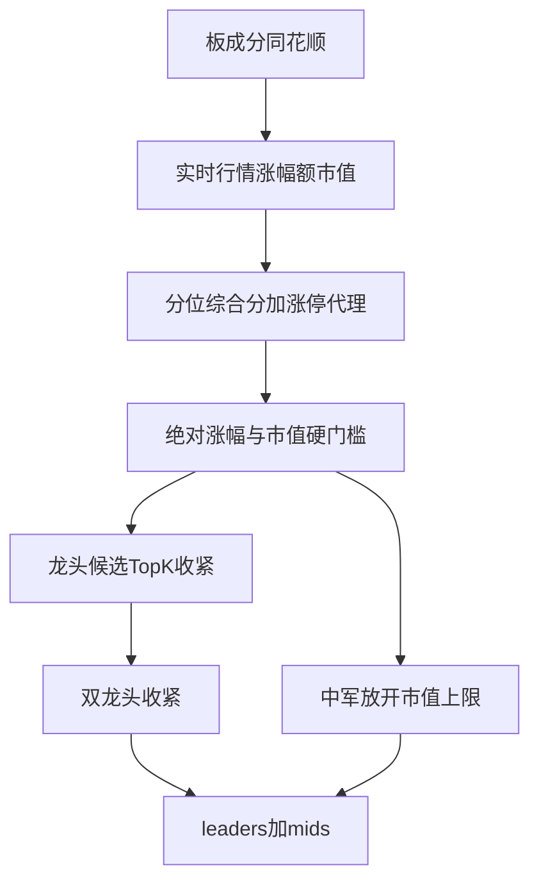

# 板块龙头/中军综合优化方案

## 专家选择建议（涨停维度）

**本轮选用：选项 1 — 仅涨停代理加分；首封时间做二期。**

| 选项 | 结论 |
|------|------|
| 1 涨停代理 | **推荐**。现有 `stock_realtime_quote` 已有涨跌幅，可按板块/代码规则识别「是否涨停」并加分，立刻修正「尾盘冲高成交额更大压过早板」类误判的大部分场景，无需改采集链路。 |
| 2 首封时间全量 | 语义最贴游资盘感，但实时表无首封字段，需扩采集、清洗、盘中刷新与回补；工期与数据质量风险明显高于收益增量，不宜绑在同一迭代。 |
| 3 完全不做涨停 | 放弃短线情绪最关键信号，与专家核心建议偏离；其它门槛改完后龙头仍易被「高成交非涨停」抢走。 |

**量化理由简述：** 在「日终/最近快照」口径下，`is_limit_up` 是可观测、可复现的强特征；「板内最早封板」依赖分钟级事件流，当前架构不具备，强行二期前置会拖垮本轮可验证交付。代理规则用「涨停布尔 + 弱加分」即可显著抬升真龙头排序，同时保持公式可解释。

二期（不在本轮）：采集并入库 `first_limit_up_time`（或等价），板内最早封板固定加分（如 +15），与代理加分并存或替代。

---

## 现状锚点

实现集中在 [`backend_core/board_roles/classify.py`](backend_core/board_roles/classify.py)：

- 综合分：`0.7·chg + 0.2·amt + 0.1·mv`（分位）
- 龙头：`mv_pctile≥40` 且（`chg_pctile≥80` 或 Top-`max(3,⌈N×0.1⌉)`）；双龙头 `LEADER_SCORE_GAP=5`
- 中军：`50≤mv_pctile≤95` 且 `chg_pctile≥60`，上限约 5
- 文档：[`docs/features/板块龙头中军业务规则.md`](docs/features/板块龙头中军业务规则.md)

数据链路：[`backend_core/board_roles/service.py`](backend_core/board_roles/service.py) ← 同花顺成分 + `stock_realtime_quote`（无首封字段）。

---

## 本轮落地规则（已拍板参数）

### 1. 涨停代理加分（专家点 1，降级实现）

- 推导 `is_limit_up`：按代码前缀/板块规则  
  - 主板（含北交所按现有涨停惯例）：`change_percent ≥ 9.8`  
  - 创业板/科创板（`300`/`301`/`688`）：`≥ 19.8`  
  - ST/*ST：本轮直接 **剔除有效样本**（见下），不再参与涨停代理  
- 综合分：在原分位加权分上，`is_limit_up` 时 **+12 分**（百分制空间内封顶 100）  
- `role_reason` 写明「涨停加分」  
- **不做**首封时间、板内最早封板排序（二期）

### 2. 市值双门槛（专家点 2 + 此前 P0）

单位统一为**元**（与现表一致；文档写「亿」时换算 ×1e8）：

| 角色 | 相对分位 | 绝对流通市值 |
|------|----------|--------------|
| 龙头 | `mv_pctile ≥ 40`（保留） | **≥ 30 亿**（`3e9`） |
| 中军 | `mv_pctile ≥ 50`，**取消 ≤95 上限** | **≥ 80 亿**（`8e9`） |

说明：中军绝对底取专家区间 80～100 亿的偏宽松端 80 亿，避免行业板大市值跟涨票被过度清空；后续可用配置上调至 100 亿。

### 3. 绝对涨幅地板（此前 P0）

- 仅当 `change_percent ≥ 0` 才允许标龙头或中军  
- 跌日板：允许空角色；可选在 API meta/`board_change_percent_est` 旁证上体现弱势（不强制新文案接口）

### 4. Top-K 收紧（专家点 3）

- 旧：`max(3, ceil(N×0.1))`  
- 新：`min(10, max(2, ceil(N×0.05)))`  
- 涨幅排序破同分：二级键 `amount` 降序，再 `circulating_market_value` 降序（此前 P0）

### 5. 双龙头收紧（专家点 4）

- `LEADER_SCORE_GAP`：`5.0` → **`2.5`**  
- 第二龙头额外满足其一：`is_limit_up` **或** `|chg1−chg2| < 1.0`（百分点）  
- 避免「活跃板几乎必双龙头」

### 6. 中军上限释放（专家点 5）

- 删除 `MID_MV_PCTILE_MAX = 95` 约束  
- 保留 `chg_pctile ≥ 60` + 绝对市值 ≥80 亿 + 涨幅 ≥0  
- 数量上限逻辑保留（含 `N<15` 缩减）

### 7. 过滤与小样本护栏（此前 P0/P1）

- 名称含 `ST` / `*ST`：**不进入有效样本**  
- `N < 8`：最多 1 龙头、中军上限 `min(mid_cap, 1)`；`N < 3`：不标注角色  
- 多板同票角色合并（若选股侧有聚合）：`leader > mid`，再比 `board_role_score`（[`board_signals.py`](backend_core/analysis/board_signals.py) / 选股挂 tag 处核对并改）

---

## 实现落点

| 文件 | 改动 |
|------|------|
| [`classify.py`](backend_core/board_roles/classify.py) | 常量、涨停代理、硬门槛、Top-K、双龙头、中军、ST/小样本 |
| [`service.py`](backend_core/board_roles/service.py) | 如需透传名称做 ST 过滤；保证市值单位注释 |
| [`test/test_board_roles_classify.py`](test/test_board_roles_classify.py) | 覆盖：涨停加分压过尾盘非涨停、微盘被绝对市值挡、跌日无角色、Top-K 新公式、双龙头 gap/涨停、中军超大市值可入选、ST 剔除、N&lt;8 |
| [`板块龙头中军业务规则.md`](docs/features/板块龙头中军业务规则.md) / 标注说明 | 同步新阈值与「涨停代理/二期首封」说明 |

前端 pill 展示一般无需改（仍读 `board_role`）；若 `role_reason` 变长，保持现有截断即可。

---

## 明确不在本轮

- 首封时间 / 封单强度 / 连板天数采集与加分  
- 把角色结果落库做历史序列  
- 改用 RPE/东财领涨字段替代本引擎  

---

## 验收要点

1. 单测全绿；重点场景与专家举例同构（早盘涨停 vs 尾盘 9.8% 非涨停）。  
2. 手工：微盘概念板不再出现「数亿流通盘龙头」；白酒/新能源等板可为超大市值跟涨标中军。  
3. 跌日板：龙头/中军为空或极少。  
4. 文档与常量一致。  
