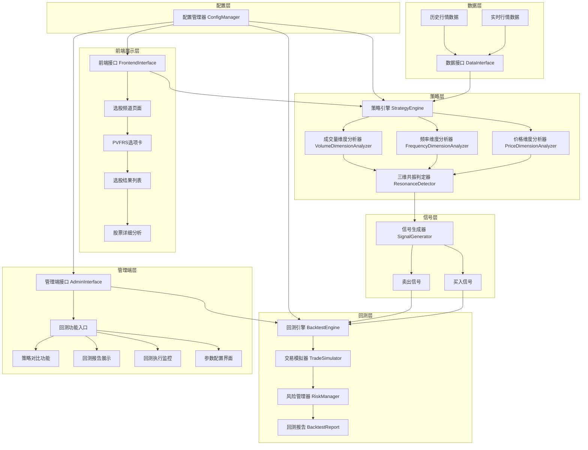
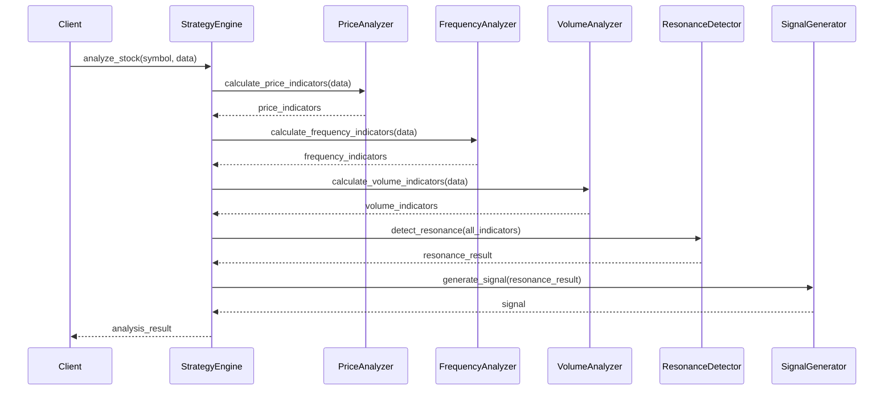
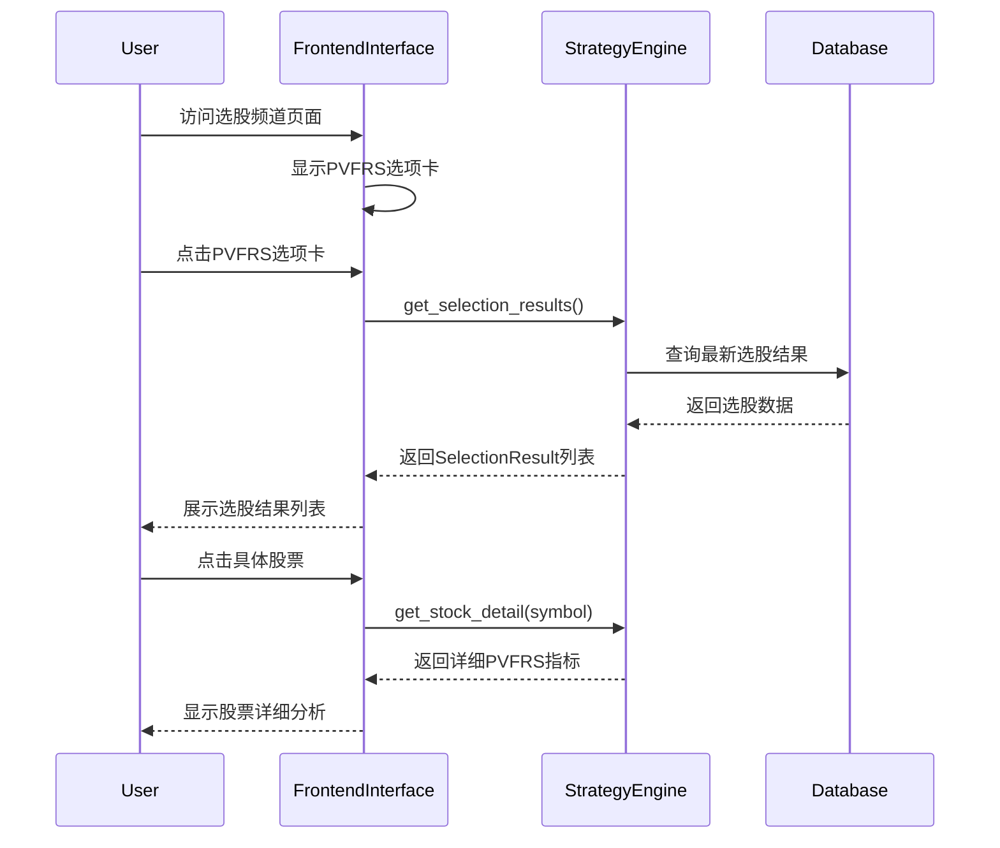
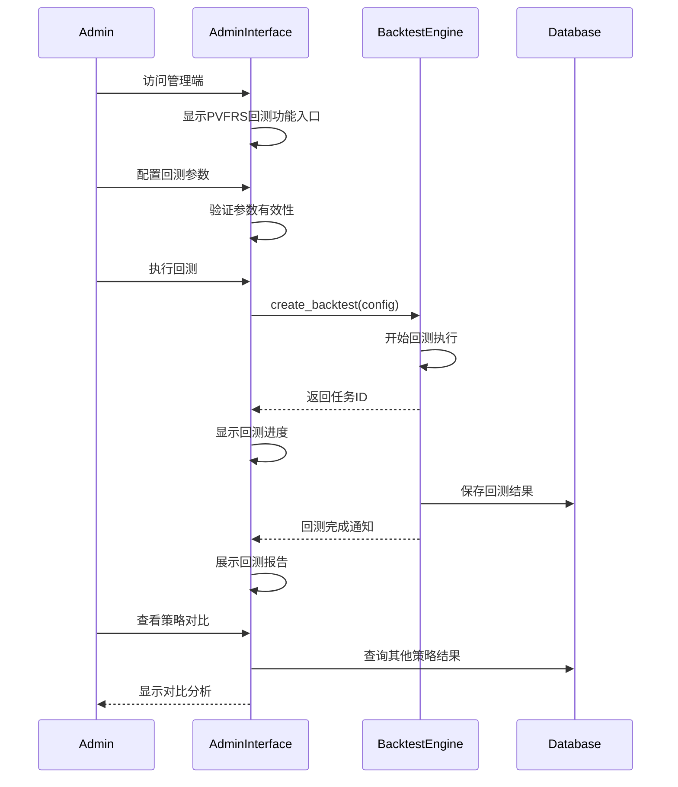

# 设计文档

## 概述

量价频三维共振演化策略（PVFRS）是一个基于数学量化模型的股票选股和交易策略系统。该系统通过分析价格、频率和成交量三个维度的共振状态，识别处于"高效率上涨"阶段的股票，并提供完整的选股、信号生成、前端展示、管理端回测和数据管理功能。

系统采用模块化设计，包含策略核心引擎、信号生成器、回测引擎、前端接口、管理端接口和数据接口等组件，支持独立部署和灵活配置，同时提供用户友好的Web界面。

## 架构

### 系统架构图



### 核心组件

1. **策略引擎 (StrategyEngine)**: 协调各个维度分析器，执行PVFRS策略逻辑
2. **维度分析器**: 分别负责价格、频率、成交量三个维度的量化分析
3. **信号生成器 (SignalGenerator)**: 基于三维共振结果生成交易信号
4. **回测引擎 (BacktestEngine)**: 提供历史数据回测功能
5. **数据接口 (DataInterface)**: 统一的数据获取和处理接口
6. **前端接口 (FrontendInterface)**: 选股频道页面的PVFRS展示功能
7. **管理端接口 (AdminInterface)**: 管理端的回测功能和策略管理

## 组件和接口

### 数据模型

#### MarketData 数据结构
```python
@dataclass
class MarketData:
    symbol: str          # 股票代码
    date: str           # 交易日期 (YYYY-MM-DD)
    open: float         # 开盘价
    high: float         # 最高价
    low: float          # 最低价
    close: float        # 收盘价
    volume: int         # 成交量
    amount: float       # 成交额
```

#### PVFRSIndicators 指标结构
```python
@dataclass
class PVFRSIndicators:
    # 价格维度指标
    macro_displacement: float    # 宏观位移 Δ = d₂₀ - d₁
    instant_deviation: float     # 即时强度 d₂₀ - d
    avg_price_20d: float        # 20日平均价格 d
    
    # 频率维度指标
    rising_days: int            # 上涨天数 Z
    falling_days: int           # 下跌天数 F
    frequency_advantage: bool   # 频率优势 Z > F
    
    # 成交量维度指标
    avg_volume_20d: float       # 20日平均成交量 m
    current_volume: float       # 当前成交量 m₂₀
    efficiency_ratio: float     # 效率比 m₂₀ / m
    
    # 综合指标
    amplitude_ratio: float      # 幅度系数 Δ₂₀ / d
    resonance_strength: float   # 共振强度 (0-1)
```

#### Signal 信号结构
```python
@dataclass
class Signal:
    symbol: str
    date: str
    signal_type: SignalType     # BUY, SELL, HOLD
    price: float
    strength: float             # 信号强度 (0-1)
    reason: str                 # 信号原因
    indicators: PVFRSIndicators # 相关指标
    conditions_met: Dict[str, bool]  # 满足的条件
```

#### SelectionResult 选股结果结构
```python
@dataclass
class SelectionResult:
    symbol: str                 # 股票代码
    name: str                  # 股票名称
    signal_strength: float     # 信号强度 (0-1)
    conditions_met: Dict[str, bool]  # 满足的条件
    indicators: PVFRSIndicators      # PVFRS指标
    timestamp: str             # 选股时间戳
```

#### BacktestConfig 回测配置结构
```python
@dataclass
class BacktestConfig:
    start_date: str            # 回测开始日期
    end_date: str             # 回测结束日期
    stock_pool: List[str]     # 股票池
    initial_capital: float    # 初始资金
    strategy_params: Dict     # 策略参数
    risk_params: Dict         # 风险管理参数
```

#### BacktestReport 回测报告结构
```python
@dataclass
class BacktestReport:
    config: BacktestConfig    # 回测配置
    total_return: float       # 总收益率
    annual_return: float      # 年化收益率
    win_rate: float          # 胜率
    max_drawdown: float      # 最大回撤
    sharpe_ratio: float      # 夏普比率
    trades: List[Trade]      # 交易记录
    equity_curve: List[float] # 资金曲线
    created_at: str          # 报告生成时间
```

### 核心接口

#### IStrategyEngine 策略引擎接口
```python
class IStrategyEngine:
    def analyze_stock(self, symbol: str, data: List[MarketData]) -> PVFRSIndicators:
        """分析单只股票的PVFRS指标"""
        pass
    
    def screen_stocks(self, symbols: List[str], date: str) -> List[str]:
        """选股：筛选符合PVFRS条件的股票"""
        pass
    
    def generate_signals(self, symbol: str, data: List[MarketData]) -> List[Signal]:
        """生成交易信号"""
        pass
```

#### IBacktestEngine 回测引擎接口
```python
class IBacktestEngine:
    def run_backtest(self, symbols: List[str], start_date: str, end_date: str) -> BacktestResult:
        """执行回测"""
        pass
    
    def calculate_performance(self, trades: List[Trade]) -> PerformanceMetrics:
        """计算绩效指标"""
        pass
```

#### IFrontendInterface 前端接口
```python
class IFrontendInterface:
    def get_selection_results(self, date: str = None) -> List[SelectionResult]:
        """获取PVFRS选股结果"""
        pass
    
    def get_stock_detail(self, symbol: str) -> Dict:
        """获取股票详细PVFRS分析指标"""
        pass
    
    def refresh_results(self) -> bool:
        """刷新选股结果"""
        pass
```

#### IAdminInterface 管理端接口
```python
class IAdminInterface:
    def create_backtest(self, config: BacktestConfig) -> str:
        """创建回测任务，返回任务ID"""
        pass
    
    def get_backtest_progress(self, task_id: str) -> Dict:
        """获取回测进度"""
        pass
    
    def get_backtest_report(self, task_id: str) -> BacktestReport:
        """获取回测报告"""
        pass
    
    def compare_strategies(self, report_ids: List[str]) -> Dict:
        """对比多个策略回测结果"""
        pass
    
    def save_backtest_report(self, report: BacktestReport) -> str:
        """保存回测报告，返回报告ID"""
        pass
    
    def list_historical_reports(self, limit: int = 50) -> List[BacktestReport]:
        """查询历史回测报告"""
        pass
```

## 数据模型

### 核心计算公式

#### 价格维度计算
- **宏观位移指标**: `Δ = d₂₀ - d₁`
  - d₂₀: 观察周期末位价格（第20天收盘价）
  - d₁: 观察周期起始价格（第1天收盘价）

- **即时强度指标**: `deviation = d₂₀ - d`
  - d: 20日平均价格 = (d₁ + d₂ + ... + d₂₀) / 20

#### 频率维度计算
- **上涨天数统计**: `Z = count(dᵢ > dᵢ₋₁)` for i in [2, 20]
- **下跌天数统计**: `F = count(dᵢ < dᵢ₋₁)` for i in [2, 20]
- **频率优势判定**: `Z > F`

#### 成交量维度计算
- **平均成交量**: `m = (m₁ + m₂ + ... + m₂₀) / 20`
- **效率指标**: `efficiency = m₂₀ - m`
- **效率比**: `efficiency_ratio = m₂₀ / m`

#### 综合判定
- **幅度校验系数**: `amplitude_ratio = Δ / d`
- **共振强度**: 基于三个维度条件满足程度的加权计算

### 核心数据流处理



### 前端展示流程



### 管理端回测流程



## 错误处理

### 数据异常处理
1. **数据缺失**: 当历史数据不足20天时，跳过该股票的分析
2. **价格异常**: 检测并过滤异常价格数据（如涨跌停、停牌等）
3. **成交量异常**: 处理成交量为0或异常放大的情况

### 计算异常处理
1. **除零错误**: 在计算比率时检查分母是否为零
2. **数值溢出**: 对极端数值进行边界检查和截断
3. **精度问题**: 使用适当的数值精度处理浮点运算

### 前端异常处理
1. **网络异常**: 处理API调用失败和网络超时情况
2. **数据异常**: 处理选股结果为空或格式异常的情况
3. **UI异常**: 处理页面渲染错误和用户交互异常

### 管理端异常处理
1. **回测异常**: 处理回测执行失败和参数配置错误
2. **存储异常**: 处理回测报告保存失败和查询异常
3. **权限异常**: 处理管理员权限验证和访问控制

### 系统异常处理
```python
class PVFRSException(Exception):
    """PVFRS策略异常基类"""
    pass

class DataInsufficientException(PVFRSException):
    """数据不足异常"""
    pass

class CalculationException(PVFRSException):
    """计算异常"""
    pass

class ConfigurationException(PVFRSException):
    """配置异常"""
    pass

class FrontendException(PVFRSException):
    """前端接口异常"""
    pass

class AdminException(PVFRSException):
    """管理端异常"""
    pass

class BacktestException(PVFRSException):
    """回测异常"""
    pass
```

## 测试策略

### 单元测试策略
- **组件测试**: 对每个维度分析器进行独立测试
- **边界测试**: 测试极端数据情况下的系统行为
- **异常测试**: 验证异常处理机制的正确性

### 前端测试策略
- **UI组件测试**: 测试PVFRS选项卡和选股结果列表的渲染
- **交互测试**: 测试用户点击和页面跳转功能
- **数据展示测试**: 验证选股结果和详细指标的正确显示
- **实时更新测试**: 测试数据更新时的页面刷新机制

### 管理端测试策略
- **回测功能测试**: 测试回测参数配置和执行流程
- **报告生成测试**: 验证回测报告的完整性和准确性
- **策略对比测试**: 测试多策略对比功能的正确性
- **权限控制测试**: 验证管理员权限和访问控制

### 集成测试策略
- **端到端测试**: 测试完整的选股和信号生成流程
- **数据集成测试**: 验证与不同数据源的集成
- **性能测试**: 测试大规模数据处理的性能
- **前后端集成测试**: 验证前端和后端接口的协调工作

### 回测验证策略
- **历史数据验证**: 使用多个时间段的历史数据验证策略有效性
- **基准对比**: 与市场基准和其他策略进行对比
- **稳定性测试**: 验证策略在不同市场环境下的稳定性

## 正确性属性

*属性是一个特征或行为，应该在系统的所有有效执行中保持为真。属性作为人类可读规范和机器可验证正确性保证之间的桥梁。*

### 属性 1: 价格维度计算正确性
*对于任何* 包含至少20个交易日的价格序列，价格维度分析器应该正确计算宏观位移指标（Δ = d₂₀ - d₁）和即时强度指标（d₂₀ - d），并且当两个条件都满足时标记为强势演化阶段
**验证需求: 需求 1.1, 1.2, 1.3, 1.4**

### 属性 2: 频率维度统计准确性  
*对于任何* 价格序列，频率维度分析器应该准确统计上涨天数Z和下跌天数F，并且当Z > F时确认频率优势，正确排除单日暴涨的虚假繁荣情况
**验证需求: 需求 2.1, 2.2, 2.3, 2.4**

### 属性 3: 成交量维度效率计算
*对于任何* 包含成交量数据的序列，成交量维度分析器应该正确计算平均成交量和效率指标（m₂₀ > m），识别量价共振状态，并排除低成色信号
**验证需求: 需求 3.1, 3.2, 3.3, 3.4**

### 属性 4: 三维共振检测逻辑
*对于任何* 股票数据，当且仅当价格、频率、成交量三个维度条件同时满足时，系统应该确认进入高效率演化轨道并生成买入信号，记录满足的具体条件和信号强度
**验证需求: 需求 4.1, 4.2, 4.3, 4.4**

### 属性 5: 入场时机优化准确性
*对于任何* 满足基本条件的股票，当价格向上穿越平均价格且成交量突破平均量时，系统应该确认入场时机，并验证幅度校验系数的有效性
**验证需求: 需求 5.1, 5.2, 5.3, 5.4**

### 属性 6: 选股流程完整性
*对于任何* 股票池，选股引擎应该对每只股票应用PVFRS条件，将满足三维共振条件的股票加入结果，按信号强度排序，并包含完整的输出信息
**验证需求: 需求 6.1, 6.2, 6.3, 6.4**

### 属性 7: 回测引擎交易模拟
*对于任何* 历史数据集，回测引擎应该正确模拟买入卖出操作，记录所有交易，计算准确的盈亏，并生成包含所有关键指标的完整报告
**验证需求: 需求 7.1, 7.2, 7.3, 7.4**

### 属性 8: 风险管理机制
*对于任何* 持仓状态，风险管理器应该在达到止损线、止盈线、最大持有期或检测到趋势反转时生成相应的卖出信号
**验证需求: 需求 8.1, 8.2, 8.3, 8.4**

### 属性 9: 数据接口标准化
*对于任何* 数据请求，数据接口应该提供标准化的获取接口，返回标准格式的数据，进行必要的清洗和标准化，并提供完善的错误处理机制
**验证需求: 需求 9.1, 9.2, 9.3, 9.4**

### 属性 10: 配置管理一致性
*对于任何* 参数配置操作，配置管理器应该验证参数有效性，确保策略引擎使用最新参数，正确加载启动配置，并可靠地持久化存储配置
**验证需求: 需求 10.1, 10.2, 10.3, 10.4**

### 属性 11: 前端选股展示功能
*对于任何* 用户访问选股频道页面的操作，前端接口应该正确显示PVFRS选项卡，展示选股结果列表包含所有必需信息，支持股票详细信息查看，并实时刷新最新结果
**验证需求: 需求 11.1, 11.2, 11.3, 11.4, 11.5**

### 属性 12: 管理端回测功能
*对于任何* 管理员的回测操作，管理端接口应该提供完整的回测功能入口，支持参数配置和验证，正确执行回测并显示进度，生成详细报告，提供策略对比功能，并可靠地持久化存储回测结果
**验证需求: 需求 12.1, 12.2, 12.3, 12.4, 12.5, 12.6**