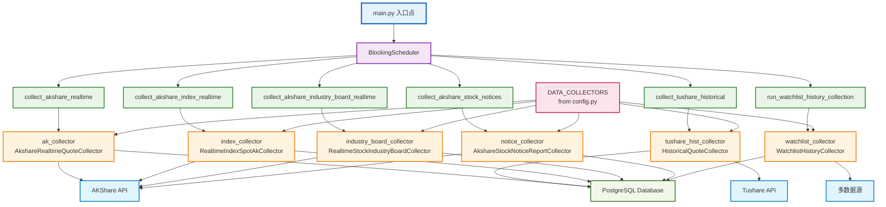

# 股票分析系统 backend_core 技术规范

## 目录
1. [项目概述](#项目概述)
2. [核心编排逻辑（可视化）](#核心编排逻辑可视化)
3. [技术栈](#技术栈)
4. [目录结构](#目录结构)
5. [开发规范](#开发规范)
6. [数据采集规范](#数据采集规范)
7. [数据库规范](#数据库规范)
8. [测试规范](#测试规范)
9. [部署规范](#部署规范)
10. [更新日志](#更新日志)
11. [参考文档](#参考文档)

## 项目概述
backend_core 负责股票分析系统的数据采集、清洗、存储、调度、模型等核心功能。对接 akshare、tushare 等第三方数据源，定时采集行情、财务、指数等数据，标准化处理后入库，为后端API和分析服务提供高质量数据。

## 核心编排逻辑（可视化）



## 技术栈
- **语言**: Python 3.8+
- **数据采集**: akshare、tushare
- **数据处理**: pandas、numpy
- **数据库**: SQLite3、PostgreSQL（SQLAlchemy/原生SQL）
- **调度**: APScheduler、crontab
- **日志**: logging
- **测试**: pytest、mock

## 目录结构
```
backend_core/
├── data_collectors/         # 数据采集器（akshare、tushare等）
│   ├── akshare/
│   │   ├── historical.py
│   │   └── ...
│   ├── tushare/
│   │   ├── historical.py
│   │   └── ...
├── database/                # 数据库相关
│   ├── stock_analysis.db    # SQLite数据库
│   └── ...
├── models/                  # 数据模型
├── rules/                   # 技术规范
├── logs/                    # 日志
├── config/                  # 配置
├── test/                    # 单元测试
└── ...
```
> 注：如使用PostgreSQL，数据库连接配置在config/中统一管理。

## 开发规范
- 遵循PEP8，4空格缩进，UTF-8编码。
- 所有函数、类、模块需有文档字符串。
- 复杂逻辑需详细注释。
- 统一异常处理，关键操作加日志。
- 采集、清洗、入库、调度等功能模块化，便于维护和扩展。
- 日志建议按天分文件，重要异常需报警。

## 数据采集规范
- 采集接口支持增量与全量采集。
- 采集前校验数据源可用性，采集后校验数据完整性。
- 采集数据需统一清洗、去重、标准化字段名与格式。
- 支持多数据源（akshare、tushare），可配置优先级与容灾。
- 采集结果以DataFrame为主，入库前转换为dict或SQL批量写入。
- 支持直接写入SQLite或PostgreSQL数据库，推荐使用SQLAlchemy统一接口。
- 调度可用APScheduler、crontab，支持定时与手动触发。
- 日志需详细记录采集时间、数据量、异常等。

## 数据库规范
- 表结构需有主键，重要字段加索引。
- 时间字段统一为TEXT(YYYYMMDD)或TIMESTAMP。
- 支持批量写入与事务，保证数据一致性。
- 采集表如 historical_quotes 字段需与API一致（code, date, open, close, high, low, volume, ...）。
- 数据库连接需支持多线程/多进程安全。
- **支持SQLite和PostgreSQL**：
  - SQLite适用于本地开发和轻量级部署，PostgreSQL适用于生产环境和大数据量场景。
  - PostgreSQL表结构需加主键、索引，建议使用分区表优化大表性能。
  - 推荐使用SQLAlchemy统一管理数据库连接和模型。
  - 数据库配置（如连接串、用户名、密码等）统一在config/目录下管理，避免硬编码。

## 测试规范
- 单元测试用pytest，覆盖率>80%。
- 采集、清洗、入库等核心流程需有mock测试。
- 测试用例需覆盖异常、边界、数据完整性等。
- 测试数据与生产数据隔离，测试后自动清理。

## 部署规范
- 依赖通过 requirements.txt 管理。
- 首次部署需初始化数据库结构。
- 定时任务建议用APScheduler或系统crontab。
- 日志、数据、配置等目录需有写权限。
- 重要采集任务建议加监控与报警。
- **PostgreSQL生产部署注意事项**：
  - 数据库需开启远程访问权限，设置合理的连接池参数。
  - 备份策略、权限管理、监控告警需完善。

## 更新日志
### v1.2.0 (2025-06)
- 完善akshare/tushare采集器，支持历史行情、财务、指数等多源采集
- 采集、清洗、入库流程标准化
- 增加批量入库与事务支持
- 完善单元测试与mock
- 文档与规范同步更新

## 参考文档
- [akshare官方文档](https://akshare.readthedocs.io/zh_CN/latest/)
- [tushare官方文档](https://tushare.pro/document/2)
- [pandas官方文档](https://pandas.pydata.org/pandas-docs/stable/)
- [SQLAlchemy官方文档](https://docs.sqlalchemy.org/)
- [pytest官方文档](https://docs.pytest.org/) 