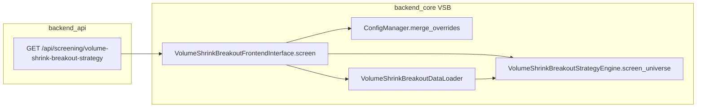

# 3倍量缩量突破策略 — 设计与使用手册

本文档描述本项目中 **3倍量缩量突破（Volume Shrink Breakout，简称 VSB）** 策略的独立模块设计、算法约定、HTTP API、前端操作与运维要点。与业务代码目录一一对应，便于交付与二次开发。

---

## 1. 策略概述

### 1.1 业务直觉

在一段近期行情中，若某日出现相对前一交易日明显 **放量（爆量）**，且当日 **短中期均线呈多头排列**，之后股价经历整理；当 **最近一个交易日** 以 **缩量** 方式 **收盘价上破爆量日收盘价** 时，视为一种量价配合的「缩量突破」形态。默认将爆量倍数设为 3，即俗称「3倍量缩量突破」。

### 1.2 技术定义（与实现一致）

- **K 线方向**：`historical_quotes` 查询结果为 **日期倒序**，下标 `0` 为最近交易日，`t` 增大表示越早。
- **默认：`evaluation_mode = three_phase`（三阶段路径）**
  - **阶段1（侦测日下标 `s`）**：在 `[boom_lookback_min, boom_lookback_max]` 内自近向远枚举 `s`（与旧版「取最小下标」一致）。要求：① `volume[s] >= volume_ratio * volume[s+1]`（`s+1` 为更早一日）；② **MA5 于 `s` 日上穿 MA20**：`MA5[s+1] <= MA20[s+1]` 且 `MA5[s] > MA20[s]`；③ **均线向上**：`MA20[s] > MA20[s + trend_ma_lookback]` 且 `MA5[s] > MA5[s+3]`（`trend_ma_lookback` 默认 5，见配置）。锁定侦测日 **OHLC** 与 `V_limit = volume[s]`（返回中 `boom_*` 仍表示侦测日，与旧版字段名兼容）。
  - **阶段2（回调段，下标 `t = 1 .. s-1`）**：若 `s=1` 则无中间日，视为通过。否则每个 `t` 要求：① 收盘 **不有效跌破** `min(侦测日开盘, 侦测日最低) * (1 - retracement_break_eps)`；② **每一日** `volume[t] < retracement_volume_half_ratio * V_limit`（默认 0.5）；③ 均线：**MA5>MA10>MA20** 或 **MA5 走平**（`|MA5[t]-MA5[t+3]|/MA5[t+3] < ma_flat_tol`）且 `MA5[t] >= MA20[t]`。
  - **阶段3（触发日，下标 0）**：`closes[0] > 侦测日收盘（C_limit）` 且 `volumes[0] < V_limit`。
  - 从满足阶段1 的候选 `s` 中 **自小到大地尝试**（离最新最近优先），**整条路径**通过则命中并返回；否则 `None`。
- **兼容：`evaluation_mode = legacy`（旧版两点式）**  
  在 lookback 内取最近爆量 `k`，要求爆量当日 **MA5>MA10>MA20**，且最新日 `closes[0] > closes[k]`、`volumes[0] < volumes[k]`。用于回归对照，不建议与三阶段结论混比。

不满足任一路径则该股不入选。

### 1.3 数据前提

- `stock_basic_info`：6 位代码、名称；排除名称含 `ST`；`collect_enabled` 为真或空视为可采集。
- `historical_quotes`：日线 OHLCV 等字段完整；策略按配置取最近约 **180 个自然日** 窗口拉取历史（见配置文件）。

---

## 2. 模块架构

### 2.1 目录与职责

策略作为 **独立子包** 置于 `backend_core/strategies/volume_shrink_breakout/`，与 GMS 等策略分包思路一致。

| 文件 | 职责 |
|------|------|
| `config.py` | `VolumeShrinkBreakoutConfigManager`：默认配置、`vsb_config.json` 加载、运行时 Query 覆盖（爆量倍数与 lookback） |
| `vsb_config.json` | 部署侧可调默认参数（JSON，UTF-8） |
| `data_loader.py` | 候选池：`StockBasicInfo` 过滤、可选 **板块代码段** `boards`、自选代码列表；`historical_quotes` 按日 DESC 拉取 |
| `strategy_engine.py` | 纯判定逻辑：`find_boom_index`、`evaluate_stock`（`three_phase` / `legacy`）、阶段校验与 `build_buy_signal_bundle*`、`VolumeShrinkBreakoutStrategyEngine` |
| `frontend_interface.py` | 对外选股入口：`VolumeShrinkBreakoutFrontendInterface.screen(...)`，供 API 薄封装 |
| `signal_storage.py` | 选股命中写入 `volume_shrink_breakout_signals`（`save_screen_hits`） |
| `__init__.py` | 导出公共符号与 `__version__` |

### 2.2 调用链（请求级）



- API 层在 **线程池** 中执行同步 `screen`，并用 `asyncio.wait_for` 包一层超时（见下文 `VSB_SCREENING_TIMEOUT`）。
- 若子包导入失败，路由返回 **503**，提示模块不可用。

---

## 3. 配置说明

### 3.1 `vsb_config.json`

路径：`backend_core/strategies/volume_shrink_breakout/vsb_config.json`

| 键 | 含义 | 默认（代码内兜底） |
|----|------|---------------------|
| `volume_ratio` | 爆量相对 **前一交易日** 成交量倍数 | `3.0` |
| `boom_lookback_min` | 爆量日下标 `k` 的最小值（含） | `5` |
| `boom_lookback_max` | 爆量日下标 `k` 的最大值（含） | `60` |
| `ma_periods` | 文档/扩展用，当前引擎固定使用 5/10/20 | `[5,10,20]` |
| `history_calendar_days` | 拉取历史的自然日窗口长度 | `180` |
| `evaluation_mode` | `three_phase`（默认）或 `legacy` | `three_phase` |
| `trend_ma_lookback` | 阶段1 中 MA20 向上回看的步长 `s + 该值` | `5` |
| `retracement_break_eps` | 阶段2 关键位下破容差（比例） | `0.005` |
| `ma_flat_tol` | 阶段2 MA5 走平相对 `MA5[t+3]` 的容忍比例 | `0.008` |
| `retracement_volume_half_ratio` | 阶段2 相对 `V_limit` 的缩量系数（严格 `< ratio * V_limit`） | `0.5` |

说明：**当前 HTTP API 仅覆盖** `volume_ratio`、`boom_lookback_min`、`boom_lookback_max`；`history_calendar_days` 与三阶段相关键仅通过 `vsb_config.json`（或 `VolumeShrinkBreakoutConfigManager.merge_overrides` 在代码侧）生效，请求 Query 暂不覆盖该项。

### 3.2 环境变量

| 变量 | 含义 |
|------|------|
| `VSB_SCREENING_TIMEOUT` | 单次选股同步计算的最大等待秒数（默认 `600`，且不低于 `60`）。全 A 扫描时请保证 **Nginx / 网关 `proxy_read_timeout`** 不小于该值，否则易出现 502/504。 |

---

## 4. 候选池与板块过滤

### 4.1 全市场 `scope=all`

- 从 `stock_basic_info` 取候选，条件见 1.3。
- 可选 Query：`boards` 多选，缩小代码前缀范围（与 SQL `LIKE` 组合为 OR）。

### 4.2 自选股 `scope=watchlist`

- 需携带有效登录 **Bearer Token**；服务端解析用户后读取 `Watchlist`。
- 候选为自选代码与 `stock_basic_info` 的交集，仍应用 ST / `collect_enabled` 规则；若同时传 `boards`，再与代码段条件 **取交**。

### 4.3 `boards` 取值与代码段

| 键 | 说明 | 前缀 |
|----|------|------|
| `CYB` | 创业板 | `300` |
| `KCB` | 科创板 | `688` |
| `SH_MAIN` | 沪市主板（不含 688） | `600`、`601`、`602`、`603`、`605` |
| `SZ_MAIN` | 深市主板 | `000`、`001` |
| `SZ_SME` | 深圳中小板 | `002` |

- 不传或全部非法键：**不限制板块**（全表候选规则内尽量全）。
- 支持 `?boards=CYB&boards=KCB` 或 `?boards=CYB,KCB` 等形式；服务端会规范化、去重。

### 4.4 `limit` 行为

- 在候选列表 **按代码升序** 取前 `limit` 条，再逐只拉历史并判定。
- 适用于联调、压测与分批扫描；**不等价于随机抽样**。

---

## 5. HTTP API

### 5.1 端点

`GET /api/screening/volume-shrink-breakout-strategy`

### 5.2 Query 参数

| 参数 | 类型 | 必填 | 说明 |
|------|------|------|------|
| `scope` | string | 否 | `all`（默认）或 `watchlist` |
| `date` | string | 否 | 筛选基准日 `YYYY-MM-DD`；不传则按当前自然日。若 `historical_quotes` 无该日或该日晚于表内全局最新 `date`，则自动用表内最新交易日作为 K 线窗口止日，并在 `message` 中提示 |
| `limit` | int | 否 | ≥1，限制候选只数 |
| `volume_ratio` | float | 否 | 1.0～30.0，覆盖配置中的爆量倍数 |
| `boom_lookback_min` | int | 否 | 1～250 |
| `boom_lookback_max` | int | 否 | 1～250 |
| `boards` | string[] | 否 | 可多传；见 4.3 |
| `persist` | bool | 否 | 默认 `true`：将本次选股命中写入 `volume_shrink_breakout_signals`；`false` 时仅返回不落库 |

认证：`scope=watchlist` 时需在 `Authorization: Bearer <token>` 中携带 JWT。

### 5.3 响应约定

- 成功：`JSONResponse`，含 `success`、`data`、`total`、`strategy_name`、`scope`、`parameters`（含 `screening_date_requested`、`screening_date_effective` 及实际使用的 `volume_ratio`、`boom_lookback_*`、`history_calendar_days`、`limit`、`boards`）、`search_date`（与落库 `run_search_date` 一致，均为解析后的有效止日）；若发生基准日回退则带 `message` 说明。
- **503**：策略子模块未加载。
- **401**：自选范围未登录或 Token 无效。
- **400**：`scope` 非法。
- **504**：计算超过 `VSB_SCREENING_TIMEOUT`。

### 5.4 单条 `data[]` 字段（主要）

| 字段 | 说明 |
|------|------|
| `code` / `name` | 股票代码、名称 |
| `boom_date` / `boom_close` / `boom_volume` | 爆量日及收盘、成交量 |
| `boom_volume_ratio_vs_prev` | 爆量日量 / 前一日量（实际比值） |
| `ma5_at_boom` / `ma10_at_boom` / `ma20_at_boom` | 爆量日对应均线 |
| `breakout_date` / `breakout_close` / `breakout_volume` | 最新日（突破判定日） |
| `current_change_percent` | 最新日涨跌幅（与 `change_percent` 一致，便于前端展示） |
| `buy_signal` | 参考买点说明（中文短句，非投资建议） |
| `signal_strength` | 信号强度 0–100（综合爆量超额、突破幅度、缩量程度、均线间距、金叉与回踩等） |
| `signal_strength_level` | `强` / `中` / `弱`（与强度分档对应） |
| `signal_reminders` | 字符串数组，强度与风险提醒（如缩量不足、涨幅过大、爆量日较远等） |
| `had_ma5_cross_above_ma10` | 是否在爆量日前若干根内出现典型 MA5 上穿 MA10 金叉 |
| `had_pullback_below_boom_zone` | 爆量后至突破前是否曾明显低于爆量日收盘（刻画「回调」） |

---

## 6. 前端使用（选股页）

- 页面：`frontend/screening.html`，Tab **「3倍量缩量突破」**。
- 脚本：`frontend/js/screening.js` 中 `strategy === 'volume-shrink-breakout'` 分支构造请求 URL。
- **可选参数**：`date`（筛选基准日 YYYY-MM-DD）、`limit`、爆量倍数、`boom_lookback_min/max`、板块多选（对应 `boards`）。`date` 在 `historical_quotes` 无该日或晚于表内最新 `date` 时，自动改用表内全局最新交易日作为 K 线窗口止日，并在响应 `message` 中说明（`search_date` 与落库 `run_search_date` 均为实际采用日）。
- 当前页内默认 `scope=all`；若需自选范围，需在调用处改为 `scope=watchlist` 并携带登录态（与接口约定一致）。

结果表格列：股票代码、名称、爆量日、爆量收盘、爆量成交量、量比、MA5/10/20、突破日、突破收盘、突破量、当前涨跌幅、操作链接（含 **信号历史** 跳转 `stock_vsb_trace.html`）。支持导出 CSV。

---

## 7. 程序化调用（后端 / 脚本）

在已持有 SQLAlchemy `Session` 的上下文中：

```python
from backend_core.strategies.volume_shrink_breakout import VolumeShrinkBreakoutFrontendInterface

payload = VolumeShrinkBreakoutFrontendInterface.screen(
    db,
    scope="all",  # 或 "watchlist" 且传入 stock_codes
    limit=200,
    stock_codes=None,  # watchlist 时传入 ["600000", ...]
    volume_ratio=3.0,
    boom_lookback_min=5,
    boom_lookback_max=60,
    boards=["CYB", "SH_MAIN"],  # 或 None 表示不限
    persist_signals=True,
    screening_date="2026-05-11",  # 可选；实际止日经 historical_quotes 解析后见 payload["search_date"]
)
# payload["data"] 为命中列表
```

单测逻辑（无 DB）可参考 `test/test_volume_shrink_breakout_strategy_engine.py`、`test/test_volume_shrink_breakout_board_filters.py`、`test/test_volume_shrink_breakout_signal_storage.py`。

---

## 8. 性能与运维建议

1. **全 A 首次上线**：务必配合 `limit` 小批量验证耗时与网关超时，再逐步放大或去掉 `limit`。
2. **超时对齐**：同步计算 + `VSB_SCREENING_TIMEOUT` + Nginx `proxy_read_timeout` 建议统一调大并文档化（可参考 `日常运维.md` 中其他选股策略的网关说明）。
3. **数据质量**：历史缺口、停牌多日会导致有效 K 线不足，`evaluate_stock` 会直接丢弃（三阶段需约 `boom_lookback_max + 25` 根以上，以覆盖 MA 与趋势回看）。
4. **日志**：引擎每约 500 只股票打进度 INFO；单股异常 DEBUG，不中断整批扫描。

---

## 9. 扩展与维护提示

- **改均线周期**：当前写死为 5/10/20；若改为可配置，需同步调整 `strategy_engine.py` 与配置校验。
- **改爆量定义**：仅改 `find_boom_index` 与文档 1.2 保持一致即可。
- **新增板块键**：在 `data_loader.VSB_BOARD_PREFIX_GROUPS` 与前端 checkbox 同步增加，并补充单测。

---

## 10. 交易信号持久化与历史查询

### 10.1 与 GMS 的差异（一期范围）

- **GMS** `gms_signal_trace`：按交易日存 **全序列追溯**（先有指标表再批量写 trace）。
- **VSB 一期**：仅在 **选股接口命中** 时写入 `volume_shrink_breakout_signals`；**不做**「把历史上每个交易日当作最新日」的逐日重算。若将来需要 GMS 式日频 trace，需独立引擎与任务（二期）。

### 10.2 表与主键

- 表名：`volume_shrink_breakout_signals`（模型 `VolumeShrinkBreakoutSignal`，见 [`backend_api/models.py`](e:\wangxw\股票分析软件\编码\stock_quote_analayze\backend_api\models.py)）。
- 唯一约束：**`(code, signal_date)`**，其中 **`signal_date` = 突破日 `breakout_date`**。
- 扩展列（买点与强度）：`signal_strength`、`signal_strength_level`、`buy_signal_text`、`signal_reminders_json`；已有库请执行 `python backend_api/alter_vsb_signal_buy_columns.py`（或 `database/tables` 中对应 `ALTER`）。
- 三阶段摘要：`phase_state_json`（JSON 文本，含 `strategy_phase`、`H_limit`、`C_limit` 等）；已有库请执行 `python backend_api/alter_vsb_signal_phase_state_column.py`。历史查询 API 会将解析结果置于 `phase_state`，并在顶层附带 `strategy_phase` 字符串（若存在）。
- 建表（**首次部署必做**，未建表时查询接口会返回 503 并提示）：在项目根目录执行  
  `python backend_api/create_volume_shrink_breakout_signal_table.py`  
  建表后若库为旧库，请再执行 `python backend_api/alter_vsb_signal_buy_columns.py` 与 `python backend_api/alter_vsb_signal_phase_state_column.py`（可重复执行）。PostgreSQL 亦可参考仓库内 [`database/tables`](e:\wangxw\股票分析软件\编码\stock_quote_analayze\database\tables) 中 DDL 片段。

### 10.3 写入时机

- `GET /api/screening/volume-shrink-breakout-strategy` 在计算完成后，当 **`persist=true`（默认）** 且存在命中行时，由 [`signal_storage.save_screen_hits`](e:\wangxw\股票分析软件\编码\stock_quote_analayze\backend_core\strategies\volume_shrink_breakout\signal_storage.py) 批量提交；写入失败 **只记日志，不改变选股 HTTP 成功结果**。

### 10.4 信号历史 HTTP API

以下两套路由**逻辑相同**，便于不同 Nginx 只反代 `/api/screening` 或全量 `/api` 时均可访问；前端「信号历史」页默认请求 **screening** 前缀。

| 方法 | 路径 | 说明 |
|------|------|------|
| GET | `/api/vsb/signals` | **推荐**：在 `main.app` 上直挂，与下表逻辑同源；参数：`code`（必填），`start_date`、`end_date`（可选），`limit`（默认 200）；按 `signal_date` **降序** |
| GET | `/api/vsb/signals/by-date` | **推荐**。参数：`signal_date`（必填），`limit`（默认 500） |
| GET | `/api/screening/vsb-signals` | 与选股同前缀（部分网关/Nginx 只反代 screening 时用） |
| GET | `/api/screening/vsb-signals/by-date` | 同上 |
| GET | `/api/stock/vsb-signals` | 与 `stock_manage` 同前缀下的备用路径 |
| GET | `/api/stock/vsb-signals/by-date` | 同上 |
| POST | `/api/vsb/signals/recalculate` | **单股重算并落库**：`code`（必填），`name`、`search_date`（默认今日）、`volume_ratio`、`boom_lookback_min`、`boom_lookback_max`（可选 Query）。默认按**最新日线**跑一次引擎，命中则 `save_screen_hits`。若 **`replay_range=true`** 且同时提供 **`start_date`、`end_date`**（YYYY-MM-DD），则对该区间内**每个有 K 线的交易日**做「截至该日的 DESC 切片」判定并批量落库；单次区间交易日上限 **500**（超出返回 400 说明）；服务端超时默认 **600s**（仅回放路径），网关 `proxy_read_timeout` 需相应放大。 |
| POST | `/api/screening/vsb-signals/recalculate` | 与上同源（screening 前缀）。 |
| POST | `/api/stock/vsb-signals/recalculate` | 与上同源（stock 前缀）。 |

### 10.5 前端

- 页面：`frontend/stock_vsb_trace.html`，脚本 `frontend/js/stock_vsb_trace.js`；选股结果表格中 **「信号历史」** 链到该页并带 `code`、`name`。
- **重算并落库**：无记录或需刷新「当前最新日」判定时，调用上述 POST（不传 `replay_range`）；成功后自动重新 GET 列表。
- **区间内逐日回放**：填写开始/结束日期后调用同一 POST，并传 `replay_range=true` 与 `start_date`、`end_date`；对区间内每个交易日逐次切片重算并落库，成功后刷新列表（耗时随交易日数量增加）。

---

## 11. 文档版本

| 版本 | 日期 | 说明 |
|------|------|------|
| 1.0 | 2026-05-09 | 首版：独立设计说明 + API/前端/配置/运维 |
| 1.1 | 2026-05-09 | 交易信号表、persist、历史查询 API、信号历史页 |
| 1.2 | 2026-05-09 | 三阶段买入路径、`evaluation_mode`、`phase_state_json` 与手册/选股说明对齐 |
| 1.3 | 2026-05-11 | 信号历史页「重算并落库」与 POST `*/vsb-signals/recalculate` |
| 1.4 | 2026-05-11 | 信号历史「区间内逐日回放」：`replay_range` + 日期窗口、600s 超时与 500 交易日上限说明 |
| 1.5 | 2026-05-11 | 选股 `date` 基准日与 `historical_quotes` 无数据时回退表内最新交易日；`screen` 入参 `screening_date` |

模块代码版本见 `backend_core/strategies/volume_shrink_breakout/__init__.py` 中的 `__version__`。
