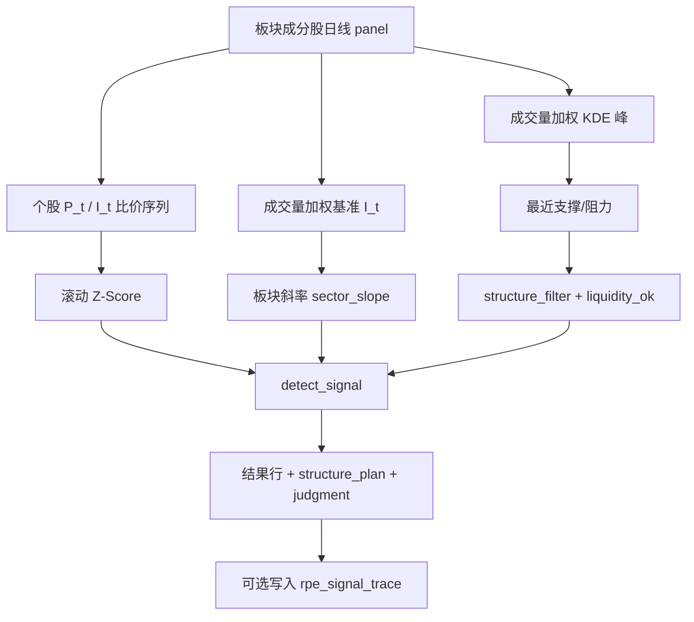

# RPE（比价效应）策略实现设计文档

本文档基于当前代码实现，系统说明比价效应（Relative Price Effect, RPE）的策略理念、参数定义、计算规则、工程架构与数据落库，便于研发校验、参数调优与业务对齐。

**相关文档：**

| 文档 | 读者 | 内容侧重 |
|------|------|----------|
| [RPE_比价效应_业务简化版.md](./RPE_比价效应_业务简化版.md) | 业务 / 交易员 | 找什么票、何时可买、怎么卖 |
| [RPE_比价效应_信号计算规则.md](./RPE_比价效应_信号计算规则.md) | 策略 / 研发 | 公式、阈值、判定码、回测口径 |
| **本文** | 研发 / 架构 | 模块、表结构、API、调度、配置版本 |

工程包路径：`backend_core/strategies/rpe/`。与 GMS、SBBR **零业务耦合**（独立表、独立 API、独立配置）。

---

## 目录

1. [策略概述](#1-策略概述)
2. [核心架构](#2-核心架构)
3. [信号参数定义](#3-信号参数定义)
4. [策略规则与计算流水线](#4-策略规则与计算流水线)
5. [模块设计](#5-模块设计)
6. [数据模型](#6-数据模型)
7. [配置管理](#7-配置管理)
8. [API 与前端](#8-api-与前端)
9. [预计算、追溯与回测](#9-预计算追溯与回测)
10. [与其它策略的关系](#10-与其它策略的关系)

---

## 1. 策略概述

### 1.1 名称与目标

**RPE（比价效应 / Relative Price Effect）**：在同一行业（或概念）板块内，用成分股成交量加权合成「簇基准」\(I_t\)，衡量个股相对基准的偏离（滚动 Z-Score），再叠加 KDE 筹码结构与流动性过滤，捕捉**向板块补涨靠拢**的机会。

主交易目标是 **补涨（catch_up）**，不是追已大幅领涨的股票。领涨（lead）默认仅观察。

### 1.2 一句话规则

> 同板块内相对明显落后（\(Z \le z\_catch\_up\)），且板块趋势未否决、现价站在 KDE 支撑之上、距阻力有足够盈亏比、流动性合格 → 给出补涨可入场信号；离场只认**收盘跌破结构支撑**，禁止固定百分比止损作为策略规则。

### 1.3 信号类型

| `signal_type` | 条件（默认） | `entry_signal` |
|---------------|--------------|----------------|
| `catch_up` | \(Z \le -1.5\) | 未趋势否决 ∧ 结构有效 ∧ 流动性通过 |
| `lead` | \(Z \ge 2.0\) | 仅当 `enable_lead_trade=true` 且同上三条件 |
| （无 / 区间内） | \(-1.5 < Z < 2.0\) | 否；单股明细可返回 `in_band` |

辅助字段：

- `watch_only`：有信号类型但未达入场（如补涨被过滤、或领涨仅观察）
- `trend_veto`：板块斜率 &lt; 0 且开启趋势否决

---

## 2. 核心架构

### 2.1 分层

```
┌─────────────────────────────────────────────────────────┐
│  前端 screening「比价效应」 / stock_rpe_trace / admin RPE │
├─────────────────────────────────────────────────────────┤
│  API：/api/screening/rpe-strategy · /api/stock/rpe-*    │
│       /api/admin/rpe/*                                  │
├─────────────────────────────────────────────────────────┤
│  RPEFrontendInterface（优先读 rpe_signal_trace）         │
├─────────────────────────────────────────────────────────┤
│  RPEStrategyEngine.screen / screen_board / evaluate_*   │
├──────────────┬──────────────┬──────────────┬────────────┤
│ sector_bench │ zscore       │ kde_levels   │ filters    │
│ mark         │              │              │ + detector │
├─────────────────────────────────────────────────────────┤
│  RPEDataLoader：industry/concept 成分 + historical_quotes│
├─────────────────────────────────────────────────────────┤
│  PostgreSQL：rpe_strategy_configs / rpe_signal_trace / … │
└─────────────────────────────────────────────────────────┘
```

### 2.2 单股评估数据流



### 2.3 选股范围（scope）

| scope | 行为 |
|-------|------|
| `cn` | 遍历行业（或概念）板块建簇筛选；可 `trace_only` 只读预计算 |
| `industry_board` / `concept_board` | 指定板块成分；默认可含无信号票 |
| `watchlist` | 自选股 → 解析所属板块后评估 |
| `single` | 单股固定主板块建簇；始终返回策略明细（含区间内） |

个股主板块规则：行业优先；同 kind 多板块取成分最多（并列 `board_code` 升序）。追溯重算全程只用该主板块。显式多选板块撞车时仍可按 **|Z| 最大** 去重。

---

## 3. 信号参数定义

默认值来自 `backend_core/strategies/rpe/config.py` → `get_default_rpe_config()`。库表 `rpe_strategy_configs.config_params` 与默认做 **深合并**；未写出的键沿用默认。

### 3.1 核心阈值（一级字段）

| 参数 | 类型 | 默认 | 含义 | 影响环节 |
|------|------|------|------|----------|
| `lookback_days` | int | 250 | 拉取日线与合成基准的回溯交易日数 | 数据加载、KDE 样本 |
| `z_window` | int | 40 | 滚动 Z 窗口（实现侧下限钳制为 ≥5） | Z-Score |
| `z_lead` | float | 2.0 | \(Z \ge\) 此值 → 领涨 | 信号类型 |
| `z_catch_up` | float | -1.5 | \(Z \le\) 此值 → 补涨 | 信号类型 |
| `sector_slope_window` | int | 60 | 对 \(I_t\) 做线性回归的窗口 | 趋势否决 |
| `enable_trend_veto` | bool | true | 斜率 &lt; 0 时禁止补涨/领涨入场 | 入场门控 |
| `enable_lead_trade` | bool | false | 是否允许领涨产生 `entry_signal` | 入场门控 |
| `kde_base_factor` | float | 1.0 | KDE 带宽 = factor × (σ/μ)，且 ≥ 0.01 | 支撑阻力平滑度 |
| `kde_grid_points` | int | 200 | 密度评估网格点数（≥50） | 峰检测精度 |
| `min_rr_to_resistance` | float | 1.5 | 上行空间/下行空间最低盈亏比 | 结构过滤 |

### 3.2 流动性子配置 `liquidity`

| 参数 | 默认 | 说明 |
|------|------|------|
| `lookback_days` | 20 | 滚动窗口 |
| `min_avg_amount` | 5_000_000 | 无 `by_board` 时的回退均额（**人民币元**） |
| `min_avg_turnover_rate` | 0.8 | 日均换手下限（%）；无换手字段则只判成交额 |
| `min_avg_amount_by_board` | 见下 | 按上市板别分层均额（人民币元，非手数） |

`min_avg_amount_by_board` 默认：`MAIN` 3000 万、`SZ_SME` 2000 万、`CYB`/`KCB` 1500 万、`BJ`/`DEFAULT` 500 万。详见 [RPE_流动性过滤_分层改造方案.md](./RPE_流动性过滤_分层改造方案.md)。

### 3.3 扫描子配置 `scan`

| 参数 | 默认 | 含义 |
|------|------|------|
| `max_results` | 200 | 全市场结果截断 |
| `min_sector_members` | 5 | 板块有效成分下限（过少不建簇） |
| `max_boards` | null | 预计算/全市场可限制板块数 |

### 3.4 回测子配置 `backtest`

| 参数 | 默认 | 含义 |
|------|------|------|
| `horizon_days` | 40 | 信号后观察/持有窗口 |
| `target_relative_pct` | 0.08 | 命中率回测目标涨幅（相对入场价） |
| `commission_bps` / `slippage_bps` | 5.0 | 预留（交易模拟当前以价格路径为主） |

### 3.5 运行期输出字段（非配置，写入结果/trace）

| 字段 | 说明 |
|------|------|
| `z_score` / `ratio` | 最新 Z 与 \(P/I\) |
| `sector_id` / `sector_name` / `sector_slope` | 簇标识与斜率 |
| `support_levels` / `resistance_levels` | KDE 峰拆分后最多各 8 档 |
| `nearest_support` / `nearest_resistance` | 现价下/上方最近峰 |
| `structure_valid` / `liquidity_ok` | 结构、流动性布尔 |
| `structure_plan` | `{entry_price, structure_support, structure_resistance, exit_rule=structure_break}` |
| `detail.judgment.steps` | 逐步判定（阈值、实际值、是否通过），供追溯页展示 |

---

## 4. 策略规则与计算流水线

### 4.1 板块簇与基准 \(I_t\)

- **行业簇**：`industry_board_basic_info` + `industry_board_constituents`
- **概念簇**：`concept_board_basic_info` + 对应成分表（`board_kind=concept`）
- 自选/单股：优先行业归属；无行业则回退概念

对某日有有效收盘价与成交量的成分股：

\[
I_t = \frac{\sum_i P_{i,t}\, V_{i,t}}{\sum_i V_{i,t}}
= \frac{\text{分子：价×量之和}}{\text{分母：成交量之和}}
\]

| 角色 | 含义 |
|------|------|
| 分子 | \(\sum_i P_{i,t} V_{i,t}\) |
| 分母 | \(\sum_i V_{i,t}\) |

实现：`sector_benchmark.compute_vwap_benchmark`。无效价量（≤0）不参与。

### 4.2 板块趋势斜率

对最近 `sector_slope_window` 日的 \(I_t\) 做普通最小二乘：\(y \sim a + b x\)，\(x=0..n-1\)，取斜率 \(b\)。

- \(b < 0\) 且 `enable_trend_veto=true` → `trend_veto=true`，禁止入场（仍可标出 catch_up/lead 类型为观察）
- 样本 &lt; 5 → 斜率 `None`，否决不触发

### 4.3 比价与滚动 Z-Score

1. 对齐日期：\(R_t = P_t / I_t\)（双方均 &gt; 0）  
   - **分子** \(P_t\)：个股收盘价；**分母** \(I_t\)：同日板块基准  
2. 窗口 `w = max(5, z_window)`，对 \(R\) 序列：

\[
\mu_t = \overline{R_{t-w+1:t}},\quad
\sigma_t = \sqrt{\frac{1}{w}\sum (R_i-\mu_t)^2},\quad
Z_t = \frac{R_t - \mu_t}{\sigma_t}
\]

Z 的分子为 \(R_t-\mu_t\)，分母为 \(\sigma_t\)（总体方差口径，除以 \(w\) 非 \(w-1\)）。\(\sigma\) 过小则 \(Z=0\)。

实现：`zscore.relative_ratio_series` / `rolling_zscore` / `latest_zscore`。

名词与逐步判定口径以 [信号计算规则](./RPE_比价效应_信号计算规则.md) 为准；选股「明细」面板展示分子/分母说明。

### 4.4 KDE 支撑 / 阻力

1. 回溯窗口内 close、volume 组成加权样本；样本数 &lt; 20 → KDE 失败，结构通常不通过
2. \(\mathrm{bw} = \max(0.01,\ \mathrm{kde\_base\_factor}\cdot \sigma/\mu)\)
3. `scipy.stats.gaussian_kde`（优先 `weights`；旧版则按权重离散复制）
4. 在 \([0.98\min P,\ 1.02\max P]\) 上评估密度，`find_peaks`（prominence ≥ 5% max density）
5. 低于现价的峰 → 支撑（由近到远）；不低于现价的峰 → 阻力

### 4.5 结构过滤（盈亏比）

设现价 \(P\)、最近支撑 \(S\)、最近阻力 \(R_{res}\)（避免与比价 \(R\) 混淆）：

- 若无 \(S\) 或 \(P \le S\) → 无效（`below_or_no_support`）
- 下行空间 \(D = P - S\)（RR **分母**）；若无 \(R_{res}\) → 视为空间充足（通过，`no_resistance`）
- 上行空间 \(U = R_{res} - P\)（RR **分子**）；盈亏比 \(\mathrm{RR} = U/D\)，要求 \(\mathrm{RR} \ge \mathrm{min\_rr\_to\_resistance}\)

### 4.6 流动性过滤

近 N 日平均成交额（**人民币元**）、平均换手（有值时）同时达到下限 → `liquidity_ok`。  
均额门槛按上市板别分层（主板 / 中小板 / 创业板 / 科创板 / 北证），换手默认 0.8%。实现：`listed_board.resolve_min_avg_amount` + `filters.liquidity_ok`。

### 4.7 入场信号组装（`detect_signal`）

```
if Z <= z_catch_up:
    signal_type = catch_up
    entry = (not veto) and structure_valid and liquidity_ok
elif Z >= z_lead:
    signal_type = lead
    entry = enable_lead_trade and (not veto) and structure_valid and liquidity_ok
else:
    无类型（reason=in_band）
```

常见 `detail.signal_reason`：`catch_up_ok` / `catch_up_filtered` / `lead_watch` / `lead_trade_ok` / `in_band` / `no_z`。

### 4.8 离场规则（强制）

| 允许 | 禁止 |
|------|------|
| `structure_break`：收盘价 &lt; 结构支撑 | 以 `fixed_pct` / `percent_stop` 等作为唯一离场理由（API 直接 400） |
| 回测中触及阻力兑现（`resistance`） | 把固定 % 止损写成策略准绳 |

正式交易 `structure_plan.exit_rule` 固定为 `structure_break`。观察列表可用实时行情二次确认现价是否仍在支撑上方（无独立盘中 cron）。

---

## 5. 模块设计

| 文件 | 职责 |
|------|------|
| `config.py` | 默认参数、`RPEConfigManager` 多版本 CRUD / 缓存 / 预计算 config 列表 |
| `data_loader.py` | 板块列表与成分、日线 panel、按日聚合成员价量 |
| `sector_benchmark.py` | VWAP 基准 \(I_t\)、线性斜率 |
| `zscore.py` | 比价序列与滚动 Z |
| `kde_levels.py` | 成交量加权 KDE + peaks + nearest |
| `filters.py` / `listed_board.py` | 趋势否决、结构、分层流动性、破位判定 |
| `signal_detector.py` | catch_up / lead / entry / reason |
| `trade_structure_plan.py` | 结构价位计划（禁固定 % 止损） |
| `strategy_engine.py` | 单股评估、按板块/全市场选股、去重排序 |
| `frontend_interface.py` | 选股入口：trace 优先或 live 计算并可回写 |
| `signal_storage.py` | upsert / load / 单股强制重算 |
| `scheduled_precompute.py` | 日终批处理 |
| `backtest_runner.py` / `backtest_storage.py` | 命中率与交易模拟 |
| `__init__.py` | 包导出 |

单元测试主要在 `test/test_rpe_*.py`。

---

## 6. 数据模型

PostgreSQL 表（迁移：`migrations/add_rpe_tables.py` 等）：

### 6.1 `rpe_strategy_configs`

策略参数版本：`name` 唯一，`config_params` JSON，`is_default` / `is_active` / `precompute_enabled`。

### 6.2 `rpe_signal_trace`

唯一键：`(code, trade_date, market_type, config_id)`。

存当日评估快照：Z、信号类型、入场标记、斜率、支撑阻力、结构/流动性、`detail` JSON（含 judgment）。

### 6.3 交易相关

- `rpe_trade_observe_stocks` / `rpe_trade_observe_history`：观察池与移除归档  
- `rpe_formal_trades`：正式交易；`exit_reason` 应以结构破位为主  
- `rpe_backtest_tasks`：回测任务进度与 summary  
- `rpe_precompute_runs`：预计算运行记录  
- `rpe_trace_recompute_tasks`：追溯页「强制重算」任务进度  

行情与成分不单独建 RPE 表，复用全站 `historical_quotes` 与板块成分表。

---

## 7. 配置管理

1. 首次读取默认配置时，若不存在 `is_default` 行则自动插入「default」  
2. `get_config(id)`：默认骨架 deep-merge 库内 JSON  
3. 进程内 `_CACHE` 按 config_id 缓存；更新/设默认时失效  
4. 日终预计算：`is_default` 或 `precompute_enabled` 的配置均会跑  

管理端：`/rpe-management`（`admin/src/views/RPEManagementView.vue`）。

---

## 8. API 与前端

### 8.1 选股

`GET /api/screening/rpe-strategy`

主要 Query：`scope`、`date`、`config_id`、`entry_only`、`signal_type`、`board_code` / 多选板块、`stock_code`、`trace_only`、`max_results`。

### 8.2 用户交易与追溯

前缀大致为 `/api/stock/rpe-*`（观察、正式交易、信号追溯、强制重算等），见 `backend_api/rpe_routes.py`。

### 8.3 管理端

前缀 `/api/admin/rpe`：`strategy-configs`、`backtests`、`precompute/trigger`、`selection-results`。

### 8.4 前端入口

| 入口 | 说明 |
|------|------|
| `frontend/screening.html` Tab「比价效应」 | 策略选股 / 观察 / 正式交易 |
| `frontend/js/rpe_screening.js` | 交互与 API 调用 |
| `frontend/stock_rpe_trace.html` | 单股信号追溯与强制重算 |
| `admin` → RPE 管理 | 配置版本、回测、手动预计算 |

---

## 9. 预计算、追溯与回测

### 9.1 日终预计算

- 调度：`backend_core/data_collectors/main.py` 任务 `rpe_signals_cn`  
- 默认工作日约 **19:40**（避开 GMS/SBBR 高峰）  
- 开关：环境变量 `ENABLE_RPE_PRECOMPUTE`  
- 流程：`run_rpe_precompute` → `engine.screen` → `upsert_signal_traces` → 写 `rpe_precompute_runs`

选股勾选「优先读预计算」时走 `trace_only`，全市场浏览更快。

### 9.2 追溯强制重算

对指定股票 + config，按历史交易日重跑评估并回写 trace；进度表 `rpe_trace_recompute_tasks`。

### 9.3 回测类型

| `backtest_type` | 行为 |
|-----------------|------|
| `signal_hit_rate` | 入场样本后 N 日内是否触及目标价且未先破位 |
| `trade_simulation` | T+1 开盘入场；离场优先结构破位，其次触及阻力，否则持有到期 |

采样可按 `date_step`、`max_boards`、`board_code` 控制计算量。

---

## 10. 与其它策略的关系

| 策略 | 关系 |
|------|------|
| GMS | 仅工程范式对标（配置版本、trace、观察→正式、回测）；**不共用业务逻辑与表** |
| SBBR（做小做底） | 小市值筑底转强；与 RPE 互补、互不依赖 |
| 其它选股 Tab | 并列展示，权限与路由独立 |

---

## 附录 A：判定步骤（引擎写入 `detail.judgment.steps`）

1. 补涨 Z 阈值：\(Z \le z\_catch\_up\)  
2. 领涨 Z 阈值：\(Z \ge z\_lead\)  
3. 板块趋势否决：开启时要求斜率 ≥ 0  
4. 结构过滤：站上支撑且 RR ≥ `min_rr_to_resistance`  
5. 流动性：近 N 日均额与换手  
6. 入场信号：补涨主路径 / 可选领涨交易  

公式摘要（引擎原文语义）：

> 入场 = (catch_up 或允许交易的 lead) ∧ 未趋势否决 ∧ 结构有效 ∧ 流动性通过；离场仅认收盘跌破结构支撑。

## 附录 B：关键调参建议

| 现象 | 可调方向 |
|------|----------|
| 补涨入场过少 | 放宽 `z_catch_up`（如 -1.2）、降低 `min_rr_to_resistance`、或临时关闭 `enable_trend_veto` |
| 噪音信号过多 | 收紧 Z、提高流动性门槛、增大 `min_rr` |
| 支撑阻力乱跳 | 增大 `kde_base_factor` 或保证 `lookback_days` 足够 |
| 领涨也想做交易 | `enable_lead_trade=true`（需知偏离均值回归主逻辑） |

参数变更应新建配置版本或明确更新默认配置，并触发对应 config 的预计算，避免与旧 trace 混读。
