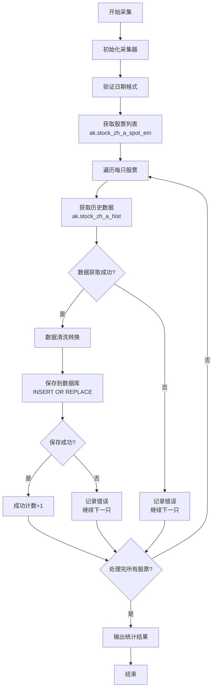
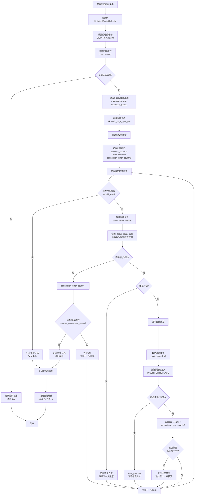
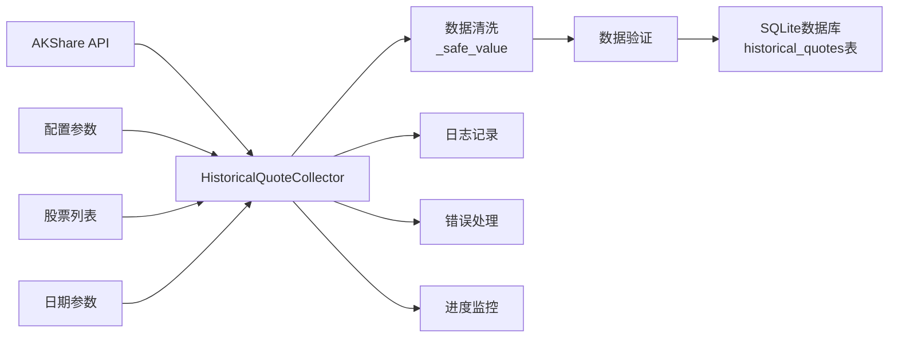
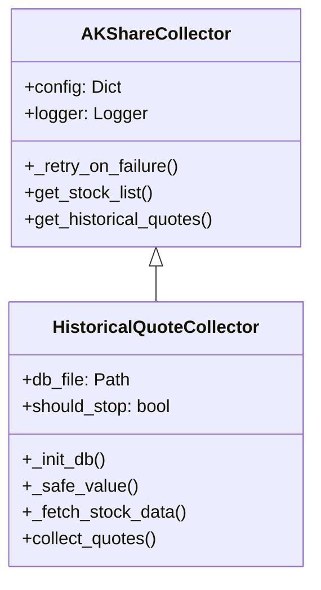
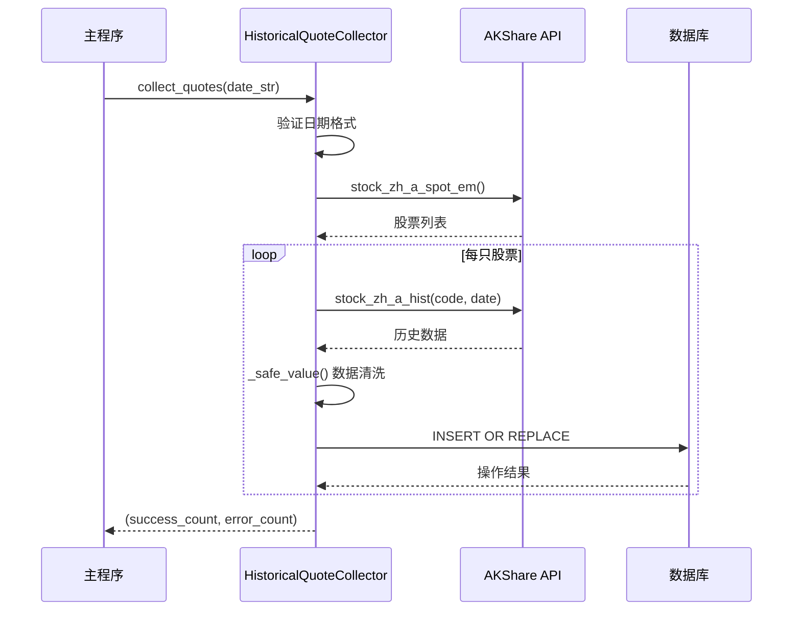
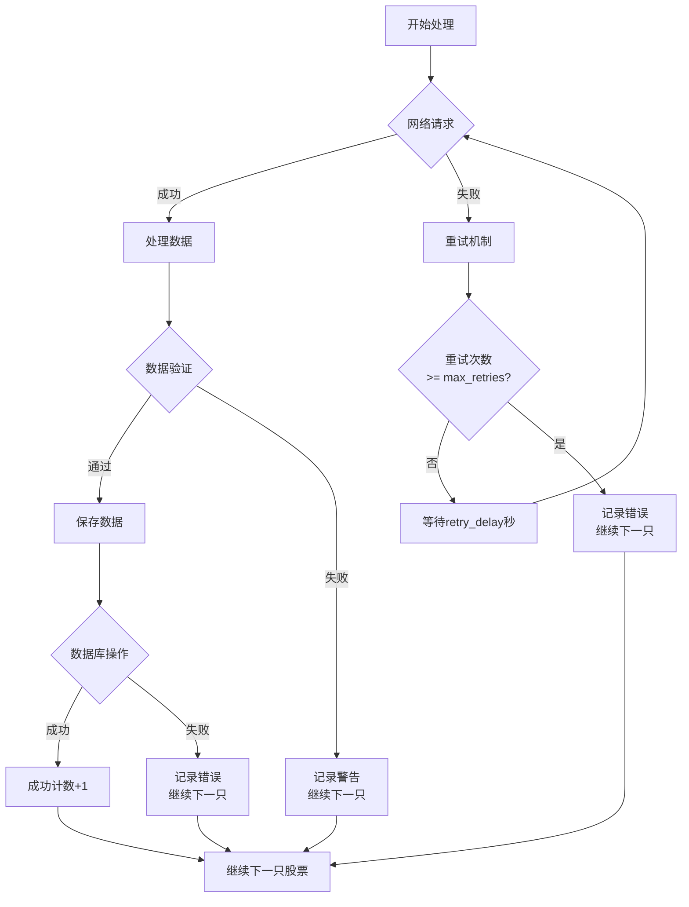
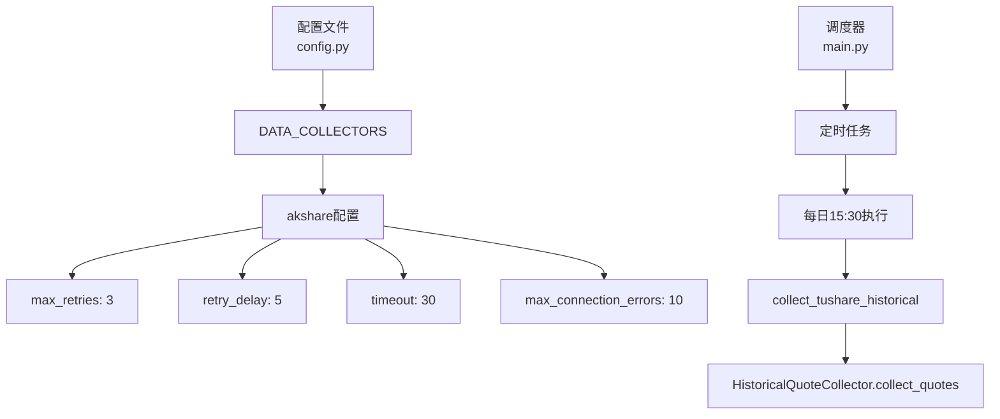

# AKShare HistoricalQuoteCollector 历史数据采集流程图

## 概述

AKShare HistoricalQuoteCollector 是一个专门用于采集股票历史行情数据的采集器，它继承自 AKShareCollector 基类，提供了完整的历史数据采集、处理和存储功能。

---

## 流程图

### 核心流程图（简化版）



### 完整流程图（详细版）



### 数据流向图



### 类继承关系



### 关键方法流程（时序图）



### 错误处理流程



---

## 详细流程说明

### 1. 初始化阶段

- **HistoricalQuoteCollector 初始化**: 继承 AKShareCollector 基类，加载配置参数
- **信号处理器设置**: 监听 SIGINT 和 SIGTERM 信号，支持安全中断
- **数据库初始化**: 创建 historical_quotes 表结构

### 2. 数据获取阶段

- **日期验证**: 验证输入日期格式为 YYYYMMDD
- **股票列表获取**: 通过 `ak.stock_zh_a_spot_em()` 获取所有 A 股列表
- **数据采集**: 对每只股票调用 `ak.stock_zh_a_hist()` 获取历史数据

### 3. 数据处理阶段

- **数据清洗**: 通过 `_safe_value()` 方法安全转换数值
- **数据验证**: 检查数据完整性，过滤空数据
- **数据转换**: 将 akshare 返回的中文字段名转换为数据库字段

### 4. 数据存储阶段

- **数据库操作**: 使用 INSERT OR REPLACE 语句避免重复数据
- **事务管理**: 每只股票单独提交，确保数据一致性
- **错误处理**: 记录详细的错误信息和统计

### 5. 监控和日志

- **进度监控**: 每处理 100 只股票记录一次进度
- **错误统计**: 分别统计成功和失败的数量
- **连接错误处理**: 连续连接错误超过阈值时安全退出

---

## 关键特性

### 1. 容错机制

- **重试机制**: 继承基类的 `_retry_on_failure` 方法
- **连接错误处理**: 连续错误超过阈值时退出
- **信号处理**: 支持 Ctrl+C 安全中断

### 2. 数据完整性

- **数据验证**: 验证日期格式和数据有效性
- **重复处理**: 使用 INSERT OR REPLACE 避免重复
- **事务安全**: 单只股票事务提交

### 3. 性能优化

- **批量处理**: 逐只股票处理，避免内存溢出
- **进度监控**: 定期记录处理进度
- **资源管理**: 及时关闭数据库连接

---

## 配置参数

```python
DATA_COLLECTORS = {
    'akshare': {
        'max_retries': 3,              # 最大重试次数
        'retry_delay': 5,              # 重试延迟（秒）
        'timeout': 30,                 # 请求超时时间（秒）
        'log_dir': 'logs',             # 日志目录
        'db_file': 'stock_analysis.db', # 数据库文件路径
        'max_connection_errors': 10    # 最大连接错误次数
    }
}
```

配置与调度关系：



---

## 数据库表结构

```sql
CREATE TABLE historical_quotes (
    code TEXT,                    -- 股票代码
    name TEXT,                    -- 股票名称
    market TEXT,                  -- 市场类型
    date TEXT,                    -- 交易日期
    open REAL,                    -- 开盘价
    high REAL,                    -- 最高价
    low REAL,                     -- 最低价
    close REAL,                   -- 收盘价
    volume REAL,                  -- 成交量
    amount REAL,                  -- 成交额
    change_percent REAL,          -- 涨跌幅
    update_time TIMESTAMP DEFAULT CURRENT_TIMESTAMP, -- 更新时间
    PRIMARY KEY (code, date)      -- 复合主键
);
```

---

## 使用示例

```python
# 创建采集器实例
collector = HistoricalQuoteCollector()

# 采集指定日期的历史数据
success_count, error_count = collector.collect_quotes('20241201')

# 输出结果
print(f"采集完成: 成功 {success_count} 只, 失败 {error_count} 只")
```

---

## 调度集成

该采集器已集成到主调度系统中，支持定时执行：

```python
# 在 main.py 中的调度配置
scheduler.add_job(
    collect_tushare_historical,
    'cron',
    hour=15,
    minute=30,
    id='historical_quotes_collection'
)
```
