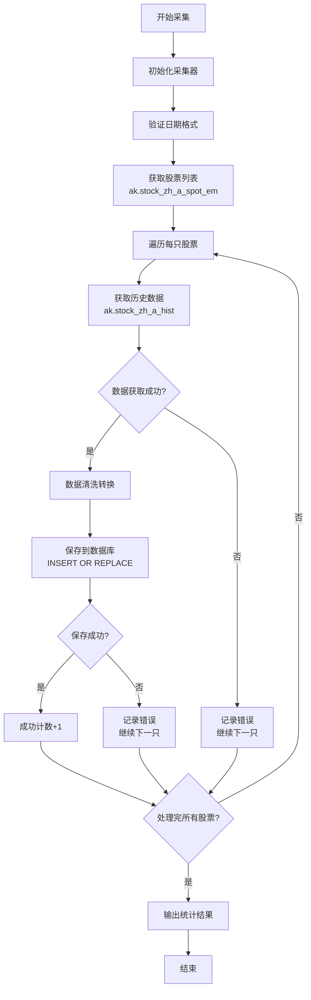
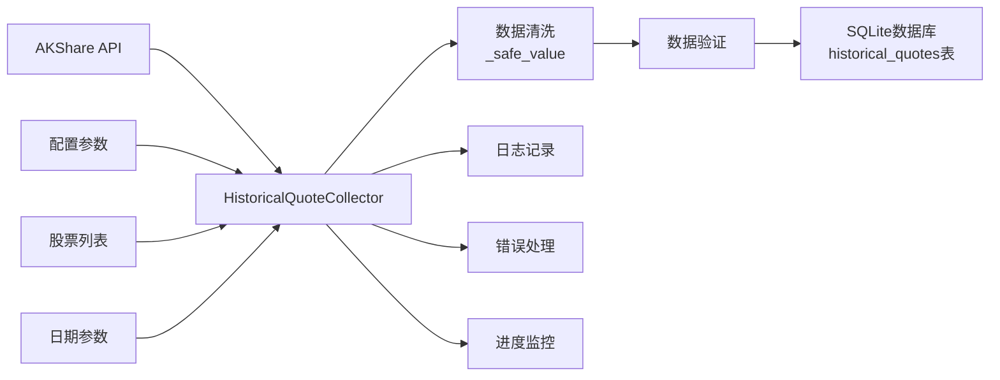
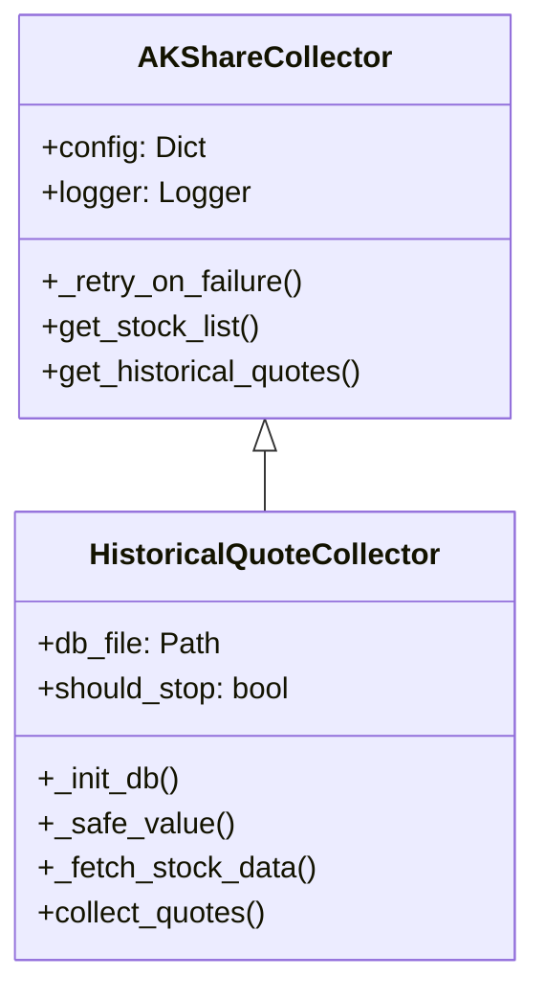
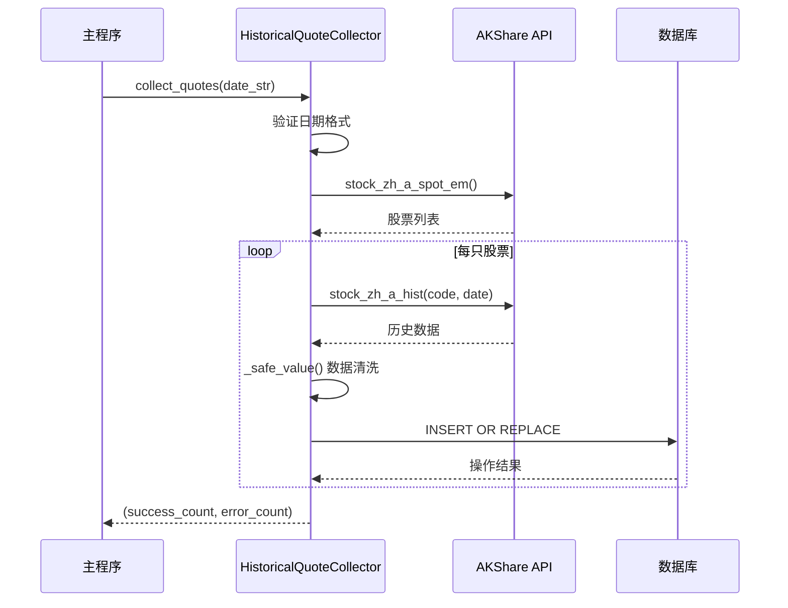
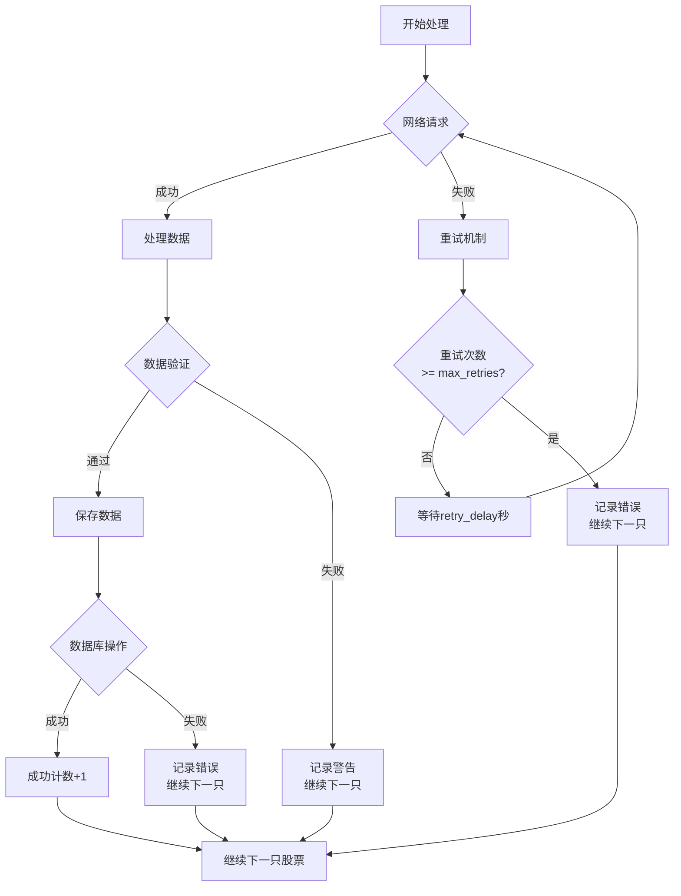
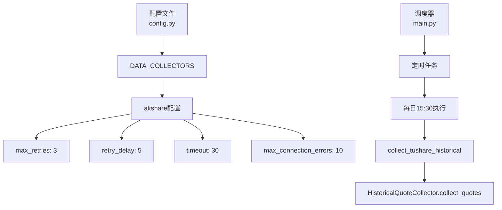

# AKShare HistoricalQuoteCollector 历史数据采集流程图（简化版）

## 核心流程图

```mermaid
flowchart TD
    A[开始采集] --> B[初始化采集器]
    B --> C[验证日期格式]
    C --> D[获取股票列表<br/>ak.stock_zh_a_spot_em]
    D --> E[遍历每只股票]
    E --> F[获取历史数据<br/>ak.stock_zh_a_hist]
    F --> G{数据获取成功?}
    G -->|否| H[记录错误<br/>继续下一只]
    G -->|是| I[数据清洗转换]
    I --> J[保存到数据库<br/>INSERT OR REPLACE]
    J --> K{保存成功?}
    K -->|否| L[记录错误<br/>继续下一只]
    K -->|是| M[成功计数+1]
    M --> N{处理完所有股票?}
    N -->|否| E
    N -->|是| O[输出统计结果]
    L --> N
    H --> N
    O --> P[结束]
```

## 数据流向图

```mermaid
flowchart LR
    A[AKShare API] --> B[HistoricalQuoteCollector]
    B --> C[数据清洗<br/>_safe_value]
    C --> D[数据验证]
    D --> E[SQLite数据库<br/>historical_quotes表]
    
    F[配置参数] --> B
    G[股票列表] --> B
    H[日期参数] --> B
    
    B --> I[日志记录]
    B --> J[错误处理]
    B --> K[进度监控]
```

## 类继承关系

```mermaid
classDiagram
    class AKShareCollector {
        +config: Dict
        +logger: Logger
        +_retry_on_failure()
        +get_stock_list()
        +get_historical_quotes()
    }
    
    class HistoricalQuoteCollector {
        +db_file: Path
        +should_stop: bool
        +_init_db()
        +_safe_value()
        +_fetch_stock_data()
        +collect_quotes()
    }
    
    AKShareCollector <|-- HistoricalQuoteCollector
```

## 关键方法流程

```mermaid
sequenceDiagram
    participant Main as 主程序
    participant Collector as HistoricalQuoteCollector
    participant AKShare as AKShare API
    participant DB as 数据库
    
    Main->>Collector: collect_quotes(date_str)
    Collector->>Collector: 验证日期格式
    Collector->>AKShare: stock_zh_a_spot_em()
    AKShare-->>Collector: 股票列表
    loop 每只股票
        Collector->>AKShare: stock_zh_a_hist(code, date)
        AKShare-->>Collector: 历史数据
        Collector->>Collector: _safe_value() 数据清洗
        Collector->>DB: INSERT OR REPLACE
        DB-->>Collector: 操作结果
    end
    Collector-->>Main: (success_count, error_count)
```

## 错误处理流程

```mermaid
flowchart TD
    A[开始处理] --> B{网络请求}
    B -->|成功| C[处理数据]
    B -->|失败| D[重试机制]
    D --> E{重试次数<br/>>= max_retries?}
    E -->|否| F[等待retry_delay秒]
    F --> B
    E -->|是| G[记录错误<br/>继续下一只]
    
    C --> H{数据验证}
    H -->|通过| I[保存数据]
    H -->|失败| J[记录警告<br/>继续下一只]
    
    I --> K{数据库操作}
    K -->|成功| L[成功计数+1]
    K -->|失败| M[记录错误<br/>继续下一只]
    
    L --> N[继续下一只股票]
    G --> N
    J --> N
    M --> N
```

## 配置和调度

```mermaid
flowchart TD
    A[配置文件<br/>config.py] --> B[DATA_COLLECTORS]
    B --> C[akshare配置]
    C --> D[max_retries: 3]
    C --> E[retry_delay: 5]
    C --> F[timeout: 30]
    C --> G[max_connection_errors: 10]
    
    H[调度器<br/>main.py] --> I[定时任务]
    I --> J[每日15:30执行]
    J --> K[collect_tushare_historical]
    K --> L[HistoricalQuoteCollector.collect_quotes]
``` 