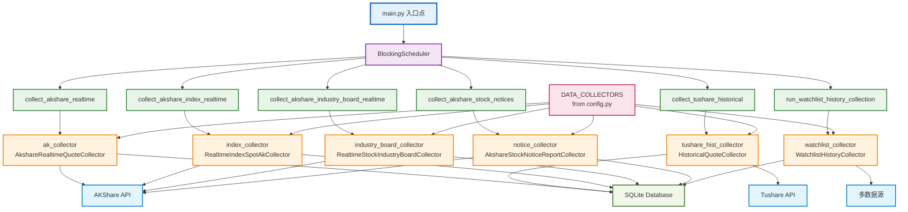
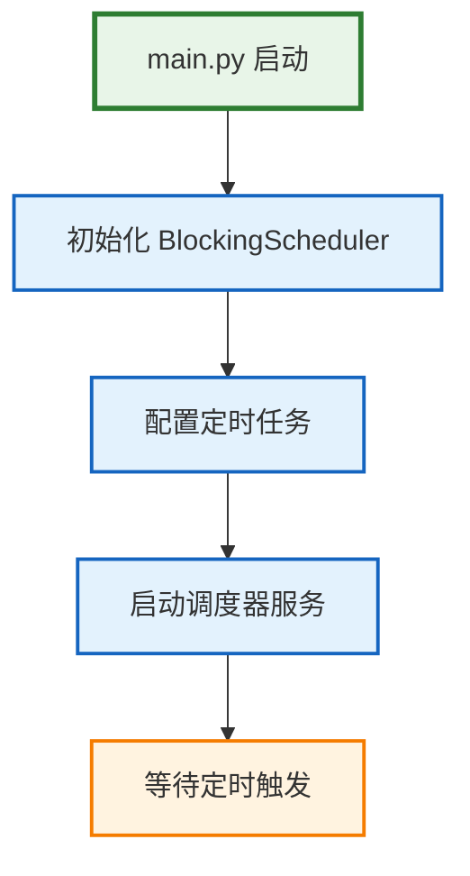
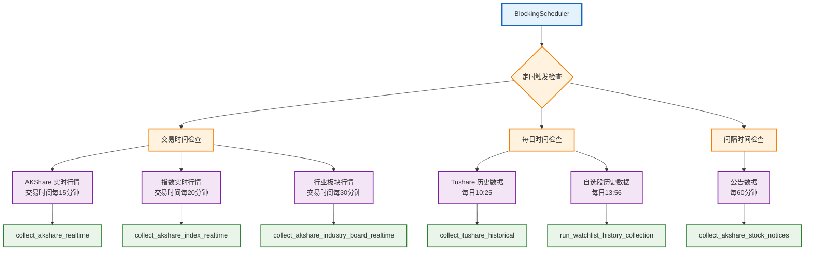
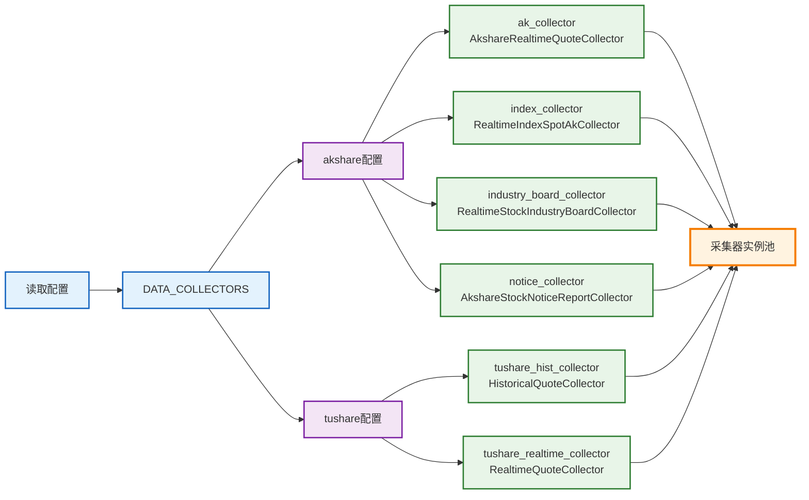
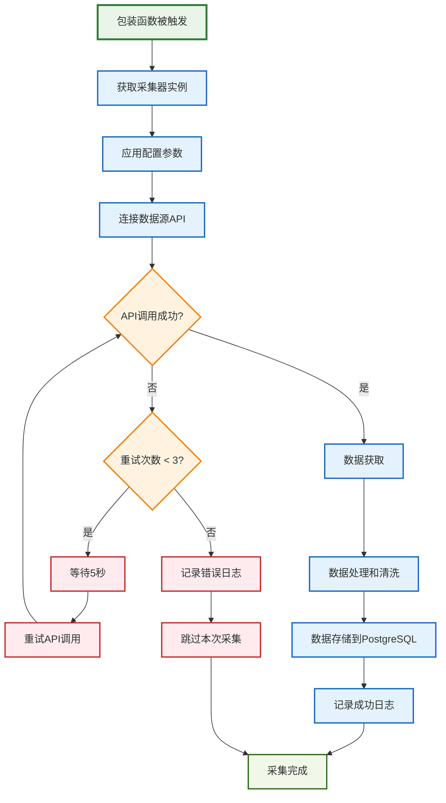
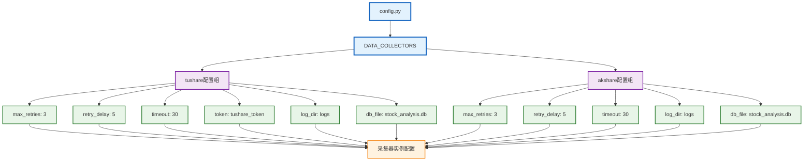
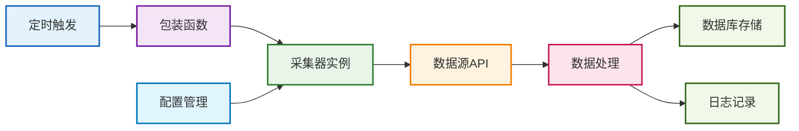

# 核心数据采集编排组件图

## 简化架构图

## 核心编排逻辑

### 1. 系统启动流程

### 2. 定时任务调度逻辑

### 3. 采集器实例初始化流程

### 4. 数据采集执行流程

### 5. 配置管理架构

## 定时任务配置

| 任务名称 | 调度策略 | 包装函数 | 采集器实例 |
|---------|---------|---------|-----------|
| AKShare 实时行情 | 交易时间每15分钟 | `collect_akshare_realtime()` | `ak_collector` |
| Tushare 历史数据 | 每日10:25 | `collect_tushare_historical()` | `tushare_hist_collector` |
| 指数实时行情 | 交易时间每20分钟 | `collect_akshare_index_realtime()` | `index_collector` |
| 行业板块行情 | 交易时间每30分钟 | `collect_akshare_industry_board_realtime()` | `industry_board_collector` |
| 公告数据 | 每60分钟 | `collect_akshare_stock_notices()` | `notice_collector` |
| 自选股历史数据 | 每日13:56 | `run_watchlist_history_collection()` | `watchlist_collector` |

## 数据流图

## 关键组件说明

### 编排层组件
- **main.py**: 系统入口点，负责初始化和启动
- **BlockingScheduler**: 核心调度器，管理所有定时任务

### 包装函数层
- **collect_akshare_realtime()**: AKShare实时行情采集
- **collect_tushare_historical()**: Tushare历史数据采集
- **collect_akshare_index_realtime()**: 指数实时行情采集
- **collect_akshare_industry_board_realtime()**: 行业板块行情采集
- **collect_akshare_stock_notices()**: 公告数据采集
- **run_watchlist_history_collection()**: 自选股历史数据采集

### 采集器实例层
- **ak_collector**: AKShare实时行情采集器
- **tushare_hist_collector**: Tushare历史数据采集器
- **index_collector**: 指数实时行情采集器
- **industry_board_collector**: 行业板块行情采集器
- **notice_collector**: 公告数据采集器
- **watchlist_collector**: 自选股历史数据采集器

### 配置层
- **DATA_COLLECTORS**: 统一配置管理，影响所有采集器实例

## 扩展性设计

### 新增采集任务流程
1. 创建新的采集器类
2. 在main.py中初始化采集器实例
3. 创建对应的包装函数
4. 在调度器中添加定时任务配置

### 配置管理优势
- 统一的配置接口
- 支持不同数据源的独立配置
- 灵活的调度策略配置
- 易于维护和扩展 