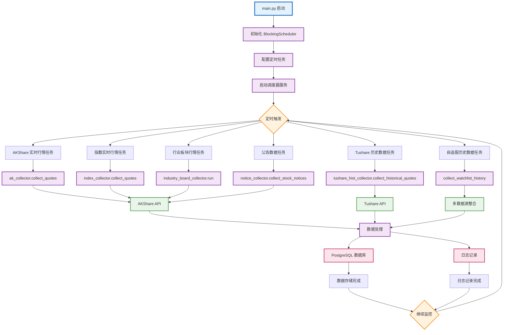
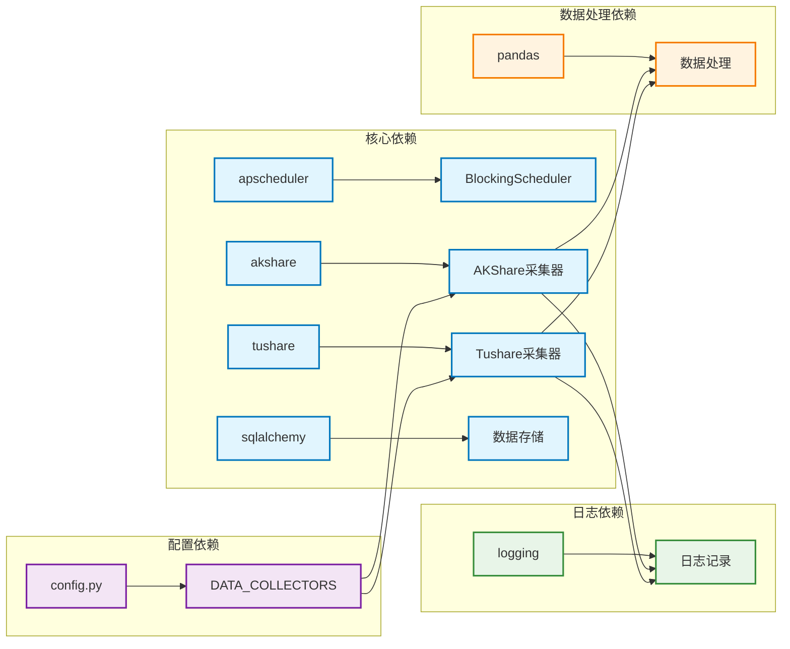
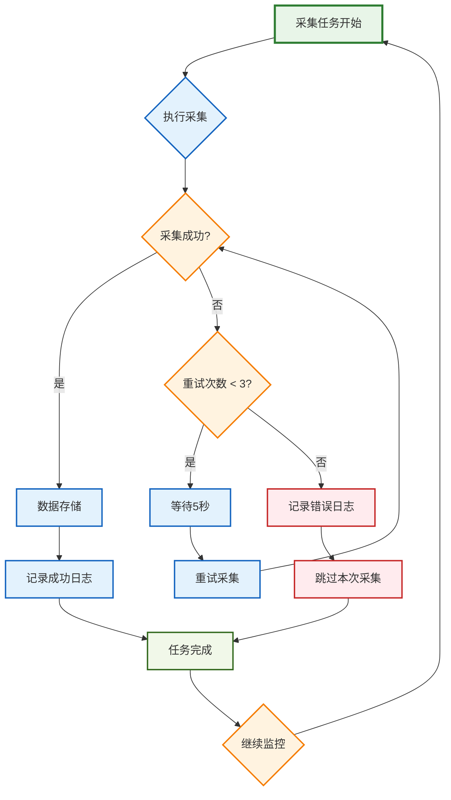

# 核心数据采集编排组件图

## 系统架构图

```mermaid
graph TB
    %% 编排层
    subgraph "编排层 (Orchestration Layer)"
        A[main.py 入口点] --> B[BlockingScheduler 调度器]
    end
    
    %% 包装函数层
    subgraph "包装函数层 (Wrapper Functions)"
        C1[collect_akshare_realtime]
        C2[collect_tushare_historical]
        C3[collect_akshare_index_realtime]
        C4[collect_akshare_industry_board_realtime]
        C5[collect_akshare_stock_notices]
        C6[run_watchlist_history_collection]
        C7[collect_tushare_realtime]
    end
    
    %% 采集器实例层
    subgraph "采集器实例层 (Collector Instances)"
        subgraph "AKShare 采集器"
            D1[ak_collector<br/>AkshareRealtimeQuoteCollector]
            D2[index_collector<br/>RealtimeIndexSpotAkCollector]
            D3[industry_board_collector<br/>RealtimeStockIndustryBoardCollector]
            D4[notice_collector<br/>AkshareStockNoticeReportCollector]
        end
        
        subgraph "Tushare 采集器"
            D5[tushare_hist_collector<br/>HistoricalQuoteCollector]
            D6[tushare_realtime_collector<br/>RealtimeQuoteCollector]
        end
        
        subgraph "自选股采集器"
            D7[watchlist_collector<br/>WatchlistHistoryCollector]
        end
    end
    
    %% 配置层
    subgraph "配置层 (Configuration)"
        E[DATA_COLLECTORS<br/>from config.py]
    end
    
    %% 数据源
    subgraph "数据源 (Data Sources)"
        F1[AKShare API]
        F2[Tushare API]
        F3[自选股数据源]
    end
    
    %% 数据存储
    subgraph "数据存储 (Data Storage)"
        G1[SQLite Database<br/>stock_analysis.db]
        G2[日志文件<br/>backend_core/logs/]
    end
    
    %% 连接关系
    B --> C1
    B --> C2
    B --> C3
    B --> C4
    B --> C5
    B --> C6
    B --> C7
    
    C1 --> D1
    C2 --> D5
    C3 --> D2
    C4 --> D3
    C5 --> D4
    C6 --> D7
    C7 --> D6
    
    E --> D1
    E --> D2
    E --> D3
    E --> D4
    E --> D5
    E --> D6
    E --> D7
    
    D1 --> F1
    D2 --> F1
    D3 --> F1
    D4 --> F1
    D5 --> F2
    D6 --> F2
    D7 --> F3
    
    D1 --> G1
    D2 --> G1
    D3 --> G1
    D4 --> G1
    D5 --> G1
    D6 --> G1
    D7 --> G1
    
    D1 --> G2
    D2 --> G2
    D3 --> G2
    D4 --> G2
    D5 --> G2
    D6 --> G2
    D7 --> G2
    
    %% 样式
    classDef orchestration fill:#e1f5fe,stroke:#01579b,stroke-width:2px
    classDef wrapper fill:#f3e5f5,stroke:#4a148c,stroke-width:2px
    classDef collector fill:#e8f5e8,stroke:#1b5e20,stroke-width:2px
    classDef config fill:#fff3e0,stroke:#e65100,stroke-width:2px
    classDef datasource fill:#fce4ec,stroke:#880e4f,stroke-width:2px
    classDef storage fill:#f1f8e9,stroke:#33691e,stroke-width:2px
    
    class A,B orchestration
    class C1,C2,C3,C4,C5,C6,C7 wrapper
    class D1,D2,D3,D4,D5,D6,D7 collector
    class E config
    class F1,F2,F3 datasource
    class G1,G2 storage
```

## 数据流向图

```mermaid
flowchart TD
    A[main.py 启动] --> B[初始化 BlockingScheduler]
    B --> C[配置定时任务]
    C --> D[启动调度器服务]
    
    D --> E{定时触发}
    E --> F1[AKShare 实时行情任务]
    E --> F2[Tushare 历史数据任务]
    E --> F3[指数实时行情任务]
    E --> F4[行业板块行情任务]
    E --> F5[公告数据任务]
    E --> F6[自选股历史数据任务]
    
    F1 --> G1[ak_collector.collect_quotes]
    F2 --> G2[tushare_hist_collector.collect_historical_quotes]
    F3 --> G3[index_collector.collect_quotes]
    F4 --> G4[industry_board_collector.run]
    F5 --> G5[notice_collector.collect_stock_notices]
    F6 --> G6[collect_watchlist_history]
    
    G1 --> H1[AKShare API]
    G2 --> H2[Tushare API]
    G3 --> H1
    G4 --> H1
    G5 --> H1
    G6 --> H3[多数据源整合]
    
    H1 --> I1[数据处理]
    H2 --> I1
    H3 --> I1
    
    I1 --> J1[PostgreSQL 数据库]
    I1 --> J2[日志记录]
    
    J1 --> K[数据存储完成]
    J2 --> L[日志记录完成]
    
    K --> M{继续监控}
    L --> M
    M --> E
    
    classDef start fill:#e3f2fd,stroke:#1565c0,stroke-width:3px
    classDef process fill:#f3e5f5,stroke:#7b1fa2,stroke-width:2px
    classDef decision fill:#fff3e0,stroke:#f57c00,stroke-width:2px
    classDef api fill:#e8f5e8,stroke:#388e3c,stroke-width:2px
    classDef storage fill:#fce4ec,stroke:#c2185b,stroke-width:2px
    
    class A start
    class B,C,D,G1,G2,G3,G4,G5,G6,I1 process
    class E,M decision
    class H1,H2,H3 api
    class J1,J2 storage
```

## 定时任务调度图

```mermaid
gantt
    title 数据采集定时任务调度表
    dateFormat  HH:mm
    axisFormat %H:%M
    
    section AKShare 实时行情
    AKShare实时行情     :09:00, 15:30, 15min
    
    section 指数实时行情
    指数实时行情       :09:00, 16:00, 20min
    
    section 行业板块行情
    行业板块行情       :09:00, 17:00, 30min
    
    section Tushare 历史数据
    Tushare历史数据     :10:25, 10:25, 1d
    
    section 自选股历史数据
    自选股历史数据     :13:56, 13:56, 1d
    
    section 公告数据
    公告数据          :00:00, 23:59, 60min
```

## 组件依赖关系图

```mermaid
graph LR
    subgraph "核心依赖"
        A[apscheduler] --> B[BlockingScheduler]
        C[akshare] --> D[AKShare采集器]
        E[tushare] --> F[Tushare采集器]
        G[sqlalchemy] --> H[数据存储]
    end
    
    subgraph "配置依赖"
        I[config.py] --> J[DATA_COLLECTORS]
        J --> D
        J --> F
    end
    
    subgraph "日志依赖"
        K[logging] --> L[日志记录]
        D --> L
        F --> L
    end
    
    subgraph "数据处理依赖"
        M[pandas] --> N[数据处理]
        D --> N
        F --> N
    end
    
    classDef core fill:#e1f5fe,stroke:#0277bd,stroke-width:2px
    classDef config fill:#f3e5f5,stroke:#7b1fa2,stroke-width:2px
    classDef log fill:#e8f5e8,stroke:#388e3c,stroke-width:2px
    classDef data fill:#fff3e0,stroke:#f57c00,stroke-width:2px
    
    class A,B,C,D,E,F,G,H core
    class I,J config
    class K,L log
    class M,N data
```

## 错误处理流程图

```mermaid
flowchart TD
    A[采集任务开始] --> B{执行采集}
    B --> C{采集成功?}
    C -->|是| D[数据存储]
    C -->|否| E{重试次数 < 3?}
    
    E -->|是| F[等待5秒]
    F --> G[重试采集]
    G --> C
    
    E -->|否| H[记录错误日志]
    H --> I[跳过本次采集]
    
    D --> J[记录成功日志]
    J --> K[任务完成]
    I --> K
    
    K --> L{继续监控}
    L --> A
    
    classDef start fill:#e8f5e8,stroke:#2e7d32,stroke-width:3px
    classDef process fill:#e3f2fd,stroke:#1565c0,stroke-width:2px
    classDef decision fill:#fff3e0,stroke:#f57c00,stroke-width:2px
    classDef error fill:#ffebee,stroke:#c62828,stroke-width:2px
    classDef success fill:#f1f8e9,stroke:#33691e,stroke-width:2px
    
    class A start
    class B,D,F,G,J process
    class C,E,L decision
    class H,I error
    class K success
``` 