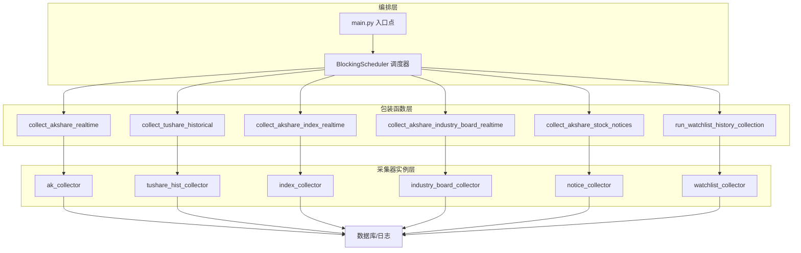
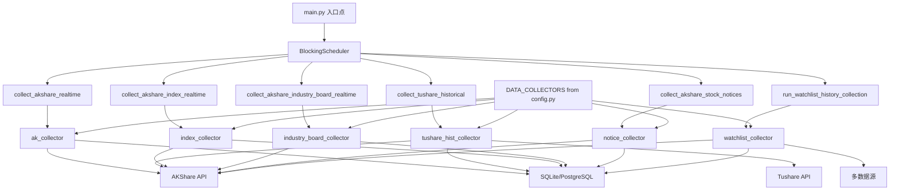
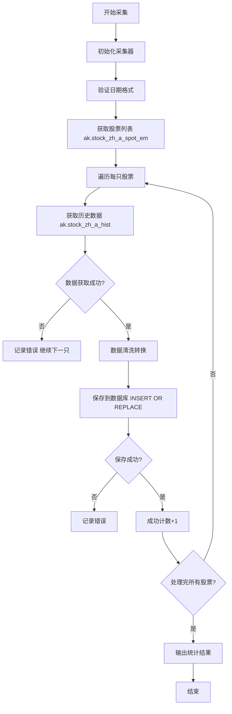

# 股票分析系统设计文档（合并版）

本文档由以下原设计文档合并而成，便于统一查阅与维护：
- 多周期行情数据采集系统设计文档
- 多指标综合交易策略设计文档
- 智能分析模块逻辑一致性修复设计文档
- 港股处理设计文档
- 股票搜索功能设计文档
- 选股频道实现设计文档
- 数据采集架构与组件图
- SYSTEM_DESIGN_V2
- core_orchestration_diagram
- design（股票分析系统设计）
- akshare_historical_quote_collector_flow

---

## 目录

1. [系统架构总览](#1-系统架构总览)
2. [数据采集架构与组件](#2-数据采集架构与组件)
3. [核心数据采集编排](#3-核心数据采集编排)
4. [AKShare 历史行情采集流程](#4-akshare-历史行情采集流程)
5. [多周期行情数据采集](#5-多周期行情数据采集)
6. [港股处理设计](#6-港股处理设计)
7. [选股频道与策略](#7-选股频道与策略)
8. [多指标综合交易策略](#8-多指标综合交易策略)
9. [智能分析模块逻辑一致性](#9-智能分析模块逻辑一致性)
10. [股票搜索功能](#10-股票搜索功能)
11. [功能模块与数据库设计](#11-功能模块与数据库设计)
12. [API、前端与部署](#12-api前端与部署)

---

## 1. 系统架构总览

### 1.1 项目简介

股票分析系统是一个基于 Web 的股票数据分析和投资决策辅助平台，为个人投资者提供实时行情、历史数据、技术分析、智能预测等功能。系统采用前后端分离架构，支持多数据源集成。

### 1.2 系统定位

- **目标用户**: 个人投资者、股票分析师
- **应用场景**: 股票市场分析、投资决策辅助、技术指标计算
- **核心价值**: 提供专业、准确、实时的股票数据分析服务

### 1.3 系统模块划分

- **backend_core（底座/核心层）**：数据采集、清洗、计算、定时任务调度；基于 AKShare 和 TuShare 的采集器，负责 A 股和港股的实时与历史数据（日、周、月、季、年）的同步。
- **backend_api（接口层）**：提供 RESTful API，处理业务逻辑（选股策略、指标计算评分、交易记录、自选股管理等）；基于 FastAPI + SQLAlchemy。
- **frontend（展示层）**：行情展示、个股分析、选股筛选、自选股监控、模拟交易等；原生 JS + HTML5 + CSS3 + ECharts。
- **admin（管理后台）**：系统监控、数据采集触发、用户管理、指标统计；Vue 3 + TypeScript + Vite + TailwindCSS + Element Plus。

### 1.4 整体架构图

```
┌─────────────────┐    ┌─────────────────┐    ┌─────────────────┐
│   前端层        │    │   后端API层     │    │   数据采集层    │
│ • HTML/CSS/JS   │◄──►│ • FastAPI       │◄──►│ • akshare       │
│ • ECharts       │    │ • SQLAlchemy    │    │ • tushare       │
└─────────────────┘    └─────────────────┘    └─────────────────┘
                                │
                                ▼
                       ┌─────────────────┐
                       │   数据存储层    │
                       │ • PostgreSQL    │
                       │ • Redis缓存     │
                       └─────────────────┘
```

```
[ 用户端 ] <---> [ backend_api (FastAPI) ] <---> [ SQLite/PostgreSQL ]
                               ^                     ^
                               |                     |
[ 管理端 ] <---> [ backend_api (FastAPI) ] <---> [ backend_core (数据处理) ]
                                                     |
                                            [ AKShare / TuShare API ]
```

### 1.5 技术栈

- **前端**: HTML5 + CSS3 + JavaScript + ECharts
- **后端**: FastAPI + SQLAlchemy + PostgreSQL
- **数据源**: akshare + tushare
- **部署**: Docker + Nginx

---

## 2. 数据采集架构与组件

### 2.1 核心组件层次结构

#### 编排层 (Orchestration Layer)

- **main.py 入口点**：系统启动入口，初始化 BlockingScheduler 和配置
- **BlockingScheduler**：核心调度组件，定时触发数据采集任务（基于 APScheduler）

**调度策略**：
- 实时行情：交易时间每 15 分钟
- 历史数据：每日收盘后
- 指数数据：每 20 分钟
- 行业板块：每 30 分钟
- 公告数据：每 60 分钟

#### 包装函数层 (Wrapper Functions Layer)

- `collect_akshare_realtime()`：AKShare 实时行情
- `collect_akshare_index_realtime()`：指数实时行情
- `collect_akshare_industry_board_realtime()`：行业板块实时行情
- `collect_tushare_historical()`：Tushare 历史行情
- `run_watchlist_history_collection()`：自选股历史行情
- `collect_akshare_stock_notices()`：A股公告数据

#### 采集器实例层 (Collector Instances Layer)

**AKShare**：AkshareRealtimeQuoteCollector、RealtimeIndexSpotAkCollector、RealtimeStockIndustryBoardCollector、AkshareStockNoticeReportCollector  
**Tushare**：HistoricalQuoteCollector、RealtimeQuoteCollector  
**自选股**：WatchlistHistoryCollector

#### 配置层 (Configuration Layer)

```python
DATA_COLLECTORS = {
    'tushare': {
        'max_retries': 3, 'retry_delay': 5, 'timeout': 30,
        'log_dir': 'logs', 'db_file': 'stock_analysis.db',
        'max_connection_errors': 10, 'token': 'tushare_token'
    },
    'akshare': {
        'max_retries': 3, 'retry_delay': 5, 'timeout': 30,
        'log_dir': 'logs', 'db_file': 'stock_analysis.db',
        'max_connection_errors': 10
    }
}
```

### 2.2 系统架构图（Mermaid）



### 2.3 定时任务配置

| 任务名称           | 调度策略           | 包装函数                          |
|--------------------|--------------------|-----------------------------------|
| AKShare 实时行情   | 交易时间每15分钟   | collect_akshare_realtime()        |
| Tushare 历史数据   | 每日 10:25         | collect_tushare_historical()       |
| 指数实时行情       | 交易时间每20分钟   | collect_akshare_index_realtime()  |
| 行业板块行情       | 交易时间每30分钟   | collect_akshare_industry_board_realtime() |
| 公告数据           | 每60分钟           | collect_akshare_stock_notices()    |
| 自选股历史数据     | 每日 13:56         | run_watchlist_history_collection() |

### 2.4 错误处理与重试

- 最大重试次数：3 次；重试延迟：5 秒；请求超时：30 秒
- 每个包装函数包含 try-except，详细日志，优雅恢复

---

## 3. 核心数据采集编排

### 3.1 简化架构图



### 3.2 系统启动与数据采集执行流程

1. main.py 启动 → 初始化 BlockingScheduler → 配置定时任务 → 启动调度器 → 等待定时触发
2. 包装函数被触发 → 获取采集器实例 → 应用配置 → 连接数据源 API → 成功则获取数据、清洗、入库；失败则重试（最多 3 次）或记录错误跳过

### 3.3 扩展性

- 新增采集任务：创建采集器类 → 在 main.py 初始化实例 → 编写包装函数 → 在调度器中添加定时任务

---

## 4. AKShare 历史行情采集流程

### 4.1 概述

HistoricalQuoteCollector 继承 AKShareCollector，负责 A 股历史行情采集、清洗与入库。

### 4.2 核心流程（简化）



### 4.3 数据流向与类关系

- 数据流向：AKShare API → HistoricalQuoteCollector → 数据清洗(_safe_value) → 数据验证 → historical_quotes 表
- 类继承：AKShareCollector ← HistoricalQuoteCollector

### 4.4 数据库表结构（historical_quotes）

- code, name, market, date, open, high, low, close, volume, amount, change_percent, update_time；PRIMARY KEY (code, date)

### 4.5 配置与调度

- 配置来自 DATA_COLLECTORS['akshare']：max_retries、retry_delay、timeout、max_connection_errors 等
- 调度：如每日 15:30 执行 collect_tushare_historical → HistoricalQuoteCollector.collect_quotes

---

## 5. 多周期行情数据采集

### 5.1 系统概述

为股票分析系统提供多周期（周、月、季、半年、年）K 线数据，覆盖 A 股和港股。周线由日线聚合；月线由周线累加；季线由月线累加；半年线由季线累加；年线由半年线累加。逐级累加保证数据一致并减少单次读取量。

### 5.2 核心设计理念

- **逐级累加**：不依赖外部 API 直接拉长周期，来源一致
- **独立存储**：每周期、每市场独立表，便于查询与管理
- **定时增量更新**：每日/每周自动更新，支持增量
- **统一架构**：A 股与港股相同架构与代码模式

### 5.3 数据流程

- A股：historical_quotes → weekly_quotes → monthly_quotes → quarterly_quotes → semiannual_quotes → annual_quotes
- 港股：historical_quotes_hk → hk_weekly_quotes → hk_monthly_quotes → hk_quarterly_quotes → hk_semiannual_quotes → hk_annual_quotes

### 5.4 周期表字段（通用）

code, date, open, high, low, close, volume, amount, change_percent, change, amplitude, turnover_rate(可选), collected_source, collected_date

### 5.5 聚合逻辑 (Resampling)

- 周线：日线表，resample('W-FRI')
- 月线：周线表，resample('ME')
- 季线：月线表，按自然季末日（03-31 / 06-30 / 09-30 / 12-31）聚合
- 半年线：季线表，按自然半年末日（06-30 / 12-31）聚合（避免 pandas `6ME` 锚点漂移）
- 年线：半年线表，按自然年末日（12-31）聚合

聚合规则：open=first, high=max, low=min, close=last, volume=sum, amount=sum

开关（`.env`，A股+港股共用，默认 true）：`ENABLE_QUARTERLY_COLLECTION` / `ENABLE_SEMIANNUAL_COLLECTION` / `ENABLE_ANNUAL_COLLECTION`  
开启后任务仍按日 cron 触发，但**仅在对应周期最后一个交易日真正生成**（自然期末 03-31 / 06-30 / 09-30 / 12-31；若期末为周末或 `trading_calendar` 节假日，则提前到期末前最后一个交易日）。

### 5.6 定时任务（APScheduler，main.py）

**A股**：周线 18:00、月线 18:30、季线 19:00、半年线 19:10、年线 19:20  
**港股**：周线 18:10、月线 18:40、季线 19:05、半年线 19:15、年线 19:30  
（季/半年/年线：到点仅做周期末日判定，非末日直接跳过）

### 5.7 代码位置

- A股：backend_core/data_collectors/akshare/ 下 weekly_collector、monthly_collector、quarterly_collector、semiannual_collector、annual_collector
- 港股：hk_weekly_collector、hk_monthly_collector、hk_quarterly_collector、hk_semiannual_collector、hk_annual_collector

---

## 6. 港股处理设计

### 6.1 数据采集端 (backend_core)

#### 实时行情

- **类**：HKRealtimeQuoteCollector（backend_core/data_collectors/akshare/hk_realtime.py）
- **数据源**：ak.stock_hk_spot，备用 ak.stock_hk_spot_em
- **频率**：工作日 9:05-16:35，每 30 分钟
- **表**：stock_realtime_quote_hk、stock_basic_info_hk

#### 历史行情

- **批量**：HKHistoricalQuoteCollector（hk_historical.py），从 stock_realtime_quote_hk 同步到 historical_quotes_hk
- **自选股**：watchlist_history_collector 中 is_hk_stock()、insert_historical_quotes_hk()、collect_watchlist_history()；港股用 ak.stock_hk_hist，A 股用 ak.stock_zh_a_hist

#### 港股历史采集后指标计算开关（新增）

- **配置项**：`.env` 中 `HK_HISTORICAL_INDICATOR_MODE`
- **取值**：
  - `watchlist`：仅计算自选港股在目标交易日的指标，包含 `MA/MAVOL/PVFRS(GMS)/KDJ/BOLL/MACD/RSI`
  - `full`：计算当次采集成功的全部港股在目标交易日的 `MA/MAVOL/PVFRS(GMS)`，暂不计算 `KDJ/BOLL/MACD/RSI`
- **默认值**：`watchlist`
- **生效位置**：`backend_core/data_collectors/akshare/hk_historical.py`

### 6.2 后端 API (backend_api)

- **POST /api/stock/quote**：优先 A 股表，无则港股表，再实时 API，再最近记录
- **GET /api/stock/hk_quote_board_list**：港股排行（rise/fall/volume/turnover_rate、分页、keyword）
- **GET /api/stock/list**：先 StockBasicInfo，不足再 StockBasicInfoHK，再 StockRealtimeQuoteHK，去重
- **GET /api/watchlist**：按代码先查 A 股实时表，无则港股实时表，字段统一映射（如 change_amount）
- **GET /api/stock/history**：先 historical_quotes，total==0 再 historical_quotes_hk；支持换手率按需从 akshare 补充（A 股/港股分别接口）
- **涨跌计算接口**：先 A 股表，无数据再港股表，更新对应表

### 6.3 前端 (frontend)

- **markets.html**：A 股 Tab + 港股 Tab；港股指数可为模拟数据；港股排行调用 hk_quote_board_list；搜索为表格内高亮而非跳转详情

### 6.4 设计原则

- 数据源优先级：A 股优先，港股补充
- 字段映射：change_amount → change 等统一
- 日期格式：统一 YYYY-MM-DD
- 换手率：按需补充，失败不影响主查询

### 6.5 相关文件

- 采集：hk_realtime.py、hk_historical.py、watchlist_history_collector.py、main.py
- API：models.py、stock_manage.py、hk_stock_manage.py、history_api.py、watchlist_manage.py
- 前端：markets.html、markets.js、hk_markets.js、markets.css

---

## 7. 选股频道与策略

### 7.1 需求概述

新增「选股」频道（位于行情后），实现创业板中线选股策略：创业板（代码 3 开头）、最近 3–4 个月历史数据、多条件技术形态筛选。

### 7.2 策略条件（概要）

1. **起始一个涨停**：当前涨停前 3–4 个月无其他涨停（涨幅≥9.8%）
2. **第一次回调不跌穿涨停底部**：回调最低价不低于涨停日 low
3. **第二次上涨突破第一个涨停高点**：最高价 > 涨停日 high
4. **跳空揉搓**：涨停与突破之间至少一个向上跳空 + 一个揉搓线（实体小、上下影线长）
5. **均线多头排列**：当前 MA5 > MA10 > MA20

### 7.3 系统架构与数据流

- 前端：screening.html、screening.css、screening.js → 调用 GET /api/screening/cyb-midline-strategy?months=4
- 后端：stock_screening_routes.py、stock_screening.py → 查 stock_basic_info（创业板）、historical_quotes（注意 date 为 text，用字符串比较）

### 7.4 核心算法要点

- 历史数据按日期倒序；涨停查找、回调不破底、突破、跳空揉搓、均线排列均有独立方法（如 find_first_limit_up、check_pullback_not_break_bottom、check_breakthrough、check_gap_and_doji、check_ma_alignment）
- 数据库事务错误时在单股异常处理中 db.rollback()；日期用 'YYYY-MM-DD' 字符串

### 7.5 API 与响应

- **GET /api/screening/cyb-midline-strategy?months=4**
- 响应含 code、name、limit_up_date、limit_up_price、limit_up_low、limit_up_high、breakthrough_date、breakthrough_price、current_price、current_change_percent、ma5/ma10/ma20、gap_dates、doji_dates 等

---

## 8. 多指标综合交易策略

### 8.1 项目目标

基于 MACD、KDJ、RSI、BOLL、PVFRS 五类指标的综合交易策略，含回测框架与风险控制。

### 8.2 技术指标与信号（概要）

- **MACD**：金叉/死叉（DIF、DEA、柱）
- **KDJ**：超卖区金叉、超买区死叉
- **RSI**：超卖反弹、超买回落
- **BOLL**：下轨反弹、上轨回调
- **PVFRS**：乖离与共振，积极/负面共振

### 8.3 买卖规则

- 买入：五类指标中至少 3 个出现买入信号
- 卖出：至少 3 个出现卖出信号
- 风险控制：单笔风险≤2%、亏损≥5% 止损、最大仓位约 90%

### 8.4 系统架构与实现

- backend_core/strategies/multi_indicator_strategy.py、backtest/strategy_backtest.py、strategy_runner.py
- 信号生成：计算 RSI、MACD、KDJ、BOLL、PVFRS，统计 buy_signals/sell_signals，达到阈值生成交易信号
- 回测：加载历史数据 → 生成信号 → 模拟交易 → 绩效指标（总收益率、胜率、夏普、最大回撤、盈利因子）
- 支持 A 股/港股、CSV、示例数据

### 8.5 使用与扩展

- 命令行：strategy_runner.py --mode/--symbol/--start-date/--end-date/--capital/--risk-per-trade/--market-type/--plot/--export-results
- 扩展：新指标通过继承/扩展策略类；不同参数可配置策略变体

---

## 9. 智能分析模块逻辑一致性

### 9.1 问题描述

价格预测显示未来大幅下跌，而交易建议仍为「建议买入」，两模块独立计算导致逻辑矛盾。

### 9.2 设计原则与方案

- **一致性**：价格预测与交易建议需一致
- **优先级**：预测大幅下跌时优先保守建议
- **可解释性**：在建议中说明预测影响
- **向后兼容**：API 不变，仅内部逻辑调整

方案：交易建议生成时接收价格预测结果，按预测涨跌幅调整看多/看空权重；预测跌幅>15% 时强制将「买入」改为「持有」并加入风险提示。

### 9.3 价格预测影响权重（示例）

| 预测涨跌幅 | 调整分数 |
|----------|---------|
| < -15%   | -3 强烈看空 |
| -15% ~ -10% | -2 |
| -10% ~ -5%  | -1 |
| -5% ~ +5%   | 0 中性 |
| +5% ~ +10%  | +1 |
| +10% ~ +15% | +2 |
| > +15%      | +3 强烈看多 |

### 9.4 实现要点

- **TradingRecommendation.generate_recommendation(..., price_prediction=None)**：可选参数，内部根据 change_percent 计算 prediction_adjustment，调整 bullish_count/bearish_count；若预测跌幅>15% 且 action 为 buy，则改为 hold、strength 降低、reasons 前插入预测风险提示
- **StockAnalysisService.get_stock_analysis()**：先得到 price_prediction，再传入 generate_recommendation
- 接口 GET /api/analysis/stock/{stock_code} 响应格式不变，仅内容更一致

### 9.5 测试与边界

- 场景：预测大跌+技术看多 → hold 与警告；预测小跌+技术看多 → 可能 hold 或弱化买入；预测上涨+技术看多 → 维持买入；预测中性 → 不受影响
- 边界：price_prediction 为 None 时按原逻辑；后续可考虑置信度、多周期预测、预测区间

---

## 10. 股票搜索功能

### 10.1 功能概述

在 header 提供全局股票搜索，支持代码/名称模糊查询，选择后跳转股票详情页；登录后预加载股票参数并缓存，提升搜索性能。

### 10.2 需求要点

- 搜索入口：header 搜索按钮 → 搜索模态框
- 搜索：代码或名称模糊查询；优先使用本地缓存（登录后 GET /api/stock/basic-info/all 存 localStorage 'stockBasicInfo'）
- 结果：最多 20 条，支持键盘导航与点击跳转 stock.html?code=xxx&name=xxx

### 10.3 技术设计

- **数据流**：登录成功 → 调用 /api/stock/basic-info/all → 存 localStorage → 搜索时优先本地过滤；无缓存时调用 GET /api/stock/list?query=xxx&limit=20
- **防抖**：输入 300ms 防抖
- **键盘**：Esc 关闭、↑/↓ 导航、Enter 选择

### 10.4 接口

- **GET /api/stock/basic-info/all**：返回全部股票 code、name，用于前端缓存
- **GET /api/stock/list?query=&limit=**：模糊查询（已存在）

### 10.5 UI/UX 与实现

- 模态框：输入框 + 搜索结果列表（最多 20 条）、hover 与键盘高亮
- 跳转：navigateToStock(code, name) → stock.html?code=xxx&name=xxx
- 错误：API 失败时友好提示；缓存不可用可降级或提示重试；空结果提示「未找到相关股票」

---

## 11. 功能模块与数据库设计

### 11.1 功能模块（概要）

- **用户管理**：注册、登录、注销、会话、权限
- **行情数据**：实时/历史、分时/K 线、导出
- **自选股**：增删、分组、监控、提醒
- **智能分析**：技术指标（RSI、MACD、KDJ、布林带）、价格预测、交易建议、关键价位（见第 9 节）
- **数据采集**：实时/历史/定时、质量监控（见第 2、3、4、5、6 节）
- **管理后台**：用户与数据管理、监控、日志

### 11.2 数据模型（核心）

- **用户与管理**：User、Admin、Watchlist、WatchlistGroup
- **行情与基础**：StockBasicInfo、StockBasicInfoHK、QuoteData/StockRealtimeQuote、HistoricalQuotes、HistoricalQuotesHK、指数表等
- **技术指标**：MACDIndicators、KDJIndicators、RSIIndicators、MAIndicators、MAVOLIndicators、BOLLIndicators
- **扩展**：StockNews、StockNoticeReport、StockResearchReport、SimTradeAccount、Position、Order、TradingNotes

### 11.3 数据库架构

- 主库：PostgreSQL（或 SQLite）；缓存：Redis；文件：本地存储
- 核心表：users、stock_realtime_quote、historical_quotes、watchlist、watchlist_groups 等；索引按 code、date、update_time 等常用查询设计

### 11.4 业务流程与规则

- **数据采集**：管理端选择市场/日期/增量全量 → API 调 backend_core 采集类；限流与指数退避重试；清洗后入库
- **选股策略**：见第 7、8 节
- **认证**：JWT；管理端与用户端独立权限与操作日志

---

## 12. API、前端与部署

### 12.1 RESTful API 规范

- HTTP 动词、统一响应格式、标准状态码、版本控制
- 响应示例：`{ "success": true, "data": {...}, "message": "...", "timestamp": "..." }`
- 错误示例：`{ "success": false, "error": { "code": "...", "message": "...", "details": {...} }`
- 认证：JWT，过期与刷新、权限分级

### 12.2 前端结构与组件

- 页面：index、login、stock、watchlist、markets、news、profile 等
- 组件：Header（导航、搜索）、Chart（ECharts）、Table、Modal、Loading
- 响应式：移动端/平板/桌面、触摸支持

### 12.3 部署与安全

- 环境：Linux、Nginx、uvicorn、PostgreSQL、Redis
- 安全：密码 bcrypt、HTTPS、数据库连接加密、JWT、角色权限、限流、审计日志
- 性能：索引与查询优化、连接池、Redis 缓存、前端压缩与懒加载

### 12.4 测试与维护

- 单元测试、集成测试、性能测试
- 运维监控、故障处理、版本与配置管理

---

**文档版本**: 合并版 V1.0  
**最后更新**: 2026-03  
**说明**: 本文档合并自项目内多份设计文档，旧文档已弃用，以本稿为唯一设计文档来源。
