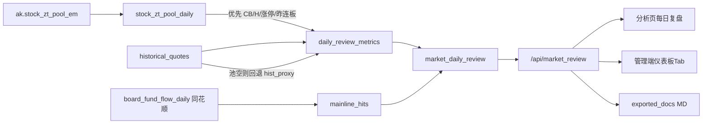

# 每日复盘报告：设计、功能实现与业务说明

本文档说明 A 股短线「每日复盘」能力的业务目标、指标口径、系统架构、实现落点与使用方式。对应实现已落地于分析频道与管理端仪表板。

---

## 一、功能概述

### 1.1 业务目标

日终对全市场情绪与主线做**可复现、可审核**的结构化复盘，输出与游资/短线复盘习惯对齐的六段报告：

1. 观点与盘面分析（可人工改写）
2. 趋势解读（指标对比 + 规则结论）
3. 五项硬门槛达标检查
4. 主线板块统计（近 10 日，同花顺口径）
5. 情绪周期判定（春夏秋冬）
6. 双曲线分析（Lo / Hi / Spread）+ 操作建议

一期**不使用 LLM**，叙述由规则模板生成草稿，人工终审后落库。

### 1.2 产品入口

| 入口 | 路径 | 能力 |
|------|------|------|
| 前台分析页 | `frontend/analysis.html` → Tab「每日复盘」 | 加载 / 重算 / 保存观点建议 / 导出 MD / 导出 PDF |
| 管理端首页 | `admin` 仪表板 `/dashboard` → Tab「每日复盘」 | 同上，并支持「补采涨停池」 |
| 导出归档 | `exported_docs/YYYY年MM月DD日 股市复盘报告.md` / `.pdf` | 与参考复盘 MD 同构；PDF 由服务端 xhtml2pdf 生成 |
| 日终工作流 | 节点 `zt_pool_em_daily` → `market_daily_review` | 自动采池 + 算快照 |

权限：分析页 Tab 复用 `channel.analyze.tab.market`（与「市场分析」同源可见）。

---

## 二、报告结构与业务含义

| 章节 | 性质 | 业务含义 |
|------|------|----------|
| 观点与盘面分析 | 主观 + 草稿 | 综合当日量能、连板、主线与情绪季节，给出「明日如何确认」的文字判断 |
| 一、趋势解读 | 半自动 | 对比昨今日 Vol / CB / H / Lo / Hi / Sp；识别回暖夭折、假高度（孤高）等信号 |
| 二、五项硬门槛 | 全自动 | 是否达到「可进攻」纪律线；全灭通常对应空仓观望 |
| 三、主线板块 | 全自动 | 近 10 日同花顺**概念**反复上榜；当日**行业**作赛道确认 |
| 四、情绪周期 | 全自动 | 冬/秋/春/夏：连板广度、高度、昨连板溢价三维匹配 |
| 五、双曲线 | 全自动 | Lo/Hi 赚钱效应上下沿及 Spread；四象限定位 |
| 六、操作建议 | 半自动 | 按门槛与季节套模板：量能确认、早盘强度、方向跟随、风控 |

---

## 三、核心指标口径（写死入库，避免漂移）

### 3.1 涨停 / 连板（优先官方池）

数据源优先级：

1. **优先**：东方财富涨停股池日表 `stock_zt_pool_daily`（`ak.stock_zt_pool_em`）
2. **回退**：`historical_quotes` 日终涨幅代理（主板 ≥9.8%，创业/科创 ≥19.8%，见 `board_roles.classify`）

| 符号 | 优先口径（池内有数据） | 回退口径（池空或采集失败） |
|------|------------------------|----------------------------|
| 涨停家数 | 池内行数 | 当日 `is_limit_up` 家数（剔 ST） |
| **CB** 连板家数 | `board_count ≥ 2` 家数 | 近窗涨停日序列近似连板 ≥2 的家数 |
| **H** 高度 | `MAX(board_count)` | 全市场最大近似连板天数 |
| 昨连板收益 | 昨日池中连板≥2 的代码，今日涨跌幅均值 | 昨日代理连板集合 × 今日涨幅均值 |

快照字段 `limit_source`：

- `em_zt_pool`：使用东财涨停池
- `hist_proxy`：使用日终涨幅代理

> 说明：东财接口仅支持**近期**交易日；失败不阻断工作流。代理口径无盘中炸板/回封细节，与池口径不完全一致。

### 3.2 量能与双曲线

| 符号 | 定义 | 数据源 |
|------|------|--------|
| **Vol** | 两市 A 股当日 `SUM(amount)` / 1e12（万亿），排除名称含 ST | `historical_quotes` |
| **Hi** | 非 ST 全市场「近 10 交易日累计涨幅%」的最大值 | 收盘价串算 |
| **Lo** | 「低位组」近 10 日累计涨幅%中位数：收盘处于近 60 日高低区间 ≤35% 分位；样本 &lt;30 则退化为全市场近 10 日累计涨幅 **P20** | 同上 |
| **Sp** | `Hi − Lo` | 派生 |
| 百分位 | 该指标在近 79 个交易日（不足则全长）中的经验分位 | `market_daily_review` 历史 |

> Lo 为可计算的「低位赚钱效应」代理，与部分外部复盘文中的专有 Lo 指数可能量级不同，可调 `LO_POS_MAX` / `LO_SAMPLE_MIN` 校准，不改表结构。

### 3.3 五项硬门槛

| # | 门槛 | 标准 |
|---|------|------|
| 1 | 市场总成交量 | Vol ≥ 2.0 万亿 |
| 2 | 连板家数 | CB ≥ 13 |
| 3 | 市场高度 | H ≥ 6 |
| 4 | 十日最低涨幅连续上升 | Lo 近 3 日严格上升 |
| 5 | 十日最高涨幅稳定 | Hi 近 3 日均 ≥ 95 |

另：若高度较昨上升、同时 CB 与 Vol 较昨下降，记「假高度 / 孤高」隐患（不单独改门槛布尔，写入趋势信号）。

### 3.4 情绪周期（春夏秋冬）

优先匹配更「冷」的季节：

| 周期 | 连板 CB | 高度 H | 昨连板收益 |
|------|---------|--------|------------|
| 冬 | &lt;10 | &lt;4 | &lt;0% |
| 秋 | &lt;13 | &lt;6 | （参考实现：CB+高度满足秋区即可判秋） |
| 春 | &lt;18 | &lt;7 | &gt;3% |
| 夏 | 其余偏热 | | |

### 3.5 双曲线四象限

- Lo &lt; 35 且 Hi &lt; 100 → **冬/冰点**
- 其余按 (Lo≥35, Hi≥100) 组合划分为低位修复 / 高位降温 / 夏·活跃
- Sp &lt; 50 → 文案提示「变盘前夜区」

### 3.6 主线板块（同花顺口径）

**概念定主线，行业做确认**；不展示东方财富涨停池「所属行业」及 `ZT:` 伪板块。

| 层级 | 板块类型 | 规则 |
|------|----------|------|
| 主线 | 同花顺**概念** | 计入近 10 日上榜次数；≥3 为核心主线 |
| 确认 | 同花顺**行业** | 仅展示**当日**涨幅/资金流上榜，**不计入**主线次数 |

当日「概念上榜」：满足任一即计 1 次

| 条件 | 来源 |
|------|------|
| 涨幅 Top15 | `board_fund_flow_daily` 且 `board_kind='concept'`、`board_code_source='tonghuashun'` |
| 资金净流入 Top10 | 同上 |

当日「行业赛道确认」：同口径取 `board_kind='industry'`（行业无资金流日表时涨幅榜可兜底 `industry_board_realtime_quotes` 且代码 `88%`）。

近 10 个交易日累计上榜次数（仅概念）：

| 次数 | 定性 |
|------|------|
| ≥5 | ★★★ 核心主线 |
| ≥3 | ★★ 核心主线 |
| 1–2 | 观察 |

梯队：今日首次上榜 → 新面孔；今日仍上榜 → 持续；核心但今日未上 → 休整；等。

列表**不做条数截断、不做框内限高滚动**（前台 / 管理端一致）。`mainline_json.policy = concept_primary`。

---

## 四、系统架构



### 4.1 数据表

迁移脚本：`migrations/add_market_daily_review_tables.py`

1. **`stock_zt_pool_daily`**  
   PK `(code, trade_date)`。字段含涨跌幅、封板时间、炸板次数、`board_count`（连板数，1=首板）、所属行业、`source=em_zt_pool` 等。

2. **`market_daily_review`**  
   PK `trade_date`。存 Vol/CB/H/Lo/Hi/Sp、百分位、`limit_source`、硬门槛 JSON、季节、规则 JSON、主线 JSON、观点/建议正文及是否人工覆盖。

3. **`market_daily_mainline_hits`**  
   PK `(trade_date, board_type, board_code)`。当日同花顺板块上榜命中明细，供近 10 日滚动统计。

### 4.2 核心代码包

| 模块 | 路径 | 职责 |
|------|------|------|
| 涨停池采集 | `backend_core/data_collectors/akshare/zt_pool_em.py` | `collect_zt_pool_em`，失败返回 `success=False` |
| 指标与快照 | `backend_core/market_review/compute.py` | 算指标、主线、upsert 快照 |
| 规则引擎 | `backend_core/market_review/rules.py` | 硬门槛、季节、趋势信号、草稿文案 |
| MD 渲染 | `backend_core/market_review/render.py` | 六章 Markdown + 写 `exported_docs` |
| PDF 导出 | `backend_core/market_review/pdf_export.py` | HTML → xhtml2pdf（CJK `STSong-Light`）|
| HTTP API | `backend_api/stock/market_review_routes.py` | 见下节 |
| 工作流 | `workflow/adapters` + `node_registry` | `zt_pool_em_daily`、`market_daily_review` |

### 4.3 API 一览

前缀：`/api/market_review`

| 方法 | 路径 | 说明 |
|------|------|------|
| POST | `/zt_pool/collect?trade_date=&sync=` | 补采涨停池 |
| POST | `/compute?trade_date=&collect_zt=&export_md=&sync=` | 重算复盘快照 |
| GET | `/daily?trade_date=` | 读取快照（含 markdown 预览字段） |
| PUT | `/daily?trade_date=` | 更新 `viewpoint_md` / `advice_md`（标记 override） |
| GET | `/export.md?trade_date=&save=` | 导出/下载 Markdown |
| GET | `/export.pdf?trade_date=&save=` | 下载 PDF（`save=true` 时同步写入 `exported_docs`，响应头 `X-Export-Path`） |

管理端前端通过同源 `/api/market_review/*` 调用（`admin/src/services/marketReview.service.ts`），不走 `/api/admin` 前缀。

### 4.4 前端与管理端

| 端 | 文件 |
|----|------|
| 分析页 UI | `frontend/analysis.html`（Tab + 面板）、`frontend/js/daily_review.js`、`frontend/css/analysis.css` |
| 分析页挂载 | `frontend/js/analysis.js` → `case 'daily-review'` |
| 管理端 Tab | `admin/src/views/DashboardView.vue`（资金流向 \| 每日复盘） |
| 管理端面板 | `admin/src/views/dashboard/DailyReviewPanel.vue` |

---

## 五、日终作业建议

推荐顺序（采集流程编排）：

1. A 股日 K / 实时归档（保证 `historical_quotes` 有当日）
2. 同花顺个股/板块资金流日采（主线涨幅与资金流榜依赖）
3. **`zt_pool_em_daily`**（东财涨停池，失败可跳过）
4. **`market_daily_review`**（算快照并可选导出 MD；节点内默认 `collect_zt=False`，依赖上一步）

手工补算示例：

```bash
# 仅涨停池
curl -X POST "http://127.0.0.1:5000/api/market_review/zt_pool/collect?trade_date=2026-09-15&sync=true"

# 复盘重算（可顺带采池）
curl -X POST "http://127.0.0.1:5000/api/market_review/compute?trade_date=2026-09-15&collect_zt=true&export_md=true&sync=true"
```

或 Python：

```python
from backend_core.market_review.compute import collect_and_build_review
collect_and_build_review("2026-09-15", collect_zt=True, export_md=True)
```

---

## 六、使用说明（运营 / 交易员）

1. 打开分析页「每日复盘」或管理端仪表板「每日复盘」。
2. 选择交易日（默认常为昨日），点 **加载**；若无快照则点 **重算**。
3. 核对：`limit_source`、季节、硬门槛达标率、主线表（应为同花顺板块名/代码）。
4. 按需编辑「观点」「操作建议」，点 **保存**（覆盖后重算不会冲掉，除非清 override）。
5. **导出 MD / PDF** 归档到 `exported_docs/`，供分享或二次编辑（PDF 依赖服务端 `xhtml2pdf`）。

纪律解读（业务侧）：

- 硬门槛 0/5 或季节处秋/冬：默认空仓或极轻仓，等量能与连板确认。
- Sp 跌破 50：提示极端压缩后的弹性与假突破风险并存。
- 主线「新面孔」：观察 1–2 日是否续上榜，忌一日游盲追。

---

## 七、测试与校验

| 用例文件 | 覆盖 |
|----------|------|
| `test/test_zt_pool_em_collector.py` | 空失败不崩、代码/封板时间归一化 |
| `test/test_market_daily_review_metrics.py` | 硬门槛全灭、秋期判定、MD 章节、假高度信号、PDF 字节冒烟 |

实盘回放参考：`2026-09-15` 在池可用时，Vol≈1.61、CB/高度与外部复盘样本接近；硬门槛常为 0/5、季节秋。

---

## 八、边界与后续

**已知边界**

- 涨停池接口仅近期可采；历史日自动 `hist_proxy`。
- Vol 为全市场成交额加总，与券商「两市成交额」可能略有差异。
- Lo 为可计算代理，与外部「Lo 指数」专有公式可能不一致。
- 主线为同花顺**概念**「涨幅榜 ∪ 资金流榜」合成上榜；行业仅当日确认，非龙虎榜/营业部口径。

**可选二期**

- 昨日涨停池 / 炸板池 / 跌停池入库
- Lo 阈值配置化与历史分位校准面板
- 独立权限码 `channel.analyze.tab.daily_review`
- LLM 辅助润色观点（仍保留规则底稿与人工审核）

---

## 九、相关文件索引

```
migrations/add_market_daily_review_tables.py
backend_core/data_collectors/akshare/zt_pool_em.py
backend_core/market_review/{__init__,compute,rules,render,pdf_export}.py
backend_api/stock/market_review_routes.py
backend_core/data_collectors/workflow/{adapters/__init__.py,node_registry.py}
frontend/analysis.html
frontend/js/daily_review.js
frontend/js/analysis.js
frontend/css/analysis.css
admin/src/views/DashboardView.vue
admin/src/views/dashboard/DailyReviewPanel.vue
admin/src/services/marketReview.service.ts
exported_docs/*股市复盘报告.md
exported_docs/*股市复盘报告.pdf
docs/features/每日复盘报告_设计与业务说明.md   ← 本文档
```

---

*文档版本：与仓库 2026-09 落地实现同步。指标阈值变更时请同步更新第三节并保留 `limit_source` / 主线同花顺约束。*
