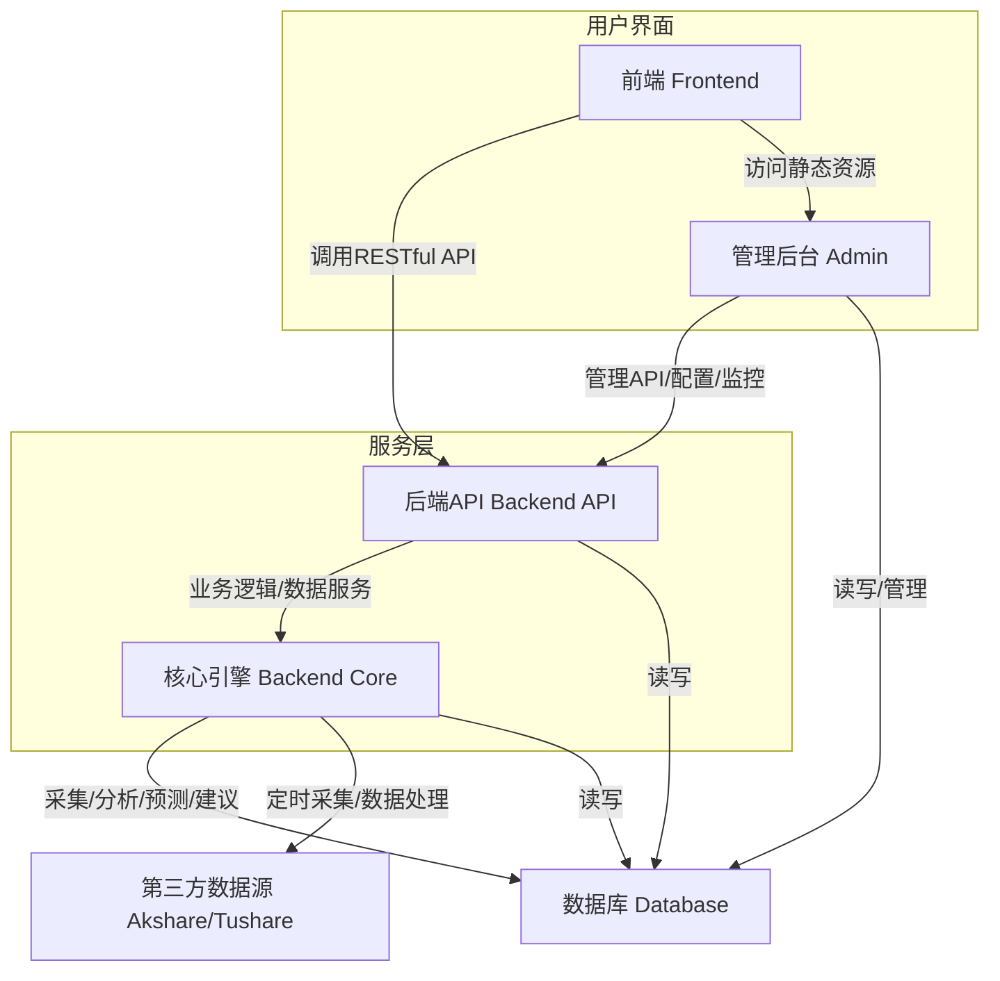
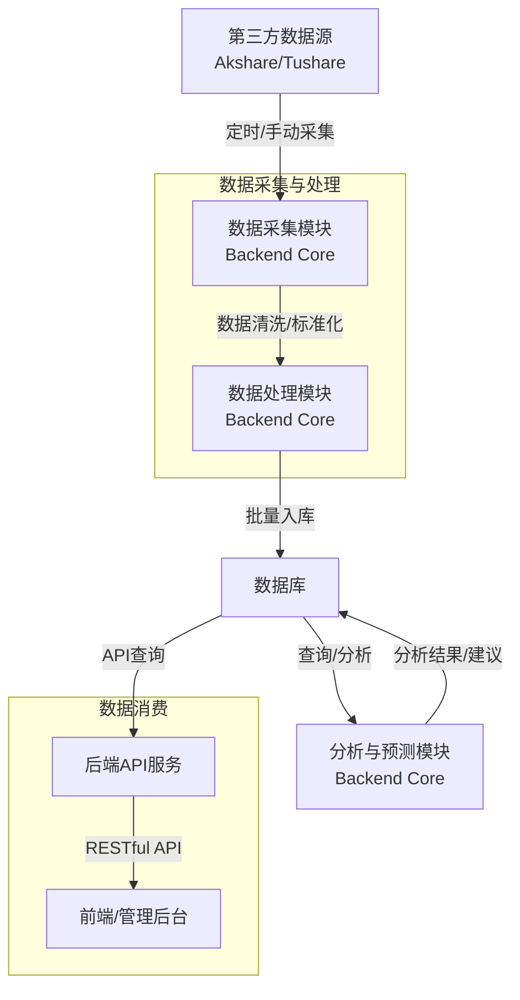
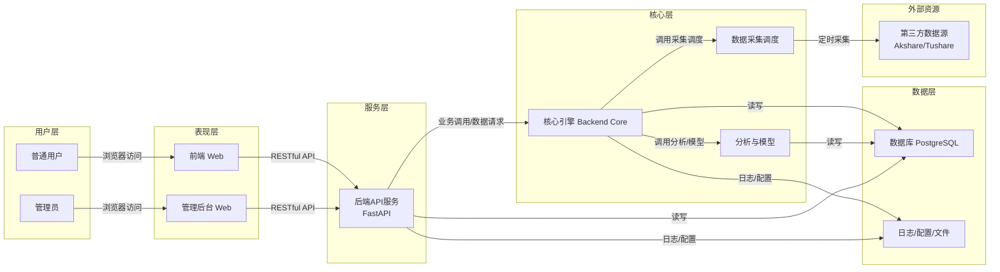

# 系统组件图



## 根据系统需求文档和项目结构，股票分析系统的主要组件及其关系如下：
  - 前端（Frontend）：为普通用户提供行情、分析、选股、资讯、自选股等页面，通过 RESTful API 与后端交互。
  - 管理后台（Admin）：为管理员提供用户、数据、采集、系统配置、日志、模型等管理功能，也通过 API 与后端交互。
  - 后端API（Backend API）：基于 FastAPI，负责用户认证、数据服务、业务逻辑处理、系统管理等，向前端和管理后台 
    提供统一接口。
  - 核心引擎（Backend Core）：负责数据采集（akshare/tushare）、数据清洗、分析计算、模型预测、交易建议等核心 
    功能，定时采集并处理第三方数据。
  - 数据库（Database）：存储行情、用户、日志、配置、分析结果等所有结构化数据。
  - 第三方数据源（Akshare/Tushare）：为系统提供实时及历史行情、财务、新闻等原始数据。

# 数据流管道图



## 说明：
  - 数据从 Akshare/Tushare 等第三方数据源采集，经采集模块进入数据处理模块进行清洗和标准化。
  - 处理后的数据批量写入数据库。
  - 分析与预测模块对数据库中的数据进行分析、建模和生成建议，结果也存回数据库。
  - 后端API服务从数据库读取数据，向前端和管理后台提供RESTful API接口。
  - 前端和管理后台通过API获取所需数据进行展示和管理。

# 顶层架构图




```mermaid

flowchart TB
 subgraph s1["用户层"]
        A1["普通用户"]
        A2["管理员"]
  end
 subgraph s2["表现层"]
        B1["前端 Web"]
        B2["管理后台 Web"]
  end
 subgraph s3["服务层"]
        C1["后端API服务<br>FastAPI"]
  end
 subgraph s4["核心层"]
        D1["核心引擎 Backend Core"]
        D2["分析与模型"]
        D3["数据采集调度"]
  end
 subgraph s5["数据层"]
        E1["数据库 PostgreSQL"]
        E2["日志/配置/文件"]
  end
 subgraph s6["外部资源"]
        F1["第三方数据源<br>Akshare/Tushare"]
  end
    A1 -- 浏览器访问 --> B1
    A2 -- 浏览器访问 --> B2
    B1 -- RESTful API --> C1
    B2 -- RESTful API --> C1
    C1 -- 业务调用/数据请求 --> D1
    D1 -- 调用分析/模型 --> D2
    D1 -- 调用采集调度 --> D3
    D3 -- 定时采集 --> F1
    D1 -- 读写 --> E1
    D2 -- 读写 --> E1
    C1 -- 读写 --> E1
    D1 -- 日志/配置 --> E2
    C1 -- 日志/配置 --> E2

    ```


## 说明：
1. 用户层
普通用户：通过浏览器访问前端页面，获取行情、分析、资讯、自选股等服务。
管理员：通过浏览器访问管理后台，进行用户、数据、采集、系统配置、日志、模型等管理操作。
2. 表现层
前端 Web：为普通用户提供股票行情、分析、图表、资讯等可视化界面，所有数据均通过后端API获取。
管理后台 Web：为管理员提供系统管理界面，包括用户管理、数据源配置、采集任务、日志监控、模型管理等。
3. 服务层
后端API服务（FastAPI）：统一对外提供RESTful API，负责用户认证、数据服务、业务逻辑处理、系统管理等。前端和管理后台均通过API与后端交互。
4. 核心层
核心引擎（Backend Core）：负责数据采集、清洗、标准化、分析、预测、交易建议等核心业务逻辑。
分析与模型：实现技术分析、基本面分析、机器学习/深度学习模型预测等功能，为用户和管理端提供智能分析结果。
数据采集调度：定时或手动从第三方数据源采集行情、财务、新闻等数据，保证数据的实时性和完整性。
5. 数据层
数据库（PostgreSQL）：存储所有结构化数据，包括行情、用户、日志、配置、分析结果等，支持高效查询和批量写入。
日志/配置/文件：存储系统运行日志、采集日志、配置文件、导出文件等，便于系统监控和维护。
6. 外部资源
第三方数据源（Akshare/Tushare）：为系统提供A股、ETF、指数、财务、新闻等原始数据，是数据采集的基础。
主要交互说明
用户和管理员均通过浏览器访问各自界面，所有数据和操作均通过后端API完成。
后端API服务作为唯一的数据和业务逻辑入口，既服务前端，也服务管理后台。
核心引擎负责所有数据的采集、处理、分析和预测，并与数据库进行读写交互。
数据采集调度模块定时从第三方数据源拉取最新数据，经过清洗和标准化后入库。
日志和配置文件为系统运维和监控提供支持，所有关键操作均有日志记录。


