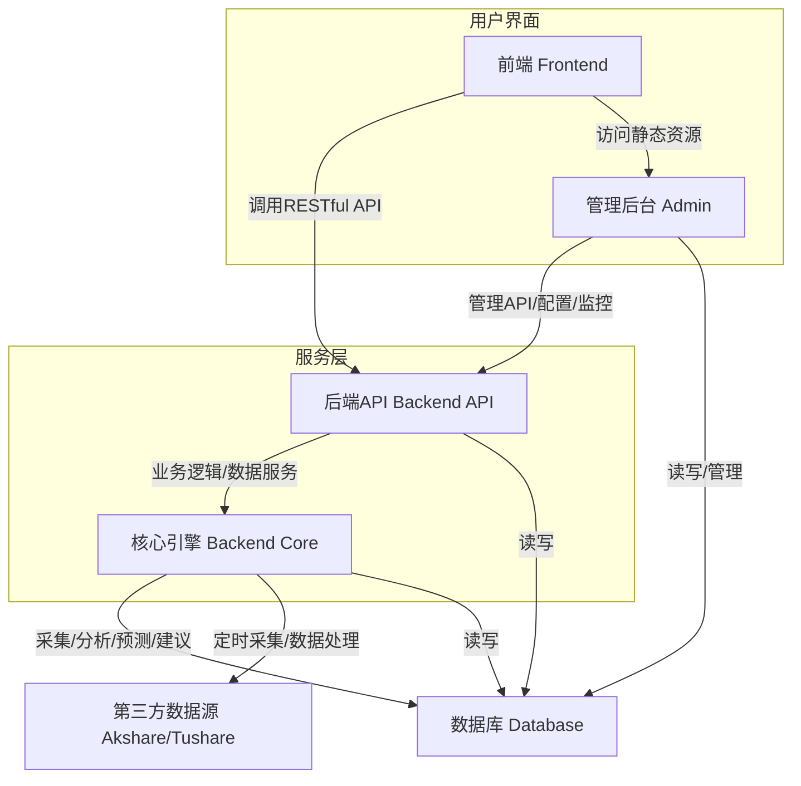
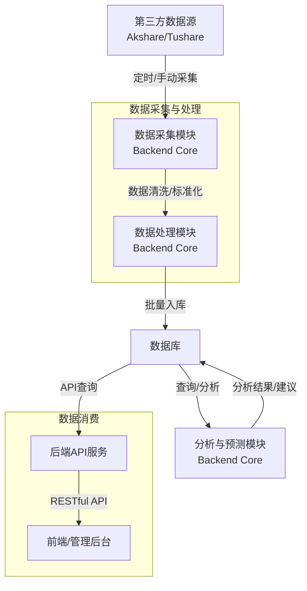

# 系统组件图

## 根据系统需求文档和项目结构，股票分析系统的主要组件及其关系如下：
  - 前端（Frontend）：为普通用户提供行情、分析、选股、资讯、自选股等页面，通过 RESTful API 与后端交互。
  - 管理后台（Admin）：为管理员提供用户、数据、采集、系统配置、日志、模型等管理功能，也通过 API 与后端交互。
  - 后端API（Backend API）：基于 FastAPI，负责用户认证、数据服务、业务逻辑处理、系统管理等，向前端和管理后台 
    提供统一接口。
  - 核心引擎（Backend Core）：负责数据采集（akshare/tushare）、数据清洗、分析计算、模型预测、交易建议等核心 
    功能，定时采集并处理第三方数据。
  - 数据库（Database）：存储行情、用户、日志、配置、分析结果等所有结构化数据。
  - 第三方数据源（Akshare/Tushare）：为系统提供实时及历史行情、财务、新闻等原始数据。

# 数据流管道图

## 说明：
  - 数据从 Akshare/Tushare 等第三方数据源采集，经采集模块进入数据处理模块进行清洗和标准化。
  - 处理后的数据批量写入数据库。
  - 分析与预测模块对数据库中的数据进行分析、建模和生成建议，结果也存回数据库。
  - 后端API服务从数据库读取数据，向前端和管理后台提供RESTful API接口。
  - 前端和管理后台通过API获取所需数据进行展示和管理。

