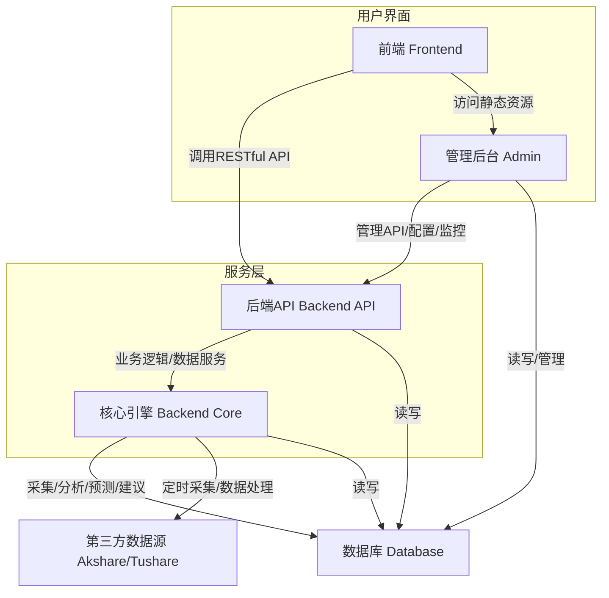
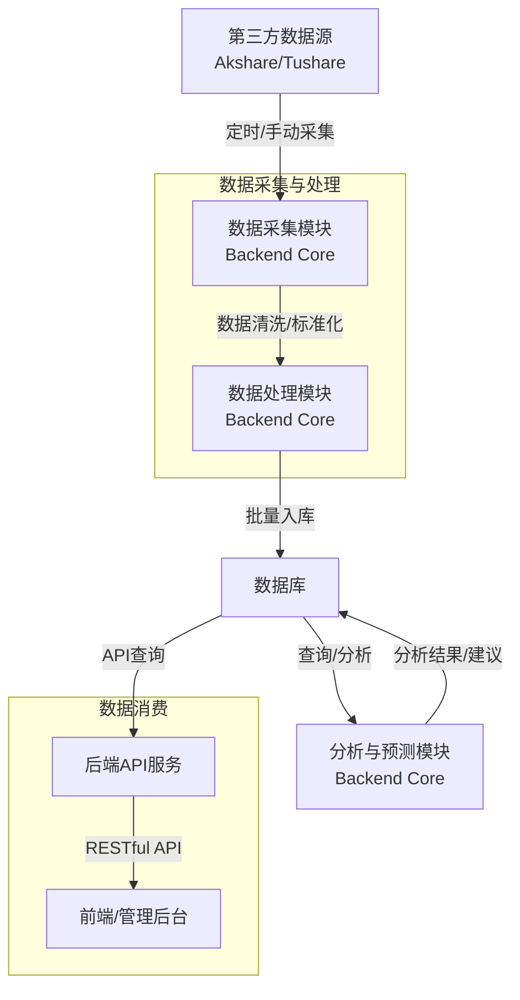
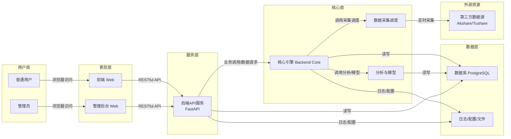
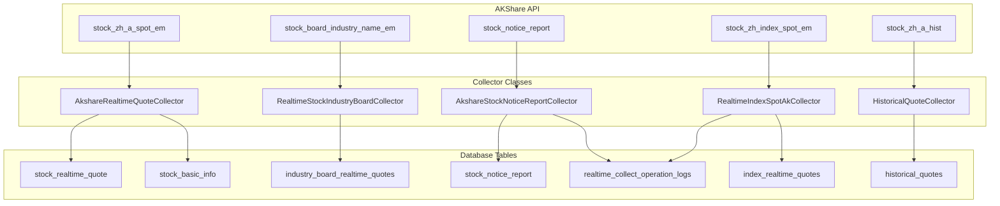

# 系统组件图




# 数据流管道图



# 顶层架构图




```mermaid

flowchart TB
 subgraph s1["用户层"]
        A1["普通用户"]
        A2["管理员"]
  end
 subgraph s2["表现层"]
        B1["前端 Web"]
        B2["管理后台 Web"]
  end
 subgraph s3["服务层"]
        C1["后端API服务<br>FastAPI"]
  end
 subgraph s4["核心层"]
        D1["核心引擎 Backend Core"]
        D2["分析与模型"]
        D3["数据采集调度"]
  end
 subgraph s5["数据层"]
        E1["数据库 PostgreSQL"]
        E2["日志/配置/文件"]
  end
 subgraph s6["外部资源"]
        F1["第三方数据源<br>Akshare/Tushare"]
  end
    A1 -- 浏览器访问 --> B1
    A2 -- 浏览器访问 --> B2
    B1 -- RESTful API --> C1
    B2 -- RESTful API --> C1
    C1 -- 业务调用/数据请求 --> D1
    D1 -- 调用分析/模型 --> D2
    D1 -- 调用采集调度 --> D3
    D3 -- 定时采集 --> F1
    D1 -- 读写 --> E1
    D2 -- 读写 --> E1
    C1 -- 读写 --> E1
    D1 -- 日志/配置 --> E2
    C1 -- 日志/配置 --> E2

    ```


# AKShare采集器 类层次结构图

```mermaid

---
config:
  look: neo
  layout: elk
---
classDiagram
    class AKShareCollector
    AKShareCollector <|-- AkshareRealtimeQuoteCollector
    AKShareCollector <|-- HistoricalQuoteCollector
    AKShareCollector <|-- IndexQuoteCollector
    AKShareCollector <|-- AkshareStockNoticeReportCollector

    class RealtimeStockIndustryBoardCollector
    class RealtimeIndexSpotAkCollector

```


# AKShare采集器 数据流架构图

