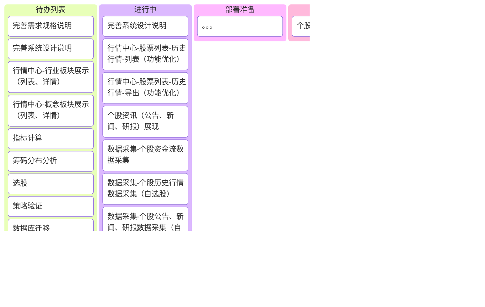

```mermaid

---
config:
  kanban:
    ticketBaseUrl: https://org.atlassian.net/browse/#TICKET#
  theme: default
---
kanban
  待办列表
    [完善需求规格说明]
    [完善系统设计说明]
    [行情中心-行业板块展示（列表、详情）]
    [行情中心-概念板块展示（列表、详情）]
    [指标计算]
    [筹码分布分析]
    [选股]
    [策略验证]
    [数据库迁移]

  [进行中]
    [完善系统设计说明]
    [行情中心-股票列表-历史行情-列表（功能优化）]
    [行情中心-股票列表-历史行情-导出（功能优化）]
    [个股资讯（公告、新闻、研报）展现]
    [数据采集-个股资金流数据采集]
    [数据采集-个股历史行情数据采集（自选股）]
    [数据采集-个股公告、新闻、研报数据采集（自选股）]

  [部署准备]
    [。。。]
  [测试准备]
    [个股财务指标展现]
  [已完成]
    [用户登录、退出、状态]
    [首页展示-除新闻列表]
    [自选股频道展示-除分组]
    [行情中心-股票列表-实时行情展示]
    [行情中心-股票列表-历史行情展示]
    [行情中心-股票列表-历史行情-导出]
    [个股详情-实时行情、K线图、分时图、资金流向、关键指标展示]
    [数据采集-个股实时行情数据采集]
    [数据采集-行业板块实时行情数据采集]

```

