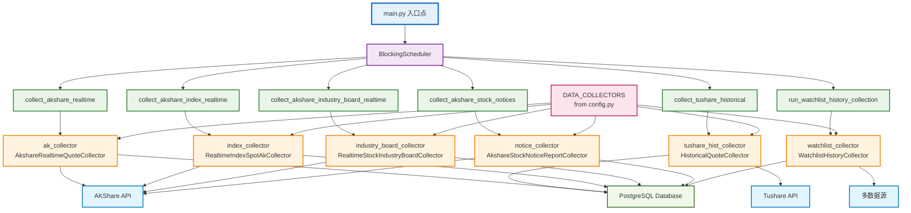

# 股票分析软件数据服务系统需求规格说明书(SRS) 

**文档版本：** V0.5 
**日    期：** 2025年05月 

## 目录 
1. 项目概述 
2. 功能需求分析 
3. 接口设计说明 
4. 非功能性需求分析

## 1. 项目概述 
### 1.1. 目标 
本需求说明书旨在详细分析并定义股票分析软件数据服务系统的功能需求，参考专业股票交易分析APP和网站（例如东方财富通信、同花顺、招商证券等）的功能布局和用户体验。本文档将作为项目开发、测试、运维的指导，指导整个项目的开发团队。

### 1.2. 范围 
本系统定位于面向个人投资者的股票分析和辅助决策平台，主要通过Web提供服务（可考虑移动端APP作为扩展）。系统核心功能包括A股市场数据展示、自选股管理、基础分析、智能模型的股票价格预测以及交易辅助分析。系统不涉及实际的股票交易功能，仅提供分析和建议。

> 注：核心数据采集编排流程见2.6.x。

## 2. 功能需求分析

系统主要分为以下几个部分：前端、后台管理、后端 API、数据采集和存储、后端系统。
前端(FE) ：系统主要面向普通用户，提供数据展示图表、投资新闻和建议模块。
后台管理(ADMIN) ：系统主要面向管理用户，提供权限管理信息、数据源配置、数据采集配置、数据导入/导出、系统日志查询、内容管理功能（可选）、用户信息管理（可选）模块。
后端API ：系统主要面向用户认证 API、数据服务 API、数据分析 API、系统管理 API模块。
数据采集和存储 ：系统主要面向数据采集监控、数据采集和获取、数据上传转换、数据清洗、数据存储、数据备份和恢复、日志记录功能模块。

### 2.x 业务流程与规则总览

1. **数据采集与入库**
   - 支持定时/手动采集A股、ETF、行业、概念等行情、资金流、财务、分红、龙虎榜等数据。
   - 多数据源（akshare、tushare），采集前后均有数据完整性校验与异常重试。
   - 采集数据经清洗、标准化后批量入库，表结构与API字段一致，主键唯一，重要字段加索引。
   - 采集日志、异常、进度均有详细记录，便于追溯和监控。

2. **数据服务与API**
   - FastAPI 提供 RESTful API，分为前台（/api/stock/xxx）和管理后台（/api/admin/xxx）两大类。
   - 主要API包括：实时/历史行情、资金流向、财务指标、分红、龙虎榜、选股、策略回测、用户管理等。
   - 支持分页、筛选、导出、权限校验（JWT+角色），所有接口有统一的异常处理和日志。
   - 管理端API支持行情数据的增删查改、用户管理、系统配置、采集任务调度等。

3. **前端业务流程**
   - 多页面应用（MPA），各页面通过fetch API与后端交互，数据渲染采用ECharts等可视化库。
   - 主要页面：行情、分析、选股、资金流、财务、龙虎榜、用户中心、管理后台等。
   - 支持实时刷新、分页、条件筛选、批量导出、个性化展示（如自选股、关注、分组）。
   - 管理端支持用户、数据、系统、日志等管理，权限严格控制。

4. **管理后台**
   - 以多页面HTML+JS为主，功能包括用户管理、行情数据管理、系统配置、采集任务、日志监控等。
   - 支持数据导出、批量操作、权限分级、操作日志、系统监控等。

#### 2.x.2 关键业务规则

- 采集任务支持全量/增量，失败自动重试，采集后校验数据完整性。
- API接口RESTful风格，返回结构统一，参数校验严格，异常有详细提示。
- 权限分级，敏感操作需二次验证，操作日志全记录。
- 前端数据渲染需校验完整性，图表美观易读，批量操作需二次确认。
- 数据库表结构与API字段一致，支持批量写入、事务、并发控制。
- 日志分模块记录，异常自动报警，管理后台有系统监控与日志分析。

### 2.3. 前端(FE)
前端是系统面向用户的展示和用户交互，主要通过调用后端API获取和提交数据。主要包含以下几个主要模块： 

#### 2.3.1. 行情模块
本模块提供股票市场的概况和详细的数据列表。

##### 2.3.1.1. 首页行情
**功能描述**
展示主要股票指数（如上证300、深证指数、创业板指数）的实时/延时行情、热点股票。
**业务流程**
前端页面加载时自动请求后端API获取主要指数和热点股票数据，定时刷新。用户可点击查看详情，支持自选添加。
**页面原型**
待完善。
**组件元素** 
待完善。
**业务规则** 
数据需实时或准实时，异常时显示提示，支持手动刷新。

##### 2.3.1.2. 沪深股票 
**功能描述** 
展示沪深股票、涨跌幅排行榜列表，支持可查看股票详情页面。
**业务流程** 
用户可切换不同市场、排序方式，前端请求API分页获取数据，支持条件筛选和导出。
**页面原型** 
待完善。
**组件元素** 
待完善。
**业务规则** 
分页、排序、筛选参数需校验，导出需权限校验。

##### 2.3.1.3. 热点板块 
**功能描述**
展示A股市场中涨跌幅、活跃度榜、成交量排行等板块列表。
**业务流程** 
待完善。
**页面原型**
待完善。
**组件元素** 
待完善。
**业务规则** 
待完善。

##### 2.3.1.4. 全球指数（可选） 
**功能描述**
展示主要国际指数（如道琼斯工业、纳斯达克、恒生指数等）行情（可选）。
**业务流程** 
待完善。
**页面原型** 
待完善。
**组件元素** 
待完善。
**业务规则**
待完善。

##### 2.3.1.5. 期货/贵金属期权（可选） 
**功能描述** 
展示主要期货合约和贵金属等商品列表（可选）。
**业务流程**
待完善。
**页面原型** 
待完善。
**组件元素** 
待完善。
**业务规则** 
待完善。

#### 2.3.2. 自选股模块 
本模块管理用户关注的股票列表和展示功能。

##### 2.3.2.1. 自选列表展示
**功能描述**
展示主要股票指数（如上证300、深证指数、创业板指数）的实时/延时行情、热点股票。
**业务流程** 
用户登录后自动加载自选股列表，支持分组、排序、批量操作。
**页面原型** 
待完善。
**组件元素** 
待完善。
**业务规则** 
自选股数据与用户绑定，操作需鉴权，批量操作需二次确认。

##### 2.3.2.2. 自选股添加/删除
**功能描述**
用户可以通过搜索功能或在股票页面将股票加入自选列表，自选列表可删除股票。
**业务流程** 
待完善。
**页面原型**
待完善。
**组件元素** 
待完善。
**业务规则** 
待完善。

##### 2.3.2.3. 自选列表排序
**功能描述** 
支持按照热点、涨跌、价格等字段对自选列表进行排序。
**业务流程** 
待完善。
**页面原型**
待完善。
**组件元素** 
待完善。
**业务规则** 
待完善。

##### 2.3.2.4. 自选股分组（可选） 
**功能描述** 
支持创建多个自选股分组（可选）。
**业务流程** 
待完善。
**页面原型** 
待完善。
**组件元素** 
待完善。
**业务规则** 
待完善。

#### 2.3.3. 个股模块
本模块展示单个股票的详细信息与分析数据，主要通过股票搜索或列表点击进入。

##### 2.3.3.1. 实时/延时行情 
**功能描述**
页面顶部展示该股的实时/延时行情（现价、涨跌额、涨跌幅、成交量、最高、最低、开盘、成交额）、量价等。
**业务流程** 
进入个股页面自动请求实时行情，定时刷新，异常时提示。
**页面原型** 
待完善。
**组件元素** 
待完善。
**业务规则** 
数据需校验完整性，异常时显示默认值或提示。

##### 2.3.3.2. 分时图 
**功能描述** 
展示该股的今日分时价格与成交量图表。
**业务流程** 
待完善。
**页面原型** 
待完善。
**组件元素** 
待完善。
**业务规则** 
待完善。

##### 2.3.3.3. K线图 
**功能描述** 
展示该股在不同时间周期（1分钟、5分钟、15分钟、30分钟、60分钟、日、周、月、年）的K线图。
支持均线、平均图等。
支持复权的选择（前复权、后复权、不复权）。
**业务流程** 
用户可切换周期、复权方式，前端请求API获取对应K线数据，支持均线、指标叠加。
**页面原型** 
待完善。
**组件元素** 
待完善。
**业务规则** 
参数需校验，数据需完整，指标计算与主流软件一致。

##### 2.3.3.4. 技术指标分析 
**功能描述** 
支持在K线图下方或叠加显示常用的技术指标，用户可选择显示/隐藏和调整参数。包括但不限于：MA, RSI, MACD, KDJ, BOLL, VOL, OBV, DMI, WR, CCI, ATR, SAR等。
**业务流程**
待完善。
**页面原型**
待完善。
**组件元素**
待完善。
**业务规则** 
待完善。

##### 2.3.3.5. 基本面数据 
**功能描述** 
展示主要财务指标（PE, PB, ROE, EPS等）与关键财报摘要（财报披露、业绩预告、业绩快报等）。
**业务流程** 
进入个股页面自动请求财务数据，支持多报告期切换，数据可视化展示。
**页面原型** 
待完善。
**组件元素** 
待完善。
**业务规则** 
数据需校验，单位、精度、图表展示需美观易读。

##### 2.3.3.6. 相关公告 
**功能描述** 
展示该股票相关的财经信号和公司公告列表，支持可查看详情。
**业务流程** 
待完善。
**页面原型** 
待完善。
**组件元素**
待完善。
**业务规则** 
待完善。

##### 2.3.3.7. 研报 
**功能描述** 
展示券商等机构发布的该股票相关的研究报告列表，支持可查看详情（可选，需要数据源）。
**业务流程** 
待完善。
**页面原型** 
待完善。
**组件元素** 
待完善。
**业务规则** 
待完善。

##### 2.3.3.8. 资金流向 
**功能描述** 
展示该股的资金流向统计数据（可选，需要数据源）。
**业务流程** 
待完善。
**页面原型** 
待完善。
**组件元素** 
待完善。
**业务规则** 
待完善。

##### 2.3.3.9. 同类股票 
**功能描述** 
展示同行业、同概念的股票推荐股票（可选）。
**业务流程** 
待完善。
**页面原型** 
待完善。
**组件元素** 
待完善。
**业务规则** 
待完善。

##### 2.3.3.10. 智能分析推荐
**功能描述** 
在个页面或子页面展示该股票的预测价格、预测评级和交易建议（对接智能分析模块）。
**业务流程**
待完善。
**页面原型** 
待完善。
**组件元素** 
待完善。
**业务规则** 
待完善。

#### 2.3.4. 智能分析模块 
本模块集中展示系统的预测和分析能力。

##### 2.3.4.1. 预测展示
**功能描述** 
展示指定股票的预测价格、趋势图表、目标价格变化，以及说明预测来源和置信度。
**业务流程** 
待完善。
**页面原型** 
待完善。
**组件元素**
待完善。
**业务规则**
待完善。

##### 2.3.4.2. 交易建议展示
**功能描述** 
集中展示系统对指定股票给出的交易建议（买入/卖出/持有/观望），并提供决策理由（技术预测、价值信号等）与风险提示。
**业务流程** 
待完善。
**页面原型** 
待完善。
**组件元素**
待完善。
**业务规则** 
待完善。

##### 2.3.4.3. 历史预测回顾 
查看系统对该股票做的历史预测结果（可选）。

##### 2.3.4.4. 选股策略 
基于预测模型或其他指标提供一些预设选股策略（可选）。

#### 2.3.5. 资讯模块 
本模块提供全面的财经资讯（可选）。

##### 2.3.5.1. 财经新闻列表 
展示最新的财经新闻列表，支持分类按政策、行业、公司等（可选）。

##### 2.3.5.2. 新闻详情 
从新闻列表可查看新闻全文（可选）。

##### 2.3.5.3. 研报列表 
集中展示证券研究报告列表，支持按照机构、行业、股票筛选（可选）。

##### 2.3.5.4. 7x24 资讯 
提供实时市场资讯（可选）。

#### 2.3.6. 我的模块 
本模块提供用户相关的设置和信息。

##### 2.3.6.1. 用户信息展示 
展示用户的基本信息，如用户名、注册时间等。

##### 2.3.6.2. 个人信息修改 
支持修改头像、昵称等（可选）。

##### 2.3.6.3. 密码修改 
支持修改登录密码。

##### 2.3.6.4. 消息中心 
接收系统通知和推送（可选）。

##### 2.3.6.5. 设置 
提供web应用相关的设置选项，如数据刷新频率、图表默认指标、主题选择等（可选）。

##### 2.3.6.6. 意见反馈 
提供意见建议和用户问题反馈（可选）。

##### 2.3.6.7. 关于我们 
展示web应用版本信息、公司信息、联系方式等（可选）。

#### 2.3.7. 全局功能 
本模块提供用户认证相关的注册、登录、退出登录等功能。

##### 2.3.7.1. 用户登录 
**功能描述** 
待定。
**业务流程** 
待定。
**使用角色** 
待定。
**页面原型** 
待完善。
**组件元素** 
待完善。
**业务规则** 
待完善。

##### 2.3.7.2. 用户注册 
**功能描述** 
待定。
**业务流程** 
待定。
**使用角色** 
待定。
**页面原型** 
待完善。
**组件元素** 
待完善。
**业务规则** 
待完善。

##### 2.3.7.3. 退出登录 
**功能描述** 
待定。
**业务流程** 
待定。
**使用角色** 
待定。
**页面原型** 
待完善。
**组件元素** 
待完善。
**业务规则** 
待完善。

### 2.4. 后台(ADMIN)管理 
后台管理系统供系统管理员使用，管理系统配置、数据管理、用户管理。

#### 2.4.1. 管理员认证 
管理员登录到后台。

#### 2.4.2. 用户管理 
##### 2.4.2.1. 用户查看 
查看所有注册用户账号、权限。
##### 2.4.2.2. 业务流程 
待完善。
##### 2.4.2.3. 页面原型 
待完善。
##### 2.4.2.4. 组件元素 
待完善。
##### 2.4.2.5. 业务规则 
待完善。

#### 2.4.3. 数据源管理 
配置和管理外部数据源、数据接口信息。

#### 2.4.4. 数据采集任务管理 
配置、启动、停止、监控数据采集任务，如股票基础信息、实时行情、频率等。

#### 2.4.5. 数据监控告警 
监控数据采集的成功率、延迟，在数据异常时发出告警。

#### 2.4.6. 预测模型管理 
上传、配置、训练、切换或换预测模型版本（可选）。

#### 2.4.7. 系统日志 
查看系统运行日志、API调用日志、错误日志（可选）。

#### 2.4.8. 内容管理 
管理财经新闻、公告、研报等信息内容（系统管理维护人员负责），可选。

#### 2.4.9. 系统消息发布 
发布系统公告给前端用户（可选）。

### 2.5. 后端API 
后端API模块为前端APP提供数据和服务接口。

#### 2.5.1. 用户认证相关 API 
注册、登录、退出、账户验证/激活。

- **用户注册/登录/登出/状态**
  - 路径：`POST /api/users/register`，`POST /api/users/login`，`POST /api/auth/login`，`POST /api/auth/logout`，`GET /api/auth/status`
  - 输入参数：用户名、密码、邮箱等
  - 输出：用户信息、Token、登录状态
  - 逻辑规则：注册/登录校验唯一性与密码，Token基于JWT，登出仅前端清理。

#### 2.5.2. 用户信息管理 API 
获取、更新用户信息。

- **获取/更新用户信息**
  - 路径：`GET /api/users/me`，`PUT /api/users/me`，`PUT /api/users/me/password`，`GET /api/users/status`
  - 输入参数：用户信息、密码
  - 输出：用户信息、状态
  - 逻辑规则：需登录，更新时校验唯一性。

- **用户搜索（管理端）**
  - 路径：`GET /api/users/search?keyword=xxx`
  - 输入参数：keyword
  - 输出：用户列表
  - 逻辑规则：仅管理端可用。

#### 2.5.3. 自选股管理 API 
获取、添加、删除自选股。

- **获取自选股列表（含实时行情）**
  - 路径：`GET /api/watchlist`
  - 输入参数：需登录
  - 输出：`{ success: bool, data: [ { code, name, current_price, ... } ] }`
  - 逻辑规则：返回当前用户全部自选股及实时行情。

- **添加/删除自选股**
  - 路径：`POST /api/watchlist`，`DELETE /api/watchlist/{watchlist_id}`，`POST /api/watchlist/delete_by_code`
  - 输入参数：股票代码、分组等
  - 输出：操作结果
  - 逻辑规则：同一股票不可重复添加，删除需校验归属。

- **自选股分组管理**
  - 路径：`GET /api/watchlist/groups`，`POST /api/watchlist/groups`，`DELETE /api/watchlist/groups/{group_id}`，`PUT /api/watchlist/{watchlist_id}/group`
  - 输入参数：分组名、ID等
  - 输出：操作结果
  - 逻辑规则：分组不可重名，删除分组时自选股归入默认分组。

#### 2.5.4. 股票搜索 API 
根据关键词搜索股票。

#### 2.5.5. 行情与股票相关 API 
获取主要指数、股票实时/延时行情、量价数据。

- **获取市场主要指数**
  - 路径：`GET /api/market/indices`
  - 输入参数：无
  - 输出：`{ success: bool, data: [ { code, name, current, change, change_percent, high, low, open, yesterday_close, volume, turnover, timestamp } ] }`
  - 逻辑规则：优先从akshare获取沪深主流指数数据，失败时返回模拟数据。字段含义与主流行情平台一致。

- **获取行业板块行情**
  - 路径：`GET /api/market/industry_board`
  - 输入参数：无
  - 输出：`{ success: bool, data: [ { name, price, change_amount, change_percent, market_cap, turnover_rate, turnover, leading_stock, leading_stock_change } ] }`
  - 逻辑规则：按涨幅降序，字段含义与主流平台一致。

- **批量获取股票实时行情**
  - 路径：`POST /api/stock/quote`
  - 输入参数：`{ codes: [股票代码列表] }`
  - 输出：`{ success: bool, data: [ { code, current_price, change_amount, change_percent, open, yesterday_close, high, low, volume, turnover } ] }`
  - 逻辑规则：工作日实时拉取，周末从本地库取，异常返回详细错误。

- **获取股票列表（模糊搜索）**
  - 路径：`GET /api/stock/list?query=关键词&limit=15`
  - 输入参数：query（代码/名称模糊），limit（返回条数）
  - 输出：`{ success: bool, data: [ { code, name } ], total }`
  - 逻辑规则：支持代码或名称模糊搜索，默认最多15条。

- **获取A股涨跌幅/成交量/换手率排行榜**
  - 路径：`GET /api/stock/quote_board_list?ranking_type=rise|fall|volume|turnover_rate&market=all|sh|sz|cy|bj&page=1&page_size=20`
  - 输入参数：排行类型、市场、分页
  - 输出：`{ success: bool, data: [ { code, name, current, change, change_percent, ... } ], total, page, page_size }`
  - 逻辑规则：支持多种排行、市场过滤、分页，数据缓存1分钟。

- **获取单只股票实时行情**
  - 路径：`GET /api/stock/realtime_quote_by_code?code=xxxxxx`
  - 输入参数：code
  - 输出：`{ success: bool, data: { code, current_price, ... } }`
  - 逻辑规则：实时拉取，返回主流行情字段。

- **获取单只股票分时数据**
  - 路径：`GET /api/stock/minute_data_by_code?code=xxxxxx`
  - 输入参数：code
  - 输出：`{ success: bool, data: [ { time, price, volume, amount, ... } ] }`
  - 逻辑规则：交易日拉取当日，非交易日取最近交易日。

- **获取K线（日/分钟）历史数据**
  - 路径：`GET /api/stock/kline_hist?code=xxxxxx&period=daily&start_date=YYYY-MM-DD&end_date=YYYY-MM-DD&adjust=qfq`
  - 路径：`GET /api/stock/kline_min_hist?code=xxxxxx&period=60&start_datetime=YYYY-MM-DD HH:MM:SS&end_datetime=YYYY-MM-DD HH:MM:SS&adjust=qfq`
  - 输入参数：股票代码、周期、时间范围、复权
  - 输出：`{ success: bool, data: [ { date, code, open, close, high, low, volume, amount, ... } ] }`
  - 逻辑规则：参数校验严格，数据完整。

- **获取股票基本面最新财务摘要**
  - 路径：`GET /api/stock/latest_financial?code=xxxxxx`
  - 输入参数：code
  - 输出：`{ success: bool, data: { pe, pb, roe, roa, revenue, profit, eps, bps, report_date } }`
  - 逻辑规则：按主流财务字段映射，异常返回详细错误。

- **获取股票财务指标列表**
  - 路径：`GET /api/stock/financial_indicator_list?symbol=xxxxxx&indicator=1|2|3`
  - 输入参数：symbol（股票代码），indicator（报告期类型）
  - 输出：`{ success: bool, data: [ { 报告期, 净资产收益率, 资产收益率, 营业总收入, 净利润, 基本每股收益, 每股净资产 } ] }`
  - 逻辑规则：支持多报告期，字段映射清晰。

#### 2.5.6. 资金流向相关 API 

- **获取个股资金流向（今日/历史）**
  - 路径：`GET /api/stock_fund_flow/today?code=xxxxxx`
  - 路径：`GET /api/stock_fund_flow/history?code=xxxxxx`
  - 输入参数：code
  - 输出：`{ success: bool, data: [ { date, code, main_net_inflow, large_net_inflow, ... } ] }`
  - 逻辑规则：优先用akshare，支持主力/大单等多维度，异常详细。

#### 2.5.6. 历史行情API

- **获取历史行情（分页）**
  - 路径：`GET /api/stock/history?code=xxxxxx&start_date=YYYY-MM-DD&end_date=YYYY-MM-DD&page=1&size=20`
  - 输入参数：股票代码、起止日期、分页
  - 输出：`{ items: [ { date, open, close, high, low, volume } ], total }`
  - 逻辑规则：分页查询，字段与数据库一致。

- **导出历史行情CSV**
  - 路径：`GET /api/stock/history/export?code=xxxxxx&start_date=YYYY-MM-DD&end_date=YYYY-MM-DD`
  - 输入参数：同上
  - 输出：CSV文件流
  - 逻辑规则：字段顺序与数据库一致，支持大批量导出。

#### 2.5.7. 基本面信息 API 
获取公司财务、基本面数据、股本结构等。

#### 2.5.8. 相关公告 API 
获取财报、业绩公告、重要事项等。

#### 2.5.9. 研报 API 
获取研究报告、研报摘要（可选）。

#### 2.5.10. 板块/行业 API 
获取板块列表、所属股票（可选）。

#### 2.5.11. 技术指标计算 API 
基于历史数据计算指标、输出指标。

#### 2.5.12. 预测结果获取 API 
获取指定股票的预测价格、评级、置信度。

#### 2.5.13. 交易建议获取 API 
获取指定股票的交易建议和风险提示。

#### 2.5.14. 财经新闻 API 
获取新闻、新闻列表、详情。

#### 2.5.15. 系统配置/消息 API 
获取系统公告的功能和信息。

### 2.6. 数据采集和存储 
数据采集模块负责从外部数据源获取数据并存储。

#### 2.6.1. 数据源对接 
实现与不同金融数据源API的对接适配，能够稳定、有效地采集数据。

#### 2.6.2. 数据采集调度 
实现灵活的数据采集调度机制，支持不同股票类型、不同股票、不同频率的采集调度。

#### 2.6.3. 增量采集策略 
采集增量数据采集，只获取新增数据，避免重复下载提高效率。

### 2.6.x 核心采集编排流程（可视化）

系统核心采集调度、清洗、入库流程如下：

### 2.6.4. 数据上传清洗和校验 
对采集到的原始数据进行清洗上传、去重、格式转换和一致性校验。
- 支持直接写入PostgreSQL数据库（推荐生产环境），也可写入SQLite（开发/测试环境）。
- 采集结果以DataFrame为主，入库前转换为dict或SQL批量写入，推荐SQLAlchemy统一接口。
- 数据表结构与API字段一致，主键唯一，重要字段加索引。

### 2.6.7. 数据备份恢复 
制定并执行数据备份和恢复策略。
- PostgreSQL生产环境需定期全量/增量备份，支持自动恢复。
- 支持多环境（PostgreSQL/SQLite）数据迁移与恢复。

### 2.7. 后端分析预测 
后端分析预测模块负责进行技术计算、预测模型运行和交易建议生成。

#### 2.7.1. 技术指标计算 
实现各类技术指标（MA, RSI, MACD等）的计算逻辑，支持不同参数和参数。

#### 2.7.2. 预测模型实现（可选） 
实现一种基于股票价格预测模型（可以是时间序列、机器学习、深度学习等）。
输入: 历史价格数据、技术指标、基本面数据（可选）、市场环境数据（可选）。
输出: 未来价格预测（目标时间）、预测评级、置信度。
模型要求: 具备一定预测精度，能够根据使用情况数据进行训练和优化。

#### 2.7.3. 模型训练与管理（可选） 
提供模型训练，更新和版本管理功能。

#### 2.7.4. 预测/交易策略（可选） 
提供内部接口管理API触发，执行预测任务生成建议。
**交易建议生成逻辑：** 
实现基于预测结果、技术指标信号、基本面数据组合的交易建议生成逻辑。
输出: 交易建议操作（买入/卖出/持有/观望）、置信度、风险等级。

## 3. 接口设计说明

### 3.1. 主要API接口详细说明

#### 3.1.1. 行情与股票相关API

#### 3.1.2. 资金流向相关API

#### 3.1.4. 自选股管理API

- **获取自选股列表（含实时行情）**
  - 路径：`GET /api/watchlist`
  - 输入参数：需登录
  - 输出：`{ success: bool, data: [ { code, name, current_price, ... } ] }`
  - 逻辑规则：返回当前用户全部自选股及实时行情。

- **添加/删除自选股**
  - 路径：`POST /api/watchlist`，`DELETE /api/watchlist/{watchlist_id}`，`POST /api/watchlist/delete_by_code`
  - 输入参数：股票代码、分组等
  - 输出：操作结果
  - 逻辑规则：同一股票不可重复添加，删除需校验归属。

- **自选股分组管理**
  - 路径：`GET /api/watchlist/groups`，`POST /api/watchlist/groups`，`DELETE /api/watchlist/groups/{group_id}`，`PUT /api/watchlist/{watchlist_id}/group`
  - 输入参数：分组名、ID等
  - 输出：操作结果
  - 逻辑规则：分组不可重名，删除分组时自选股归入默认分组。

#### 3.1.5. 用户与认证API

- **用户注册/登录/登出/状态**
  - 路径：`POST /api/users/register`，`POST /api/users/login`，`POST /api/auth/login`，`POST /api/auth/logout`，`GET /api/auth/status`
  - 输入参数：用户名、密码、邮箱等
  - 输出：用户信息、Token、登录状态
  - 逻辑规则：注册/登录校验唯一性与密码，Token基于JWT，登出仅前端清理。

- **获取/更新用户信息**
  - 路径：`GET /api/users/me`，`PUT /api/users/me`，`PUT /api/users/me/password`，`GET /api/users/status`
  - 输入参数：用户信息、密码
  - 输出：用户信息、状态
  - 逻辑规则：需登录，更新时校验唯一性。

- **用户搜索（管理端）**
  - 路径：`GET /api/users/search?keyword=xxx`
  - 输入参数：keyword
  - 输出：用户列表
  - 逻辑规则：仅管理端可用。

## 4. 非功能性需求分析 
### 4.1. 性能要求 
- 数据延迟响应延迟：实时行情数据从数据源更新后，前端展示延迟不超过 [5] 秒。
- 页面加载速度：主要页面（自选股、个股页面）加载时间不超过 [5] 秒。
- 图表交互响应：K线图缩放、平移、切换周期、添加指标等操作响应延迟，延迟不超过 [500] 毫秒。
- API响应时间：各类API调用响应在 [5] 秒内响应。
- 数据采集效率：能够在规定时间内完成全部、高效的数据采集任务。
- PostgreSQL数据库应支持高并发读写，表结构优化，索引合理，满足大数据量场景。

### 4.2. 安全性要求 
- 用户认证和授权：确保用户账号安全，API调用权限控制。
- 数据传输安全：前端、后端各服务之间使用加密通信（HTTPS, TLS）。
- 敏感数据保护：用户密码、API密钥等敏感信息加密存储，防止数据泄露。
- 防护攻击防护：防护SQL注入、XSS、CSRF、DDoS等安全威胁。
- 预测模型安全：保护预测模型算法和数据不被非法获取。

### 4.3. 高可用性要求 
- 系统可用性：系统核心功能（行情、自选股管理）的可用目标达到 [99% 以上]。
- 数据一致性：确保存储和展示的数据准确一致。
- 容错性：系统应能处理部分服务异常，不影响整体系统功能。
- 数据备份恢复：建立备份机制，具备快速恢复能力。
- PostgreSQL生产环境需具备主从、备份、监控、自动恢复等高可用能力。

### 4.4. 扩展性要求 
系统能够应支持未来用户数量和数据量增长，可以通过增加服务器资源进行水平扩展。

### 4.5. 可维护性要求 
- 代码结构：模块化设计，逻辑清晰，便于后续修改。
- 文档：提供详细的开发文档、API文档、运维文档。
- 监控：提供系统运行状态、性能、错误等的监控功能。

### 4.6. 用户体验要求 
- web端UI/UX：界面设计品质、移动端操作习惯，布局合理，视觉美观。
- 图表体验：图表功能直观便于操作。
- 信息展示：关键信息突出，层次清晰。
- 错误提示：错误信息友好，提供操作指引。

### 4.7. 兼容性要求 
- Web平台支持主流浏览器IE以上。
- 网络环境：在不同网络环境（Wi-Fi, 4G/5G）下均能正常使用，进行网络优化。

## 5. 附录 
- PyJWT：用于 JSON Web Token 的编码与解码