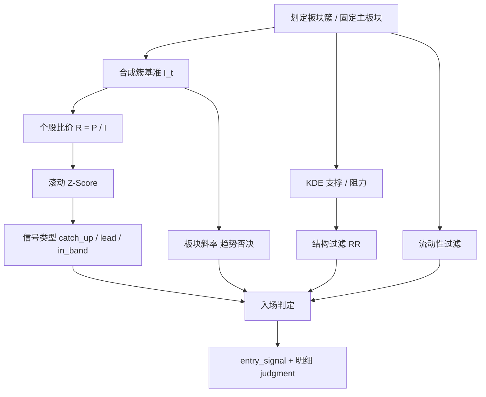

# RPE（比价效应）信号计算规则说明

本文档基于当前代码实现，说明**计算流程、公式、分子/分母含义、名词解释与入场判定**，与选股页「明细」面板口径一致。

- 业务速览：[RPE_比价效应_业务简化版.md](./RPE_比价效应_业务简化版.md)  
- 工程设计：[RPE_STRATEGY_IMPLEMENTATION_DESIGN.md](./RPE_STRATEGY_IMPLEMENTATION_DESIGN.md)  

工程包：`backend_core/strategies/rpe/`（与 GMS **零耦合**）。

---

## 1. 计算流程总览

| 步骤 | 做什么 | 代码入口 |
|------|--------|----------|
| 1 | 确定板块（单股/自选用**主板块**） | `resolve_primary_board` / `screen_board` |
| 2 | 算板块量权基准 \(I_t\) | `compute_vwap_benchmark` |
| 3 | 算比价 \(R=P/I\) 与滚动 \(Z\) | `latest_zscore` |
| 4 | 算 \(I_t\) 斜率，趋势否决 | `sector_slope` / `trend_veto` |
| 5 | KDE 取支撑/阻力 | `extract_kde_levels` |
| 6 | 结构 RR + 流动性 | `structure_filter` / `liquidity_ok` |
| 7 | 组装信号与入场 | `detect_signal` |

单股评估：`RPEStrategyEngine.evaluate_in_sector`；全市场：`screen` → `screen_board`。

---

## 2. 名词解释（与明细面板对齐）

| 名词 / 符号 | 含义 | 明细里怎么看 |
|-------------|------|----------------|
| **板块簇** | 同一行业或概念成分股集合；单股追溯固定一个主板块 | 「板块」行：名称 + `board_code` |
| **收盘价 \(P\)** | 评估日个股收盘价 | 「收盘价」 |
| **板块基准 \(I_t\)** | 该日板块成分股**成交量加权收盘价**（自建，非外部指数） | 「板块基准 \(I_t\)」 |
| **比价 \(R\)** | \(R = P / I\)，个股相对板块的价格比 | 「比价 \(R=P/I\)」 |
| **Z-Score \(Z\)** | 对 \(R\) 序列做滚动标准化后的偏离 | 「Z-Score」+ 窗口（默认 40） |
| **补涨 catch_up** | \(Z\) 过低：相对板块落后 | 信号类型 |
| **领涨 lead** | \(Z\) 过高：相对板块强势 | 默认仅观察 |
| **板块斜率** | 近 N 日 \(I_t\) 线性回归斜率 \(b\) | 「板块斜率」 |
| **趋势否决** | 斜率 &lt; 0 且开启否决 → 禁止入场 | meta「趋势否决」 |
| **最近支撑 \(S\)** | 现价下方最近 KDE 密度峰 | 「最近支撑」 |
| **最近阻力 \(R_{res}\)** | 现价上方最近 KDE 密度峰（无则显示 `-`） | 「最近阻力」 |
| **盈亏比 RR** | 上行空间 / 下行空间 | 「盈亏比 RR」 |
| **结构有效** | 站上支撑且 RR 达标（或无阻力视为空间充足） | 「结构有效」 |
| **入场 entry_signal** | 可交易主信号（补涨主路径） | meta「入场 是/否」 |
| **结构破位** | 收盘 &lt; 结构支撑 → 策略离场 | 离场规则 |

> 注意：文档里阻力位有时记为 \(R_{res}\)，避免与比价 \(R\) 混淆。

---

## 3. 分子、分母与对应取值

### 3.1 板块基准 \(I_t\)（量权均价）

\[
I_t = \frac{\sum_i P_{i,t}\, V_{i,t}}{\sum_i V_{i,t}}
= \frac{\text{分子：价×量之和}}{\text{分母：成交量之和}}
\]

| 角色 | 符号 | 数据来源 | 有效条件 |
|------|------|----------|----------|
| **分子项** | \(P_{i,t} V_{i,t}\) | 成分股当日收盘价 × 成交量 | \(P>0\) 且 \(V>0\)，否则跳过该成分 |
| **分母** | \(\sum V_{i,t}\) | 同上有效成分的成交量合计 | 分母 ≤ 0 则该日无 \(I_t\) |
| **结果** | \(I_t\) | 写入明细 `detail.i_t` | 例：半导体板 92.1304 |

实现：`sector_benchmark.compute_vwap_benchmark`；输出 `[{date, i_t, volume_sum}, ...]`。

### 3.2 比价 \(R_t\)（个股相对基准）

\[
R_t = \frac{P_t}{I_t}
= \frac{\text{分子：个股收盘价}}{\text{分母：同日板块基准}}
\]

| 角色 | 符号 | 含义 | 明细字段 |
|------|------|------|----------|
| **分子** | \(P_t\) | 评估日该股收盘价 | `close` / `price` |
| **分母** | \(I_t\) | 同日簇基准 | `detail.i_t` |
| **结果** | \(R_t\) | 比价 | `ratio`（例：0.3261） |

约束：\(P_t>0\) 且 \(I_t>0\) 才计入序列；实现：`zscore.relative_ratio_series`。

### 3.3 滚动 Z-Score（对 \(R\) 标准化）

窗口 \(w=\max(5,\,z\_window)\)（默认 40）。满窗后：

\[
\mu_t=\frac{1}{w}\sum_{k=t-w+1}^{t} R_k,\quad
\sigma_t=\sqrt{\frac{1}{w}\sum_{k=t-w+1}^{t}(R_k-\mu_t)^2},\quad
Z_t=\frac{R_t-\mu_t}{\sigma_t}
\]

| 角色 | 含义 |
|------|------|
| **分子** | \(R_t - \mu_t\)：当日比价相对窗口均值的偏离 |
| **分母** | \(\sigma_t\)：窗口内比价波动（总体标准差，除以 \(w\)） |
| 特例 | \(\sigma_t \le 10^{-12}\) → \(Z_t=0\)；样本不足 → `no_z` |

### 3.4 盈亏比 RR（结构过滤）

\[
D = P - S,\quad U = R_{res} - P,\quad
\mathrm{RR} = \frac{U}{D}
= \frac{\text{分子：距阻力上行空间}}{\text{分母：距支撑下行空间}}
\]

| 角色 | 符号 | 含义 |
|------|------|------|
| **分子** | \(U\) | 现价到最近阻力的距离 |
| **分母** | \(D\) | 现价到最近支撑的距离 |
| 阈值 | `min_rr_to_resistance` | 默认 ≥ 1.5 才结构通过 |

无上方阻力时：不强制算 RR，记 `structure_valid=true`，`reason=no_resistance`（视为空间充足），明细阻力可为 `-`。

---

## 4. 入场判断逻辑（与明细逐步表一致）

**公式（明细原文）：**

> 入场 = (catch_up 或 允许交易的 lead) AND 未趋势否决 AND 结构有效 AND 流动性通过  

**说明：** 补涨主路径看 \(Z\) 偏低；领涨默认仅观察（`enable_lead_trade=false`）；离场仅认结构破位。

### 4.1 逐步条件

| 条件 | 规则（默认） | 通过含义 |
|------|--------------|----------|
| 补涨 Z | \(Z \le z\_catch\_up\)（-1.5） | 相对落后，类型可为 `catch_up` |
| 领涨 Z | \(Z \ge z\_lead\)（2.0） | 相对领涨；默认不单独构成可交易入场 |
| 板块趋势否决 | `enable_trend_veto` 时要求斜率 ≥ 0 | 斜率 &lt; 0 → 否决入场 |
| 结构过滤 | 站上支撑，且 RR ≥ 1.5（或无阻力） | `structure_valid` |
| 流动性 | 近 20 日均额 ≥ **本档人民币门槛**，且换手 ≥ 0.8%（有换手时） | `liquidity_ok` |
| 入场信号 | catch_up：未否决 + 结构 + 流动性；lead：仅允许交易时同理 | `entry_signal` |

### 4.2 信号类型与 reason

| 条件 | `signal_type` | 典型 `reason` |
|------|---------------|---------------|
| \(Z \le -1.5\) 且过滤全过 | `catch_up` | `catch_up_ok` → **入场=是** |
| \(Z \le -1.5\) 但被挡 | `catch_up` | `catch_up_filtered` → 入场=否，可观察 |
| \(Z \ge 2\) 默认 | `lead` | `lead_watch` |
| \(Z \ge 2\) 且允许交易且过滤过 | `lead` | `lead_trade_ok` |
| 中间带 | 无 / in_band | `in_band` |
| 算不出 Z | — | `no_z` |

引擎写入 `detail.judgment.steps`（条件、规则、实际值、是否通过），供「明细」展开。

---

## 5. KDE 支撑 / 阻力

1. 样本：评估日前近 `lookback_days`（默认 **250**）根 K 线的 close、volume；有效点（价&gt;0 且量&gt;0）&lt; 20 → `insufficient_samples`，支撑/阻力为空  
   - **强制口径**：无论日终选股还是追溯全历史重算，KDE/Z 均只使用该窗口，禁止用全历史算密度（全历史带宽过大易抹平低位峰，导致「无支撑」）  
2. 带宽：\(\mathrm{bw}=\max(0.01,\ \mathrm{kde\_base\_factor}\cdot \sigma_P/\mu_P)\)  
3. **优先**成交量加权 `scipy.stats.gaussian_kde` → 密度峰  
4. **生产注意**：若 API 环境未安装 `scipy`，会回退直方图平滑（`ok_histogram_fallback`）；部署应保证 `scipy` 可用  
5. 峰 &lt; 现价 → 支撑；峰 ≥ 现价 → 阻力（最多各 8 个）  

现价上方无峰 → 最近阻力为空（列表显示 `-`），结构仍可因 `no_resistance` 通过。  
现价下方无峰 → 最近支撑为空；常见于带宽过大或价格跌破唯一密度峰之后。  
若两侧均为 `-`，请在选股「明细」中查看 **KDE 状态**（`detail.kde_reason`）。

---

## 6. 离场规则

**禁止**固定百分比止损作为策略唯一离场理由。

- **结构破位** `structure_break`：收盘价 &lt; 最近有效结构支撑  
- 正式交易 API 提交 `fixed_pct` / `percent_stop` 等 → HTTP 400  
- 观察列表可用实时行情二次确认：现价是否仍在支撑上  

---

## 7. 默认参数一览

来源：`config.get_default_rpe_config()`；库内版本与默认深合并。

| 参数 | 默认 | 作用 |
|------|------|------|
| `lookback_days` | 250 | 回溯交易日 |
| `z_window` | 40 | Z 窗口 |
| `z_catch_up` | -1.5 | 补涨阈值 |
| `z_lead` | 2.0 | 领涨阈值 |
| `sector_slope_window` | 60 | 斜率窗口 |
| `enable_trend_veto` | true | 弱势板块否决 |
| `enable_lead_trade` | false | 领涨可否交易 |
| `kde_base_factor` | 1.0 | KDE 带宽系数 |
| `min_rr_to_resistance` | 1.5 | 结构 RR 下限 |
| `liquidity.lookback_days` | 20 | 流动性窗口 |
| `liquidity.min_avg_amount` | 5e6 | 无分档配置时的回退均额（人民币元） |
| `liquidity.min_avg_turnover_rate` | 0.8 | 日均换手（%） |
| `liquidity.min_avg_amount_by_board` | 见下表 | 按上市板别分层的均额门槛（人民币元，非手数） |

分层均额默认（近 20 日，单位：元）：

| 分档 | 代码段 | 均额下限 |
|------|--------|----------|
| MAIN 主板 | 60x / 000 / 001 | 3000 万 |
| SZ_SME 中小板 | 002 | 2000 万 |
| CYB 创业板 | 300 | 1500 万 |
| KCB 科创板 | 688 | 1500 万 |
| BJ 北证 / DEFAULT | 北证前缀等 | 500 万 |

详见 [RPE_流动性过滤_分层改造方案.md](./RPE_流动性过滤_分层改造方案.md)。

---

## 8. 主板块与去重

- **单股 / 自选 / 强制重算**：每只股票固定**一个主板块**——优先同花顺行业成分（`board_code_source=tonghuashun`）；同 kind 取成分最多，并列 `board_code` 升序；无同花顺行业则回退同花顺概念。追溯全历史同一板块。  
- **列表「板块」列**：与建簇/选板一致；无同花顺行业映射时回退 `stock_basic_info.industry` 并标注「（基础信息）」，再无则 `--`。  
- **显式多选板块**撞车：保留 `|Z|` 最大的一条，再截断 `max_results`。

排序（降序）：`entry_signal` → `catch_up` → `|z_score|`。

---

## 9. 完整计算示例（对齐明细面板）

以示意数据（半导体板、补涨入场）：

| 量 | 取值 | 说明 |
|----|------|------|
| \(P\) | 30.04 | 分子（比价） |
| \(I_t\) | 92.1304 | 分母（比价）/ 量权基准 |
| \(R=P/I\) | 0.3261 | 比价 |
| \(Z\)（窗 40） | -1.516 | ≤ -1.5 → 补涨通过 |
| 板块斜率（窗 60） | 0.116 | ≥ 0 → 未否决 |
| \(S\) / \(R_{res}\) | 25.02 / 51.99 | KDE |
| \(D=P-S\) | 5.02 | RR 分母 |
| \(U=R_{res}-P\) | 21.95 | RR 分子 |
| RR | ≈ 4.38 | ≥ 1.5 → 结构通过 |
| 日均成交额 | 很大 | 流动性通过 |

逐步：补涨 Z 通过、领涨 Z 未通过、趋势否决通过、结构通过、流动性通过、入场信号通过 → **`catch_up` + 入场=是**（`catch_up_ok`）。  
离场：收盘跌破支撑 25.02 → `structure_break`。

若斜率 &lt; 0 且开启否决：仍可为 `catch_up`，但入场=否，`catch_up_filtered`。

---

## 10. 数据、调度与回测

| 项 | 说明 |
|----|------|
| 行情 | `historical_quotes` |
| 成分 | `industry_board_constituents` / 概念成分 |
| 信号表 | `rpe_signal_trace`（按 `config_id`） |
| 日终 | `rpe_signals_cn`，约 19:40，`ENABLE_RPE_PRECOMPUTE` |
| 强制重算 | 追溯页 → 按主板块逐日回写；每日 Z/KDE 仍截断为 `lookback_days` |
| `signal_hit_rate` | N 日内是否触及目标相对涨幅且未先破位 |
| `trade_simulation` | T+1 开盘入；离场：破位 / 触及阻力 / horizon |

实现：`backtest_runner.py`。
