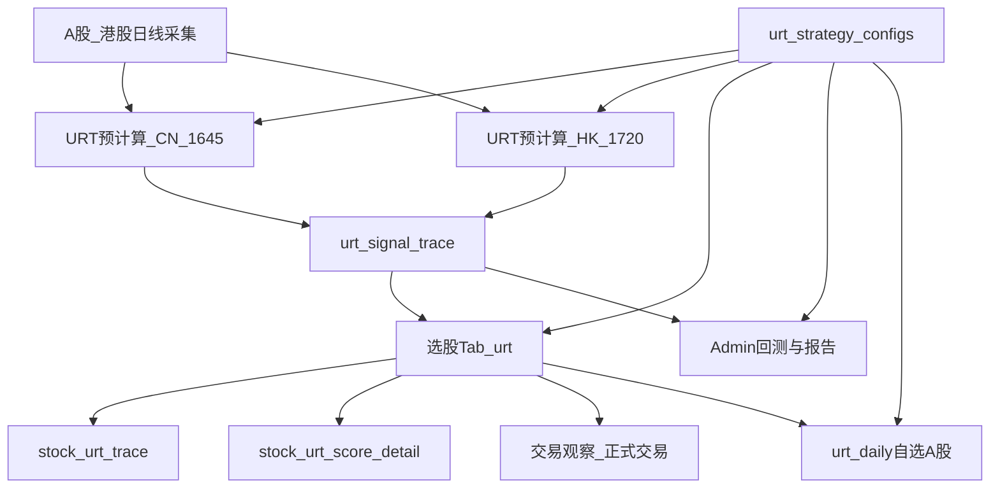

# URT 与 GMS 功能对比及 URT 技术方案

整理日期：2026-08-12（相对 2026-07-23 版大幅修订）  
**口径优先**：当前代码 + [URT_上升趋势_业务简化版.md](./URT_上升趋势_业务简化版.md)  
工程细节：[URT_STRATEGY_IMPLEMENTATION_DESIGN.md](./URT_STRATEGY_IMPLEMENTATION_DESIGN.md)  
回测买卖：[URT策略交易回测说明.md](./URT策略交易回测说明.md)  
历史对照表（可选）：`exported_docs/GMS策略功能模块完成列表.xlsx`

> 本文 §4 中已落地项的旧「待实现方案」保留为**历史方案摘要**（以现实现为准）；未落地项仍写可执行技术方案。

---

## 1. 策略定位差异

| 维度 | GMS | URT（上升趋势策略） |
|------|-----|---------------------|
| 产品名 | 均值引力与动量突变 | 上升趋势（Upward Right-side Trend） |
| 买点逻辑 | **左侧**均值吸附 + **右侧**动量引爆（双轨，`buy_type`） | **仅右侧**趋势：站上 MA20 + 连阳 + 量能确认 |
| 评分 | 双模块阶梯分，标准版 / 增强减分版 | 百分制；多头+6/空头−8；结构 RR **偏低仅软标签**；破位/贴阻力/悬空可**硬闸**否决买点 |
| 数据主源 | `mean_frequency_resonance_indicators` + MA60 等 | `historical_quotes` / `historical_quotes_hk` 现算；无 Query 覆盖时可读 `urt_signal_trace` |
| 覆盖市场 | A股 / 港股 / **ETF** / **策略版本观察股池** / 自选 / 行业概念等 | A股全市场、港股全市场、自选、行业/概念（多选）、单股（**仅 6 位 A 股**）；**无独立 ETF scope**；**无 GMS 式版本观察股池** |
| 日报 | `gms_daily`（覆盖面以 GMS 配置为准） | `urt_daily`：**仅用户自选中的 A 股**（港股/5 位码跳过） |
| 总体完成度（粗估） | 约 95% | 约 **92%**（交易观察/正式交易/港股选股与预计算/日报/选股版本 UI 已落地；缺口见 §2） |

---

## 2. 功能模块对照

状态约定：**已实现** / **部分实现** / **未实现**。URT 列以代码与业务简化版为准。

| 功能模块 | GMS | URT | URT 状态 |
|----------|-----|-----|----------|
| 策略引擎 / 打分 | 双模块 + 减分机制注册表 | 硬筛 + `compute_score` | **已实现** |
| 左 / 右侧买点 | `detect_left_buy` / `detect_right_buy` | 无左侧轨；仅右侧趋势买点 | **不适用**（策略定位差异，非缺口） |
| 离场纪律 | 回测内出场逻辑 | `evaluate_exit_rules`；回测 `exit_mode=hit_rate\|risk_exit` | **已实现**（默认仍为命中率模式） |
| 选股 API / Tab | `/api/screening/gms-strategy` | `/api/screening/urt-strategy` | **已实现** |
| 选股页参数版本 UI | 有 | `GET /api/frontend/urt/strategy-configs` + `#urt-config_id`，查询传 `config_id` | **已实现** |
| A 股板块多选 | 有（`cn_board_segment`） | 同参数；MAIN/CYB/SZ_SME/KCB/BJ 并集；空=不限 | **已实现** |
| 行业 / 概念多选 | 有 | `industry_board` / `concept_board`；可挂 `role_tags`（不参与硬筛） | **已实现** |
| ST 剔除 | 可选 `exclude_st` 等 | 候选池名称 `LIKE '%ST%'` **硬剔除**（无选股勾选开关） | **部分实现**（效果有，交互无开关） |
| 港股 scope | 有 | `scope=hk` + `historical_quotes_hk`；预计算约 17:20 | **已实现** |
| ETF scope | 有（可配置开关） | 选股 allowed scope **无** `etf` | **未实现** |
| 单股分析 | 支持更广代码解析 | `scope=single` 跳过硬筛出明细；**仅 6 位 A 股** | **部分实现** |
| 信号预计算 | 全 A / 港股 / 自定义 / 自选等 | A 股约 16:45 + 港股约 17:20（`ENABLE_URT_PRECOMPUTE`）；写入 `urt_signal_trace` | **已实现**（A/港全市场日终；自选/板块选股多为实时或读当日买点缓存） |
| 信号历史 / 明细 / 重算 | 有 | 有 | **已实现** |
| 追溯页单股回测 | 有 | `/api/stock/urt-backtest` | **已实现** |
| Admin 参数多版本 | 有（含 clone/compare） | CRUD + 默认参数 + `precompute_enabled` | **已实现**（能力面略精简） |
| Admin 回测 / 报告 | 有 | 命中率 + 纪律出场；CSV/xlsx | **已实现**（回测市场暂仅 A 股） |
| 观察股**版本池** | `gms_strategy_versions*` / `scope=gms_watchlist` | 无对等「按版本维护观察池」 | **未实现** |
| 交易观察 / 正式交易 | 有 | `urt_trade_observe*`、`urt_formal_trade*`；选股页三子面板 | **已实现** |
| 推送日报 | `gms_daily` | `urt_daily`（自选 A 股：买点 + 连阳补充） | **已实现** |
| 选股页「刷新筛选」 | 有 | 改 scope/板块/版本/量能/得分后须点刷新 | **已实现** |
| Admin 审计 / 系统状态 | 有 | `/system/status`、`/audit-logs` | **已实现** |
| 个股详情策略卡片 | 有 | `stock.js` URT 卡片 | **已实现** |
| 独立 migrations | 较完整 | 核心表 + 交易表迁移 | **已实现** |
| 配置库表 | 有 | `urt_strategy_configs` 等；DB 默认版本优先于 JSON | **已实现** |

---

## 3. URT 已落地主链路



核心落点：

| 层级 | 落点 |
|------|------|
| Core | `backend_core/strategies/urt/` |
| 选股 | `GET /api/screening/urt-strategy`（`scope`：`cn`/`hk`/`watchlist`/`industry_board`/`concept_board`/`single`） |
| 前台公开配置 | `GET /api/frontend/urt/strategy-configs` |
| 前台信号 / 交易 | `/api/stock/urt-signal-trace*`、`/urt-score-detail`、`urt-trade-observe*`、`urt-formal-trade*` |
| Admin | `/api/admin/urt/*`，页面 `/urt-management` |
| 表 | `urt_strategy_configs`、`urt_signal_trace`、`urt_backtest_tasks`、`urt_trace_recompute_tasks`、交易观察/正式交易相关表 |
| 调度 | `ENABLE_URT_PRECOMPUTE`：工作日 A 股约 **16:45** / 港股约 **17:20** |
| 日报 | `report_type=urt_daily`，建议约 **17:30**（晚于预计算） |

业务规则全文见：[URT_上升趋势_业务简化版.md](./URT_上升趋势_业务简化版.md)。

---

## 4. 技术方案：已落地 vs 待办

### 4.1 已落地（原「高/中优先级」方案 → 现实现）

下列条目在 2026-07 文档中曾标「待实现」；**现以实现为准**。旧方案文字仅作归档，不再按待办推进。

| 项 | 现状态 | 实现要点（摘要） |
|----|--------|------------------|
| A. 选股页参数版本下拉 | **已实现** | 前台只读配置列表 + `#urt-config_id` 写入 `config_id`；可与页面级 `volume_multiple` / `min_score` 覆盖并存（有覆盖不走预计算缓存） |
| B. 回测接入 `evaluate_exit_rules` | **已实现** | `exit_mode=hit_rate\|risk_exit`；细则见 [URT策略交易回测说明.md](./URT策略交易回测说明.md) |
| C. 交易观察 + 正式交易 | **已实现** | 独立 URT 表与路由（不复用 GMS 表）；选股页「策略信号 / 交易观察 / 正式交易」三子面板 |
| D. 收盘推送 `urt_daily` | **已实现** | 复用 `push_service` / `report_service`；**仅自选 A 股**；买点 + 连阳补充；休市跳过。详见本文 §7 |
| E. 港股 scope + 预计算 | **已实现** | `URTDataLoader` + `historical_quotes_hk`；`scheduled_urt_signals_hk`；选股 `scope=hk`。**注意**：单股 scope、日报、回测仍不含港股 |

> **历史方案**：上表各项的逐步设计稿曾对齐 GMS 垂直切片；若需对照旧接口草案，以仓库 git 历史中本文件 2026-07-23 版为准，**勿再按旧「未实现」表述改代码或排期。**

### 4.2 仍待实现 / 待产品确认

#### F. ETF 独立选股池（未实现）

- **现状**：URT 选股 scope 无 `etf`；GMS 有 `scope=etf`（可开关）。
- **若要做**：扩展候选加载（ETF 基础信息 + 行情表）、预计算是否纳入、权限与 UI 开关；**需产品确认**是否纳入 URT 右侧趋势口径。
- **原则**：继续垂直切片，不引入 MFR / 双模块评分。

#### G. GMS 式「策略版本观察股池」（未实现）

- **现状**：URT 已有**用户侧**交易观察列表；**没有**管理端按策略版本维护、并以 `scope=…_watchlist` 选股的版本池（GMS：`gms_strategy_versions*` / `gms_watchlist`）。
- **若要做**：独立 `urt_*` 版本池表 + Admin + 选股 scope；**勿复用 GMS 表**。是否与现有「交易观察」合并，**待产品确认**。

#### H. 单股 / 回测 / 日报的港股与代码面扩展（部分实现 → 待确认）

| 缺口 | 现状 | 备注 |
|------|------|------|
| 单股 `scope=single` | 仅 6 位 A 股 | 港股单股明细是否开放待确认 |
| Admin 回测 | 仅 A 股 | 港股回测数据与交易日历成本需评估 |
| `urt_daily` | 仅自选 A 股 | 是否推港股自选待产品确认 |
| ST 剔除开关 | 候选池硬剔除 | 是否要做 GMS 式可选 `exclude_st` 待确认 |

#### I. 其它低优先级（可选）

| 项 | 说明 | 状态 |
|----|------|------|
| Admin clone/compare 参数版本 | GMS 更完整；URT 已有 CRUD/默认 | 体验增强，非阻塞 |
| 管理端独立「选股结果中心」 | 配置页有试算，无独立结果中心 | 可选；网站端选股已可用 |

### 4.3 早期运维项（均已完成，归档）

| 项 | 状态 |
|----|------|
| Admin 审计 / 系统状态 | **已完成** |
| 个股详情 URT 卡片 | **已完成** |
| 独立 migrations（核心 + 交易表） | **已完成** |
| 追溯页单股回测 | **已完成** |
| 报告 xlsx（`/export-xlsx`） | **已完成** |

---

## 5. 建议迭代顺序（更新后）

1. **产品确认缺口**：ETF 是否纳入 URT；版本观察股池是否要做；港股单股/日报/回测是否扩展。  
2. **若确认做市场扩展**：ETF 选股 →（可选）港股单股明细 / 日报。  
3. **若确认做管理端池**：版本观察股池（与交易观察关系先定稿）。  
4. **体验增强（可选）**：ST 可选开关、Admin 参数 compare、管理端选股结果中心。

原则：继续「垂直切片」对齐 GMS **能力面**，但不引入 MFR / 双模块评分体系；业务口径以 [业务简化版](./URT_上升趋势_业务简化版.md) 为准。

---

## 6. 配套清单文件

业务视角完成列表（可导入 Excel）：

- 生成脚本：`generate_urt_completion_excel.py`（已与本文 §2 对齐；若再改能力请同步脚本或重跑导出）
- 输出文件：`exported_docs/URT上升趋势策略功能模块列表.xlsx`

运行：

```bash
python generate_urt_completion_excel.py
```

---

## 7. 收盘推送（urt_daily）

管理端配置 `report_type=urt_daily` 后，系统将按推送时间对**自选股中的 A 股**标的生成 URT Excel，经邮件/企业微信发送；A 股休市日自动跳过，管道与 `gms_daily` 一致。港股与 5 位数字码不进入该日报。

**Excel 列**（对齐选股页）：股票代码、股票名称、信号日、收盘、MA20、4日阳、5日阳、量能倍数、量比、换手%、得分、是否买点。

**收录规则**：

1. 当日正式买点（`buy_signal=true`）一律收录；  
2. 无买点的自选股，若满足策略连阳硬筛（**4日阳≥3 或 5日阳≥4**），也一并列出（「是否买点=否」，观察补充，**不是**正式买点）。

**时间建议**：推送设单点且晚于 A 股预计算（默认 16:45），例如 **17:30**；勿设多个偏早时间点（行情/预计算未就绪会推到旧信号日）。

更细口径见业务简化版 §4、§6.4、§9.3。
