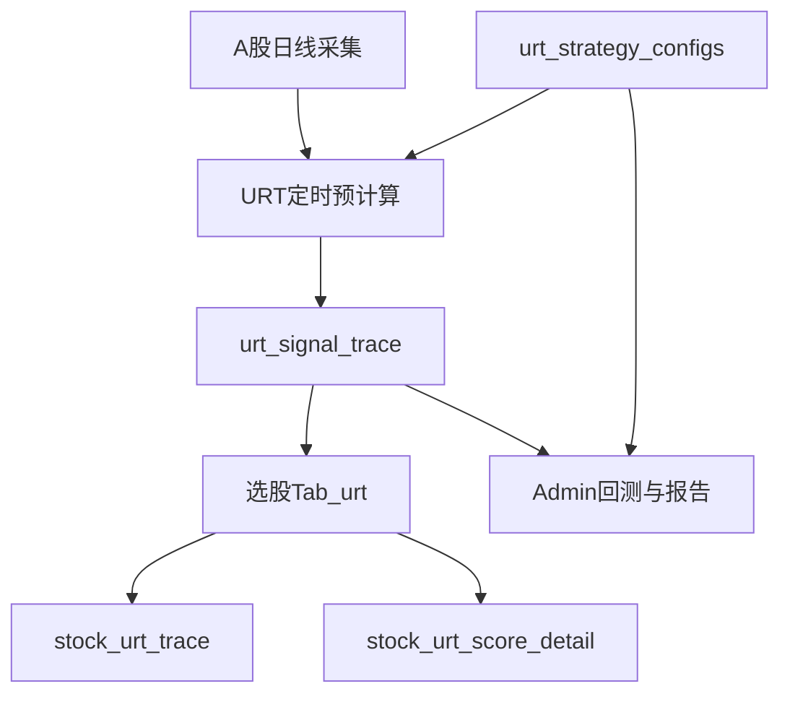

# URT 与 GMS 功能对比及 URT 技术方案

整理日期：2026-07-23  
对照基准：`exported_docs/GMS策略功能模块完成列表.xlsx`、`docs/strategies/urt/URT_STRATEGY_IMPLEMENTATION_DESIGN.md`

## 1. 策略定位差异

| 维度 | GMS | URT（上升趋势策略） |
|------|-----|---------------------|
| 产品名 | 均值引力与动量突变 | 上升趋势（Upward Right-side Trend） |
| 买点逻辑 | 左侧均值吸附 + 右侧动量引爆 | 右侧趋势：站上 MA20 + 连阳 + 量能确认 |
| 评分 | 双模块阶梯分，标准版 / 增强减分版 | 百分制固定规则（MA20 / 连阳 / 量能 + 可选换手量比） |
| 数据主源 | `mean_frequency_resonance_indicators` + MA60 | `historical_quotes` 现算 MA / 量能 / 连阳 |
| 覆盖市场 | A股 / 港股 / ETF / 观察股池等 | 当前以 A 股为主（全市场/自选/行业/概念/单股） |
| 总体完成度 | 约 95% | 约 78%（Phase 5 运维与体验已落地） |

## 2. 功能模块对照

| 功能模块 | GMS | URT | URT 状态 |
|----------|-----|-----|----------|
| 策略引擎 / 打分 | 双模块 + 减分机制注册表 | 硬筛 + `compute_score` | 已完成 |
| 离场纪律 | 回测内出场逻辑 | `evaluate_exit_rules` 有实现，回测未接入 | 部分完成 |
| 选股 API / Tab | `/api/screening/gms-strategy` | `/api/screening/urt-strategy` | 已完成 |
| 选股页参数版本 UI | 有 | API 支持 `config_id`，页面未传 | 部分完成 |
| 港股 / ETF scope | 有 | 无 | 未实现 |
| 信号预计算 | 全 A / 港股 / 自定义 / 自选 | 仅全 A | 部分完成（A 股已完成） |
| 信号历史 / 明细 / 重算 | 有 | 有 | 已完成 |
| 追溯页单股回测 | 有 | 有 | 已完成（`/api/stock/urt-backtest`） |
| Admin 参数多版本 | 有（含 clone/compare） | 有（CRUD + 默认参数） | 已完成 |
| Admin 回测 / 报告 | 有 | 有（命中率模式） | 已完成 |
| 观察股版本池 | `gms_strategy_versions*` | 无 | 未实现 |
| 交易观察 / 正式交易 | 有 | 无 | 未实现 |
| 推送日报 | `gms_daily` | 无 | 未实现 |
| Admin 审计 / 系统状态 | 有 | 有 | 已完成（`/system/status`、`/audit-logs`） |
| 个股详情策略卡片 | 有 | 有 | 已完成（`stock.js` URT 卡片） |
| 独立 migrations 套件 | 较完整 | 核心表已补 | 已完成（`add_urt_core_tables.py`） |

## 3. URT 已落地主链路



核心落点：

| 层级 | 落点 |
|------|------|
| Core | `backend_core/strategies/urt/` |
| 选股 | `GET /api/screening/urt-strategy` |
| 前台信号 | `/api/stock/urt-signal-trace*`、`/urt-score-detail` |
| Admin | `/api/admin/urt/*`，页面 `/urt-management` |
| 表 | `urt_strategy_configs`、`urt_signal_trace`、`urt_backtest_tasks`、`urt_trace_recompute_tasks` |
| 调度 | `ENABLE_URT_PRECOMPUTE`，默认工作日 A 股 **16:45** / 港股 **17:20** |

## 4. 待优化 / 待实现技术方案

### 4.1 高优先级

#### A. 选股页参数版本下拉

- **现状**：后端支持 `config_id`；`screening.js` 构建 URT 查询时不传版本。
- **方案**：
  1. 增加前台配置列表接口（可复用 Admin `GET /api/admin/urt/strategy-configs`，或新增只读 `GET /api/frontend/urt/strategy-configs`）。
  2. 在上升趋势 Tab 增加版本下拉，写入 `config_id`。
  3. 与页面级 `volume_multiple` / `min_score` 覆盖并存（覆盖不落库）。
- **参考**：GMS 选股页版本切换逻辑。

#### B. 回测接入 `evaluate_exit_rules`

- **现状**：命中率回测 `apply_stop_loss=False`；离场函数与 `risk.*` 配置已存在。
- **方案**：
  1. 在 `backtest_runner.py` 任务参数增加 `exit_mode=hit_rate|risk_exit`（默认 `hit_rate` 保持兼容）。
  2. `risk_exit` 模式：持仓期内逐日调用 `evaluate_exit_rules`（价格止损 / 连跌 / 回撤止盈）。
  3. 同步更新 `docs/strategies/urt/URT策略交易回测说明.md`，消除流程图与实现不一致。
- **参考**：GMS `backtest_runner` 出场分支。

### 4.2 中优先级

#### C. 观察股 + 正式交易

- **方案（垂直切片对齐 GMS，不复用 GMS 表）**：
  - 表：`urt_trade_observe_stocks`、`urt_trade_observe_history`、`urt_formal_trades`
  - API：`/api/stock/urt-trade-observe*`、`/api/stock/urt-formal-trade*`
  - 前端：选股页「策略信号 / 交易观察 / 正式交易」三子面板
  - 权限码：`channel.screening.tab.urt.*` 扩展观察/交易按钮
- **原则**：先观察列表与归档，再正式交易记账；价格计划可后置。

#### D. 收盘推送

- **方案**：新增 `report_type=urt_daily`，复用 `push_service` / `report_service` 管道；内容为自选或当日 URT 买点列表 Excel；休市日跳过。
- **参考**：`gms_daily`。

#### E. 港股 scope + 预计算

- **方案**：
  1. `URTDataLoader` 支持港股候选与 `historical_quotes_hk`。
  2. `scheduled_urt_signals_hk` + `main.py` 注册（`SCHED_URT_SIGNALS_HK_*`）。
  3. 选股 `scope=hk`。
- **注意**：连阳/量能规则沿用 A 股定义，先验证标的池与字段兼容性。

### 4.3 低优先级

| 项 | 技术方案要点 | 状态 |
|----|--------------|------|
| Admin 审计 / 系统状态 | 对齐 GMS：`/audit-logs`、`/system/status`；审计写 `operation_logs`（`urt_*`） | **已完成** |
| 个股详情 URT 卡片 | `stock.js` 调 `urt-score-detail` / 单股选股接口 | **已完成** |
| 独立 migrations | 为 `urt_strategy_configs`、`urt_signal_trace`、`urt_backtest_tasks` 补正式 SQL/Python 迁移 | **已完成** |
| 追溯页单股回测 | 镜像 GMS trace 页回测入口，复用 Admin 回测创建 API | **已完成**（前台 `/api/stock/urt-backtest`） |
| 报告 xlsx | 在现有 CSV 外增加 openpyxl 导出 | **已完成**（`/export-xlsx`） |

## 5. 建议迭代顺序

1. **体验一致性**：选股页参数版本 UI  
2. **规则闭环**：回测 `risk_exit` 模式  
3. **交易闭环**：观察股 → 正式交易 → 推送  
4. **市场扩展**：港股  
5. **运维完善**：审计、系统状态、migrations、详情卡片 — **Phase 5 已落地**

原则：继续「垂直切片」对齐 GMS 能力面，但不引入 MFR / 双模块评分体系。

## 6. 配套清单文件

业务视角完成列表（可导入 Excel）：

- 生成脚本：`generate_urt_completion_excel.py`
- 输出文件：`exported_docs/URT上升趋势策略功能模块列表.xlsx`

运行：

```bash
python generate_urt_completion_excel.py
```

## 7. 收盘推送（urt_daily）

管理端配置 `report_type=urt_daily` 后，系统将按推送时间对自选股中的 A 股标的生成 URT Excel，经邮件/企业微信发送；A 股休市日自动跳过，管道与 `gms_daily` 一致。

**Excel 列**（对齐选股页）：股票代码、股票名称、信号日、收盘、MA20、4日阳、5日阳、量能倍数、量比、换手%、得分、是否买点。

**收录规则**：

1. 当日正式买点（`buy_signal=true`）一律收录；  
2. 无买点的自选股，若满足策略连阳硬筛（**4日阳≥3 或 5日阳≥4**），也一并列出。

**时间建议**：推送设单点且晚于 A 股预计算（默认 16:45），例如 **17:30**；勿设多个偏早时间点（行情/预计算未就绪会推到旧信号日）。
