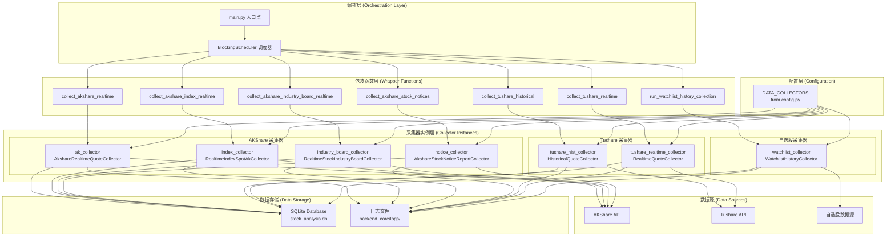
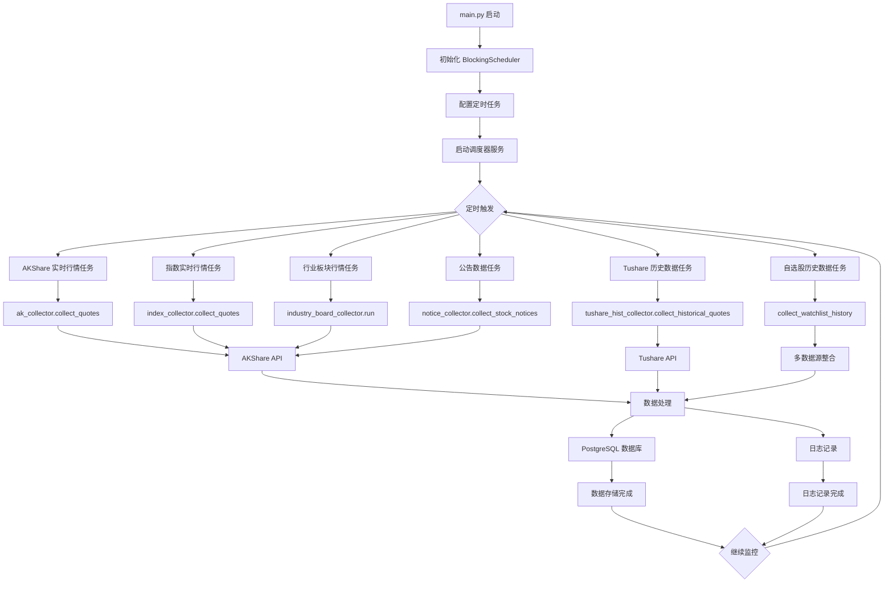
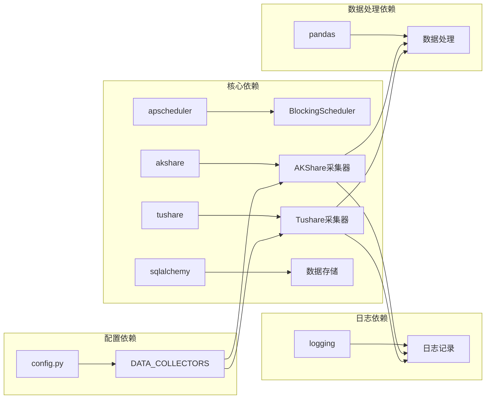
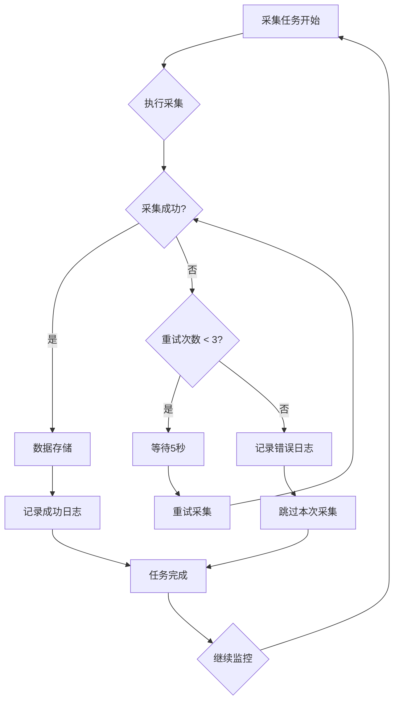

# 数据采集架构与组件图

## 系统架构概览

本系统采用分层架构设计，通过调度器统一管理各种数据采集任务，实现股票数据的自动化采集和处理。

---

## 核心组件层次结构

### 1. 编排层 (Orchestration Layer)

#### 1.1 main.py 入口点

- **功能**: 系统启动入口，初始化调度器和配置
- **职责**:
  - 初始化 BlockingScheduler
  - 配置定时任务
  - 启动调度器服务

#### 1.2 BlockingScheduler 调度器

- **功能**: 核心调度组件，负责定时触发数据采集任务
- **配置**: 基于 APScheduler 库实现
- **调度策略**:
  - 实时行情: 交易时间每 15 分钟
  - 历史数据: 每日收盘后
  - 指数数据: 每 20 分钟
  - 行业板块: 每 30 分钟
  - 公告数据: 每 60 分钟

### 2. 包装函数层 (Wrapper Functions Layer)

#### 2.1 实时数据采集包装函数

```python
def collect_akshare_realtime():
    """AKShare 实时行情采集包装函数"""

def collect_akshare_index_realtime():
    """AKShare 指数实时行情采集包装函数"""

def collect_akshare_industry_board_realtime():
    """行业板块实时行情采集包装函数"""
```

#### 2.2 历史数据采集包装函数

```python
def collect_tushare_historical():
    """Tushare 历史行情采集包装函数"""

def run_watchlist_history_collection():
    """自选股历史行情采集包装函数"""
```

#### 2.3 其他数据采集包装函数

```python
def collect_tushare_realtime():
    """Tushare 实时行情采集包装函数"""

def collect_akshare_stock_notices():
    """A股公告数据采集包装函数"""
```

### 3. 采集器实例层 (Collector Instances Layer)

#### 3.1 AKShare 采集器实例

- **AkshareRealtimeQuoteCollector** (ak_collector)
  - 功能: 采集 A 股实时行情数据
  - 数据源: AKShare API
  - 采集频率: 交易时间每 15 分钟

- **RealtimeIndexSpotAkCollector** (index_collector)
  - 功能: 采集指数实时行情
  - 数据源: AKShare 指数 API
  - 采集频率: 每 20 分钟

- **RealtimeStockIndustryBoardCollector** (industry_board_collector)
  - 功能: 采集行业板块实时行情
  - 数据源: AKShare 行业板块 API
  - 采集频率: 每 30 分钟

- **AkshareStockNoticeReportCollector** (notice_collector)
  - 功能: 采集 A 股公告数据
  - 数据源: AKShare 公告 API
  - 采集频率: 每 60 分钟

#### 3.2 Tushare 采集器实例

- **HistoricalQuoteCollector** (tushare_hist_collector)
  - 功能: 采集历史行情数据
  - 数据源: Tushare API
  - 采集频率: 每日收盘后

- **RealtimeQuoteCollector** (tushare_realtime_collector)
  - 功能: 采集实时行情数据
  - 数据源: Tushare API
  - 采集频率: 每 5 分钟（暂未启用）

#### 3.3 自选股采集器实例

- **WatchlistHistoryCollector** (watchlist_collector)
  - 功能: 采集自选股历史行情
  - 数据源: 多数据源整合
  - 采集频率: 每日下午 3 点

### 4. 配置层 (Configuration Layer)

#### 4.1 DATA_COLLECTORS 配置

```python
DATA_COLLECTORS = {
    'tushare': {
        'max_retries': 3,
        'retry_delay': 5,
        'timeout': 30,
        'log_dir': 'logs',
        'db_file': 'stock_analysis.db',
        'max_connection_errors': 10,
        'token': 'tushare_token'
    },
    'akshare': {
        'max_retries': 3,
        'retry_delay': 5,
        'timeout': 30,
        'log_dir': 'logs',
        'db_file': 'stock_analysis.db',
        'max_connection_errors': 10
    }
}
```

---

## 系统架构图



---

## 数据流向图

### 文本示意

```
┌─────────────────┐
│   main.py       │ ← 系统入口点
│   Entry Point   │
└─────────┬───────┘
          │
          ▼
┌─────────────────┐
│ BlockingScheduler│ ← 核心调度器
│   scheduler     │
└─────────┬───────┘
          │
          ▼
┌─────────────────────────────────────────────────────────┐
│                 Wrapper Functions                      │
├─────────────────┬─────────────────┬─────────────────────┤
│collect_akshare_ │collect_tushare_ │collect_akshare_     │
│realtime()       │historical()     │index_realtime()     │
├─────────────────┼─────────────────┼─────────────────────┤
│collect_akshare_ │run_watchlist_   │collect_akshare_     │
│industry_board_  │history_         │stock_notices()      │
│realtime()       │collection()     │                     │
└─────────┬───────┴─────────┬───────┴─────────┬───────────┘
          │                 │                 │
          ▼                 ▼                 ▼
┌─────────────────┐ ┌─────────────────┐ ┌─────────────────┐
│ Collector       │ │ Collector       │ │ Collector       │
│ Instances       │ │ Instances       │ │ Instances       │
├─────────────────┤ ├─────────────────┤ ├─────────────────┤
│ak_collector     │ │tushare_hist_    │ │index_collector  │
│(AkshareRealtime)│ │collector        │ │(RealtimeIndex)  │
├─────────────────┤ ├─────────────────┤ ├─────────────────┤
│industry_board_  │ │tushare_realtime_│ │notice_collector │
│collector        │ │collector        │ │(StockNotices)   │
└─────────┬───────┘ └─────────┬───────┘ └─────────┬───────┘
          │                   │                   │
          └───────────────────┼───────────────────┘
                              │
                              ▼
                    ┌─────────────────┐
                    │ DATA_COLLECTORS │ ← 统一配置管理
                    │   from config   │
                    └─────────────────┘
```

### 流程图



---

## 定时任务配置与调度

### 定时任务配置

**实时数据采集任务**

- **AKShare 实时行情**: 交易时间 9:00-11:30, 13:30-15:30，每 15 分钟
- **指数实时行情**: 交易时间 9:00-16:00，每 20 分钟 (11,31,51 分)
- **行业板块行情**: 交易时间 9:00-17:00，每 30 分钟 (10,40 分)

**历史数据采集任务**

- **Tushare 历史数据**: 每日 10:25 执行
- **自选股历史数据**: 每日 13:56 执行

**其他数据采集任务**

- **A股公告数据**: 每 60 分钟执行一次
- **Tushare 实时数据**: 每 5 分钟（暂未启用）

### 定时任务调度图

```mermaid
gantt
    title 数据采集定时任务调度表
    dateFormat  HH:mm
    axisFormat %H:%M

    section AKShare 实时行情
    AKShare实时行情     :09:00, 15:30, 15min

    section 指数实时行情
    指数实时行情       :09:00, 16:00, 20min

    section 行业板块行情
    行业板块行情       :09:00, 17:00, 30min

    section Tushare 历史数据
    Tushare历史数据     :10:25, 10:25, 1d

    section 自选股历史数据
    自选股历史数据     :13:56, 13:56, 1d

    section 公告数据
    公告数据          :00:00, 23:59, 60min
```



---

## 组件依赖关系图



---

## 错误处理与重试机制

### 重试配置

- **最大重试次数**: 3 次
- **重试延迟**: 5 秒
- **请求超时**: 30 秒
- **最大连接错误**: 10 次

### 异常处理

- 每个包装函数都包含 try-catch 异常处理
- 详细的日志记录
- 优雅的错误恢复机制

### 错误处理流程图



---

## 数据存储

### 数据库配置

- **数据库文件**: stock_analysis.db
- **存储位置**: database/ 目录
- **支持的数据类型**: SQLite

### 日志管理

- **日志目录**: backend_core/logs/
- **日志级别**: INFO
- **日志格式**: 时间戳 + 级别 + 消息

---

## 扩展性设计

### 新增采集器

1. 在对应数据源目录下创建新的采集器类
2. 在 main.py 中初始化采集器实例
3. 创建对应的包装函数
4. 在调度器中添加定时任务

### 配置管理

- 统一的 DATA_COLLECTORS 配置
- 支持不同数据源的独立配置
- 灵活的调度策略配置

---

## 监控和维护

### 运行状态监控

- 详细的执行日志
- 采集成功率统计
- 异常情况告警

### 性能优化

- 异步采集支持
- 连接池管理
- 数据缓存机制
