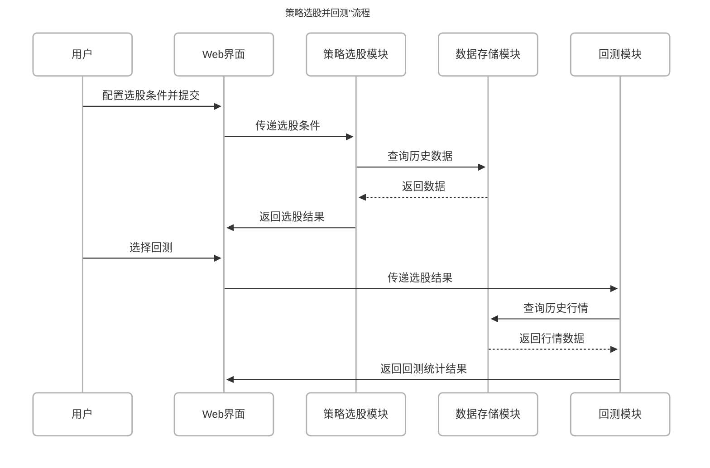
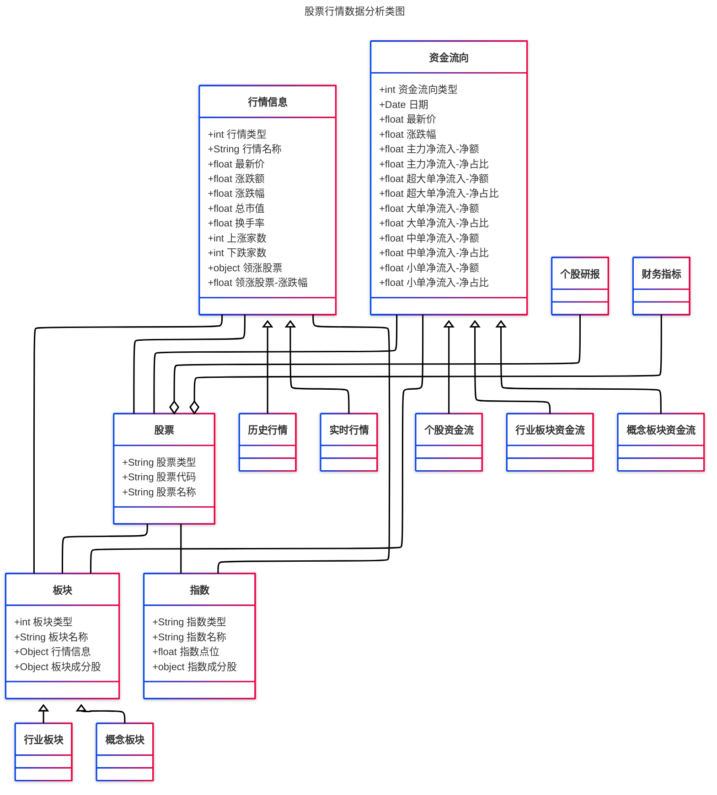
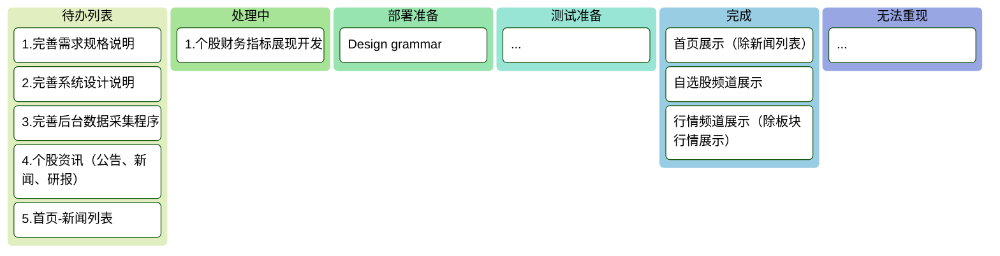

```mermaid
---
config:
  look: neo
  theme: neo
  layout: elk
title: 策略选股并回测"流程
---
sequenceDiagram
    participant 用户
    participant Web界面
    participant 策略选股模块
    participant 数据存储模块
    participant 回测模块

    用户->>Web界面: 配置选股条件并提交
    Web界面->>策略选股模块: 传递选股条件
    策略选股模块->>数据存储模块: 查询历史数据
    数据存储模块-->>策略选股模块: 返回数据
    策略选股模块->>Web界面: 返回选股结果
    用户->>Web界面: 选择回测
    Web界面->>回测模块: 传递选股结果
    回测模块->>数据存储模块: 查询历史行情
    数据存储模块-->>回测模块: 返回行情数据
    回测模块->>Web界面: 返回回测统计结果
```

```mermaid
---
config:
  look: neo
  theme: neo
  layout: elk
title: 股票行情数据分析类图
---
classDiagram
direction TB
    class 板块 {
	    +int 板块类型
	    +String 板块名称
	    +Object 行情信息
	    +Object 板块成分股
    }
    class 股票 {
	    +String 股票类型
	    +String 股票代码
	    +String 股票名称
    }
    class 行业板块 {
    }
    class 概念板块 {
    }
    class 行情信息 {
	    +int 行情类型
	    +String 行情名称
	    +float 最新价
	    +float 涨跌额
	    +float 涨跌幅
	    +float 总市值
	    +float 换手率
	    +int 上涨家数
	    +int 下跌家数
	    +object 领涨股票
	    +float 领涨股票-涨跌幅
    }
    class 指数 {
	    +String 指数类型
	    +String 指数名称
	    +float 指数点位
	    +object 指数成分股
    }
    class 历史行情 {
    }
    class 实时行情 {
    }
    class 资金流向 {
      +int 资金流向类型
	    +Date 日期
	    +float 最新价
	    +float 涨跌幅
	    +float 主力净流入-净额
	    +float 主力净流入-净占比
	    +float 超大单净流入-净额
	    +float 超大单净流入-净占比	
	    +float 大单净流入-净额
	    +float 大单净流入-净占比
	    +float 中单净流入-净额
      +float 中单净流入-净占比
      +float 小单净流入-净额
      +float 小单净流入-净占比
    
    }
    class 个股资金流 {
    }
    class 行业板块资金流 {
    }
    class 概念板块资金流 {
    }
    class 个股研报 {
    }
    class 财务指标 {
    }

    板块 <|-- 行业板块
    板块 <|-- 概念板块
    行情信息 <|-- 实时行情
    行情信息 <|-- 历史行情
    行情信息 -- 股票
    行情信息 -- 指数
    股票 -- 指数
    股票 -- 板块
    行情信息 -- 板块
    资金流向 <|-- 个股资金流
    资金流向 <|-- 行业板块资金流
    资金流向 <|-- 概念板块资金流
    资金流向 -- 股票
    资金流向 -- 板块
    个股研报 --o 股票
    财务指标 --o 股票

```

```mermaid
---
config:
  kanban:
    ticketBaseUrl: https://mermaidchart.atlassian.net/browse/#TICKET#
  theme: forest
---
kanban
  待办列表
    [1.完善需求规格说明]
    [2.完善系统设计说明]
    [3.完善后台数据采集程序]
    [4.个股资讯（公告、新闻、研报）]
    [5.首页-新闻列表]

  [处理中]
    [1.个股财务指标展现开发]
  [部署准备]
    [Design grammar]
  [测试准备]
    [...]
  [完成]
    [首页展示（除新闻列表）]
    [自选股频道展示]
    [行情频道展示（除板块行情展示）]
  [无法重现]
    [...]
    
```