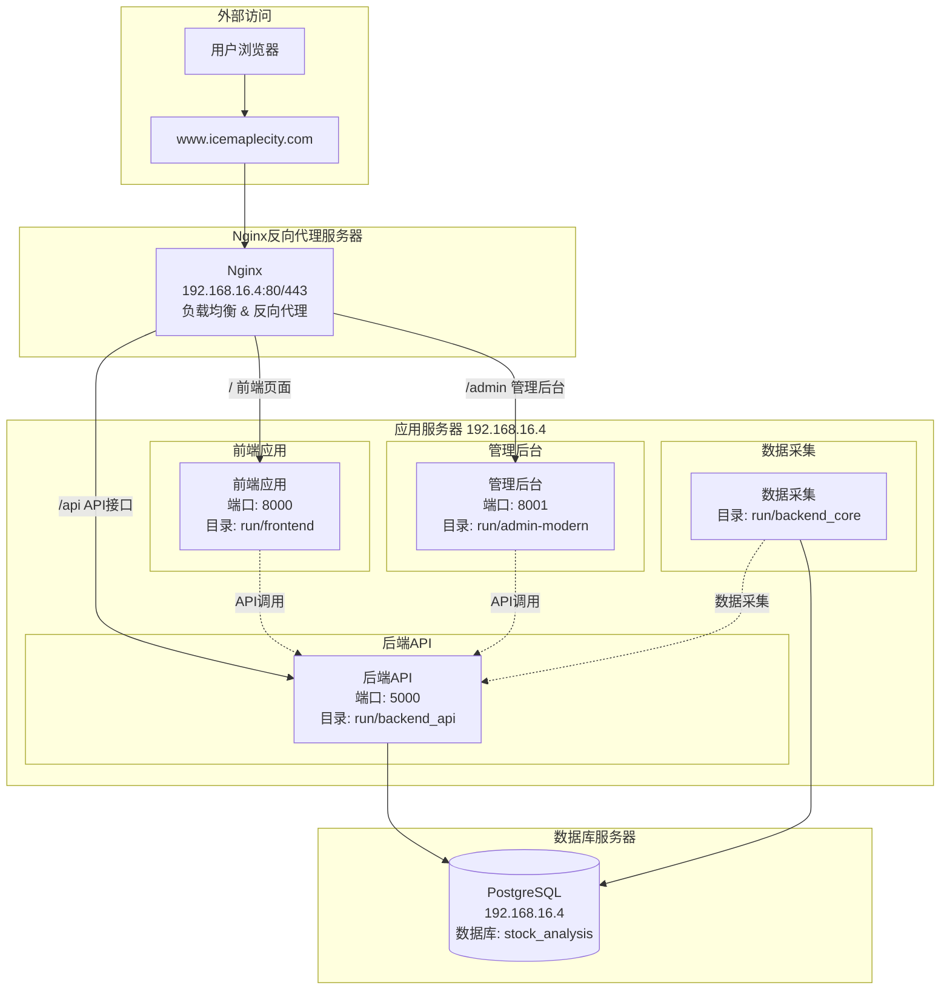
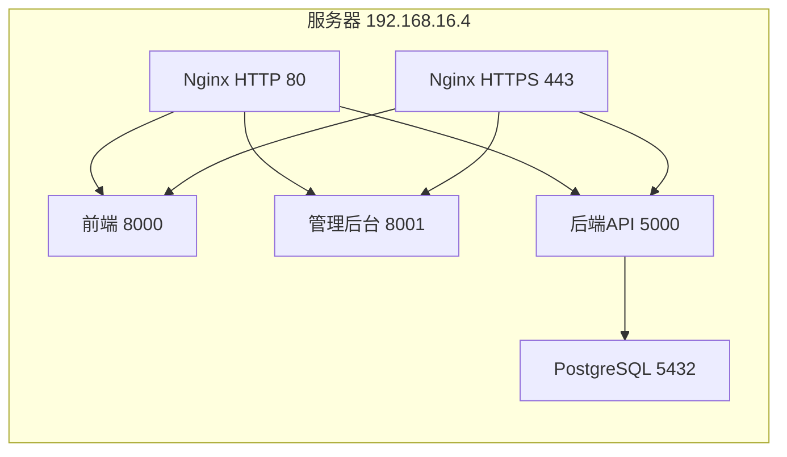
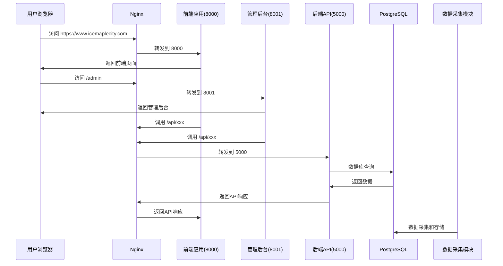
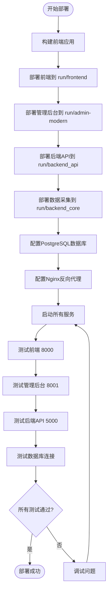

# 股票分析系统 · 系统维护手册

**文档版本：** 1.2  
**更新日期：** 2026 年 3 月  
**变更说明：** 合并 DEPLOYMENT_*、系统部署架构图、**生产环境说明**、**生产环境与HTTPS部署配置指南** 至本手册，统一部署、生产环境与 HTTPS 维护说明。  

本手册面向**运维与维护人员**，说明生产/测试环境的配置、启动、打包部署、日志、数据库、常见故障排查、备份恢复及安全更新。用户使用说明见《用户使用手册》，管理后台使用见《管理后台说明与使用指南》。

---

## 目录

1. [概述与架构](#1-概述与架构)（含部署架构图、访问地址）
2. [环境与依赖](#2-环境与依赖)
3. [配置说明](#3-配置说明)（含 .env、Nginx、HTTPS/SSL、ACME、代理、Vite）
4. [服务启动与停止](#4-服务启动与停止)（含推送调度器 systemd/nssm）
5. [打包与部署](#5-打包与部署)（含快速部署、Docker、部署流程图）
6. [日志与监控](#6-日志与监控)（含推送 KPI 与 SQL）
7. [数据库维护](#7-数据库维护)（含推送表索引与清理）
8. [常见故障与排查](#8-常见故障与排查)（含调度器、推送、邮件/微信、报告、端口与依赖）
9. [备份与恢复](#9-备份与恢复)
10. [安全与更新](#10-安全与更新)
11. [附录：常用命令速查](#11-附录常用命令速查)

---

## 1. 概述与架构

### 1.1 子系统组成

| 子系统 | 说明 | 典型端口 |
|--------|------|----------|
| 前端 (frontend) | 用户端静态站点，行情、自选股、选股、个股等 | 8000 |
| 管理后台 (admin) | Vue 3 管理端，用户/日志/行情/GMS 回测/推送等 | 8001 |
| 后端 API (backend_api) | FastAPI 接口，认证、行情、选股、推送等 | 5000 |
| 数据采集 (backend_core) | 定时/手动采集行情、指标等，写库 | 无端口 |
| Nginx | 反向代理、HTTPS、静态资源 | 80 / 443 |
| PostgreSQL | 业务数据库 | 5432 / 8432 等 |

### 1.2 数据流与访问路径

- 用户浏览器 → Nginx(80/443) → 前端(8000) 或 管理后台(8001)
- 前端/管理后台 → Nginx → 后端 API(5000)
- 后端 API、数据采集 → PostgreSQL
- 推送调度（若启用）→ 报告生成 → 企业微信/邮件

### 1.3 部署目录示例（生产）

```
项目根目录/
├── run/                  # 运行目录（打包产出或拷贝）
│   ├── frontend/         # 前端静态文件
│   ├── admin-modern/     # 管理后台 dist 或静态
│   ├── backend_api/      # 后端 API 代码与依赖
│   └── backend_core/     # 数据采集与策略核心
├── tools/                # Nginx、SSL 等
│   ├── nginx-1.28.0/     # Nginx 可执行与配置
│   └── nginx/ssl/        # SSL 证书
├── .env                  # 环境变量（勿提交版本库）
└── docs/                 # 文档
```

### 1.4 部署架构图

#### 整体架构



#### 网络端口



#### 数据流



### 1.5 访问地址

部署成功后常用地址（域名与端口以实际为准）：

| 用途 | 地址示例 |
|------|----------|
| 登录页 | http://localhost:8000/login.html 或 https://域名/login.html |
| 首页 | http://localhost:8000/index.html |
| 后端 API | http://localhost:5000 |
| API 文档 | http://localhost:5000/docs |
| 管理后台 | http://localhost:8001/ 或 https://域名/admin |

### 1.6 生产环境示例（参考）

以下为生产环境典型配置参考，实际 IP/端口/路径以现场为准；**数据库密码等敏感信息仅配置于 .env，勿写入文档。**

| 项目 | 说明 |
|------|------|
| 数据库 | PostgreSQL，库名 stock_analysis，端口 8432 或 5432；连接串与密码见 .env |
| Nginx | HTTP 80、HTTPS 443；配置路径如 `tools/nginx-1.28.0/conf/nginx.conf`；SSL 证书目录 `tools/nginx/ssl` |
| 前端 | 端口 8000，目录 run/frontend，启动 `python start_frontend.py` |
| 管理后台 | 端口 8001，目录 run/admin-modern，启动 `python -m http.server 8001`（或 Nginx 直供静态） |
| 后端 API | 端口 5000，目录 run/backend_api，启动 `python run.py` 或 uvicorn（workers=4，timeout-keep-alive 300） |
| 数据采集 | 目录 run/backend_core，无端口；启动 `python -m backend_core.data_collectors.main` |
| 打包 | `python package.py`；管理后台：`.\deploy-env.bat production` → `npm run build` → 上传 dist |
| 启动顺序 | PostgreSQL → 后端 API → 前端 → 管理后台 → Nginx → 数据采集/推送（按需） |

生产访问示例：前端 https://域名/，管理后台 https://域名/admin，API https://域名/api。日志：Nginx 在 `tools/nginx-1.28.0/logs/`，PostgreSQL 在数据目录 `pg_log/`。

---

## 2. 环境与依赖

### 2.1 系统要求

- **操作系统**：Windows Server 或 Linux（如 Ubuntu 20.04+）
- **Python**：3.8+（推荐 3.10+），后端与采集均依赖
- **Node.js**：16+（管理后台与前端构建）
- **数据库**：PostgreSQL 12+
- **内存/磁盘**：建议 4GB+ 内存，10GB+ 可用磁盘（含日志与报告）

### 2.2 Python 依赖

```bash
# 项目根目录
pip install -r requirements.txt
# 若存在生产依赖文件
# pip install -r requirements-prod.txt
```

核心依赖包括：FastAPI、uvicorn、SQLAlchemy、psycopg2-binary、python-dotenv、apscheduler 等。验证：

```bash
python -c "import fastapi, sqlalchemy; print('OK')"
```

### 2.3 数据库

- 需提前创建数据库（如 `stock_analysis`）及用户。
- 连接信息通过 `.env` 或环境变量配置（见下文）。

---

## 3. 配置说明

### 3.1 环境变量（.env）

在项目根目录复制 `.env.example` 为 `.env`，按实际环境修改。**不要将 `.env` 提交到版本库。**

| 类别 | 变量示例 | 说明 |
|------|----------|------|
| 数据库 | DB_HOST, DB_PORT, DB_USER, DB_PASSWORD, DB_NAME | 或使用 DATABASE_URL 完整连接串 |
| 连接池 | DB_POOL_SIZE, DB_MAX_OVERFLOW, DB_POOL_PRE_PING | 可选 |
| JWT | JWT_SECRET_KEY, JWT_ALGORITHM, JWT_ACCESS_TOKEN_EXPIRE_MINUTES | 认证 |
| SMTP | SMTP_HOST, SMTP_PORT, SMTP_USERNAME, SMTP_PASSWORD, SMTP_USE_TLS, SMTP_FROM_EMAIL | 邮件推送 |
| 企业微信 | WECHAT_CORP_ID, WECHAT_AGENT_ID, WECHAT_CORP_SECRET | 企业微信推送（注意变量名为 CORP_SECRET） |
| 推送 | MAX_RETRY_COUNT, PUSH_BATCH_SIZE, REPORT_DIR, PUSH_DEFAULT_TIMES | 报告目录与重试 |
| CORS | CORS_ORIGINS | 可选，逗号分隔 |

数据库连接串示例：

```
DATABASE_URL=postgresql+psycopg2://postgres:密码@主机:端口/stock_analysis
```

### 3.2 后端 API 配置

- 主配置集中在 `backend_api/config.py`，通过环境变量覆盖。
- 选股等长耗时接口：后端可配置超时（如 PVFRS 选股 300 秒）；Nginx 需相应加大 `proxy_read_timeout`（见下文故障排查）。

### 3.3 Nginx 配置要点

- **反向代理**：`/api`、`/data-collection` 等转发到后端 API（如 `http://127.0.0.1:5000`）。
- **前端**：根或指定 path 指向前端静态目录。
- **管理后台**：如 `/admin/` 指向管理后台静态目录，并配置 **SPA fallback**（`error_page 404 = @admin_fallback` + `proxy_pass .../index.html`），避免刷新 404。
- **选股长超时**（生产环境说明中已强调）：

```nginx
location /api/screening/ {
    proxy_pass http://127.0.0.1:5000;
    proxy_connect_timeout 60s;
    proxy_read_timeout 300s;
    proxy_send_timeout 300s;
    # 其他 proxy_* 与主 location 一致
}
```

- **HTTPS**：见下文 3.5。

### 3.5 HTTPS 与 SSL 配置

- **证书位置**：统一放置于如 `tools/nginx/ssl/`，nginx 中配置 `ssl_certificate`、`ssl_certificate_key`。示例：`www.域名-chain.pem`（完整证书链）、`www.域名-key.pem`（私钥）。
- **HTTP 跳转**：80 端口 `return 301 https://$server_name$request_uri;`。
- **HTTPS 服务器块**：监听 443，启用 `ssl`、可选 `http2`；安全头：HSTS（max-age=31536000）、X-Frame-Options DENY、X-Content-Type-Options nosniff、X-XSS-Protection；协议 TLS 1.2/1.3；会话缓存如 `ssl_session_cache shared:SSL:1m;`。
- **访问地址示例**：https://域名/（前端）、https://域名/api/（API）、https://域名/admin/（管理后台）、https://域名/health（健康检查）。
- **证书续期（Let's Encrypt）**：约 90 天有效；续期后重载 nginx：`certbot renew --quiet && nginx -s reload`；可放入计划任务每 60 天执行。

### 3.6 生产环境反向代理（/api 与 /data-collection）

生产请求 `https://域名/data-collection/...` 或 `/api/...` 若返回 404，多为 Nginx 未转发。在 Nginx 中配置：

```nginx
location /data-collection {
    proxy_pass http://localhost:5000;
    proxy_set_header Host $host;
    proxy_set_header X-Real-IP $remote_addr;
}
location /api {
    proxy_pass http://localhost:5000;
    proxy_set_header Host $host;
    proxy_set_header X-Real-IP $remote_addr;
}
```

验证：`curl https://域名/data-collection/stock-list`；确保 CORS 允许前端域名。

### 3.7 SSL 证书 ACME 验证失败（HTTP 403）修复

- **现象**：ACME http-01 验证返回 **HTTP 403 Forbidden**，多为 `/.well-known/acme-challenge/` 不可访问。
- **步骤**：① 创建目录，如 `tools/nginx-1.28.0/html/.well-known/acme-challenge`（路径与 nginx root 一致）。② Nginx 中单独配置：
  ```nginx
  location /.well-known/acme-challenge/ {
      root html;
      try_files $uri =404;
      access_log logs/acme_access.log;
      error_log logs/acme_error.log debug;
  }
  location ~ /\.(?!well-known) { deny all; }
  ```
  ③ 测试：`echo "test" > .../html/.well-known/acme-challenge/test.txt`，`curl http://域名/.well-known/acme-challenge/test.txt`。④ 申请/续期：`certbot certonly --webroot -w 实际root路径 -d 域名`。
- **排查**：403 检查 root、try_files、隐藏文件规则；验证失败检查 80 端口对外可访问、DNS 解析、防火墙。

### 3.8 代理配置（数据采集等）

- **配置文件**：在 `backend_core/config/config.py` 中可配置 akshare 的 `proxy_pool`（HTTP/SOCKS）、`ssl_verify`、`use_fallback_sources` 等；支持环境变量 `HTTP_PROXY`、`HTTPS_PROXY`；或维护 `proxy_config.json` 在启动时加载。
- **验证与轮换**：通过代理访问固定 URL 验证可用性；可轮询或按成功率轮换。生产建议使用稳定代理；注意合规与认证。

### 3.9 管理端 Vite/TypeScript 配置修复

若 `admin/vite.config.ts` 报错 `Cannot find module '@vitejs/plugin-vue'`，多为 TypeScript 解析上下文缺失。修改 `admin/tsconfig.node.json`：`include` 含 `vite.config.ts`，`exclude` 含 `node_modules`、`dist`，`types` 含 `node`；保证 `moduleResolution: "bundler"` 等与当前 Node/Vite 兼容。然后执行 `npm run build` 验证。

### 3.10 传统部署配置（deploy_config.json）

若仍使用旧版部署脚本，可能依赖 `deploy_config.json`。**推荐以 .env 为主**，此处仅作参考：

```json
{
  "python_version": "3.8",
  "ports": { "backend": 5000, "frontend": 8000, "admin": 8001 },
  "database": { "type": "sqlite", "path": "database/stock_analysis.db" },
  "services": { "backend": true, "frontend": true, "admin": true, "data_collector": true }
}
```

生产环境应使用 PostgreSQL，数据库连接以 `.env` 中 `DATABASE_URL` 或 `DB_*` 为准。

---

## 4. 服务启动与停止

### 4.1 推荐启动顺序

1. PostgreSQL：确保数据库服务已启动。
2. 后端 API：端口 5000。
3. 前端静态服务：端口 8000（若单独起 HTTP 服务）。
4. 管理后台静态服务：端口 8001。
5. Nginx：80/443。
6. 数据采集/推送调度（若需）：按需启动。

### 4.2 后端 API

```bash
# 项目根目录，开发/测试（带 --reload）
python start_backend_api.py

# 生产示例（多 worker、长超时）
python -m uvicorn backend_api.main:app --host 0.0.0.0 --port 5000 --workers 4 --timeout-keep-alive 300 --timeout-graceful-shutdown 300
```

确保 `PYTHONPATH` 含项目根目录；`start_backend_api.py` 已自动设置。

### 4.3 前端与管理后台（静态）

- **开发**：前端可用 `python start_frontend.py` 或前端自带 dev 命令；管理后台 `npm run dev`。
- **生产**：将构建好的静态文件放到 Nginx 指定目录，或临时用 HTTP 服务：
  - 前端：`python start_frontend.py`（默认 8000）
  - 管理后台：在 admin 构建产物目录执行 `python -m http.server 8001`

### 4.4 Nginx

```bash
# Windows（在 Nginx 安装目录下）
nginx -t          # 检查配置
start nginx       # 或 .\nginx.exe
nginx -s stop     # 优雅停止
nginx -s reload   # 重载配置
nginx -t && nginx -s reload
# 强制结束再启动（502 等异常时）
taskkill /im nginx.exe /f
tasklist /fi "imagename eq nginx.exe"   # 确认已结束
.\nginx.exe
```

### 4.5 数据采集

```bash
# 定时/手动采集入口（按项目实际模块）
python -m backend_core.data_collectors.main

# 历史数据采集指定日期
python -m backend_core.data_collectors.tushare.main --type historical --date yyyymmdd
```

### 4.6 推送调度器（若启用）

```bash
# 前台运行（测试）
python start_scheduler.py

# 指定推送时间
python start_scheduler.py --push-times "09:30,15:30"

# 指定日志级别
python start_scheduler.py --log-level DEBUG

# 后台守护进程
python start_scheduler.py --daemon --pid-file /var/run/scheduler.pid
```

**Linux systemd 示例**（创建 `/etc/systemd/system/push-scheduler.service`）：

```ini
[Unit]
Description=Stock Report Push Scheduler
After=network.target postgresql.service

[Service]
Type=simple
User=your_user
WorkingDirectory=/path/to/project
Environment="PATH=/path/to/venv/bin"
ExecStart=/path/to/venv/bin/python start_scheduler.py
Restart=always
RestartSec=10

[Install]
WantedBy=multi-user.target
```

启用：`sudo systemctl daemon-reload` → `sudo systemctl enable push-scheduler` → `sudo systemctl start push-scheduler`。查看日志：`journalctl -u push-scheduler -f`。

**Windows 服务（nssm）**：

```cmd
nssm install PushScheduler "C:\path\to\python.exe" "C:\path\to\start_scheduler.py"
nssm start PushScheduler
nssm status PushScheduler
```

---

## 5. 打包与部署

### 5.1 快速部署（一键/脚本）

```bash
# 使用部署脚本（若项目提供）
python deploy.py

# 启动整套系统
python start_system.py
```

或使用打包好的部署包：解压后 Windows 运行 `deploy.bat`，Linux/macOS 运行 `chmod +x deploy.sh && ./deploy.sh`。

### 5.2 手动部署步骤

```bash
pip install -r requirements.txt
pip install -r backend_core/requirements.txt
pip install -r backend_api/requirements.txt
python init_postgresql_db.py   # 或 init_db.py / migrate_db.py
python start_system.py
```

### 5.3 Docker 部署

```bash
# 构建镜像
docker build -t stock-analyzer .

# 运行容器
docker run -d -p 5000:5000 -p 8000:8000 -p 8001:8001 stock-analyzer

# 或使用 Docker Compose
docker-compose up -d
```

### 5.4 后端与前端打包（package.py）

在项目根目录执行：

```bash
python package.py
# 或指定格式：python package.py --format deploy
```

将按脚本逻辑打包 backend_api、backend_core、frontend 等到目标目录（如 `run/`），便于拷贝到生产服务器。部署流程概览：



### 5.5 管理后台打包（生产）

```bash
cd admin
.\deploy-env.bat production   # 或对应生产环境脚本
npm run build
```

将 `dist` 目录上传到服务器 Nginx 配置的 admin 静态目录（如 `run/admin-modern/dist`）。

### 5.6 部署后检查

- 确认 `.env` 在运行目录存在且配置正确（尤其数据库、JWT、推送相关）。
- 确认 Nginx 配置中 API、前端、admin 的 root/location 与端口一致。
- 访问前端、admin、API 健康接口（若有 `/health` 或 `/api/...`）验证。

---

## 6. 日志与监控

### 6.1 日志位置

| 来源 | 位置/说明 |
|------|-----------|
| Nginx | Nginx 安装目录下 `logs/`（如 `tools/nginx-1.28.0/logs/`） |
| 后端 API | 应用目录下 `app.log` 或 `logs/`；部分策略日志在 `backend_api/logs/`（如一阳穿三线 `one_yang_three_lines_*.log`） |
| 推送调度器 | 项目根或运行目录下 `scheduler.log`（若使用 start_scheduler.py） |
| PostgreSQL | 数据库数据目录下 `pg_log/`（如 `C:\Program Files\PostgreSQL\17\data\pg_log\`） |
| GMS 回测 | `backend_core/strategies/gms/backtest_data/` 下任务与明细 CSV |

### 6.2 日志级别与轮转

- 生产环境建议将 DEBUG 改为 INFO，减少磁盘与 I/O。
- 使用 logrotate（Linux）或计划任务定期归档/删除旧日志，避免占满磁盘。

### 6.3 监控建议

- **端口**：确认 5000、8000、8001、80/443 等处于 LISTENING。
- **进程**：确认 uvicorn、nginx、数据采集、推送调度器等进程存在。
- **数据库**：连接数、慢查询、表大小。
- **磁盘**：报告目录 `REPORT_DIR`、日志目录、数据库数据目录空间。

### 6.4 推送监控指标（KPI）

推送系统建议关注以下指标（目标：成功率 ≥95%，错误率 ≤5%，延迟 ≤5 分钟）：

```sql
-- 近 7 日推送成功率
SELECT COUNT(*) FILTER (WHERE status = 'success') * 100.0 / NULLIF(COUNT(*), 0) AS success_rate
FROM push_records WHERE push_date >= CURRENT_DATE - INTERVAL '7 days';

-- 近 7 日失败率
SELECT COUNT(*) FILTER (WHERE status = 'failed') * 100.0 / NULLIF(COUNT(*), 0) AS error_rate
FROM push_records WHERE push_date >= CURRENT_DATE - INTERVAL '7 days';

-- 今日推送按状态统计
SELECT status, COUNT(*) FROM push_records WHERE push_date = CURRENT_DATE GROUP BY status;
```

告警建议：推送成功率低于 90%、同一用户连续多次失败、调度器进程停止、数据库或 SMTP/企业微信不可用时及时排查。

---

## 7. 数据库维护

### 7.1 连接与权限

- 使用 `.env` 中配置的账号连接 PostgreSQL，确保有建表、读写、创建索引等权限。
- 迁移脚本（若有）：`python init_db.py` 或项目内 alembic/其他迁移工具。

### 7.2 常用维护 SQL

```sql
-- 查看连接数
SELECT count(*) FROM pg_stat_activity;

-- 分析表（更新统计信息）
ANALYZE users;
ANALYZE push_records;

-- 清理与回收空间（谨慎，会锁表）
VACUUM ANALYZE push_records;
```

### 7.3 生成表结构脚本（pg_dump）

```bash
# 仅表结构
pg_dump -h 主机 -p 端口 -U postgres -d stock_analysis -t 表名 --schema-only > 表名_create_script.sql

# 示例
pg_dump -h 192.168.16.4 -p 8432 -U postgres -d stock_analysis -t sim_trade_accounts --schema-only > sim_trade_accounts_create_script.sql
```

### 7.4 推送相关表索引与维护

```sql
CREATE INDEX IF NOT EXISTS idx_push_records_user_date ON push_records(user_id, push_date);
CREATE INDEX IF NOT EXISTS idx_push_records_status ON push_records(status);
CREATE INDEX IF NOT EXISTS idx_user_push_configs_enabled ON user_push_configs(enabled);
ANALYZE push_records;
```

### 7.5 清理旧数据（示例）

- **推送记录**：可定期删除或归档 90 天前的 `push_records`：

  ```sql
  DELETE FROM push_records WHERE push_date < CURRENT_DATE - INTERVAL '90 days';
  -- 或先归档再删：CREATE TABLE push_records_archive AS SELECT * FROM push_records WHERE push_date < CURRENT_DATE - INTERVAL '90 days';
  ```

- **报告文件**：`find ./reports -name "*.csv" -mtime +30 -delete`（Linux）；或定期手动清理 `REPORT_DIR` 下过期文件。
- **GMS 回测明细**：按需清理 `backtest_data/details/` 下旧 CSV。

推送调度器日志可配置 logrotate（如 `/etc/logrotate.d/push-scheduler`）进行按日轮转、保留 30 天。

---

## 8. 常见故障与排查

### 8.1 Nginx 502 Bad Gateway

- **原因**：上游（如后端 API 或前端服务）未启动或崩溃、端口不对。
- **排查**：确认后端/前端进程在运行、端口与 Nginx 配置一致；查看 Nginx error.log。
- **处理**：启动或重启上游服务；必要时重启 Nginx（见 4.4）。

### 8.2 选股/长接口 504 超时

- **原因**：Nginx `proxy_read_timeout` 过小（如默认 60s），选股计算未完成即断开。
- **处理**：为 `/api/screening/` 单独配置 `proxy_read_timeout 300s`（或与后端超时一致），并 `nginx -s reload`。

### 8.3 管理后台刷新 404

- **原因**：Vue Router history 模式，刷新时 Nginx 未返回 index.html。
- **处理**：为 `/admin/` 配置 SPA fallback（`error_page 404 = @admin_fallback` + 代理到 index.html），详见《管理后台说明与使用指南》；Nginx 与 HTTPS 见本手册 3.3、3.5。

### 8.4 数据库连接失败

- 检查 PostgreSQL 服务是否启动、`.env` 中主机/端口/用户/密码是否正确、防火墙是否放行。
- 测试：`psql -h 主机 -p 端口 -U 用户 -d stock_analysis`。

### 8.5 推送失败（邮件/企业微信）

- **邮件**：检查 SMTP 配置、应用专用密码（Gmail）、网络与防火墙；查看推送记录表 `error_messages` 及日志中 SMTP 报错。
- **企业微信**：检查 WECHAT_CORP_ID、WECHAT_AGENT_ID、WECHAT_CORP_SECRET；**企业可信 IP** 需包含调用方出口 IP，否则报 60020；若提示先配置可信域名或接收消息服务器，按企业微信后台要求先完成其一。

### 8.6 前端/管理后台请求 API 404

- 确认 Nginx 中 `/api`、`/data-collection` 等已转发到后端 5000；确认后端路由已挂载；用 curl 直接访问后端端口验证。

### 8.7 调度器无法启动

- **现象**：运行 `start_scheduler.py` 后立即退出。
- **排查**：检查数据库连接（`.env` 中 DATABASE_URL/DB_*）、配置是否完整、端口与权限；使用 `--log-level DEBUG` 查看详细日志；删除残留 `scheduler.pid` 后重试。

### 8.8 邮件/企业微信发送失败

- **邮件**：确认 SMTP 配置与应用专用密码（如 Gmail）；检查 `push_records` 表 `error_messages` 及日志中 SMTP 报错；测试端口可达性（如 `telnet smtp.gmail.com 587`）。
- **企业微信**：确认 `WECHAT_CORP_ID`、`WECHAT_AGENT_ID`、`WECHAT_CORP_SECRET`（变量名为 CORP_SECRET）；**企业可信 IP** 需包含调用方出口 IP，否则报 60020。

### 8.9 报告生成失败

- 检查用户是否有自选股、历史数据是否缺失；检查 `REPORT_DIR` 磁盘空间与写权限；查看推送记录中该用户的 `error_messages` 及调度器日志。

### 8.10 端口冲突与依赖安装失败

- **端口冲突**：修改 `deploy_config.json` 或实际启动参数中的端口；用 `netstat -tulpn`（Linux）或 `netstat -ano`（Windows）查看占用。
- **依赖安装失败**：升级 pip（`python -m pip install --upgrade pip`）、清理缓存（`pip cache purge`）后重新 `pip install -r requirements.txt`；Linux/macOS 可执行脚本需 `chmod +x *.sh`。

### 8.11 生产与 HTTPS 相关速查

| 现象 | 检查项 |
|------|--------|
| API 或 /data-collection 404 | Nginx 是否将 /api、/data-collection 转发到后端 5000（见 3.6） |
| SSL 启动失败 | 证书路径与权限、端口 443 占用 |
| ACME 验证 403 | root、.well-known、try_files、隐藏文件规则（见 3.7） |
| CORS 报错 | 后端 CORS 是否允许前端域名与请求方法/头 |
| Vite 类型错误 | admin/tsconfig.node.json、include/exclude、types（见 3.9） |

验证 HTTPS：`nginx -t`、`nginx -s reload`、`curl -I https://域名`；HTTP 应 301 到 HTTPS。证书：`certbot certificates`；ACME 测试路径：`curl http://域名/.well-known/acme-challenge/test.txt`。

---

## 9. 备份与恢复

### 9.1 数据库备份

```bash
# 全库
pg_dump -h 主机 -p 端口 -U postgres stock_analysis > backup_$(date +%Y%m%d).sql

# 指定表（含推送相关）
pg_dump -h 主机 -p 端口 -U postgres -t users -t user_push_configs -t push_records stock_analysis > push_backup_$(date +%Y%m%d).sql
```

### 9.2 恢复

```bash
psql -h 主机 -p 端口 -U postgres stock_analysis < backup_YYYYMMDD.sql
```

### 9.3 配置与代码

- 定期备份 `.env`、Nginx 配置、SSL 证书；代码使用 Git 管理并打 tag，便于回滚。

---

## 10. 安全与更新

### 10.1 敏感信息

- `.env` 不得提交版本库；生产环境定期更换 JWT_SECRET_KEY、数据库密码、SMTP/企业微信密钥。
- 更换后需重启后端 API 及依赖该配置的服务。

### 10.2 更新与回滚

- **更新**：拉取代码 → 安装依赖 → 执行数据库迁移（若有）→ 重启服务。
- **回滚**：从备份恢复数据库（如有必要）；Git 回退到指定版本；重启服务。

### 10.3 SSL 证书续期

- 若使用 Let's Encrypt，证书约 90 天有效，需定期续期；续期后执行 `nginx -s reload`。可配置计划任务自动续期。

---

## 11. 附录：常用命令速查

| 操作 | 命令示例 |
|------|----------|
| 启动后端 API | `python start_backend_api.py` |
| 生产后端 | `python -m uvicorn backend_api.main:app --host 0.0.0.0 --port 5000 --workers 4` |
| 启动前端 | `python start_frontend.py` |
| 管理后台静态 | `python -m http.server 8001`（在 admin 构建目录） |
| Nginx 检查/启动/停止/重载 | `nginx -t` / `start nginx` / `nginx -s stop` / `nginx -s reload` |
| 强制结束 Nginx | `taskkill /im nginx.exe /f` |
| 打包 | `python package.py` |
| 管理后台构建 | `cd admin && .\deploy-env.bat production && npm run build` |
| 历史数据采集 | `python -m backend_core.data_collectors.tushare.main --type historical --date yyyymmdd` |
| 数据库表结构导出 | `pg_dump -h H -p P -U postgres -d stock_analysis -t 表名 --schema-only > 表名.sql` |
| 推送调度器（前台） | `python start_scheduler.py` |
| 推送调度器（指定时间） | `python start_scheduler.py --push-times "09:30,15:30"` |
| 查看推送状态 | `curl http://localhost:5000/api/push/status`（端口以实际为准） |
| 延迟重启机器（Windows） | `shutdown /r /t 30` |

---

## 相关文档索引

| 文档 | 说明 |
|------|------|
| 日常运维.md | 日常运维要点（Nginx 502、admin 打包、package.py、历史采集、pg_dump 等） |
| 管理后台说明与使用指南.md | 管理后台架构、刷新 404、独立运行、配置示例 |

**已合并至本手册的文档**（内容已整合，无需单独查阅）：  
`DEPLOYMENT_GUIDE.md`、`DEPLOYMENT_SUMMARY.md`、`DEPLOYMENT.md`、`系统部署架构图.md`、**生产环境说明.md**、**生产环境与HTTPS部署配置指南.md**。

---

*本手册根据当前代码与现有文档整理，若部署方式或路径有变更，请以实际环境为准。*
